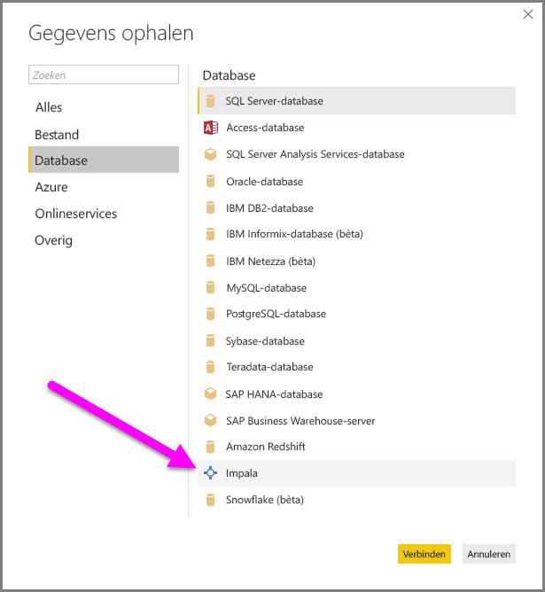
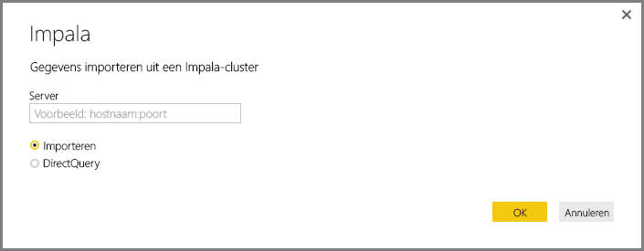
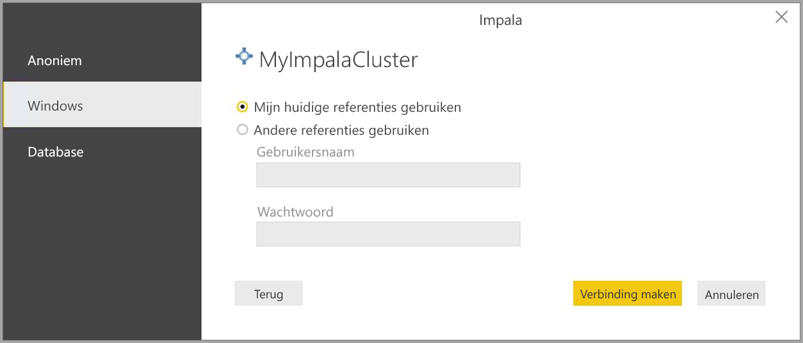
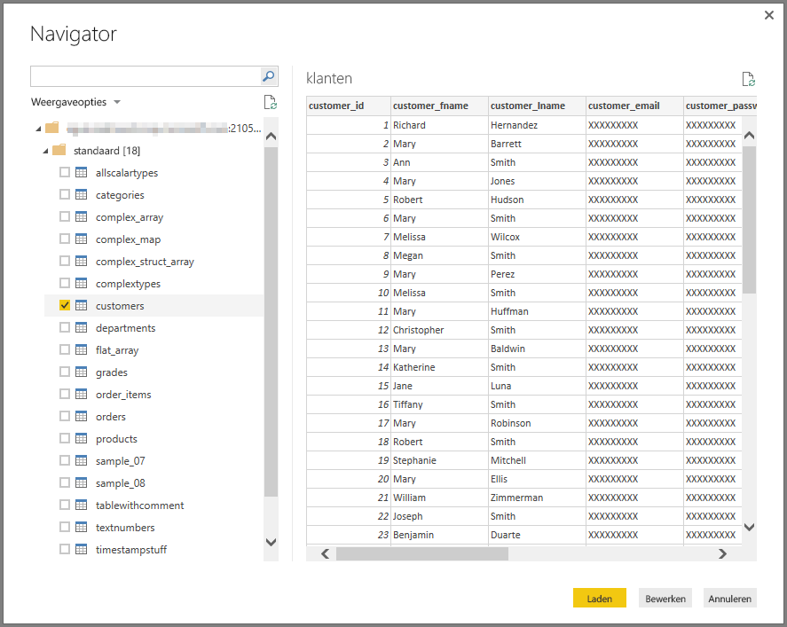

# Verbinding met een Impala-database maken in Power BI Desktop
In Power BI Desktop kunt u verbinding maken met een **Impala**-database en gebruikmaken van de onderliggende gegevens, net zoals elke andere gegevensbron in Power BI Desktop.

## Verbinding maken met een Impala-database
Als u verbinding wilt maken met een **Impala**-database, selecteert u **Gegevens ophalen** op het lint **Start** in Power BI Desktop. Selecteer **Database** uit de categorieën aan de linkerkant en u ziet **Impala**.

In het **Impala**-venster dat verschijnt, typt of plakt u de naam van de Impala-server in het vak en selecteert u **OK**. U kunt desgewenst de gegevens rechtstreeks **importeren** in Power BI. U kunt ook **DirectQuery** gebruiken. Over het [gebruik van DirectQuery](desktop-use-directquery.md) kunt u meer informatie vinden (Engelstalig).

Voer uw referenties in wanneer u daar om wordt gevraagd, of maak anoniem verbinding. De Impala-connector ondersteunt Anonymouse-, Basic- (gebruikersnaam en wachtwoord) en Windows-verificatie.

> [!NOTE]
> Als u uw gebruikersnaam en wachtwoord voor een bepaalde **Impala**-server hebt ingevoerd, worden deze referenties gebruikt bij volgende pogingen verbinding te maken. U kunt de referenties wijzigen via **Bestand > Opties en instellingen > Instellingen voor gegevensbron**.
> 
> 

Als u verbinding hebt gemaakt, verschijnt er een **Navigator**-scherm waarin de gegevens worden getoond die op de server beschikbaar zijn. Hier kunt u een of meer elementen selecteren die u in **Power BI Desktop** wilt importeren en gebruiken.

## Overwegingen en beperkingen
Houd rekening met enkele beperkingen en overwegingen als u de **Impala**-connector wilt gebruiken:

* De Impala-connector wordt ondersteund in de on-premises gegevensgateway met behulp van één van de drie ondersteunde verificatiemechanismen.

## Volgende stappen
Met Power BI Desktop kunt u verbinding maken met allerlei andere gegevens. Bekijk de volgende bronnen voor meer informatie over gegevensbronnen:

* [Getting Started with Power BI Desktop](desktop-getting-started.md) (Aan de slag met Power BI Desktop)
* [Data Sources in Power BI Desktop](desktop-data-sources.md) (Gegevensbronnen in Power BI Desktop)
* [Shape and Combine Data with Power BI Desktop](desktop-shape-and-combine-data.md) (Gegevens vormgeven en combineren met Power BI Desktop)
* [Connect to Excel workbooks in Power BI Desktop](desktop-connect-excel.md) (Verbinding maken met Excel-werkmappen in Power BI Desktop)   
* [Enter data directly into Power BI Desktop](desktop-enter-data-directly-into-desktop.md) (Rechtstreeks gegevens in Power BI Desktop invoeren)   

