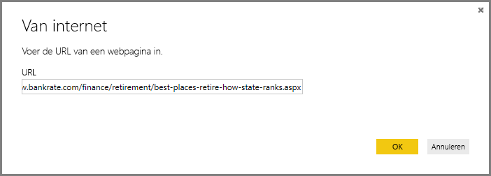
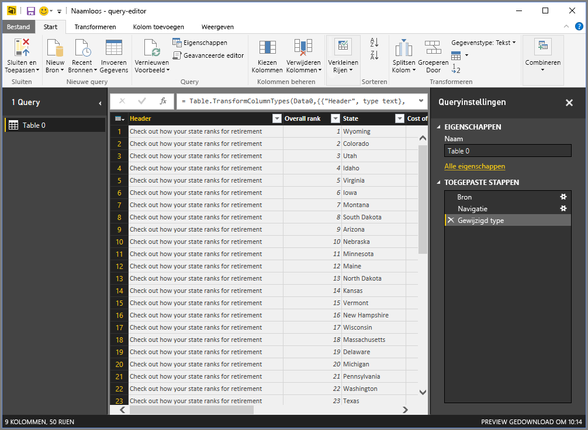
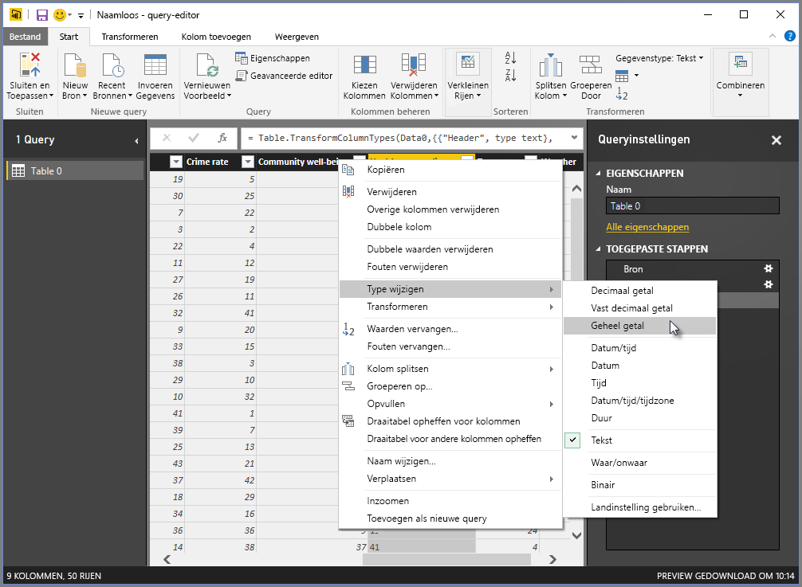
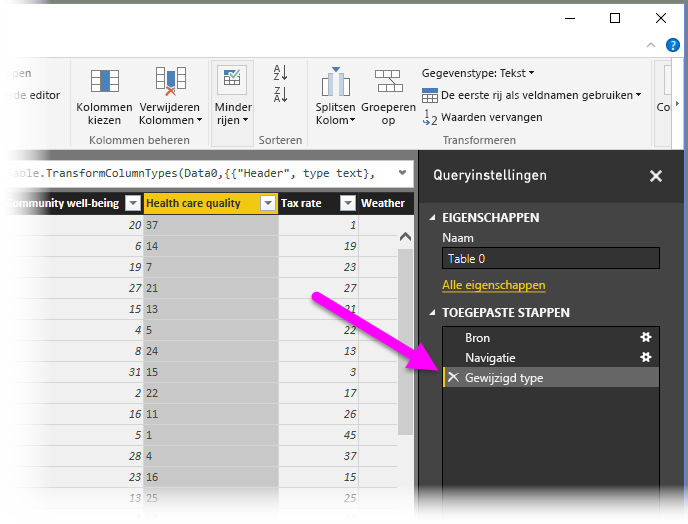
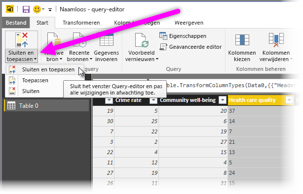
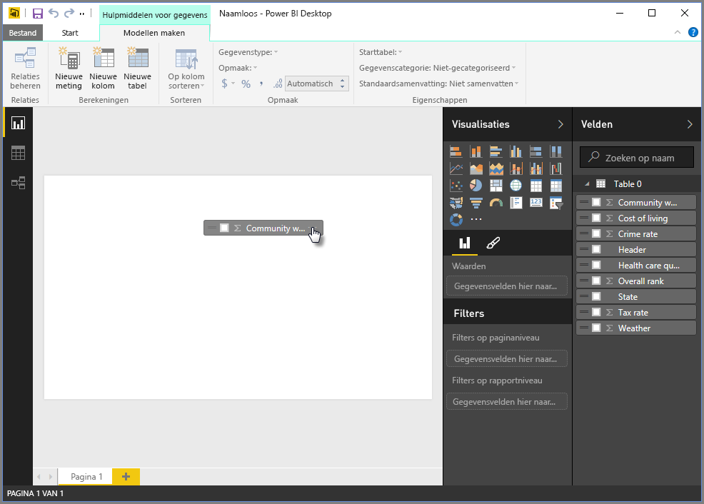
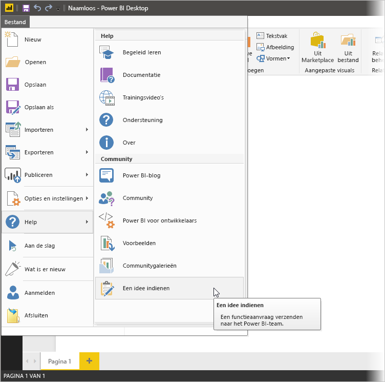

# Verbinding maken met gegevens in Power BI Desktop
Met Power BI Desktop kunt u eenvoudig verbinding maken met de zich almaar uitbreidende wereld van gegevens. Als u niet beschikt over Power BI Desktop, kunt u het [downloaden](http://go.microsoft.com/fwlink/?LinkID=521662) en installeren.

In Power BI Desktop zijn *allerlei verschillende* gegevensbronnen beschikbaar. De volgende afbeelding toont hoe u verbinding met gegevens maakt door het lint **Bestand** te selecteren en vervolgens **Gegevens ophalen \> Meer**.

## Voorbeeld van het verbinding maken met gegevens
In dit voorbeeld maken we verbinding met een gegevensbron op het **web**.

Stel dat u met pensioen gaat. U verlangt naar veel zon, lage belastingen en goede zorg. of... u bent een gegevensanalist en u wilt deze informatie om uw klanten te helpen, bijvoorbeeld om een fabrikant van regenjassen verkoopdoelen te laten behalen op een plek waar het *veel* regent.

Hoe dan ook, u vindt een bron op het web met interessante gegevens over onder meer deze onderwerpen:

[*http://www.bankrate.com/finance/retirement/best-places-retire-how-state-ranks.aspx*](http://www.bankrate.com/finance/retirement/best-places-retire-how-state-ranks.aspx)

U selecteert **Gegevens ophalen \> Web** en typt het adres.

Als u **OK** selecteert, gaat de functionaliteit **Query** van Power BI Desktop aan het werk. Er wordt contact opgenomen met de webbron en in het venster **Navigator** worden de resultaten geretourneerd die op deze website zijn gevonden. In dit geval zijn een tabel (Tabel 0) en het hele document gevonden. We zijn alleen geïnteresseerd in de tabel, dus we selecteren dit in de lijst. In het venster **Navigator** wordt een voorbeeld weergegeven.

Nu kunnen we de query bewerken voordat we de tabel laden. We selecteren **Bewerken** onderaan het venster of we laden de tabel.

Als we **Bewerken** selecteren, wordt de tabel geladen en Query-editor gestart. Het deelvenster **Queryinstellingen** wordt weergegeven (zo niet, dan selecteert u **Weergave** op het lint en vervolgens **Weergeven \> Queryinstellingen** om het deelvenster **Queryinstellingen** weer te geven). Het geheel ziet er als volgt uit.

De vermeldingen tekst willen we omzetten in getallen. Dat kan. Klik met de rechtermuisknop op de kolomkop en selecteer **Type wijzigen \> Geheel getal** om ze om te zetten. Als u meer dan één kolom wilt selecteren, selecteert u eerst een kolom en houdt u **Shift** ingedrukt, selecteert u extra aangrenzende kolommen en klikt u vervolgens met de rechtermuisknop op een kolomkop om alle geselecteerde kolommen te wijzigen. Gebruik **Ctrl** als u kolommen wilt kiezen die niet aangrenzend zijn.

In **Queryinstellingen** wordt onder **Toegepaste stappen** aangegeven of er wijzigingen zijn aangebracht. Terwijl u aanvullende wijzigingen aan de gegevens aanbrengt, worden de wijzigingen in de sectie **Toegepaste stappen** geregistreerd, waar u ze nog eens kunt bekijken, aanpassen, herschikken of verwijderen.

Nadat de gegevens zijn geladen kunt u nog steeds wijzigingen aan de tabel aanbrengen, maar voorlopig is dit voldoende. Als we klaar zijn, selecteren we **Sluiten en toepassen** in het lint **Start**. De wijzigingen worden toegepast en Query-editor gesloten.

Als het gegevensmodel is geladen, kunnen we in de **rapportweergave** in Power BI Desktop visuele elementen gaan maken door velden naar het canvas te slepen.

Dit is uiteraard slechts een eenvoudig model met één gegevensverbinding. De meeste Power BI Desktop-rapporten hebben verbindingen naar verschillende gegevensbronnen die aan uw wensen zijn aangepast en met relaties die een uitgebreid gegevensmodel produceren. 

## Volgende stappen
U kunt allerlei handelingen uitvoeren met Power BI Desktop. Bekijk de volgende bronnen voor meer informatie over de vele mogelijkheden:

* [Wat is Power BI Desktop?](desktop-what-is-desktop.md)
* [Query Overview with Power BI Desktop](desktop-query-overview.md) (Queryoverzicht met Power BI Desktop)
* [Data Sources in Power BI Desktop](desktop-data-sources.md) (Gegevensbronnen in Power BI Desktop)
* [Shape and Combine Data with Power BI Desktop](desktop-shape-and-combine-data.md) (Gegevens vormgeven en combineren met Power BI Desktop)
* [Common Query Tasks in Power BI Desktop](desktop-common-query-tasks.md) (Algemene querytaken in Power BI Desktop)   

Wilt u feedback geven? Groot – gebruik het menu-item **indienen van een idee** in Power BI Desktop of ga naar [Feedback van de community](http://community.powerbi.com/t5/Community-Feedback/bd-p/community-feedback). We horen graag van u!

