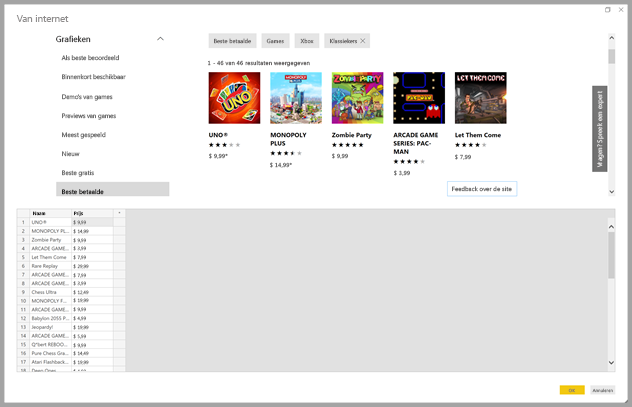
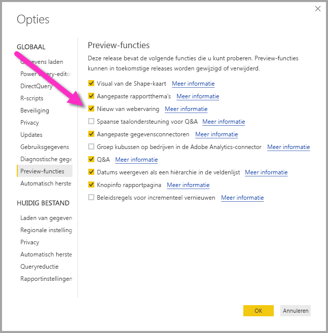
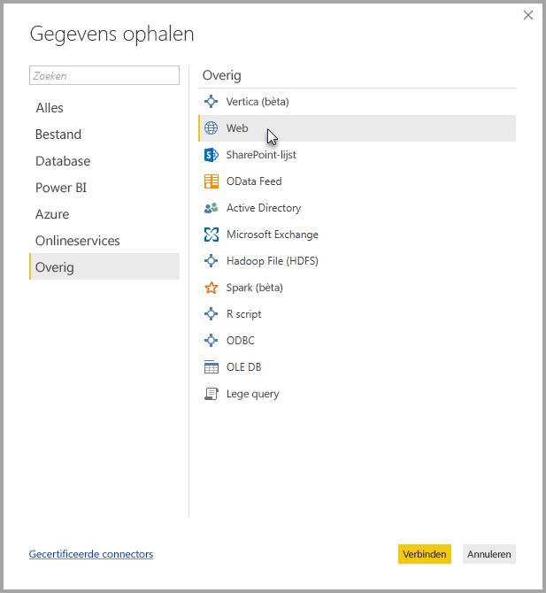
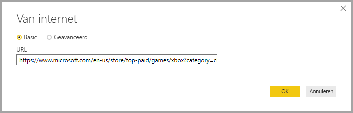
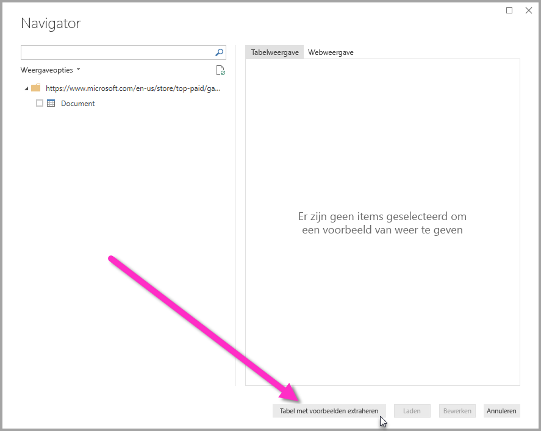
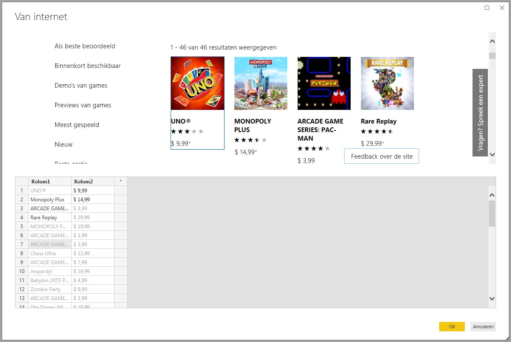

# Gegevens van een webpagina ophalen door een voorbeeld op te geven (preview)

Door gegevens van een webpagina op te halen, kunnen gebruikers eenvoudig gegevens van webpagina's extraheren en die gegevens importeren in **Power BI Desktop**. Omdat de gegevens op webpagina's zich vaak niet in overzichtelijke tabellen bevinden die eenvoudig kunnen worden geëxtraheerd, kan het ophalen van gegevens van dergelijke pagina's lastig zijn, zelfs als deze gestructureerd en consistent zijn. 

Maar er is een oplossing. Met de functie **Gegevens van web ophalen met een voorbeeld** kunt u **Power BI Desktop** in feite laten zien welke gegevens u wilt extraheren. Hiervoor geeft u in het dialoogvenster van de connector een of meer voorbeelden op, waarna de overige gegevens op de pagina worden verzameld die overeenkomen met uw voorbeelden. Met deze oplossing kunt u allerlei soorten gegevens van wegpagina's extraheren, waaronder gegevens in tabellen *en* gegevens die zich niet in tabellen bevinden. 

## De preview-functie Gegevens ophalen van web met een voorbeeld inschakelen

De functie **Gegevens ophalen van web met een voorbeeld** bevindt zich nog in de preview-fase en moet in **Power BI Desktop** worden ingeschakeld. U kunt de functie inschakelen door **Bestand > Opties en instellingen > Opties > Preview-functies** te selecteren en vervolgens het selectievakje **Nieuw van Web-ervaring** in te schakelen. Power BI Desktop moet opnieuw worden opgestart nadat u de selectie hebt gemaakt.

Zodra de preview-functie is ingeschakeld, kunt u deze gebruiken. 

## Gegevens ophalen van web met een voorbeeld gebruiken

Als u **Gegevens ophalen van web met een voorbeeld** wilt gebruiken, selecteert u **Gegevens ophalen** in het lintmenu **Start**. Selecteer in het venster dat wordt weergegeven **Overig** in de categorieën in het linkerdeelvenster en selecteer vervolgens **Web**.

Voer hier de URL in van de webpagina waarvan u gegevens wilt extraheren. In dit artikel wordt de webpagina van Microsoft Store gebruikt en wordt uitgelegd hoe deze connector werkt. 

Als u het voorbeeld in het artikel wilt volgen, kunt u de [URL van de Microsoft Store](https://www.microsoft.com/en-us/store/top-paid/games/xbox?category=classics) gebruiken die we in dit artikel gebruiken:

    https://www.microsoft.com/en-us/store/top-paid/games/xbox?category=classics

Wanneer u **OK** selecteert, wordt het dialoogvenster **Navigator** geopend, waarin de automatisch gedetecteerde tabellen van de webpagina worden weergegeven. In het voorbeeld in de onderstaande afbeelding zijn geen tabellen gevonden. Aan de onderkant van de pagina bevindt zich echter een knop met de naam **Tabel extraheren met voorbeelden**. Met deze knop kunt u voorbeelden opgeven.

Als u **Tabel extraheren met voorbeelden** selecteert, wordt een interactief venster weergegeven waarin u een voorbeeld kunt bekijken van de inhoud van de webpagina. Daarnaast kunt u in dit venster voorbeeldwaarden invoeren van de gegevens die u wilt extraheren. 

In dit voorbeeld extraheren we de *naam* en de *prijs* voor alle games op de pagina. We kunnen dit doen door voor elke kolom een aantal voorbeelden van de pagina op te geven, zoals u in de volgende afbeelding kunt zien. Wanneer deze voorbeelden worden getypt, kunnen de gegevens die overeenkomen met het patroon van de voorbeeldgegevens met **Power Query** met behulp van slimme algoritmen voor gegevensextractie worden geëxtraheerd. (Power Query is de onderliggende technologie waarmee de gegevens van de webpagina worden opgehaald.)

Wanneer u tevreden bent met de gegevens die van de webpagina worden geëxtraheerd, selecteert u **OK** om **Query-editor** te openen, waar u meer transformaties kunt toepassen of de gegevens kunt vormgeven (door deze gegevens bijvoorbeeld te combineren met gegevens van andere gegevensbronnen).

Hier kunt u visuals maken of de webpaginagegevens op een andere manier gebruiken tijdens het maken van uw **Power BI Desktop**-rapporten.

## Volgende stappen
Met **Power BI Desktop** kunt u verbinding maken met allerlei andere gegevens. Bekijk de volgende bronnen voor meer informatie over gegevensbronnen:

* [Een kolom uit een voorbeeld toevoegen](desktop-add-column-from-example.md)
* [Verbinding met een webpagina maken](desktop-connect-to-web.md)
* [Data Sources in Power BI Desktop](desktop-data-sources.md) (Gegevensbronnen in Power BI Desktop)
* [Shape and Combine Data with Power BI Desktop](desktop-shape-and-combine-data.md) (Gegevens vormgeven en combineren met Power BI Desktop)
* [Connect to Excel workbooks in Power BI Desktop](desktop-connect-excel.md) (Verbinding maken met Excel-werkmappen in Power BI Desktop)   
* [Connect to CSV files in Power BI Desktop](desktop-connect-csv.md) (Verbinding met CSV-bestanden maken in Power BI Desktop)   
* [Enter data directly into Power BI Desktop](desktop-enter-data-directly-into-desktop.md) (Rechtstreeks gegevens in Power BI Desktop invoeren)   

