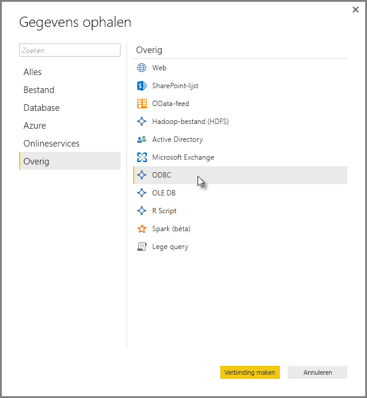
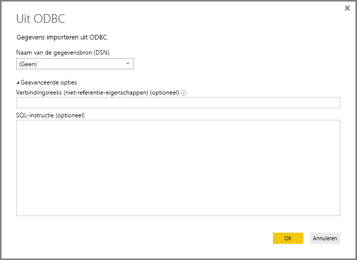
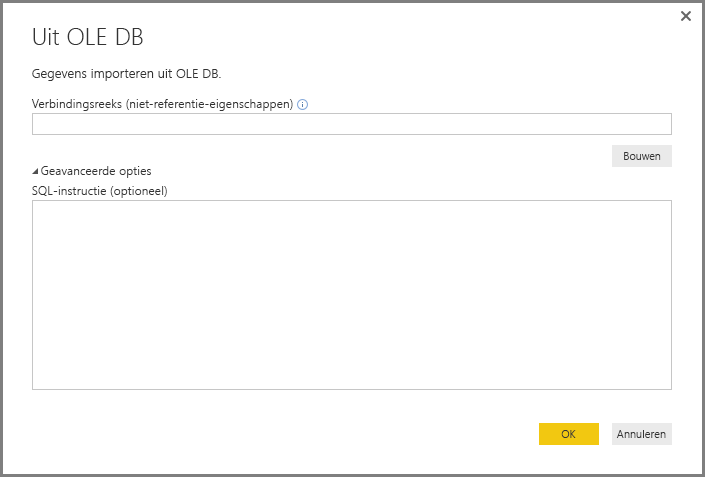
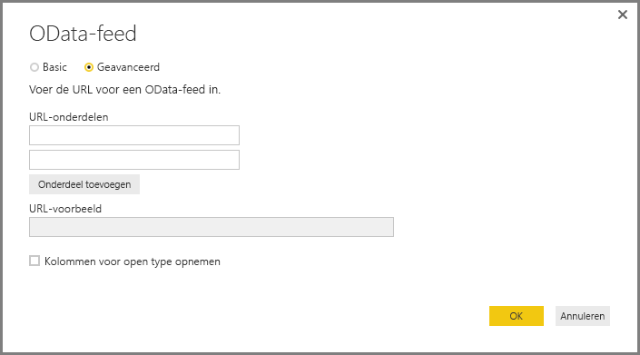
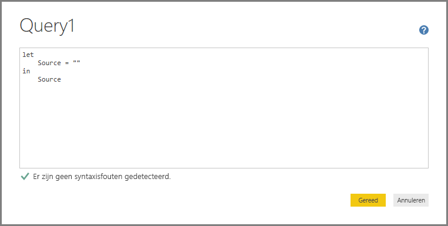
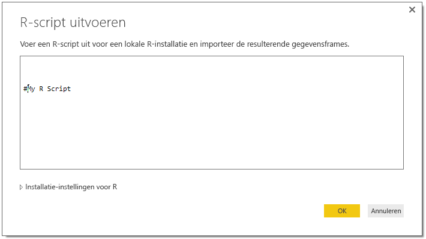

# Verbinding met gegevens maken via algemene interfaces in Power BI Desktop
U kunt verbinding maken met een groot aantal verschillende gegevensbronnen in **Power BI Desktop**, waarbij u ingebouwde gegevensconnectors gebruikt, variërend van **Access-databases** tot **Zendesk**-bronnen, zoals weergegeven in het venster **Gegevens ophalen**. U kunt ook verbinding maken met allerlei *andere* gegevensbronnen, om zo uw verbindingsopties verder uit te breiden, met behulp van de algemene interfaces (zoals **ODBC** of **REST API's**) die zijn ingebouwd in **Power BI Desktop**.

## Gegevensinterfaces in Power BI Desktop
**Power BI Desktop** omvat een groeiende verzameling gegevensconnectors die zijn ontworpen om verbinding te maken met een specifieke gegevensbron. De gegevensconnector **SharePoint-lijst** biedt bijvoorbeeld specifieke velden en ondersteunende informatie tijdens de verbinding die zijn ontworpen voor **SharePoint-lijsten**. Dat geldt ook voor andere gegevensbronnen in het venster dat wordt weergegeven wanneer u **Gegevens ophalen > Meer...**  selecteert (zoals in de vorige afbeelding).

Daarnaast kunt u in **Power BI Desktop** verbinding maken met gegevensbronnen die niet worden aangegeven in de lijsten bij **Gegevens ophalen** door een van de volgende algemene gegevensinterfaces te gebruiken:

* **ODBC**
* **OLE DB**
* **OData**
* **REST-API's**
* **R-scripts**

Als u in het verbindingsvensters die deze algemene interfaces bieden, de juiste parameters opgeeft, neemt het aantal gegevensbronnen waartoe u toegang hebt en dat u kunt gebruiken in **Power BI Desktop** aanzienlijk toe.

In de volgende secties vindt u lijsten met gegevensbronnen die toegankelijk via deze algemene interfaces.

Kunt u de gegevensbron die u wilt gebruiken met **Power BI Desktop** niet vinden? Verzend uw idee naar de lijst van het Power BI-team [met ideeën en aanvragen](https://ideas.powerbi.com/).

## Gegevensbronnen die toegankelijk zijn via ODBC
Met de **ODBC**-connector in **Power BI Desktop** kunt u gegevens importeren uit elk ODBC-stuurprogramma van derden door eenvoudig de **naam van de gegevensbron (DSN)** of een  *verbindingsreeks* op te geven. Desgewenst kunt u ook een SQL-instructie opgeven die wordt uitgevoerd door het ODBC-stuurprogramma.

De volgende lijst bevat enkele voorbeelden van gegevensbronnen waarmee **Power BI Desktop** verbinding kan maken met behulp van de algemene **ODBC**-interface.

| Algemene Power BI Desktop-connector | Externe gegevensbron | Koppeling naar meer informatie |
| --- | --- | --- |
| ODBC |Cassandra |[ODBC-stuurprogramma voor Cassandra](http://www.simba.com/drivers/cassandra-odbc-jdbc/) |
| ODBC |Couchbase DB |[Couchbase en Power BI](https://powerbi.microsoft.com/en-us/blog/visualizing-data-from-couchbase-server-v4-using-power-bi/) |
| ODBC |DynamoDB |[ODBC-stuurprogramma voor DynamoDB](http://www.simba.com/drivers/dynamodb-odbc-jdbc/) |
| ODBC |Google BigQuery |[ODBC-stuurprogramma voor BigQuery](http://www.simba.com/drivers/bigquery-odbc-jdbc/) |
| ODBC |Hbase |[ODBC-stuurprogramma voor Hbase](http://www.simba.com/drivers/hbase-odbc-jdbc/) |
| ODBC |Hive |[ODBC-stuurprogramma voor Hive](http://www.simba.com/drivers/hive-odbc-jdbc/) |
| ODBC |IBM Netezza |[Informatie over IBM Netezza](https://www.ibm.com/support/knowledgecenter/SSULQD_7.2.1/com.ibm.nz.datacon.doc/c_datacon_plg_overview.html) |
| ODBC |Presto |[ODBC-stuurprogramma voor Presto](http://www.simba.com/drivers/presto-odbc-jdbc/) |
| ODBC |Project Online |[Artikel over Project Online](desktop-project-online-connect-to-data.md) |
| ODBC |Progress OpenEdge |[Blogbericht over het ODBC-stuurprogramma voor Progress OpenEdge](https://na01.safelinks.protection.outlook.com/?url=https%3A%2F%2Fwww.progress.com%2Fblogs%2Fconnect-microsoft-power-bi-to-openedge-via-odbc-driver&data=02%7C01%7CMatt.Masson%40microsoft.com%7C5e63742e6c454308b58a08d4034b5923%7C72f988bf86f141af91ab2d7cd011db47%7C1%7C0%7C636137069555329811&sdata=gSu2Rq3vZ0uBVOgjaXxd8Y3uBf%2B8DidX6PG33jwAduY%3D&reserved=0) |

## Gegevensbronnen die toegankelijk zijn via OLE DB
Met de **OLE DB**-connector in **Power BI Desktop** kunt u gegevens importeren uit elk OLE DB-stuurprogramma van derden door eenvoudig een *verbindingsreeks* op te geven. Desgewenst kunt u ook een SQL-instructie opgeven die wordt uitgevoerd door het OLE DB-stuurprogramma.

De volgende lijst bevat enkele voorbeelden van gegevensbronnen waarmee **Power BI Desktop** verbinding kan maken met behulp van de algemene **OLE DB**-interface.

| Algemene Power BI Desktop-connector | Externe gegevensbron | Koppeling naar meer informatie |
| --- | --- | --- |
| OLE DB |SAS OLE DB |[SAS-provider voor OLE DB](https://support.sas.com/downloads/package.htm?pid=648) |
| OLE DB |Sybase OLE DB |[Sybase-provider voor OLE DB](http://infocenter.sybase.com/help/index.jsp?topic=/com.sybase.infocenter.dc35888.1550/doc/html/jon1256941734395.html) |

## Gegevensbronnen die toegankelijk zijn via OData
Met de **OData**-connector in **Power BI Desktop** kunt u gegevens importeren van elke **OData**-URL door de **OData**-URL eenvoudig te typen of te plakken. U kunt meerdere URL-onderdelen toevoegen door die koppelingen te typen of te plakken in de tekstvakken in het venster **OData-feed**.

De volgende lijst bevat enkele voorbeelden van gegevensbronnen waarmee **Power BI Desktop** verbinding kan maken met behulp van de algemene **OData**-interface.

| Algemene Power BI Desktop-connector | Externe gegevensbron | Koppeling naar meer informatie |
| --- | --- | --- |
| OData |Binnenkort beschikbaar |Kom binnenkort terug voor OData-gegevensbronnen. |

## Gegevensbronnen die toegankelijk zijn via REST-API's
U kunt verbinding maken met gegevensbronnen met behulp van de **REST-API's** en daarmee gegevens gebruiken uit allerlei soorten gegevensbronnen die **REST** ondersteunen.

De volgende lijst bevat enkele voorbeelden van gegevensbronnen waarmee **Power BI Desktop** verbinding kan maken met behulp van de algemene interface voor **REST-API's**.

| Algemene Power BI Desktop-connector | Externe gegevensbron | Koppeling naar meer informatie |
| --- | --- | --- |
| REST-API's |Couchbase DB |[Informatie over Couchbase REST API](https://powerbi.microsoft.com/en-us/blog/visualizing-data-from-couchbase-server-v4-using-power-bi/) |

## Gegevensbronnen die toegankelijk zijn via R-scripts
U kunt **R-scripts** gebruiken om toegang te krijgen tot gegevensbronnen en die gegevens gebruiken in **Power BI Desktop**.

De volgende lijst bevat enkele voorbeelden van gegevensbronnen waarmee **Power BI Desktop** verbinding kan maken met behulp van de algemene interface van **R-scripts**.

| Algemene Power BI Desktop-connector | Externe gegevensbron | Koppeling naar meer informatie |
| --- | --- | --- |
| R-script |SAS-bestanden |[Richtlijnen voor R-scripts van CRAN](https://cran.r-project.org/doc/manuals/R-data.html) |
| R-script |SPSS-bestanden |[Richtlijnen voor R-scripts van CRAN](https://cran.r-project.org/doc/manuals/R-data.html) |
| R-script |Statistische R-bestanden |[Richtlijnen voor R-scripts van CRAN](https://cran.r-project.org/doc/manuals/R-data.html) |

## Volgende stappen
Met **Power BI Desktop** kunt u verbinding maken met allerlei gegevensbronnen. Bekijk de volgende bronnen voor meer informatie over gegevensbronnen:

* [Getting Started with Power BI Desktop](desktop-getting-started.md) (Aan de slag met Power BI Desktop)
* [Data Sources in Power BI Desktop](desktop-data-sources.md) (Gegevensbronnen in Power BI Desktop)
* [Shape and Combine Data with Power BI Desktop](desktop-shape-and-combine-data.md) (Gegevens vormgeven en combineren met Power BI Desktop)
* [Connect to Excel workbooks in Power BI Desktop](desktop-connect-excel.md) (Verbinding maken met Excel-werkmappen in Power BI Desktop)   
* [Enter data directly into Power BI Desktop](desktop-enter-data-directly-into-desktop.md) (Rechtstreeks gegevens in Power BI Desktop invoeren)   

