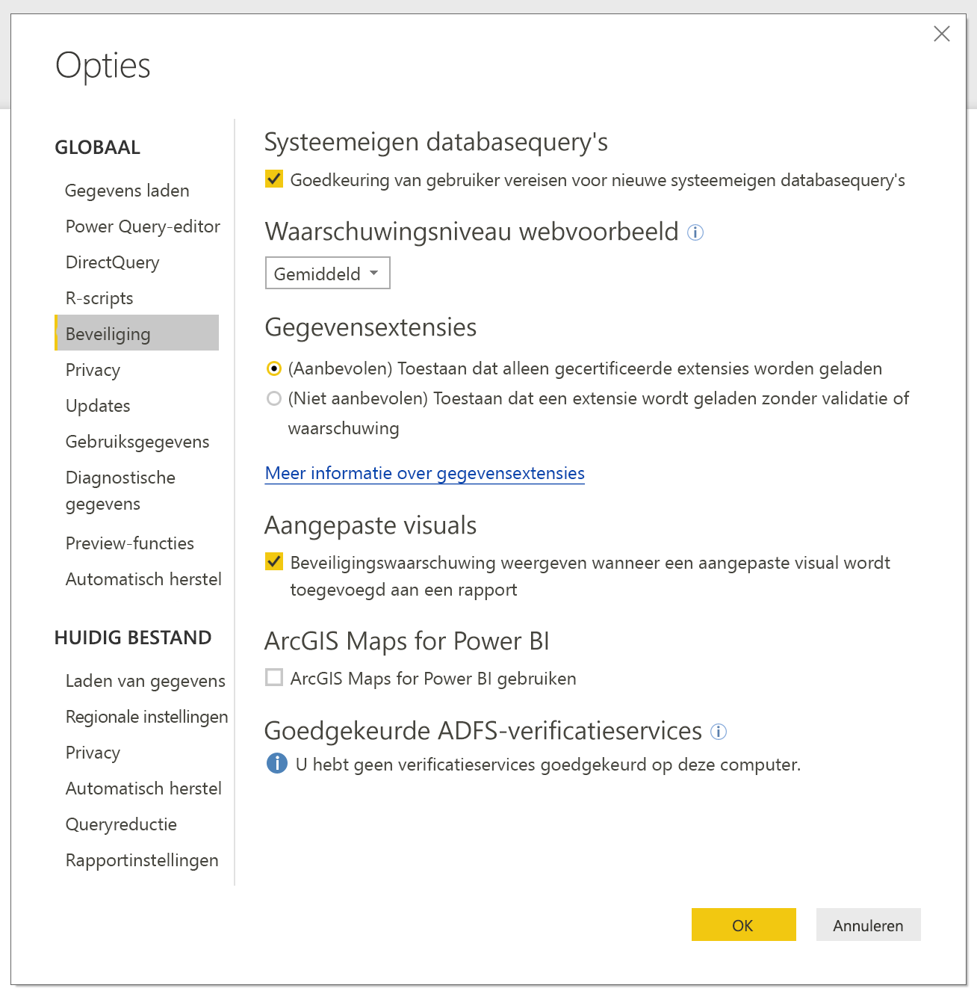
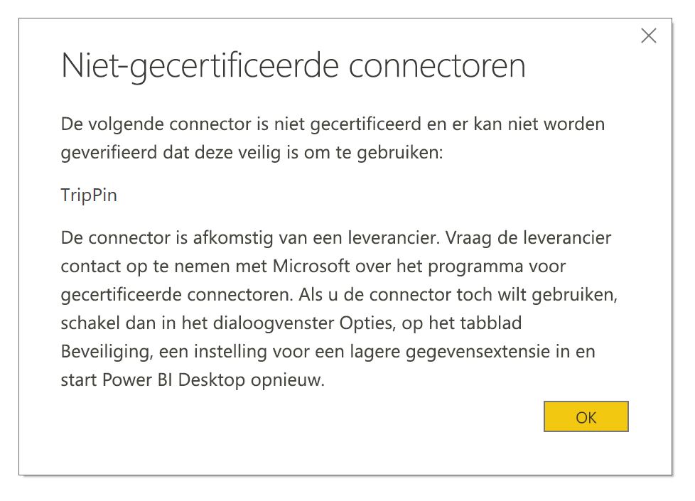

# Uitbreidbaarheid van connectors in Power BI

In Power BI kunnen klanten en ontwikkelaars de gegevensbronnen waarmee ze verbinding maken op tal van manieren uitbreiden, door bijvoorbeeld bestaande connectors en algemene gegevensbronnen te gebruiken (zoals ODBC, OData, Oledb, Web, CSV, XML en JSON). Hiernaast kunnen ontwikkelaars ook gegevensextensies maken (ook wel **aangepaste connectors** genoemd) en connectors certificeren zodat het **gecertificeerde connectors** worden.

Op dit moment is de mogelijkheid om **aangepaste connectors** te gebruiken ingeschakeld met een functieschakelaar. Deze functie wordt nog niet algemeen beschikbaar gemaakt. Er is nu een menu toegevoegd waarmee u veilig kunt bepalen welk niveau aan aangepaste code u wilt kunnen laten uitvoeren in uw systeem: alle aangepaste connectors of alleen connectors die zijn gecertificeerd en die door Microsoft worden gedistribueerd via het dialoogvenster **Gegevens ophalen**.

## Aangepaste connectors

**Aangepaste connectors** kunnen vele verschillende zaken omvatten, van kleine API's die van groot belang zijn voor uw bedrijf tot grote, branchespecifieke services waarvoor Microsoft nog geen connector beschikbaar heeft gesteld. Veel connectors worden door de leverancier zelf gedistribueerd. Als u een specifieke gegevensconnector nodig hebt, moet u contact opnemen met een leverancier.

Als u een **aangepaste connector** wilt gebruiken, plaatst u deze in de map *\[Documenten\\Power BI Desktop\\Aangepaste connectors*. Pas de beveiligingsinstellingen aan zoals wordt beschreven in het volgende gedeelte.

U hoeft de beveiligingsinstellingen niet aan te passen als u **gecertificeerde connectors** wilt gebruiken.

## Beveiliging van gegevensextensies

Als u de beveiligingsinstellingen van een gegevensextensie wilt wijzigen, gaat u naar **Power BI Desktop** en selecteert u **Bestand > Opties en instellingen > Opties > Beveiliging**.

Bij **Gegevensextensies** kunt u uit twee beveiligingsniveaus kiezen:

* (Aanbevolen) Toestaan dat alleen gecertificeerde extensies worden geladen
* (Niet aanbevolen) Toestaan dat een extensie wordt geladen zonder waarschuwing

Als u van plan bent om **aangepaste connectors**, zelf ontwikkelde connectors of connectors van een derden te gebruiken, moet u **(Niet aanbevolen) Toestaan dat een extensie wordt geladen zonder waarschuwing** selecteren. Het wordt afgeraden om die beveiligingsinstelling te gebruiken, tenzij u van plan bent om **aangepaste connectors** te gaan gebruiken.

Met de **aanbevolen** beveiligingsinstelling wordt een foutmelding weergegeven waarin wordt beschreven welke connectors niet kunnen worden geladen vanwege de beveiliging (als er aangepaste connectors aanwezig zijn in uw systeem).

Als u deze fout wilt verhelpen en u de connectors wilt gebruiken, moet u de beveiligingsinstellingen wijzigen zodat de eerder beschreven instelling **niet aanbevolen** wordt gebruikt. Start vervolgens **Power BI Desktop** opnieuw op.

## Gecertificeerde connectors

Een beperkte subset gegevensextensies wordt beschouwd als **gecertificeerd**. Gecertificeerde connectors zijn beschikbaar via het dialoogvenster **Gegevens ophalen**. De partij die verantwoordelijk is voor onderhoud en ondersteuning blijft de externe ontwikkelaar die de connector heeft gemaakt. Microsoft distribueert deze connectors wel, maar kan niet verantwoordelijk worden gehouden voor de prestaties of de functionaliteit op de lange termijn.

Als u een aangepaste connector wilt laten certificeren, laat u uw leverancier contact opnemen met dataconnectors@microsoft.com.
