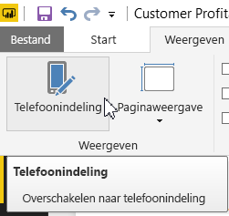
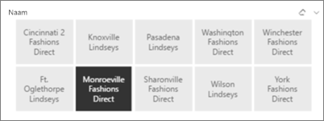
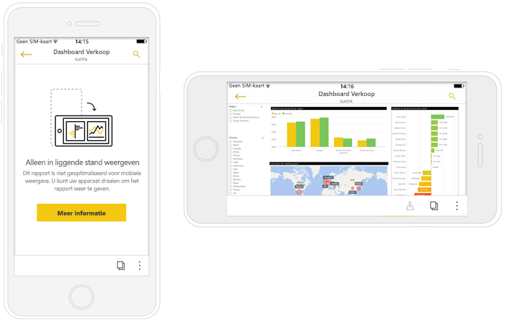

# Rapporten maken die zijn geoptimaliseerd voor de mobiele Power BI-apps
U kunt de weergave van uw rapporten in de mobiele apps verbeteren voor telefoons en tablets. Maak een rapport in de staande indeling, specifiek bedoeld voor telefoons en tablets. U kunt voor een optimale ervaring uw rapport aanpassen in Power BI Desktop en in de Power BI-service, door visuele elementen te rangschikken en de grootte ervan te wijzigen in een staande weergave. U hoeft ze niet allemaal op te nemen. Ook kunt u [*responsieve*visuals](#optimize-a-visual-for-any-size) en [responsieve slicers](#enhance-slicers-to-to-work-well-in-phone-reports) maken waarvan de grootte goed kan worden gewijzigd voor weergave op een telefoon. Als u filters aan uw rapport toevoegt, worden deze filters bovendien automatisch weergegeven in het geoptimaliseerde rapport. De lezers van uw rapport kunnen deze filters zien en het rapport ermee filteren.

## Een rapportpagina indelen als staande versie

Nadat u een rapport hebt gemaakt, kunt u dit optimaliseren voor telefoons en tablets.

1. Selecteer op het tabblad **Weergave** de optie **Telefoonindeling** in de rapportweergave in Power BI Desktop.  
   
    
   
    Selecteer in de Power BI-service **Rapport bewerken** > **Telefoonindeling**.

    U ziet een lege canvas in de vorm van een telefoon. Alle visuele elementen op de oorspronkelijke rapportpagina worden weergegeven in het deelvenster Visualisaties aan de rechterkant.

3. Als u een visueel element aan de telefoonindeling wilt toevoegen, sleept u het vanuit het deelvenster Visualisaties naar het telefooncanvas.
   
    Telefoonrapporten maken gebruik van een rasterindeling. Wanneer u visuele elementen naar het canvas voor mobiele telefoons versleept, worden ze met dat raster uitgelijnd.
   
    
   
    U kunt enkele of alle visuele elementen van de hoofdrapportpagina toevoegen aan de rapportpagina voor de telefoon. U kunt elk visuele element slechts één keer toevoegen.

4. U kunt de grootte van de visuele elementen in het raster wijzigen, op dezelfde manier als u voor tegels in dashboards en mobiele dashboards doet.
   
   De schaal van het telefoonrapportraster kan worden aangepast aan telefoons van verschillende groottes. Het rapport ziet er dus goed uit op telefoons met een klein scherm en telefoons met een groot scherm.
   
   

## Een visueel element optimaliseren voor elke grootte
U kunt de visuele elementen op het dashboard of in een rapport instellen als *responsief*. Ze kunnen dynamisch veranderen zodat de maximale hoeveelheid gegevens en inzichten wordt weergegeven, ongeacht de schermgrootte. 

Als de grootte van een visueel element verandert, geeft Power BI de prioriteit aan de gegevensweergave. Zo kan, bijvoorbeeld, de opvulling automatisch worden verwijderd en de legenda naar de bovenkant van het visuele element worden verplaatst, zodat het visuele element informatief blijft, ook als het kleiner wordt.

U kiest voor elk visueel element of u reactietijd wilt inschakelen. Lees meer over [het optimaliseren visuele elementen](visuals/desktop-create-responsive-visuals.md).

## Overwegingen bij het maken van telefoonrapportindelingen
* U kunt alle pagina's of slechts enkele optimaliseren voor rapporten met meerdere pagina's. 
* Als u een achtergrondkleur voor een rapportpagina hebt gedefinieerd, heeft het telefoonrapport dezelfde achtergrondkleur.
* U kunt de opmaakinstellingen niet alleen voor de telefoon wijzigen. De opmaak is consistent tussen de hoofd- en mobiele indeling. Tekengrootten zijn bijvoorbeeld hetzelfde.
* Als u een visueel element wilt wijzigen, bijvoorbeeld de opmaak, gegevensset, filters of een ander kenmerk, keert u terug naar de normale rapportontwerpmodus.
* Power BI biedt standaardtitels en -paginanamen voor telefoonrapporten in de mobiele app. Als u visuele tekstelementen voor titels en paginanamen in uw rapport hebt gemaakt, kunt u overwegen deze niet aan uw telefoonrapporten toe te voegen.     

## Een visueel element verwijderen uit de telefoonindeling
* Als u een visueel element wilt verwijderen, klikt u op de X in de rechterbovenhoek van het visuele element op het telefooncanvas of selecteert u het en drukt u op **Verwijderen**.
  
   Als u het visuele element hier verwijdert, wordt het alleen uit het canvas van de telefoonindeling verwijderd. Het visuele element en het originele rapport worden niet beïnvloed.
  
   

## Slicers verbeteren zodat ze goed werken in telefoonrapporten
Met slicers kunt u rapportgegevens op het canvas filteren. Wanneer u slicers ontwerpt in de normale rapportontwerpmodus, kunt u enkele slicerinstellingen wijzigen zodat ze beter geschikt zijn voor gebruik in telefoonrapporten:

* Besluit of rapportlezers slechts één of meer dan één item kunnen selecteren.
* Plaats een vak rond de slicer om het rapport gemakkelijker te kunnen scannen.
* Maak de slicer verticaal, horizontaal of *responsief*. 

Als u de slicer responsief maakt, worden er meer of minder opties weergegeven wanneer u het formaat en de vorm wijzigt. Hij kan lang, kort, breed of smal zijn. Als u de slicer klein genoeg maakt, wordt op de rapportpagina alleen nog een filterpictogram weergegeven. 

Lees meer over [responsieve slicers maken](power-bi-slicer-filter-responsive.md).

## Een telefoonrapport publiceren
* Als u de telefoonversie van een rapport wilt publiceren, [publiceert u het hoofdrapport van de Power BI Desktop naar de Power BI Desktop-service](desktop-upload-desktop-files.md). De telefoonversie wordt dan op hetzelfde moment gepubliceerd.
  
    Lees meer over [delen en machtigingen in Power BI](service-how-to-collaborate-distribute-dashboards-reports.md).

## Geoptimaliseerde en niet-geoptimaliseerde rapporten weergeven op een telefoon of tablet
In de mobiele apps op telefoons worden geoptimaliseerde en niet-geoptimaliseerde telefoonrapporten automatisch door Power BI gedetecteerd. Als een voor de telefoon geoptimaliseerd rapport bestaat, opent de Power BI-telefoon-app het rapport automatisch in de rapportmodus voor de telefoon.

Als er geen voor de telefoon geoptimaliseerd rapport bestaat, wordt het rapport geopend in de niet-geoptimaliseerde liggende weergave.  

Wanneer u een telefoonrapport hebt geopend en u de richting van de telefoon wijzigt naar liggend, wordt het rapport in de niet-geoptimaliseerde weergave geopend met de oorspronkelijke rapportindeling, of het rapport nu wel of niet is geoptimaliseerd.

Als u slechts enkele pagina’s optimaliseert, zien lezers een bericht in de portretweergave met de mededeling dat het rapport in de liggende modus beschikbaar is.

Rapportlezers kunnen hun telefoon of tablet zijdelings houden om de pagina in de liggende modus te bekijken. Lees meer over het [gebruiken van geoptimaliseerde Power BI-rapporten voor de staande modus](consumer/mobile/mobile-apps-view-phone-report.md).

## Volgende stappen
* [Een telefoonweergave van een dashboard maken in Power BI](service-create-dashboard-mobile-phone-view.md)
* [Voor uw telefoon geoptimaliseerde Power BI-rapporten weergeven](consumer/mobile/mobile-apps-view-phone-report.md)
* [Responsieve visuele elementen maken die zijn geoptimaliseerd voor elke grootte](visuals/desktop-create-responsive-visuals.md)
* Hebt u nog vragen? [Misschien dat de Power BI-community het antwoord weet](http://community.powerbi.com/)

