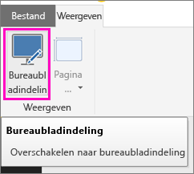
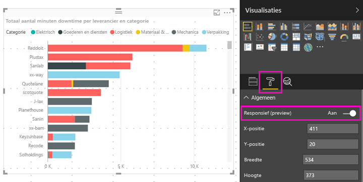

# Een visueel Power BI-element optimaliseren voor elke grootte
U kunt de visuele elementen in uw dashboard of rapport zodanig instellen dat ze *responsief* zijn. Dat wil zeggen dat ze dynamisch worden gewijzigd zodat ze de maximale hoeveelheid gegevens weergeven, ongeacht de schermgrootte.

Als de grootte van een visueel element verandert, geeft Power BI de prioriteit aan de gegevensweergave, bijvoorbeeld door automatisch de opvulling te verwijderen en de legenda naar de bovenkant van het visuele element te verplaatsen, zodat het visuele element ook als het kleiner wordt informatief blijft. Reactietijd is met name nuttig in visuele elementen in de mobiele Power BI-app op telefoons.

U kunt de reactietijd voor elk visueel element inschakelen met de X- en Y-as en met slicers.

## Reactietijd inschakelen in Power BI Desktop
1. Zorg er in Power BI Desktop op het tabblad **Weergeven** voor dat u in de modus **Bureaubladindeling** bent.
   
    
2. Selecteer een visueel element en selecteer in het deelvenster **Visualisaties** de sectie **Indeling**.
3. Vouw **Algemeen** uit > schuif **Responsief** naar **Aan**.
   
    
   
     Wanneer u nu [een voor de telefoon geoptimaliseerd rapport maakt](desktop-create-phone-report.md) en dit visuele element toevoegt, wordt de grootte ervan correct aangepast.

## Reactietijd inschakelen in de Power BI-service
U schakelt reactietijd voor een visueel element in een rapport in de Power BI-service in. U moet het rapport kunnen bewerken.

1. Selecteer in een rapport in de Power BI-service ([https://powerbi.com](https://powerbi.com)), de optie **Rapport bewerken**.
2. Selecteer een visueel element en selecteer in het deelvenster **Visualisaties** de sectie **Indeling**.
3. Vouw **Algemeen** uit > schuif **Responsief** naar **Aan**.
   
    
   
     Wanneer u nu [een telefoonweergave van een dashboard maakt](service-create-dashboard-mobile-phone-view.md) en dit visuele element toevoegt, wordt de grootte ervan correct aangepast.

## Volgende stappen
* [Rapporten maken die zijn geoptimaliseerd voor de mobiele Power BI-apps](desktop-create-phone-report.md)
* [Een telefoonweergave van een dashboard maken in Power BI](service-create-dashboard-mobile-phone-view.md)
* [Voor uw telefoon geoptimaliseerde Power BI-rapporten weergeven](mobile-apps-view-phone-report.md)
* Nog vragen? [Misschien dat de Power Bi-community het antwoord weet](http://community.powerbi.com/)

