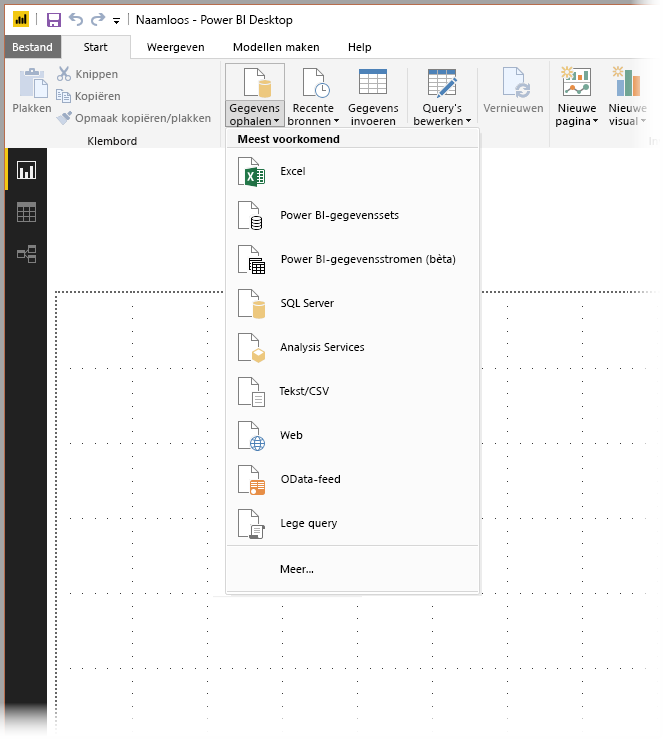
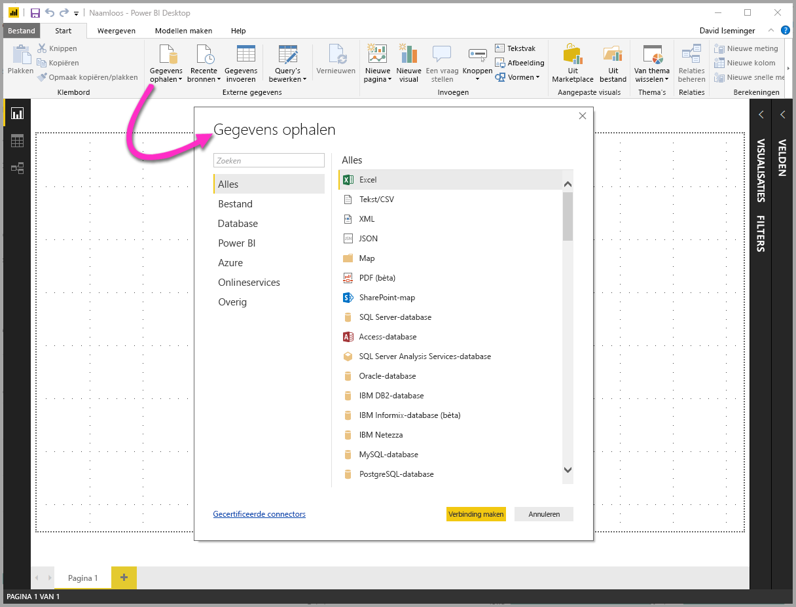
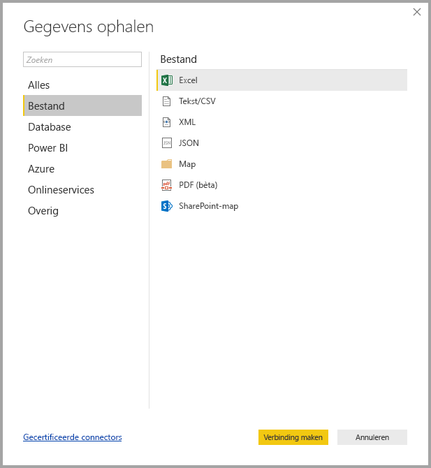
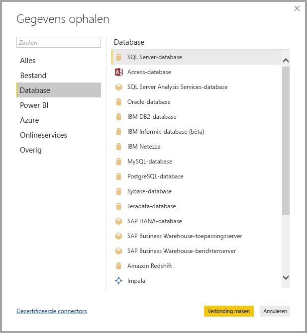
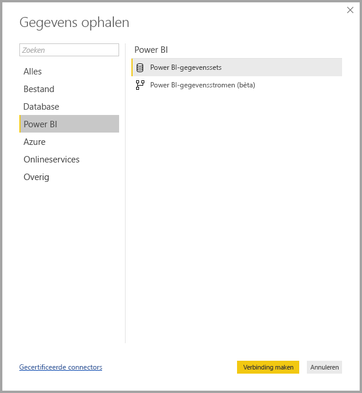
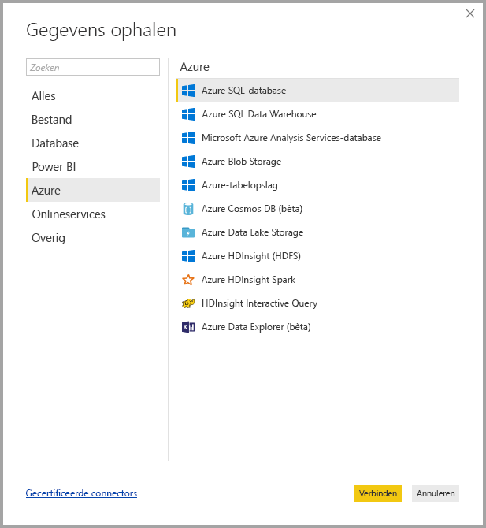
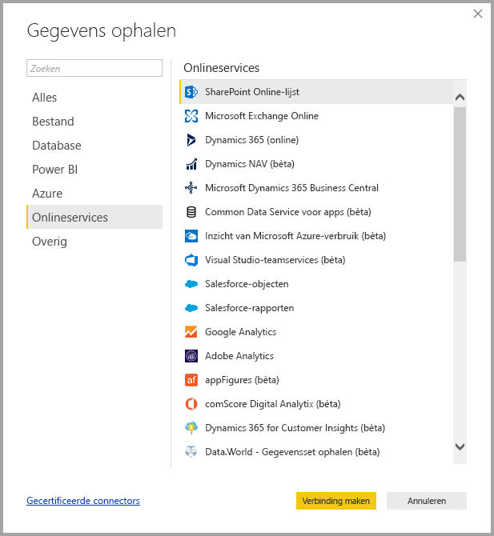
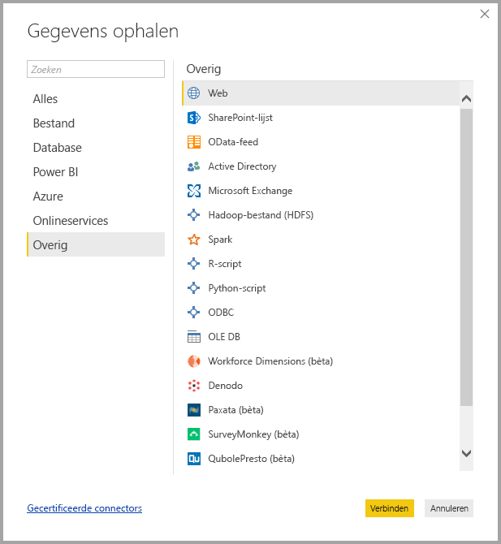
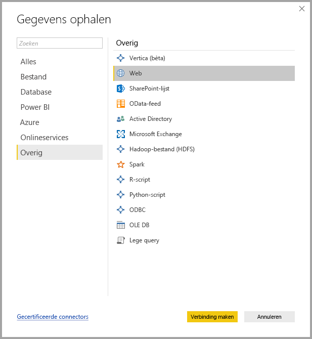

# Gegevensbronnen in Power BI Desktop
Met Power BI Desktop kunt u verbinding maken met gegevens uit veel verschillende bronnen. Onderaan op deze pagina vindt u een volledige lijst met beschikbare gegevensbronnen.

Als u verbinding wilt maken met gegevens, selecteert u **Gegevens ophalen** op het lint **Start**. Als u de pijl-omlaag selecteert of de tekst **Gegevens ophalen** op de knop, wordt het menu met **meest voorkomende** gegevenstypen weergegeven, zoals in de volgende afbeelding:

Als u **Meer...** selecteert in het menu **Meest voorkomend**, wordt het venster **Gegevens ophalen** weergegeven. U kunt het venster **Gegevens ophalen** ook weergeven (en het menu **Meest voorkomend** omzeilen) door de **pictogramknop** **Gegevens ophalen** rechtstreeks te selecteren.

> [!NOTE]
> Het Power BI-team breidt de beschikbare gegevensbronnen voor **Power BI Desktop** en de **Power BI-service** voortdurend uit. Daarom ziet u vaak vroege versies van gegevensbronnen waaraan wordt gewerkt en die worden aangeduid als *bèta* of *preview*. Een gegevensbron die wordt gemarkeerd als *bèta* of *preview*, heeft beperkte ondersteuning en functionaliteit en dient niet te worden gebruikt in een productieomgeving.
> 
> 

## Gegevensbronnen
Gegevenstypen zijn ingedeeld in de volgende categorieën:

* Alle
* Bestand
* Database
* Power BI
* Azuur
* Onlineservices
* Overige

De categorie **Alle** omvat alle gegevenstypen uit alle categorieën.

De categorie **Bestand** biedt de volgende gegevensverbindingen:

* Excel
* Tekst/CSV
* XML
* JSON
* Map
* SharePoint-map

In de volgende afbeelding ziet u het venster **Gegevens ophalen** voor **Bestand**.

De categorie **Database** biedt de volgende gegevensverbindingen:

* SQL Server-database
* Access-database
* SQL Server Analysis Services-database
* Oracle-database
* IBM DB2-database
* IBM Informix-database (bèta)
* IBM Netezza
* MySQL-database
* PostgreSQL-database
* Sybase-database
* Teradata-database
* SAP HANA-database
* SAP Business Warehouse-toepassingsserver
* SAP Business Warehouse-berichtenserver (bèta)
* Amazon Redshift
* Impala
* Google BigQuery
* Snowflake
* Exasol

> [!NOTE]
> Sommige databaseconnectors moet u eerst inschakelen door **Bestand > Opties en instellingen > Opties** te selecteren en vervolgens **Voorbeeldfuncties** en de connector in te schakelen. Als u geen van de hierboven genoemde connectors ziet en ze wel wilt gebruiken, controleert u de instellingen voor **Voorbeeldfuncties**. Houd er ook rekening mee dat een gegevensbron die wordt gemarkeerd als *bèta* of *preview*, beperkte ondersteuning en functionaliteit heeft en niet dient te worden gebruikt in een productieomgeving.
> 
> 

In de volgende afbeelding ziet u het venster **Gegevens ophalen** voor **Database**.

De categorie **Power BI** biedt de volgende gegevensverbindingen:

* Power BI-gegevenssets
* Power BI-gegevenspools (bèta)

In de volgende afbeelding ziet u het venster **Gegevens ophalen** voor **Power BI**.

De categorie **Azure** biedt de volgende gegevensverbindingen:

* Azure SQL-database
* Azure SQL Data Warehouse
* Microsoft Azure Analysis Services-database
* Azure Blob-opslag
* Azure-tabelopslag
* Azure Cosmos DB (bèta)
* Azure Data Lake Store
* Azure HDInsight (HDFS)
* Azure HDInsight Spark (bèta)
* HDInsight interactieve Query (bèta)
* Azure KustoDB (bèta)

In de volgende afbeelding ziet u het venster **Gegevens ophalen** voor **Azure**.

De categorie **Onlineservices** biedt de volgende gegevensverbindingen:

* SharePoint Online-lijst
* Microsoft Exchange Online
* Dynamics 365 (online)
* Dynamics NAV (bèta)
* Dynamics 365 Business Central
* Common Data Service voor apps (bèta)
* Common Data Service (bèta)
* Inzicht van Microsoft Azure-verbruik (bèta)
* Visual Studio-teamservices (bèta)
* Salesforce-objecten
* Salesforce-rapporten
* Google Analytics
* Adobe Analytics
* appFigures (bèta)
* comScore Digital Analytix (bèta)
* Dynamics 365 for Customer Insights (bèta)
* Data.World - Gegevensset ophalen (bèta)
* Facebook
* GitHub (bèta)
* MailChimp (bèta)
* Marketo (bèta)
* Mixpanel (bèta)
* Planview Enterprise One - PRM (bèta)
* Planview Projectplace (bèta)
* QuickBooks Online (bèta)
* Smartsheet
* SparkPost (bèta)
* Stripe (bèta)
* SweetIQ (bèta)
* Planview Enterprise One - CMT (bèta)
* Twilio (bèta)
* tyGraph (bèta)
* Webtrends (bèta)
* Zendesk (bèta)
* TeamDesk (bèta)

In de volgende afbeelding ziet u het venster **Gegevens ophalen** voor **Onlineservices**.

De categorie **Overige** biedt de volgende gegevensverbindingen:

* Vertica (bèta)
* Web
* SharePoint-lijst
* OData-feed
* Active Directory
* Microsoft Exchange
* Hadoop-bestand (HDFS)
* Spark (bèta)
* R-script
* ODBC
* OLE DB
* Lege query

In de volgende afbeelding ziet u het venster **Gegevens ophalen** voor **Overige**.

> [!NOTE]
> Op dit moment is het niet mogelijk om verbinding te maken met aangepaste gegevensbronnen die zijn beveiligd met Azure Active Directory.
> 
> 

## Verbinding maken met een gegevensbron
Als u verbinding wilt maken met een gegevensbron, selecteert u de gegevensbron in het venster **Gegevens ophalen** en selecteert u **Verbinding maken**. In de volgende afbeelding is **Web** geselecteerd in de categorie **Overige**.

Er wordt een verbindingsvenster weergegeven dat specifiek is voor het type gegevensverbinding. Als referenties zijn vereist, wordt u gevraagd ze op te geven. In de volgende afbeelding ziet u hoe een URL wordt ingevoerd om verbinding te maken met een webgegevensbron.

Nadat u de URL of de gegevens voor de bronverbinding hebt ingevoerd, selecteert u **OK**. Power BI Desktop maakt de verbinding met de gegevensbron en toont de beschikbare gegevensbronnen in de **Navigator**.

U kunt de gegevens laden door de knop **Laden** onderaan in het deelvenster **Navigator** te selecteren of de query bewerken voordat gegevens worden geladen door de knop **Bewerken** te selecteren.

Dat is alles wat u hoeft te weten om verbinding te maken met gegevensbronnen in Power BI Desktop! Probeer verbinding te maken met onze groeiende lijst gegevensbronnen en kom regelmatig terug. We blijven deze lijst voortdurend uitbreiden.

## Volgende stappen
U kunt allerlei handelingen uitvoeren met Power BI Desktop. Bekijk de volgende bronnen voor meer informatie over de vele mogelijkheden:

* [Getting Started with Power BI Desktop](desktop-getting-started.md) (Aan de slag met Power BI Desktop)
* [Queryoverzicht met Power BI Desktop](desktop-query-overview.md)
* [Gegevenstypen in Power BI Desktop](desktop-data-types.md)
* [Gegevens vormgeven en combineren met Power BI Desktop](desktop-shape-and-combine-data.md)
* [Common Query Tasks in Power BI Desktop](desktop-common-query-tasks.md) (Algemene querytaken in Power BI Desktop)    
