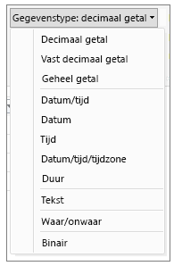
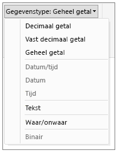

# Gegevenstypen in Power BI Desktop
In dit artikel worden de gegevenstypen beschreven die worden ondersteund in Power BI Desktop en Data Analysis Expressions (DAX). 

Wanneer u gegevens laadt in Power BI Desktop, wordt geprobeerd het gegevenstype van de bronkolom te converteren naar een gegevenstype dat betere ondersteuning biedt voor opslag, berekeningen en visualisatie van gegevens . Als bijvoorbeeld een kolom met waarden die u uit Excel importeert, geen decimale waarden bevat, converteert Power BI Desktop de hele kolom met gegevens naar het gegevenstype Geheel getal, dat beter geschikt is voor het opslaan van gehele getallen.

Dit concept is belangrijk omdat sommige DAX-functies speciale vereisten voor gegevenstypen hebben. Hoewel DAX in veel gevallen een gegevenstype impliciet converteert, gebeurt dat een enkele keer niet.  Als een DAX-functie bijvoorbeeld het gegevenstype Date nodig heeft en het gegevenstype voor de kolom Text is, zal de DAX-functie niet correct werken.  Het is dus zowel belangrijk als handig om het juiste gegevenstype voor een kolom te gebruiken. Impliciete conversies worden verderop in dit artikel beschreven.

## Het gegevenstype van een kolom vaststellen en opgeven
U kunt in Power BI Desktop het gegevenstype van een kolom vaststellen en opgeven in de Query-editor of in de Gegevens- of Rapportweergave:

**Gegevenstypen in Query-editor**

**Gegevenstypen in de Gegevens- of Rapportweergave**

De vervolgkeuzelijst voor Gegevenstype in de Query-editor bevat twee gegevenstypen die momenteel niet zijn opgenomen in de Gegevens- of Rapportweergave: **Datum/tijd/tijdzone** en **Duur**. Wanneer een kolom met deze gegevenstypen wordt geladen in het model en bekeken in de Gegevens- of Rapportweergave, wordt een kolom met een Datum/tijd/tijdzone-gegevenstype geconverteerd naar een datum/tijd en wordt een kolom met het gegevenstype Duur geconverteerd naar een decimaal getal.

### Getaltypen
Power BI Desktop ondersteunt drie getaltypen:

**Decimaal getal**: geeft een 64-bits (8-bytes) getal met drijvende komma weer. Dit is het meest voorkomende getaltype en komt overeen met de getallen zoals u zich deze doorgaans voorstelt.  Hoewel ontworpen voor het verwerken van getallen met een decimale waarde, worden hiermee ook gehele getallen verwerkt.  Het type Decimaal getal kan negatieve waarden tussen - 1,79E +308 tot en met -2,23E -308, 0 en positieve waarden van 2,23E -308 tot en met 1,79E +308 verwerken. Getallen zoals 34, 34,01 en 34,000367063 zijn geldige decimale getallen. De grootste waarde die als Decimaal getal kan worden weergegeven is 15 cijfers lang.  Het decimale scheidingsteken kan overal in het getal staan. Het type Decimaal getal correspondeert met de manier waarop getallen in Excel worden opgeslagen.

**Vast decimaal getal**: heeft een vaste locatie voor het decimaalteken. Er staan altijd vier cijfers rechts van het decimaalteken en er is plaats voor 19 significante cijfers.  De grootste waarde die kan worden weergegeven is 922.337.203.685.477,5807 (positief of negatief).  Het type Vast decimaal getal is handig in gevallen waar door afronding fouten kunnen ontstaan.  Wanneer u werkt met veel getallen met kleine decimale waarden, kan het aantal fouten soms oplopen waardoor het resultaat een kleine afwijking vertoont.  Omdat de waarden achter de vier cijfers rechts van het decimaalteken worden afgekapt, kunt u met het type Vast decimaal getal dit soort fouten voorkomen.   Als u bekend bent met SQL Server, komt dit gegevenstype overeen met Decimaal (19,4) van SQL Server of het gegevenstype Valuta in Power Pivot. 

**Geheel getal**: geeft een 64-bits (8-bytes) geheel getal weer. Omdat het een geheel getal is, zijn er geen cijfers rechts van het decimaalteken. Er is plaats voor 19 cijfers; positieve of negatieve gehele getallen tussen -9.223.372.036.854.775.808 (-2^63) en 9.223.372.036.854.775.807 (2^63-1).  Hiermee kunt u het grootst mogelijke getal van de verschillende numerieke gegevenstypen aangeven.  Net zoals het type Vast decimaal getal kan het type Geheel getal handig zijn in gevallen waarin u het afronden wilt controleren. 

### Datum/tijd-typen
Power BI Desktop ondersteunt vijf datum/tijd-gegevenstypen in de Queryweergave en drie in de Rapportweergave en het rapportmodel.   Tijdens het laden in het model worden zowel Datum/tijd/tijdzone als Duur geconverteerd.

**Datum/tijd**: geeft een datum- en tijd-waarde weer.  De Datum/tijd-waarde wordt opgeslagen als een Decimaal getal.  Daardoor kunt u een conversie tussen beide uitvoeren.   Het tijdgedeelte van een datum wordt opgeslagen als een fractie van hele veelvouden van 1/300 seconden (3,33 ms).  Datums tussen 1900 en 9999 worden ondersteund.

**Datum**: geeft alleen een datum weer (geen tijdgedeelte).  Bij conversie naar het model is een Datum-waarde hetzelfde als een Datum/tijd-waarde met nul voor de decimale waarde.

**Tijd**: geeft alleen Tijd (geen datumgedeelte) aan.  Bij conversie naar het model is een Tijd-waarde hetzelfde als een Datum/tijd-waarde zonder cijfers links van het decimaalteken.

**Datum/tijd/tijdzone**: geeft een UTC-datum/tijd weer.  Op dit moment wordt dit geconverteerd naar een Datum/tijd-waarde wanneer het in het model wordt geladen.

**Duur**: geeft een tijdsduur weer. Op dit moment wordt dit geconverteerd naar een Decimaal getal-waarde wanneer het in het model wordt geladen.  Als Decimaal getal-type kan het worden opgeteld bij of afgetrokken van een Datum/tijd-veld met de juiste resultaten.  U kunt dit gemakkelijk als Decimaal getal-type gebruiken in visualisaties die grootte weergeven.

### Teksttype
**Tekst**: een gegevensreeks van Unicode-tekens. Dit kunnen tekenreeksen, cijfers of datums zijn die worden weergegeven in een tekstindeling. Maximale tekenreekslengte is 268.435.456 Unicode-tekens (256 megatekens) of 536.870.912 bytes.

### Waar/onwaar-type
**Waar/onwaar**: een booleaanse waarde die waar of onwaar aangeeft.

### Type lege waarden/null-waarden
**Leeg**: is een gegevenstype in DAX dat SQL-null-waarden weergeeft en vervangt. U kunt een lege waarde maken met behulp van de functie [BLANK](http://msdn.microsoft.com/library/ee634820.aspx) en testen op lege waarden met behulp van de logische functie [ISBLANK](https://msdn.microsoft.com/library/ee634204.aspx).

### Tabelgegevenstype
DAX maakt in veel functies gebruik van een tabelgegevenstype, zoals aggregaties en berekeningen van tijdinformatie. Sommige functies vereisen een verwijzing naar een tabel. Andere functies retourneren een tabel die vervolgens kan worden gebruikt als invoer voor andere functies. In sommige functies die een tabel als invoer nodig hebben, kunt u een expressie opgeven die in een tabel resulteert. Voor sommige functies is een verwijzing naar een basistabel vereist. Zie [Naslag voor DAX-functies](https://msdn.microsoft.com/library/ee634396.aspx) voor meer informatie over de vereisten van specifieke functies.

## Impliciete en expliciete conversie van gegevenstypen in DAX-formules
Elke DAX-functie heeft specifieke vereisten voor de typen gegevens die worden gebruikt als in- en uitvoer. Bepaalde functies vereisen bijvoorbeeld gehele getallen voor sommige argumenten en datums voor andere. Andere functies vereisen tekst of tabellen.

Als de gegevens in de kolom die u als een argument opgeeft, niet compatibel zijn met het gegevenstype dat door de functie wordt vereist, geeft DAX in veel gevallen een fout als resultaat. Maar waar mogelijk zal DAX proberen de gegevens impliciet te converteren naar het vereiste type. Bijvoorbeeld:

* U kunt een datum typen als een tekenreeks en DAX zal die tekenreeks dan parseren en proberen te berekenen als een van de Windows-indelingen voor datum en tijd.
* U kunt TRUE + 1 optellen en 2 als resultaat verkrijgen, omdat TRUE impliciet wordt geconverteerd naar het getal 1 en de bewerking 1 + 1 wordt uitgevoerd.
* Als u waarden in twee kolommen optelt en één waarde wordt weergegeven als tekst ("12") en de andere als een getal (12), zal DAX de tekenreeks impliciet converteren naar een getal en vervolgens een optelling uitvoeren met een numerieke waarde als resultaat. De volgende expressie retourneert 44: = "22" + 22.
* Als u probeert twee getallen samen te voegen, geeft Excel deze weer als tekenreeksen om ze vervolgens samen te voegen. De volgende expressie retourneert "1234": = 12 & 34.

### Tabel met impliciete gegevensconversies
Het type conversie dat wordt uitgevoerd, wordt bepaald door de operator, die de vereiste waarden berekent voordat de aangevraagde bewerking wordt uitgevoerd. Deze tabellen vermelden de operators en geven de conversie aan die wordt uitgevoerd voor elk gegevenstype in de kolom wanneer dit wordt gekoppeld aan het gegevenstype in de rij die de kolom kruist.

> [!NOTE]
>  Tekst-gegevenstypen worden niet in deze tabellen opgenomen. Wanneer een getal wordt weergegeven in een tekstindeling, probeert Power BI in sommige gevallen het type te bepalen en dat weer te geven als een getal.
> 
> 

**Optelling (+)**

| Operator(+) | INTEGER | CURRENCY | REAL | Datum/tijd |
| --- | --- | --- | --- | --- |
| INTEGER |INTEGER |CURRENCY |REAL |Datum/tijd |
| CURRENCY |CURRENCY |CURRENCY |REAL |Datum/tijd |
| REAL |REAL |REAL |REAL |Datum/tijd |
| Datum/tijd |Datum/tijd |Datum/tijd |Datum/tijd |Datum/tijd |

Als bijvoorbeeld een reëel wordt gebruikt in een optelling in combinatie met valutagegevens, worden beide waarden geconverteerd naar REAL en is de geretourneerde waarde REAL.

**Aftrekking (-)**

In de volgende tabel is de rijkop het aftrekgetal (links) en is de kolomkop de aftrekker (rechts).

| Operator(-) | INTEGER | CURRENCY | REAL | Datum/tijd |
| --- | --- | --- | --- | --- |
| INTEGER |INTEGER |CURRENCY |REAL |REAL |
| CURRENCY |CURRENCY |CURRENCY |REAL |REAL |
| REAL |REAL |REAL |REAL |REAL |
| Datum/tijd |Datum/tijd |Datum/tijd |Datum/tijd |Datum/tijd |

Als een datum bijvoorbeeld wordt gebruikt in voor aftrekken met een ander gegevenstype, worden beide waarden geconverteerd naar datums en is de geretourneerde waarde ook een datum.

> [!NOTE]
>    Gegevensmodellen bieden tevens ondersteuning voor de monadische operator - (negatief), maar deze operator wijzigt niet het gegevenstype van de operand.
> 
> 

**Vermenigvuldiging (*)**

| Operator(\*) | INTEGER | CURRENCY | REAL | Datum/tijd |
| --- | --- | --- | --- | --- |
| INTEGER |INTEGER |CURRENCY |REAL |INTEGER |
| CURRENCY |CURRENCY |REAL |CURRENCY |CURRENCY |
| REAL |REAL |CURRENCY |REAL |REAL |

Als een geheel getal bijvoorbeeld wordt gecombineerd met een reëel getal in een vermenigvuldiging, worden beide nummers geconverteerd naar reële getallen en is ook de geretourneerde waarde REAL.

**Deling (/)**

In de volgende tabel is de rijkop de teller en is de kolomkop de noemer.

| Operator(/) (rij/kolom) | INTEGER | CURRENCY | REAL | Datum/tijd |
| --- | --- | --- | --- | --- |
| INTEGER |REAL |CURRENCY |REAL |REAL |
| CURRENCY |CURRENCY |REAL |CURRENCY |REAL |
| REAL |REAL |REAL |REAL |REAL |
| Datum/tijd |REAL |REAL |REAL |REAL |

Als een geheel getal bijvoorbeeld wordt gecombineerd met een valutawaarde in een deling, worden beide nummers geconverteerd naar reële getallen en is ook de geretourneerde waarde een reëel getal.

### Vergelijkingsoperators
In vergelijkingsexpressies worden booleaanse waarden beschouwd als groter dan tekenreekswaarden en worden tekenreekswaarden beschouwd als groter dan numerieke of datum/tijd-waarden. Getallen en datum/tijd-waarden worden beschouwd als gelijkwaardig. Er worden geen impliciete conversies uitgevoerd voor booleaanse of tekenreekswaarden. BLANK of een lege waarde wordt geconverteerd naar 0 /”"/false, afhankelijk van het gegevenstype van de andere vergeleken waarde.

De volgende DAX-expressies illustreren dit gedrag:

=IF(FALSE()\>"true","Expressie is waar", "Expressie is onwaar") retourneert "Expressie is waar"

=IF("12"\>12,"Expressie is waar", "Expressie is onwaar") retourneert "Expressie is waar"

=IF("12"=12,"Expressie is waar", "Expressie is onwaar") retourneert "Expressie is onwaar"

Conversies worden impliciet uitgevoerd voor numerieke of datum/tijd-typen zoals beschreven in de volgende tabel:

| Vergelijkingsoperator | INTEGER | CURRENCY | REAL | Datum/tijd |
| --- | --- | --- | --- | --- |
| INTEGER |INTEGER |CURRENCY |REAL |REAL |
| CURRENCY |CURRENCY |CURRENCY |REAL |REAL |
| REAL |REAL |REAL |REAL |REAL |
| Datum/tijd |REAL |REAL |REAL |Datum/tijd |

### Lege waarden, lege tekenreeksen en nulwaarden verwerken
In DAX worden een null-waarde, lege waarde, lege cel of een ontbrekende waarde allemaal weergegeven door hetzelfde nieuwe waardetype, BLANK. U kunt ook lege waarden genereren met behulp van de functie BLANK of testen op lege waarden met behulp van de functie ISBLANK.

Hoe lege waarden worden verwerkt in bewerkingen zoals optellingen of samenvoegingen is afhankelijk van de afzonderlijke functie. De volgende tabel geeft een overzicht van de verschillen tussen DAX- en Microsoft Excel-formules in de manier waarop lege waarden worden verwerkt.

| Expressie | DAX | Excel |
| --- | --- | --- |
| BLANK + BLANK |BLANK |0(nul) |
| BLANK + 5 |5 |5 |
| BLANK * 5 |BLANK |0(nul) |
| 5/BLANK |Oneindig |Fout |
| 0/BLANK |Geen getal |Fout |
| BLANK/BLANK |BLANK |Fout |
| FALSE OR BLANK |FALSE |FALSE |
| FALSE AND BLANK |FALSE |FALSE |
| TRUE OR BLANK |TRUE |TRUE |
| TRUE AND BLANK |FALSE |TRUE |
| BLANK OR BLANK |BLANK |Fout |
| BLANK AND BLANK |BLANK |Fout |

