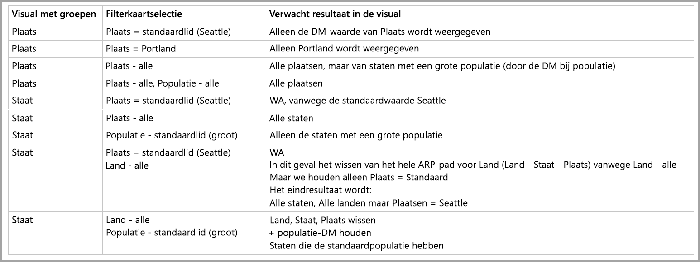

# Standaardlid in multidimensionale modellen in Power BI

U kunt verbinding maken met multidimensionale modellen in Power BI en rapporten maken waarin allerlei soorten gegevens binnen het model worden gevisualiseerd. Wanneer u met multidimensionale modellen werkt, past Power BI regels toe op hoe gegevens worden verwerkt, gebaseerd op welke kolom is gedefinieerd als het *standaardlid*. 

Wanneer u werkt met multidimensionale modellen, verwerkt Power BI gegevens uit het model op basis van waar het kolom met het **standaardlid** wordt gebruikt. Het kenmerk *standaardlid* is ingesteld in CSDL (Conceptual Schema Definition Language) voor een bepaalde kolom in een multidimensionaal model. U leert meer over het standaardlid in het [artikel over kenmerkeigenschappen](https://docs.microsoft.com/sql/analysis-services/multidimensional-models/attribute-properties-define-a-default-member?view=sql-server-2017). Wanneer een DAX-query wordt uitgevoerd, wordt het standaardlid dat in het model is opgegeven, automatisch toegepast.

In dit artikel wordt beschreven hoe Power BI zich onder bepaalde omstandigheden gedraagt wanneer u met multidimensionale modellen werkt, op basis van waar het *standaardlid* is gevonden. 

## Werken met filterkaarten

Wanneer u een filterkaart maakt op een veld met een standaardlid, wordt de veldwaarde standaardlid automatisch geselecteerd in de filterkaart. Het resultaat is dat alle visuals die worden beïnvloed door de filterkaart hun standaardmodellen in de database behouden. De waarden in dergelijke filterkaarten weerspiegelen dat standaardlid.

Als het standaardlid wordt verwijderd, wordt de waarde voor alle visuals waarop de filterkaart van toepassing is opgeheven door deze te deselecteren. De weergegeven waarden weerspiegelen dan niet meer het standaardlid.

Als voorbeeld hebben we de kolom *Valuta* met een standaardlid dat is ingesteld op *USD*:

* In dit voorbeeld hebben we een kaar met *Totale verkoop*, het standaardlid is toegepast op de waarde en we zien verkopen die overeenkomen met 'USD'.
* Als u *Valuta* versleept naar het filterkaartvenster, ziet u dat *USD* als standaardwaarde is geselecteerd. De waarde van *Totale verkoop* blijft dezelfde, omdat het standaardlid is toegepast.
* Als u echter de selectie van de waarde *USD* in de filterkaart ongedaan maakt, wordt het standaardlid voor *Valuta* gewist, waardoor *Totale verkoop* alle valuta's weerspiegelt.
* Stel dat u een andere waarde in de filterkaart selecteert (bijvoorbeeld *EURO*), evenals het standaardlid, weerspiegelt *Totale verkoop* het filter *Valuta IN {USD, EURO}*.

## Groeperingsgedrag

Wanneer u een visual groepeert in een kolom met het *standaardlid*, wist Power BI het *standaardlid* in die kolom en het kenmerkrelatiepad van dat lid. Dit zorgt ervoor dat de visual alle waarden weergeeft en niet alleen de standaardwaarden.

## Kenmerkrelatiepaden (ARP's)

Kenmerkrelatiepaden (ARP's) bieden *standaardleden* krachtige mogelijkheden, maar zorgen ook voor een bepaalde mate van complexiteit. Wanneer ARP's optreden, volgt Power BI het pad van ARP's om aanvullende standaardleden voor andere kolommen te wissen, om zo te zorgen voor consistente en nauwkeurige verwerking van gegevens voor visuals.

Bekijk een voorbeeld om het gedrag te verduidelijken. Houd rekening met de volgende configuratie van ARP's:

Stel u voor dat de volgende *standaardleden* zijn ingesteld voor deze kolommen:

* Plaats > Seattle
* Staat > WA
* Land > VS
* Populatie > Groot

Bekijk nu wat er gebeurt als elk van deze kolommen wordt gebruikt in Power BI. Als visuals worden gegroepeerd in de volgende kolommen, zijn dit de resultaten:

* **Plaats** - Power BI geeft alle plaatsen weer door alle **standaardleden** voor *Plaats*, *Staat* en *Land* te wissen, maar behoudt het **standaardlid** voor *Populatie*; Power BI heeft de volledige ARP gewist voor *Plaats*.
    > [!NOTE]
    > *Populatie* staat niet in het ARP-pad van *Plaats* en heeft uitsluitend betrekking op *Staat*, waardoor Power BI het niet wist.
* **Staat** - Power BI geeft alle *Staten* weer door de **standaardleden** voor *Plaats*, *Staat*, *Land* en *Populatie* te wissen.
* **Land** - Power BI geeft alle landen weer door alle **standaardleden** voor *Plaats*, *Staat* en *Land* te wissen, maar behoudt het **standaardlid** voor *Populatie*.
* **Plaats en Staat** - Power BI wist alle **standaardleden** voor alle kolommen.

Het volledige ARP-pad wordt gewist van groepen die in de visual worden weergegeven. 

Als een groep niet wordt weergegeven in de visual, maar onderdeel is van het ARP-pad van een andere kolom waarin is gegroepeerd, is het volgende van toepassing:

* Niet alle vertakkingen van het ARP-pad worden automatisch gewist.
* Die groep wordt nog steeds gefilterd door het niet-gewiste **standaardlid**.

### Slicers en filterkaarten

Als u met slicers of filterkaarten werkt, treedt het volgende gedrag op:

* Wanneer een slicer of filterkaart wordt geladen met gegevens, groepeert Power BI in de kolom in de visual, zodat het weergavegedrag hetzelfde is als is beschreven in de vorige sectie.

Aangezien slicers en filterkaarten vaak worden gebruikt voor interactie met andere visuals, wordt de logica achter het wissen van **standaardleden** voor de beïnvloede visuals in de volgende tabel uitgelegd. 

In deze tabel gebruiken we dezelfde gegevens die eerder in dit artikel zijn gebruikt:

De volgende regels zijn van toepassing voor hoe Power BI zich in de volgende omstandigheden gedraagt.

Power BI wist alle **standaardleden** voor een bepaalde kolom als:

* Power BI in die kolom groepeert
* Power BI in een kolom groepeert die gerelateerd is aan die kolom (overal in de ARP, omhoog of omlaag)
* Power BI filtert in een kolom in de ARP (omhoog of omlaag)
* De kolom heeft een filterkaart met de staat *ALLE*
* De kolom heeft een filterkaart waarin een waarde is geselecteerd (Power BI ontvangt een filter voor de kolom)

Power BI wist niet alle **standaardleden** voor een bepaalde kolom als:

* De kolom heeft een filterkaart met een standaardstatus en Power BI groepeert in een kolom in de ARP.
* De kolom ligt boven een andere kolom in de ARP en Power BI heeft een filterkaart voor die andere kolom in de standaardstatus.

## Volgende stappen

In dit artikel werd het gedrag van Power BI beschreven wanneer het te maken heeft met standaardleden in multidimensionale modellen. Wellicht bent u ook geïnteresseerd in de volgende artikelen: 

* [Items zonder gegevens weergeven in Power BI](desktop-show-items-no-data.md)
* [Gegevensbronnen in Power BI Desktop](desktop-data-sources.md)
