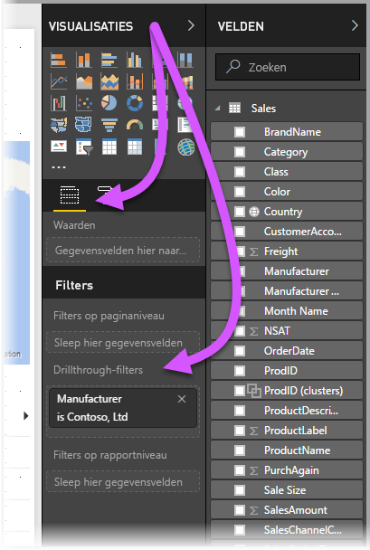
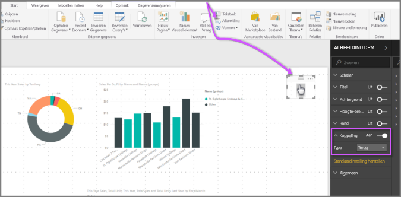

# Drillthrough gebruiken in Power BI Desktop
Met **drillthrough** in **Power BI Desktop** kunt u een pagina in uw rapport maken die zich op een bepaalde entiteit richt, zoals een leverancier, klant of fabrikant. Met die specifieke rapportpagina kunnen gebruikers met de rechtermuisknop op een gegevenspunt in andere rapportpagina's klikken en inzoomen op die specifieke pagina voor gefilterde details met betrekking tot die context.

## Drillthrough gebruiken
Als u **drillthrough** wilt gebruiken, maakt u een rapportpagina met visuele elementen over het type entiteit waarop u drillthrough wilt toepassen. Stel dat u drillthrough voor fabrikanten beschikbaar wilt maken. Dan kunt u een drillthrough-pagina maken met visuele elementen met de totale omzet, het totale aantal verzonden eenheden, omzet per categorie of per regio, enzovoort. Als u vervolgens op die pagina inzoomt, dan ziet u dat de visuele elementen specifiek zijn voor de fabrikant waarop u hebt geklikt en die u hebt geselecteerd om drillthrough op toe te passen.

Op de drillthrough-pagina gaat u vervolgens naar de sectie **Velden** van het deelvenster **Visualisaties** en sleept u het veld waarop u drillthrough wilt toepassen naar de verdieping **Drillthrough-filters**.

Als u een veld toevoegt aan de verdieping **Drillthrough-filters**, wordt automatisch de knop **Terug** als visueel element gemaakt. Dit visuele element wordt een knop in gepubliceerde rapporten. Gebruikers die het rapport gebruiken in de **Power BI-service** kunnen er makkelijk mee teruggaan naar de rapportpagina waar ze vandaan kwamen (de pagina waar ze voor de drillthrough hebben gekozen).

Omdat de knop *Terug* een afbeelding is, kunt u deze vervangen door een andere afbeelding naar keuze. De knop werkt dan nog steeds als knop om gebruikers van het rapport te laten terugkeren naar de oorspronkelijke pagina. Als u een eigen afbeelding voor deze knop wilt gebruiken, plaatst u een afbeelding op de drillthrough-pagina, selecteert u het visuele element en schuift u de schuifregelaar naast de *knop Terug* in de positie Aan. Hiermee werkt uw afbeelding als een knop *Terug*.

Als uw **drillthrough**-pagina is voltooid en een gebruiker klikt in het rapport met de rechtermuisknop op een gegevenspunt waarvoor het veld wordt gebruikt dat u in de verdieping **Drillthrough-filters** op de drillthrough-pagina hebt geplaatst, dan wordt er een snelmenu weergegeven waarmee de gebruik op die pagina kan inzoomen.

Als de gebruiker voor drillthrough kiest, wordt de pagina gefilterd en wordt informatie getoond over het gegevenspunt waar de gebruiker met de rechtermuisknop op heeft geklikt. Als de gebruiker bijvoorbeeld met de rechtermuisknop heeft geklikt op een gegevenspunt over Contoso (een fabrikant) en voor drillthrough heeft gekozen, dan wordt de drillthrough-pagina die wordt getoond, op Contoso gefilterd.

> [!NOTE]
> Alleen het veld in de verdieping **Drillthrough-filters** wordt doorgegeven aan de drillthrough-pagina van het rapport. Er wordt geen andere contextuele informatie doorgegeven.
> 
> 

Meer hoeft u niet te doen om **drillthrough** in uw rapporten te gebruiken. Het is een uitstekende manier om een uitgebreid overzicht te krijgen over de entiteitsgegevens die u voor uw drillthrough-filter selecteert.

