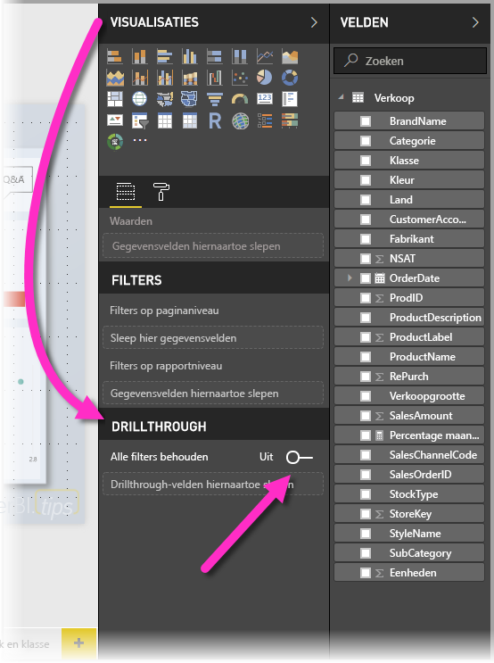
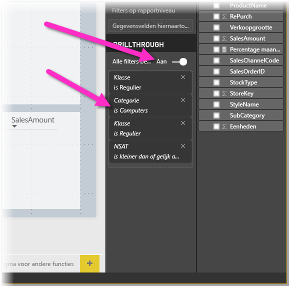
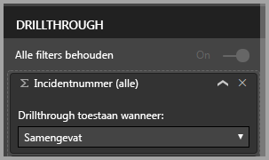

# Drillthrough gebruiken in Power BI Desktop
Met **drillthrough** in **Power BI Desktop** kunt u een pagina in uw rapport maken die zich richt op een bepaalde entiteit, zoals een leverancier, klant of fabrikant. Gebruikers kunnen met de rechtermuisknop op een gegevenspunt op andere rapportpagina's klikken. Vervolgens kunnen ze inzoomen op die specifieke pagina voor meer informatie die tot die context is gefilterd.

## Drillthrough gebruiken
1. Als u **drillthrough** wilt gebruiken, maakt u een rapportpagina die de gewenste visuals bevat voor het type entiteit waarop u drillthrough wilt toepassen. 

    Stel, u wilt drillthrough toepassen voor fabrikanten. U kunt dan een drillthrough-pagina maken met visuals die de totale omzet, het totale aantal verzonden eenheden, omzet per categorie of per regio, enzovoort tonen. Als u vervolgens op die pagina inzoomt, ziet u de visuals die specifiek zijn voor de fabrikant die u hebt geselecteerd.

2. Op de drillthrough-pagina gaat u vervolgens naar de sectie **Velden** van het deelvenster **Visualisaties** en sleept u het veld waarop u drillthrough wilt inschakelen eveneens naar de verdieping **Drillthrough-filters**.

    

    Als u een veld toevoegt aan de verdieping **Drillthrough-filters**, wordt automatisch de knop **Terug** als visueel element gemaakt. Deze visual wordt een knop in gepubliceerde rapporten. Gebruikers die uw rapport gebruiken in de **Power BI-service**, kunnen deze knop gebruiken om naar de rapportpagina terug te gaan van waar ze vandaan komen.

    

## Uw eigen afbeelding gebruiken voor een knop Terug    
 Omdat de knop Terug een afbeelding is, kunt u de afbeelding van die visual vervangen door elke andere gewenste afbeelding. Deze blijft gewoon werken als de knop Terug, zodat gebruikers terug kunnen gaan naar hun oorspronkelijke pagina. Als u uw eigen afbeelding wilt gebruiken voor een knop Terug, voert u de volgende stappen uit:

1. Ga naar het tabblad **Start** en selecteer de optie **Afbeelding**. Zoek de afbeelding en plaats deze op de drillthrough-pagina.

2. Selecteer de nieuwe afbeelding op de drillthrough-pagina. In de sectie **Afbeelding opmaken** stelt u de schuifregelaar **Koppeling** in op **Aan** en stelt u het **Type** in op **Terug**. De afbeelding fungeert nu als een knop Terug.

    

    
     Nu kunnen gebruikers met de rechtermuisknop op een gegevenspunt in uw rapport klikken om een contextmenu te openen dat ondersteuning biedt om in te zoomen op die pagina. 

    

    Als rapportgebruikers willen inzoomen, wordt de pagina zo gefilterd dat informatie wordt weergegeven over het gegevenspunt waarop met de rechtermuisknop is geklikt. Stel, de gebruiker heeft met de rechtermuisknop geklikt op een gegevenspunt over Contoso (een fabrikant) en heeft drillthrough geselecteerd. De drillthrough-pagina die wordt weergegeven, is gefilterd op Contoso.

## Alle filters in drillthrough goedkeuren

Vanaf de versie van mei 2018 van **Power BI Desktop**, kunt u alle filters die toegepast worden op het drillthrough-venster goedkeuren. U kunt bijvoorbeeld alleen een bepaalde categorie van producten selecteren, waarna de visuals worden gefilterd voor die categorie. Daarna kunt u drillthrough selecteren. U bent wellicht geïnteresseerd in hoe drillthrough er uit ziet wanneer al deze filters toegepast worden.

Als u alle toegepaste filters wilt behouden, gaat u naar de sectie **Drillthrough** van het venster **Visualisaties** en zet u de wisselknop **Alle filters goedkeuren** op **Aan**. 

In **Power BI Desktop**-versies vóór mei 2018 werkt dit net als wanneer de wisselknop op **Uit** staat.

Wanneer u drillthrough toepast op een visual, kunt u zien welke filters er zijn toegepast als resultaat van tijdelijke filters die op de bronvisual zijn toegepast. In het venster drillthrough zijn deze tijdelijke filters cursief weergegeven. 

U kunt dit doen met tooltips-pagina’s, maar dat zou een vreemde ervaring zijn omdat de tooltip niet correct zou werken. Om deze reden wordt het gebruik van tooltips voor dit doel dus niet aanbevolen.

## Een meting aan drillthrough toevoegen

Naast het doorgeven van alle filters aan het drillthrough-venster, kunt u ook een meting (of een samengevatte numerieke kolom) toevoegen aan het drillthrough-gebied. Sleep het drillthrough-veld naar de drillthrough-kaart om het toe te passen. 

Wanneer u een meting of samengevatte numerieke kolom toevoegt, kunt u inzoomen op de pagina als het veld wordt gebruikt in het gebied *Waarde* van een visual.

Meer hoeft u niet te doen om **drillthrough** in uw rapporten te gebruiken. Het is een uitstekende manier om een uitgebreid overzicht te krijgen van de entiteitsgegevens die u voor uw drillthrough-filter hebt geselecteerd.

## Volgende stappen

Wellicht bent u ook geïnteresseerd in de volgende artikelen:

* [Slicers Power BI Desktop gebruiken](visuals/desktop-slicers.md)

