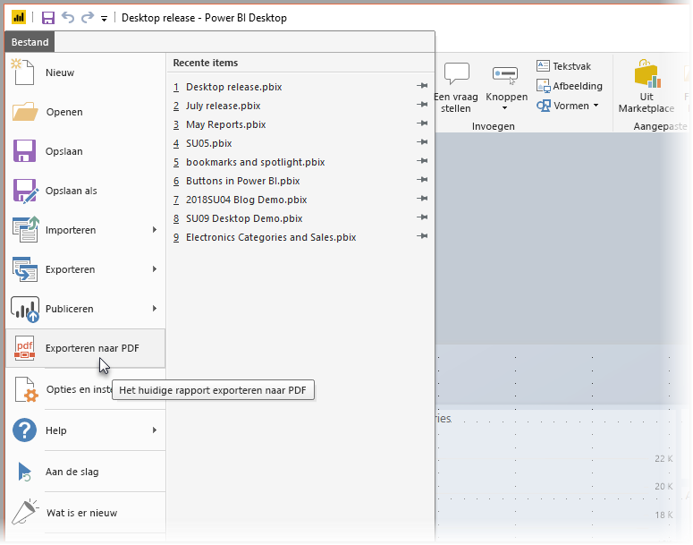
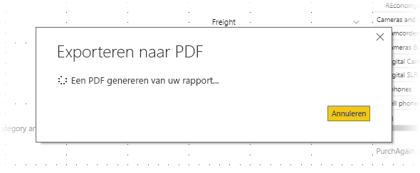

# Rapporten naar PDF exporteren vanuit Power BI Desktop
In **Power BI Desktop** kunt u rapporten exporteren naar een PDF-bestand en zo uw rapporten eenvoudig delen of afdrukken vanuit dat PDF-bestand.

Het proces van het exporteren van uw rapport uit **Power BI Desktop** naar een PDF-bestand, zodat u het PDF-bestand kunt afdrukken of met anderen kunt delen, is eenvoudig. Selecteer **Bestand > Exporteren naar PDF** vanuit Power BI Desktop.

Het proces **Exporteren naar PDF** zorgt ervoor dat alle *zichtbare* pagina's in het rapport worden geëxporteerd, waarbij elke pagina van het rapport naar een afzonderlijke pagina in het PDF-bestand wordt geëxporteerd. Rapportpagina's die op dat moment niet zichtbaar zijn, zoals knopinfo of verborgen pagina's, worden niet naar het PDF-bestand geëxporteerd. 

Wanneer u **Bestand > Exporteren naar PDF** selecteert, wordt het exporteren gestart en wordt een dialoogvenster weergegeven waarin de uitvoering van het exportproces wordt getoond. Het dialoogvenster wordt op het scherm weergegeven totdat het exportproces is voltooid. Tijdens het exportproces is alle interactie met het rapport dat wordt geëxporteerd, uitgeschakeld. De enige manier om te communiceren met het rapport is te wachten totdat het exportproces is voltooid, of het exportproces te annuleren. 

Wanneer het exportproces is voltooid, wordt het PDF-bestand geladen in de standaard PDF-viewer op de computer. 

## Overwegingen en beperkingen
Er zijn enkele overwegingen waarmee u rekening moet houden als u de functie **Exporteren naar PDF** wilt gebruiken:

* De functie **Exporteren naar PDF** is alleen beschikbaar met **Power BI Desktop** en is momenteel niet beschikbaar in de **Power BI-service**.
* Met de functie worden wel aangepaste visuals, maar *geen* achtergrond geëxporteerd die u mogelijk hebt toegepast op het rapport.

Aangezien de achtergrond niet wordt geëxporteerd naar het PDF-bestand, dient u speciale aandacht te schenken aan rapporten die gebruikmaken van donkere achtergrond. Als de tekst in uw rapport van een lichte kleur of wit is om deze te laten opvallen tegen de donkere achtergrond, wordt deze moeilijk te lezen of onleesbaar bij het proces Exporteren naar PDF, aangezien de achtergrond niet met de rest van het rapport wordt geëxporteerd. 

## Volgende stappen
Er zijn allerlei interessante visuele elementen en functies beschikbaar in **Power BI Desktop**. Bekijk de volgende resources voor meer informatie:

* [Power BI-rapporten verbeteren met visuele elementen](desktop-visual-elements-for-reports.md)
* [Wat is Power BI Desktop?](desktop-what-is-desktop.md)

