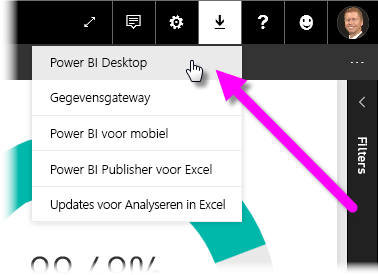
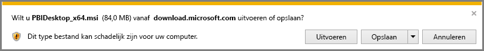
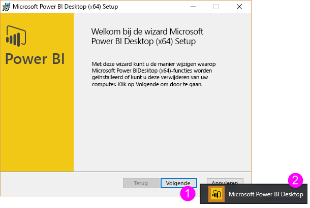
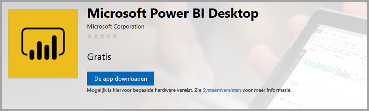
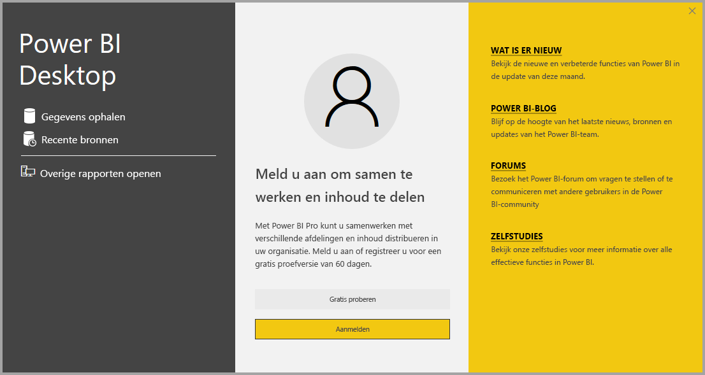

# Power BI Desktop downloaden
Met **Power BI Desktop** kunt u geavanceerde query's, modellen en rapporten samenstellen die gegevens visualiseren. Met **Power BI Desktop** kunt u gegevensmodellen bouwen, rapporten maken en uw werk delen door dit te publiceren naar de Power BI-service.  **Power BI Desktop** is gratis te downloaden.

U kunt **Power BI Desktop** downloaden op twee manieren die in de volgende secties worden beschreven:

* Rechtstreeks **downloaden** (een MSI-pakket downloaden en installeren op uw computer)
* Installeren als een app uit de **Microsoft Store**

In beide gevallen krijgt u de nieuwste versie van **Power BI Desktop** op uw computer, maar er zijn enkele verschillen waar u op moet letten. Deze worden beschreven in de volgende secties.

## Power BI Desktop downloaden
Als u de meest recente versie van **Power BI Desktop** wilt downloaden, selecteert het downloadpictogram in de rechterbovenhoek van de Power BI-service en selecteert u **Power BI Desktop**.

U kunt de nieuwste versie van Power BI Desktop ook downloaden van de volgende downloadpagina:

* [**Power BI Desktop downloaden** (zowel de 32-bits als de 64-bits versie)](https://powerbi.microsoft.com/desktop).
  
  

Ongeacht de manier waarop u **Power BI Desktop** downloadt, wordt u, wanneer het eenmaal is gedownload, gevraagd het installatiebestand uit te voeren:

**Power BI Desktop** wordt als een toepassing geïnstalleerd en wordt op het bureaublad uitgevoerd.

> [!NOTE]
> Het is niet mogelijk om zowel de gedownloade (MSI) versie als de **Microsoft Store**-versie van **Power BI Desktop** tegelijk op dezelfde computer te installeren (soms ook wel een *side-by-side* installatie genoemd).
> 
> 

## Installeren als een app uit de Microsoft Store
U kunt **Power BI Desktop** ook downloaden uit de Microsoft Store via de volgende koppeling:

* [**Power BI Desktop** installeren via de **Microsoft Store**](http://aka.ms/pbidesktopstore)

Er zijn enkele voordelen als u **Power BI Desktop** ophaalt vanuit de Microsoft Store:

* **Automatische updates**: Windows downloadt de nieuwste versie automatisch op de achtergrond zodra deze beschikbaar is, zodat uw versie altijd up-to-date is.
* **Kleinere downloads**: de **Microsoft Store** zorgt ervoor dat alleen de onderdelen die zijn gewijzigd in elke update naar uw computer worden gedownload, wat resulteert in kleinere downloads voor elke update.
* **Geen beheerdersbevoegdheden vereist**: wanneer u het MSI-bestand rechtstreeks downloadt en installeert, werkt de installatie alleen als u een beheerder bent. Wanneer u **Power BI Desktop** downloadt via de Microsoft Store, zijn beheerdersbevoegdheden *niet* vereist.
* **IT-distributie ingeschakeld**: de **Microsoft Store**-versie kan eenvoudiger worden geïmplementeerd of *gedistribueerd* naar iedereen in uw organisatie en **Power BI Desktop** kan beschikbaar worden gesteld via de **Microsoft Store voor bedrijven**.
* **Taaldetectie**: de **Microsoft Store**-versie omvat alle ondersteunde talen en controleert welke taal wordt gebruikt op de computer telkens wanneer het wordt gestart. Dit is ook van invloed op de lokalisatie van modellen die worden gemaakt in **Power BI Desktop**. Ingebouwde datumhiërarchieën komen bijvoorbeeld overeen met de taal die **Power BI Desktop** gebruikte toen het PBIX-bestand werd gemaakt.

Er gelden enkele overwegingen en beperkingen voor de installatie van **Power BI Desktop** vanuit de Microsoft Store, waaronder:

* Als u de SAP-connector gebruikt, moet u uw SAP-stuurprogrammabestanden mogelijk verplaatsen de map *Windows\System32*.
* Bij het installeren van **Power BI Desktop** vanuit de Microsoft Store worden gebruikersinstellingen uit de MSI-versie niet gekopieerd. Mogelijk moet u opnieuw verbinding maken met uw recente gegevensbronnen en uw referenties voor gegevensbronnen opnieuw invoeren. 

> [!NOTE]
> Het is niet mogelijk om zowel de gedownloade (MSI) versie als de **Microsoft Store**-versie van **Power BI Desktop** tegelijk op dezelfde computer te installeren (soms ook wel een *side-by-side* installatie genoemd). U moet **Power BI Desktop** handmatig verwijderen voordat u het downloadt uit de **Microsoft Store**
> 
> [!NOTE]
> De Power BI Report Server-versie van **Power BI Desktop** is een afzonderlijke installatie die verschilt van de versies die in dit artikel worden besproken. Zie [Een Power BI-rapport maken voor Power BI Report Server](report-server/quickstart-create-powerbi-report.md) voor informatie over de Report Server-versie van **Power BI Desktop**.
> 
> 

## Power BI Desktop gebruiken
Wanneer u **Power BI Desktop** start, wordt er een *welkomstscherm* weergegeven.

Als dit de eerste keer is dat u **Power BI Desktop** gebruikt (als de installatie geen upgrade is), wordt u gevraagd een formulier in te vullen en enkele vragen te beantwoorden of u aan te melden bij de **Power BI-service** voordat u kunt verdergaan.

Vervolgens kunt gegevensmodellen of rapporten gaan maken en deze delen met anderen in de Power BI-service. De koppelingen onder **Meer informatie** aan het einde van dit artikel leiden naar handleidingen die u helpen aan de slag te gaan met **Power BI Desktop**.

## Minimale vereisten
De volgende lijst bevat de minimale vereisten voor het uitvoeren van **Power BI Desktop**:

* Windows 7 / Windows Server 2008 R2 of hoger
* .NET 4.5
* Internet Explorer 9 of hoger
* **Geheugen (RAM):** ten minste 1 GB beschikbaar, 1,5 GB of meer aanbevolen.
* **Beeldscherm:** ten minste 1440x900 of 1600x900 (16:9) aanbevolen. Lagere resoluties zoals 1024x768 of 1280x800 worden niet aanbevolen aangezien bepaalde besturingselementen (bijvoorbeeld om het opstartscherm te sluiten) buiten die resoluties worden weergegeven.
* **Beeldscherminstellingen van Windows:** als uw beeldscherminstellingen zo zijn geconfigureerd dat de grootte van tekst, apps en andere items wordt gewijzigd naar meer dan 100%, ziet u mogelijk bepaalde dialoogvensters niet die moeten worden gesloten of waarop u moet reageren om door te gaan met het gebruik van **Power BI Desktop**. Als u dit probleem ondervindt, controleert u uw **beeldscherminstellingen** door te gaan naar **Instellingen > Systeem > Beeldscherm** in Windows en met de schuifregelaar de weergave weer in te stellen op 100%.
* **CPU:** 1 GHz (gigahertz) of snellere x86- of x64-bits processor aanbevolen.

## Overwegingen en beperkingen

Sommige gebruikers ondervinden een fout die overeenkomt met de volgende als ze een verouderde versie van **Power BI Desktop** gebruiken: 

    "We weren't able to restore the saved database to the model" 

Dit probleem wordt meestal opgelost door de huidige versie van Power BI Desktop bij te werken.

## Volgende stappen
Nadat u **Power BI Desktop** hebt geïnstalleerd, helpen de volgende onderwerpen u snel aan de slag te gaan:

* [Wat is Power BI Desktop?](desktop-what-is-desktop.md)
* [Query Overview with Power BI Desktop](desktop-query-overview.md) (Queryoverzicht met Power BI Desktop)
* [Data Sources in Power BI Desktop](desktop-data-sources.md) (Gegevensbronnen in Power BI Desktop)
* [Connect to Data in Power BI Desktop](desktop-connect-to-data.md) (Verbinding maken met gegevens in Power BI Desktop)
* [Shape and Combine Data with Power BI Desktop](desktop-shape-and-combine-data.md) (Gegevens vormgeven en combineren met Power BI Desktop)
* [Common Query Tasks in Power BI Desktop](desktop-common-query-tasks.md) (Algemene querytaken in Power BI Desktop)   

