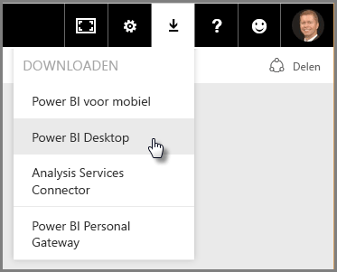
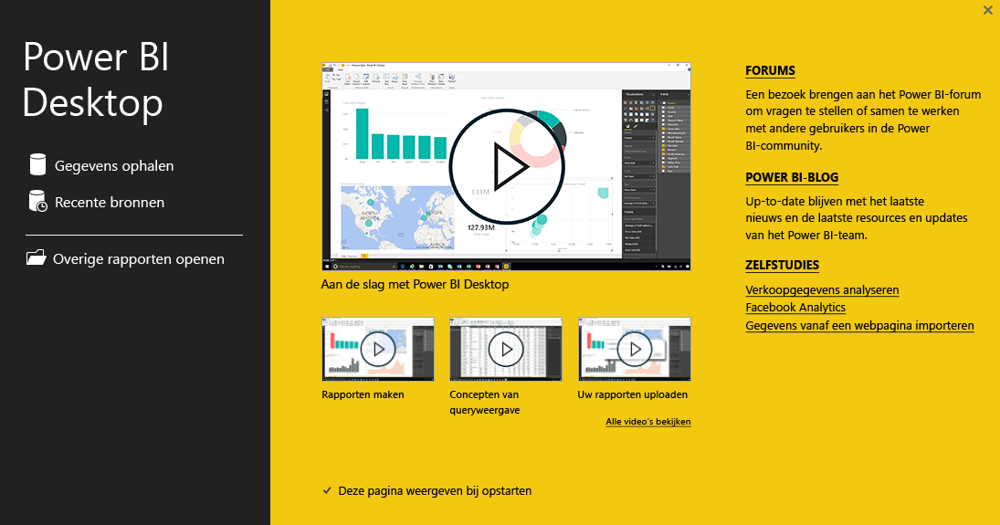
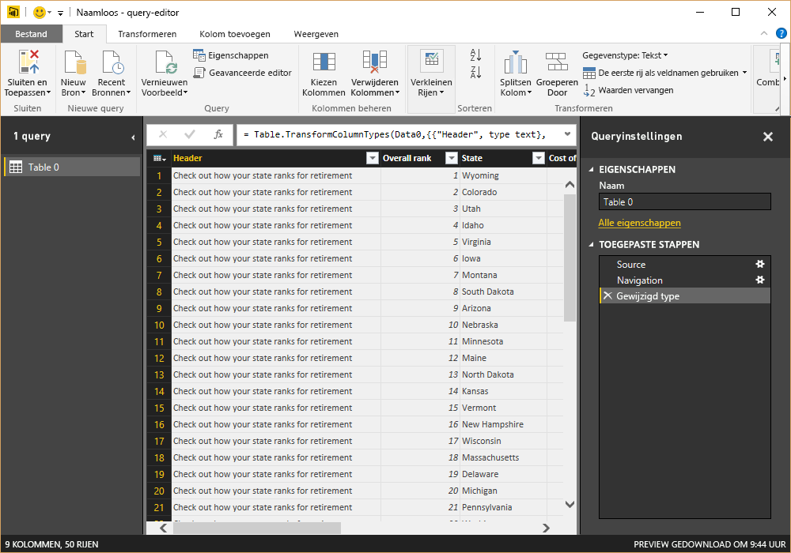
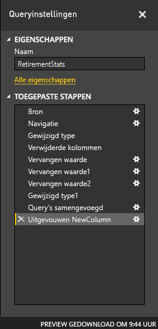
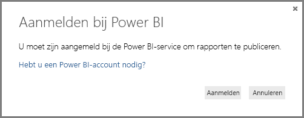

# Aan de slag met Power BI Desktop
Welkom bij de **handleiding voor Power BI Desktop**. Deze korte inleiding van Power BI Desktop is bedoeld om u te laten zien hoe het programma het werkt en wat het kan doen, en helpt u sneller robuuste gegevensmodellen en handige rapporten te maken die uw business intelligence verbeteren. 

Wilt u liever iets kijken in plaats van lezen? Bekijk gerust [onze introductievideo](desktop-videos.md). Als u de video wilt volgen met bijbehorende voorbeeldgegevens, kunt u [deze voorbeeld-Excel-werkmap downloaden](http://go.microsoft.com/fwlink/?LinkID=521962).

Met Power BI Desktop kunt u een verzameling query's, gegevensverbindingen en rapporten maken die eenvoudig met anderen kan worden gedeeld. Power BI Desktop integreert beproefde Microsoft-technologieën (de krachtige Query-engine, gegevensmodellering en visualisaties) en werkt naadloos samen met de online [**Power BI-service**](https://app.powerbi.com/).

Met de combinatie van **Power BI Desktop** (waar analisten en anderen krachtige gegevensverbindingen, modellen en rapporten kunnen maken) en de [**Power BI-service**](https://preview.powerbi.com/) (waarin Power BI Desktop-rapporten kunnen worden gedeeld zodat gebruikers ze kunnen bekijken en er acties op kunnen uitvoeren) zijn nieuwe inzichten in de wereld van gegevens gemakkelijker te modelleren, bouwen, delen en uit te breiden.

Gegevensanalisten vinden Power BI Desktop vast een krachtig, flexibel en zeer toegankelijk hulpprogramma om met de wereld van gegevens te verbinden en deze vorm te geven, robuuste modellen te bouwen en gestructureerde rapporten te maken.

## Het gebruik van deze handleiding
U kunt de handleiding op een aantal manieren gebruiken: u kunt deze scannen voor een snel overzicht of elk gedeelte doorlezen voor een grondig begrip van hoe Power BI Desktop werkt.

Als u weinig tijd hebt, kunt u deze handleiding in een paar minuten doorbladeren om een goed beeld te krijgen van de werking en het gebruik van Power BI Desktop. Deze handleiding bestaat voornamelijk uit schermafbeeldingen die de werking van Power BI Desktop weergeven.

Voor een uitgebreider inzicht kunt u elk gedeelte doorlezen, de stappen uitvoeren en uw eigen Power BI Desktop-bestand maken dat klaar is om in de **Power BI**-service te plaatsen en met anderen te delen.

>[!NOTE]
>Er is ook een afzonderlijke en speciale versie van **Power BI**, met de naam [**Power BI Report Server**](report-server/get-started.md), die is bedoeld voor klanten die hun gegevens en rapportages on-premises moeten houden. Voor gebruik met die gespecialiseerde versie is er tevens een afzonderlijke en speciale versie van **Power BI Desktop** met de naam **Power BI Desktop voor Power BI Report Server**, die alleen werkt met de versie Report Server van Power BI. In dit artikel wordt de standaard **Power BI Desktop** omschreven.

## De werking van Power BI Desktop
Met Power BI Desktop kunt u *verbinding maken met gegevens* (meestal meerdere gegevensbronnen), *die gegevens vormgeven* (met query's die begrijpelijke, handige gegevensmodellen bouwen), en dit model gebruiken om *rapporten te maken* (die anderen kunnen gebruiken, aanpassen en delen).

Wanneer u de stappen verbinden, vormgeven en rapporteren naar tevredenheid hebt voltooid, kunt u uw werk opslaan in de Power BI Desktop-bestandsindeling, met de extensie .pbix. Power BI Desktop-bestanden kunnen worden gedeeld zoals elk ander bestand, maar de meest waardevolle manier om Power BI Desktop-bestanden te delen, is om ze te uploaden (delen) in de [**Power BI-service**](https://preview.powerbi.com/). 

Met Power BI Desktop centraliseert, vereenvoudigt en stroomlijnt u het ontwerpen en maken van opslagplaatsen en rapporten voor business intelligence, wat anders een verspreid, ongeorganiseerd en lastig proces kan zijn.

Wilt u het proberen? Laten we aan de slag gaan.

## Power BI Desktop installeren en starten
U kunt Power BI Desktop uit de **Power BI**-service downloaden door het **tandwielpictogram** te selecteren en vervolgens **Power BI Desktop** te selecteren.

Power BI Desktop wordt als een toepassing geïnstalleerd en wordt op het bureaublad uitgevoerd.

Tijdens het uitvoeren van Power BI Desktop wordt er een *Welkom*-scherm weergegeven.

U kunt rechtstreeks vanuit het *Welkom*-scherm de opties **Gegevens ophalen**, **Recente bronnen** en **Andere** **rapporten openen** gebruiken (via de koppelingen in het linkerdeelvenster). Als u het scherm sluit (met de **x** in de rechterbovenhoek), wordt de weergave **Rapport** van Power BI Desktop weergegeven.

Er zijn drie weergaven in Power BI Desktop: de weergave **Rapport**, de weergave **Gegevens** en de weergave **Relaties**. Power BI Desktop bevat ook **Query-editor**, die in een afzonderlijk venster wordt geopend. In **Query-editor** kunt u query's maken en gegevens transformeren om het verfijnde gegevensmodel vervolgens in Power BI Desktop te laden en rapporten te maken.

In het volgende scherm ziet u aan de linkerkant van Power BI Desktop, van boven naar onder, de drie weergavepictogrammen: **Rapport**, **Gegevens** en **Relaties**. De momenteel weergegeven weergave wordt aangegeven door de gele balk aan de linkerzijde. In dit geval wordt de weergave **Rapport** momenteel weergegeven. U kunt van weergave wisselen door een van de drie pictogrammen te selecteren.

Nu Power BI Desktop is geïnstalleerd kunt u verbinding maken met gegevens, ze vormgeven en rapporten maken (meestal in die volgorde). In de volgende gedeelten komt elk onderdeel aan bod.

## Verbinding maken met gegevens
Nu Power BI Desktop is geïnstalleerd, kunt u verbinding maken met de zich almaar uitbreidende wereld van gegevens. In het venster Query zijn *allerlei verschillende* gegevensbronnen beschikbaar. De volgende afbeelding toont hoe u verbinding met gegevens maakt door het lint **Start** te selecteren en vervolgens **Gegevens ophalen \> Meer** te selecteren.

 

Voor deze introductie maken we verbinding met een aantal verschillende **Web**-gegevensbronnen.

Stel dat u met pensioen gaat en wilt wonen op een plek waar de zon veel schijnt, de belastingen gunstig zijn en de gezondheidszorg goed is. Of misschien bent u een gegevensanalist en hebt u deze informatie nodig om uw klanten te helpen. U wilt bijvoorbeeld een zonnebrilverkoper helpen de markten te targeten waar de zon het meeste schijnt.

Hoe dan ook, de volgende webbron bevat interessante gegevens over onder meer deze onderwerpen:

[*http://www.bankrate.com/finance/retirement/best-places-retire-how-state-ranks.aspx*](http://www.bankrate.com/finance/retirement/best-places-retire-how-state-ranks.aspx)

Selecteer **Gegevens ophalen \> Web** en plak het adres.

 

Als u **OK** selecteert, gaat de **Query**-functionaliteit van Power BI Desktop aan de slag. Query maakt verbinding met de webbron en in het venster **Navigator** wordt geretourneerd wat er op deze website is gevonden. In dit geval zijn een tabel (*Tabel 0*) en het hele webdocument gevonden. We zijn alleen geïnteresseerd in de tabel, dus we selecteren die in de lijst. In het venster **Navigator** wordt een voorbeeld weergegeven.

 

Nu kunt u de query bewerken voordat u de tabel laadt. Selecteer **Bewerken** onderaan het venster of laadt de tabel.

Wanneer u **Bewerken** selecteert, wordt Query-editor gestart en wordt er een representatieve weergave van de tabel weergegeven. Het deelvenster **Queryinstellingen** wordt weergegeven (zo niet, dan selecteert u **Weergave** op het lint en vervolgens **Weergeven \> Queryinstellingen** om het deelvenster **Queryinstellingen** weer te geven). Het geheel ziet er als volgt uit.

 

Zie [Verbinding maken met gegevens in Power BI Desktop](desktop-connect-to-data.md) voor meer informatie over het verbinding maken met gegevens.

In het volgende gedeelte passen we de gegevens aan zodat ze aan onze behoeften voldoen. Het proces van het aanpassen van verbonden gegevens wordt het *vormgeven* van gegevens genoemd.

## Gegevens vormgeven en combineren
Nu we verbinding met een gegevensbron hebben gemaakt, moeten we de gegevens aan onze behoeften aanpassen. Het aanpassen van gegevens betekent soms het *transformeren* van gegevens, zoals de naam wijzigen van kolommen of tabellen, het wijzigen van tekst in getallen, het verwijderen van rijen, het instellen van de eerste rij als koptekst, enzovoort.

Query-editor in Power BI Desktop maakt veel gebruik van contextmenu's. Daarnaast zijn taken ook beschikbaar via het lint. Het meeste van wat u kunt selecteren in het lint **Transformeren** is ook beschikbaar door met de rechtermuisknop op een item (zoals een kolom) te klikken en een keuze te maken in het menu dat verschijnt.

## Gegevens vormgeven
Wanneer u gegevens in **Query-editor** vormgeeft, geeft u stapsgewijze instructies (die **Query-editor** voor u uitvoert) om de gegevens aan te passen terwijl **Query-editor** de gegevens laadt en presenteert. De oorspronkelijke gegevensbron wordt daardoor niet beïnvloed; alleen deze specifieke weergave van de gegevens wordt aangepast, ofwel *vormgegeven*.

De stappen die u opgeeft (zoals de naam van een tabel wijzigen, een gegevenstype transformeren of kolommen verwijderen), worden vastgelegd door **Query-editor** en elke keer dat deze query verbinding maakt met de gegevensbron, worden die stappen uitgevoerd zodat de gegevens altijd op de door u bepaalde manier worden vormgegeven. Dit proces vindt plaats wanneer u de query in Power BI Desktop gebruikt, maar vindt ook plaats voor iedereen die gebruikmaakt van de door u gedeelde query, bijvoorbeeld in de **Power BI**-service. Deze stappen worden in volgorde vastgelegd in het deelvenster **Query-instellingen** onder **Toegepaste stappen**.

De volgende afbeelding toont het deelvenster **Query-instellingen** voor een query die is vormgegeven. In de volgende alinea’s bekijken we elk van deze stappen.

 

Laten we teruggaan naar de pensioengegevens, die we hebben gevonden door verbinding te maken met een webgegevensbron, en de gegevens naar wens aanpassen.

Om te beginnen zijn de meeste classificaties naar **Query-editor** overgebracht als hele getallen, maar niet allemaal (één kolom bevat tekst en nummers, en deze is daarom niet automatisch geconverteerd). De gegevens moeten getallen zijn. Dat kan. Klik met de rechtermuisknop op de kolomkop en selecteer **Type wijzigen \> Geheel getal** om ze om te zetten. Als u meer dan één kolom wilt selecteren, selecteert u eerst een kolom en houdt u **Shift** ingedrukt, selecteert u extra aangrenzende kolommen en klikt u vervolgens met de rechtermuisknop op een kolomkop om alle geselecteerde kolommen te wijzigen. U kunt ook **Ctrl** gebruiken om niet-aangrenzende kolommen te selecteren.

 

U kunt die kolommen ook wijzigen, of *transformeren*, van tekst naar koptekst met behulp van het lint **Transformeren**. Hier ziet u het lint **Transformeren**, met een pijl die wijst naar de knop **Gegevenstype**, waarmee u het huidige gegevenstype in een ander gegevenstype kunt omzetten.

 

In **Queryinstellingen** wordt onder **Toegepaste stappen** aangegeven of er wijzigingen zijn aangebracht. Als u een stap uit het vormgevingsproces wilt verwijderen, selecteert u de stap en vervolgens de **X** links van de stap.

 

Met nog een paar wijzigingen ziet de query er uit als gewenst:

* *Verwijder de eerste kolom*: deze is niet nodig, want de kolom bevat alleen redundante rijen met de tekst 'Check out how your state ranks for retirement', wat is overgenomen uit deze webgebaseerde tabel.

<!-- -->

* *Enkele fouten corrigeren*: op de webpagina staat een kolom met tekst tussen de getallen (bepaalde staten in één categorie). Dat werkt goed op de website, maar niet voor de gegevensanalyse. Het is in dit geval eenvoudig op te lossen, en u ontdekt ook meteen een aantal functies en mogelijkheden van **Query-editor** en de bijbehorende **toegepaste stappen**

<!-- -->

* *Wijzig de naam van de tabel*: **Table 0** is niet een handige beschrijving, maar dat kan eenvoudig worden gewijzigd

Elk van deze stappen wordt uitgelegd in **[Gegevens vormgeven en combineren in Power BI Desktop](desktop-shape-and-combine-data.md)**. U kunt die pagina bekijken of verder gaan in dit document om te zien wat de volgende stappen zijn. Het volgende gedeelte begint op het punt nadat de bovenstaande wijzigingen zijn toegepast.

## Gegevens combineren
De informatie over de verschillende staten is best interessant en handig voor extra analyses en query's. Maar er is wel één probleem: de meeste van die gegevens gebruiken de tweeletterige afkorting als code voor staten, niet de volledige naam van de staat. We hebben een manier nodig om namen van staten te koppelen aan hun afkortingen.

Maar gelukkig is er een andere openbare gegevensbron die precies dat doet, maar er moet dan wel eerst aardig wat worden aangepast voordat die bron aan de pensioneringstabel kan worden gekoppeld. Hier is de webbron voor staatafkortingen:

<http://en.wikipedia.org/wiki/List_of_U.S._state_abbreviations>

Op het lint **Start** van **Query-editor** selecteert u **Gegevens ophalen \> Web** en typt u het adres. Klik op **OK** en het venster **Navigator** toont wat er op die webpagina is gevonden.

 

We selecteren **Tabel [bewerken]** omdat hierin de gewenste gegevens zijn opgenomen, maar het kost wel wat werk om de gegevens uit die tabel vorm te geven. Elk van deze stappen wordt ook uitgelegd in **[Gegevens vormgeven en combineren in Power BI Desktop](desktop-shape-and-combine-data.md)**. Dit zijn de samengevatte stappen:

Selecteer **Bewerken** en doe vervolgens het volgende:

* *Verwijder de eerste twee rijen*: deze zijn een resultaat van de manier waarop de tabel van die webpagina werd gemaakt en die rijen zijn niet nodig.

<!-- -->

* *Verwijder de onderste 26 rijen*: dat zijn alle territoriale gebieden en die zijn nu niet nodig.

<!-- -->
* *Filter Washington DC weg*: DC staat niet in de tabel met pensioenstatistieken, dus sluiten we deze uit van de lijst.

<!-- -->

* *Verwijder enkele overbodige kolommen*: we hebben alleen de koppeling van een staat met de officiële afkorting van twee letters nodig, dus kunnen we de andere kolommen verwijderen.

<!-- -->

* *Gebruik de eerste rij voor de kopnamen*: omdat we de drie bovenste rijen hebben verwijderd, bevat de huidige bovenste rij de gewenste koptekst.

    >[!NOTE]
    >Dit is een goed moment om te vermelden dat de *reeks* toegepaste stappen in **Query-editor** belangrijk is en van invloed kan zijn op hoe de gegevens worden vormgegeven. Het is ook belangrijk om na te gaan hoe de ene stap van invloed kan zijn op een volgende stap. Als u een stap uit de **Toegepaste stappen** verwijdert, werken daaropvolgende stappen mogelijk niet meer zoals bedoeld.

* *Wijzig de naam van de kolommen en van de tabel zelf*: er zijn een aantal manieren om de naam van een kolom te wijzigen. U kunt zelf kiezen wat u het handigst vindt.

Nu de tabel *StateCodes* is vormgegeven, kunnen we deze twee tabellen, of query's, samenvoegen in één tabel. Omdat de tabellen die we nu hebben, het resultaat zijn van de query's die we op de gegevens hebben toegepast, worden ze vaak aangeduid als *query's*.

Er zijn twee primaire manieren om query's te combineren: *samenvoegen* en *toevoegen*.

Wanneer u een of meer kolommen hebt die u wilt toevoegen aan een andere query gaat u de query’s **samenvoegen**. Wanneer u extra rijen met gegevens hebt die u aan een bestaande query wilt toevoegen, gaat u de query **toevoegen**.

In dit geval gaan we query's samenvoegen. Eerst selecteren we de query *waarin* we de andere query willen voegen. Vervolgens selecteren we in het tabblad **Start** op het lint **Query's samenvoegen**.

 

Het venster **Samenvoegen** wordt weergegeven, waarin wordt gevraagd welke tabel er in de geselecteerde tabel moet worden samengevoegd, gevolgd door de overeenkomende kolommen die worden gebruikt voor het samenvoegen. Selecteer *State* in de tabel (query) *RetirementStats* en selecteer de query *StateCodes* (eenvoudig in dit geval, omdat er maar één andere query is – wanneer u verbinding met veel gegevensbronnen maakt, zijn er veel query's waaruit u kunt kiezen). Wanneer we de juiste overeenkomende kolommen selecteren – *State* uit *RetirementStats* en *State Name* uit *StateCodes* – ziet het venster **Samenvoegen** er als volgt uit en is de knop **OK** ingeschakeld.

 

Er wordt een **NewColumn** aan het einde van de query gemaakt, met daarin de inhoud van de tabel (query) die met de bestaande query is samengevoegd. Alle kolommen uit de samengevoegde query zijn samengevoegd in de **NewColumn**, maar u kunt ervoor kiezen de tabel **uit te breiden** om elke gewenste kolom op te nemen. Als u de samengevoegde tabel wilt uitbreiden en wilt aangeven welke kolommen u wilt opnemen, selecteert u het uitbreidpictogram (). Het venster **Uitbreiden** wordt weergegeven.

 

In dit geval hebben we alleen de kolom *State Code* nodig. Daarom selecteren we alleen die kolom en vervolgens **OK**. We schakelen het selectievakje **Oorspronkelijke kolomnaam gebruiken als voorvoegsel** uit omdat we die niet nodig hebben en ook niet willen. Als we het selectievakje ingeschakeld zouden laten, krijgt de samengevoegde kolom de naam *NewColumn.State Code* (de naam van de oorspronkelijke kolom, ofwel *NewColumn*, gevolgd door een punt en de naam van de kolom die in de query wordt opgenomen).

>[!NOTE]
>Wilt u uitproberen hoe u die *NewColumn*-tabel kunt invoegen? U kunt wat experimenteren en als de resultaten u niet bevallen, kunt u die stap gewoon verwijderen uit de lijst **Toegepaste stappen** in het deelvenster **Query-instellingen**. De query krijgt dan weer de status die gold voordat de stap **Uitbreiden** werd toegepast. U kunt de stap zo vaak uitvoeren als u wilt, totdat u met het uitbreidproces het gewenste resultaat hebt bereikt.

We hebben nu één query (tabel) waarin twee gegevensbronnen zijn samengevoegd, die elk volgens onze behoeften zijn vormgegeven. Deze query kan fungeren als basis voor een groot aantal extra, interessante gegevensverbindingen, zoals statistieken voor huisvestingskosten, demografische gegevens of werkgelegenheid in een staat.

Zie [Gegevens vormgeven en combineren in Power BI Desktop](desktop-shape-and-combine-data.md) voor een gedetailleerde beschrijving van elk van deze stappen voor het vormgeven en combineren van gegevens.

We hebben nu voldoende gegevens voor het maken van enkele interessante rapporten in Power BI Desktop. Aangezien dit een mijlpaal is, slaan we het Power BI Desktop-bestand op met de naam **Aan de slag met Power BI Desktop**. Selecteer in het lint **Start** **Sluiten en toepassen** om de wijzigingen in **Query-editor** toe te passen en in Power BI Desktop te laden.

## Rapporten maken
U kunt meer wijzigingen aanbrengen nadat de tabel is geladen en u kunt een model opnieuw laden om gemaakte wijzigingen toe te passen. Maar dit is voor nu voldoende. In de weergave **Rapport** van Power BI Desktop kunt u beginnen met het maken van een rapport.

De weergave **Rapport** bevat vijf hoofdgebieden:

1. Het lint, waarop de algemene taken worden weergegeven in verband met rapporten en visualisaties
2. De weergave **Rapport**, of het canvas, waar visualisaties worden gemaakt en gerangschikt
3. Het tabblad **Pagina's** onderaan, waar u een rapportpagina kunt selecteren of toevoegen
4. Het deelvenster **Visualisaties**, waar u visualisaties kunt wijzigen, kleuren of assen kunt aanpassen, filters kunt toepassen, velden heen kunt slepen, en nog veel meer
5. Het deelvenster **Velden**, waarvandaan query-elementen en filters naar de weergave **Rapport** kunnen worden gesleept of naar het gebied **Filters** van het deelvenster **Visualisaties**
   
   

De deelvensters **Visualisaties** en **Velden** kunnen worden samengevouwen met het pijltje langs de rand , zodat u meer ruimte hebt in de weergave**Rapport** voor het bouwen van aantrekkelijke visualisaties. Als u een visualisatie wijzigt, ziet u deze pijlen ook omhoog of omlaag wijzen, wat betekent dat u de betreffende sectie respectievelijk kunt uitvouwen of samenvouwen.

 

Voor het maken van een visualisatie sleept u een veld uit de lijst **Velden** lijst naar de weergave **Rapport**. In dit geval slepen we het veld *State* uit *RetirementStats*.

 

Kijk wat er gebeurt. Power BI Desktop heeft automatisch een visualisatie gemaakt op basis van een kaart doordat het veld *State* geolocatiegegevens bevat.

In het deelvenster **Visualisaties** kunnen verschillende soorten visualisaties worden geselecteerd, en in het gebied onder deze pictogrammen kunnen velden naar verschillende gebieden worden gesleept om een legenda toe te passen of de visualisatie anderszins te wijzigen.

 

Laten we iets vooruitkijken en bekijken hoe de weergave **Rapport** eruitziet nadat er een aantal visualisaties is toegevoegd, en enkele nieuwe rapportpagina's. Zie [Rapportweergave in Power BI Desktop](desktop-report-view.md) voor meer informatie over rapporten.

De eerste rapportpagina bevat een overzicht van de gegevens op basis van *algemene rangschikking*. Wanneer u een van de visualisaties selecteert, geeft het deelvenster **Velden en filters** de geselecteerde velden en de structuur van de visualisatie weer (welke velden worden toegepast op **Gedeelde as**, **Kolomwaarden** en **Lijnwaarden**).

 

Dit rapport bevat zes **pagina's**, die elk bepaalde elementen van de gegevens visualiseren.

1. De eerste pagina, die hierboven wordt weergegeven, toont alle staten op basis van *algemene rangschikking*.
2. De tweede pagina is gericht op de eerste tien staten op basis van *algemene rangschikking*.
3. Op de derde pagina worden de beste 10 staten wat betreft de kosten voor levensonderhoud (en de bijbehorende gegevens) gevisualiseerd.
4. De vierde pagina draait om het weer en is gefilterd op de 15 zonnigste staten.
5. Op de vijfde pagina wordt het welzijn van de gemeenschap weergegeven en gevisualiseerd voor de beste 15 staten.
6. Ten slotte worden de misdaadstatistieken gevisualiseerd, waarbij de beste tien (en de slechtste) staten worden weergegeven.

Zo ziet de rapportpagina die is gericht op de kosten van levensonderhoud eruit.

 

U kunt allerlei interessante rapporten en visualisaties maken.

## Uw werk delen
Nu we een Power BI Desktop-rapport hebben dat redelijk voltooid is, kunnen we het met anderen delen op de **Power BI**-service. Er zijn een aantal manieren om uw werk in Power BI Desktop te delen. U kunt publiceren naar de **Power BI** service, u kunt het .pbix-bestand rechtstreeks uit de Power BI-service uploaden of u kunt het .pbix-bestand opslaan en het zoals elk ander bestand verzenden.

Eerst kijken we naar het rechtstreeks vanuit Power BI Desktop publiceren naar de **Power BI**-service. Selecteer in het lint **Start** **Publiceren**.

U moet zich mogelijk aanmelden bij Power BI.

Zodra u zich hebt aangemeld en het publiceren is voltooid, ziet u het volgende dialoogvenster.

Wanneer u zich bij Power BI aanmeldt, ziet u het Power BI Desktop-bestand dat u zojuist hebt geladen in de gedeelten **Dashboards**, **Rapporten** en **Gegevenssets** van de service.

Een andere manier om uw werk te delen, is om het te laden vanuit de **Power BI**-service. Met de volgende koppeling opent u de **Power BI**-service in een browser:

`https://app.powerbi.com`

Selecteer **Gegevens ophalen** om het laden van uw Power BI Desktop-rapport te starten.

 

De pagina **Gegevens ophalen** wordt weergegeven, waarin u kunt selecteren waar uw gegevens worden opgehaald. In dit geval selecteren we **Ophalen** vanuit het vak **Bestanden**.

De weergave **Bestanden** wordt geopend. In dit geval selecteren we **Lokaal bestand**.

Wanneer u het bestand selecteert, wordt het bestand vanuit Power BI geüpload.

Zodra het bestand is geüpload, kunt u het bestand selecteren in **Rapporten** in het linkerdeelvenster van de Power BI-service.

De **Power BI**-service geeft de eerste pagina van het rapport weer. Langs de onderkant van de pagina kunt u een tabblad selecteren om een andere pagina van het rapport weer te geven.

 

U kunt wijzigingen aanbrengen in een rapport in de **Power BI**-service door bovenaan het rapportcanvas **Rapport bewerken** te selecteren.

Selecteer **Bestand \> Opslaan als** in de service om het rapport op te slaan. U kunt allerlei interessante visuals maken in de **Power BI**-service vanuit uw rapport, die u aan een *dashboard* kunt vastmaken. Als u meer informatie wilt over dashboards in de **Power BI**-service**[, bekijkt u Tips voor het ontwerpen van een geweldig dashboard](service-dashboards-design-tips.md)**.

 

Wanneer het bestand is opgeslagen, selecteert u op de hoofdpagina het pictogram **Delen**.

 

Hier kunt u een e-mail verzenden naar collega's met wie u het dashboard wilt delen.

 

Zie [Een dashboard delen](service-share-dashboards.md) voor meer informatie over het maken, delen en wijzigen van dashboards.

U kunt allerlei indrukwekkende aan gegevens gerelateerde combinaties en visualisaties maken met Power BI Desktop en met de Power BI-service. Bekijk het volgende gedeelte voor meer informatie.

## Volgende stappen
U kunt allerlei handelingen uitvoeren met Power BI Desktop. Bekijk de volgende bronnen voor meer informatie over de vele mogelijkheden:

* [Queryoverzicht in Power BI Desktop](desktop-query-overview.md)
* [Data Sources in Power BI Desktop](desktop-data-sources.md) (Gegevensbronnen in Power BI Desktop)
* [Connect to Data in Power BI Desktop](desktop-connect-to-data.md) (Verbinding maken met gegevens in Power BI Desktop)
* [Shape and Combine Data with Power BI Desktop](desktop-shape-and-combine-data.md) (Gegevens vormgeven en combineren met Power BI Desktop)
* [Common Query Tasks in Power BI Desktop](desktop-common-query-tasks.md) (Algemene querytaken in Power BI Desktop)   

