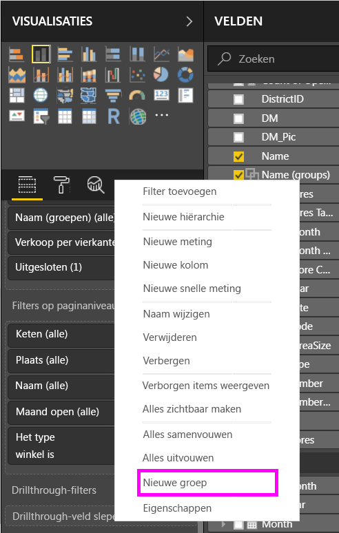
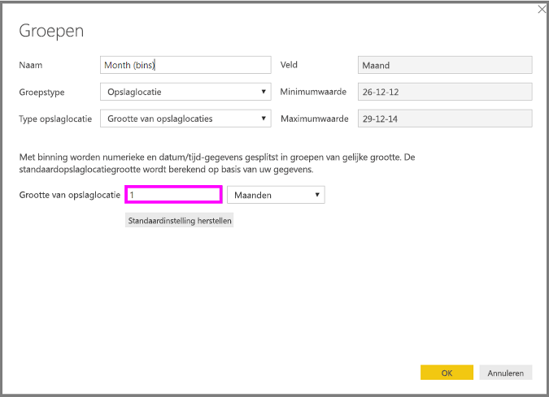
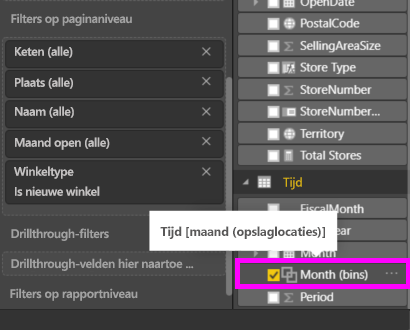

# Groeperen en binning in Power BI Desktop gebruiken
Als in **Power BI Desktop** visuele elementen worden gemaakt, worden uw gegevens in segmenten geaggregeerd of **groepen**) op basis van waarden die in de onderliggende gegevens worden aangetroffen. Dat gaat vaak goed, maar het kan voorkomen dat u de manier waarop deze segmenten worden gepresenteerd, wilt verfijnen. Stel dat u drie categorieën met producten in één grotere categorie wilt onderbrengen (één *groep*). Of u wilt bijvoorbeeld verkoopcijfers zien in groepen van 1.000.000 euro in plaats van in gelijkmatige delen van 923.983 euro.

In Power BI Desktop kunt u gegevenspunten **groeperen**, zodat u gegevens en trends in uw visuele elementen beter kunt weergeven, analyseren en onderzoeken. U kunt ook de **grootte van de opslaglocatie** definiëren, meestal **binning** genoemd, zodat u waarden in groepen van gelijke grootte kunt plaatsen. Op die manier kunt u uw gegevens beter en zinvoller visualiseren.

### Groeperen
Als u **groeperen** wilt gebruiken, selecteert u twee of meer elementen van een visueel element. Gebruik Ctrl+klik om meerdere elementen te selecteren. Klik vervolgens met de rechtermuisknop op een van de elementen uit de meervoudige selectie en selecteer *Groeperen* in het menu dat wordt weergegeven.

Als de groep is gemaakt, wordt deze toegevoegd aan de bucket **Legenda** voor het visuele element. De groep wordt ook weergegeven in de lijst **Velden**.

Zodra u een groep hebt, kunt u de leden van die groep eenvoudig bewerken door vanuit de bucket **Legenda** of de lijst **Velden** met de rechtermuisknop op het veld te klikken en *Groepen bewerken* te selecteren.

In het venster **Groepen** dat verschijnt, kunt u nieuwe groepen maken of bestaande groepen aanpassen. U kunt ook de *naam van een groep wijzigen* door te dubbelklikken op de titel **Groep** in het vak **Groepen en leden** en een nieuwe naam te typen.

Er zijn talloze dingen die u met groepen in dit venster kunt doen. U kunt items aan een nieuwe of een bestaande groep toevoegen vanuit de lijst **Niet-gegroepeerde waarden**. Als u een nieuwe groep wilt maken, selecteert u twee of meer items (met Ctrl+klik) in het vak **Niet-gegroepeerde waarden** en klikt u op de knop **Groeperen** onder dat vak.

U kunt een niet-gegroepeerde waarde aan een bestaande groep toevoegen. Selecteer hiertoe de gewenste bestaande groep en klik op de knop **Groeperen**. Als u een item uit een groep wilt verwijderen, selecteert u het in het vak **Groepen en leden** en klikt u op **Groep opheffen**. U kunt ook selecteren of er al dan niet niet-gegroepeerde categorieën in de groep **Overig** moeten worden geplaatst.

> [!NOTE]
> U kunt groepen maken voor elk veld in het veld **Velden**, zonder dat u een meervoudige selectie op een bestaand visueel element hoeft uit te voeren. Klik met de rechtermuisknop in het veld en selecteer **Groeperen** in het menu dat wordt weergegeven.
> 
> 

### Binning
In **Power BI Desktop** kunt u de grootte van de opslaglocatie voor numerieke en tijdvelden instellen. U kunt binning gebruiken om de gegevens die in **Power BI Desktop** worden weergegeven de juiste grootte te geven.

Als u een opslaglocatie een bepaalde grootte wilt geven, klikt u met de rechtermuisknop op een **veld** en selecteert u **Groepen**.

Stel in het venster **Groepen** de optie **Grootte van opslaglocatie** in op de gewenste grootte.

Als u **OK** selecteert, ziet u dat er in het deelvenster **Velden** een nieuw veld verschijnt, waaraan *(opslaglocaties)* is toegevoegd. Vervolgens kunt u dit veld naar het canvas slepen om de grootte van de opslaglocatie in een visueel element te gebruiken.

Bekijk deze [video](https://www.youtube.com/watch?v=BRvdZSfO0DY) als u wilt zien hoe **binning** werkt.

Dat is alles wat u moet weten over **binning** en **groeperen** om ervoor te zorgen dat de visuele elementen in uw rapport uw gegevens weergeven zoals u dat wilt.

