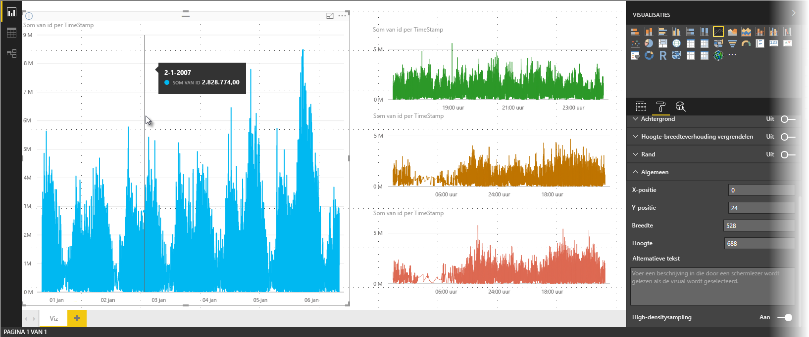

# High-densitysampling van lijnen in Power BI
Sinds de release in juni 2017 van **Power BI Desktop** en updates voor de **Power BI-service** is er een nieuw samplingalgoritme beschikbaar waarmee visuals worden verbeterd die high-densitygegevens verzamelen. U kunt bijvoorbeeld een lijndiagram maken op basis van de verkoopresultaten van uw winkels, waarbij elke winkel jaarlijks meer dan tienduizend verkoopontvangsten genereert. Een lijndiagram van dergelijke verkoopcijfers zou een sample van gegevens ophalen (door een zinvolle representatie van alle gegevens te selecteren, ter illustratie van de wijze waarop de verkoop gedurende een bepaalde periode varieert) uit de gegevens voor elke winkel en een lijndiagram met meerdere reeksen maken dat op die manier de onderliggende gegevens laat zien. Dit is gebruikelijk bij het visualiseren van high-densitygegevens en Power BI Desktop heeft de sampling van high-densitygegevens verbeterd, zoals nader beschreven in dit artikel.

> [!NOTE]
> Het **high-densitysampling**- algoritme dat in dit artikel wordt beschreven, is van toepassing op en beschikbaar in zowel **Power BI Desktop** als de **Power BI-service**.
> 
> 

## Hoe high-densitysampling van lijnen werkt
Voorheen selecteerde **Power BI** op deterministische wijze een sample van gegevenspunten in het volledige bereik van onderliggende gegevens. Voor high-densitygegevens in een visual die één jaar bestrijkt, kunnen er in de visual bijvoorbeeld 350 sample-gegevenspunten worden weergegeven, die allemaal werden geselecteerd om te controleren of het volledige gegevensbereik (de totale reeks onderliggende gegevens) in de visual werd weergegeven. Om te begrijpen hoe dit gebeurt, moet u zich voorstellen dat we aandelenkoersen uitzetten gedurende een periode van één jaar en dat we 365 gegevenspunten hebben geselecteerd om een lijndiagram te maken (met één gegevenspunt voor elke dag).

In dat geval zijn er elke dag veel waarden voor een aandelenkoers. Er is natuurlijk een dagelijks hoogste en laagste koers, maar die kunnen zich op elk moment van de dag voordoen wanneer de beurs geopend is. Als bij high-densitysampling van lijnen de onderliggende gegevenssample elke dag werd genomen om 10.30 uur en 24.00 uur, ontstaat er een representatieve momentopname van de onderliggende gegevens (de koers op 10.30 uur en 24.00 uur), maar daarmee worden mogelijk niet de werkelijke hoogste en laagste koers voor dat representatieve gegevenspunt (voor die dag) vastgelegd. In situaties als deze vertegenwoordigt de sample de onderliggende gegevens, maar daarin zijn niet altijd de belangrijke punten opgenomen, in dit geval de hoogste en laagste dagkoers.

High-densitygegevens worden per definitie verzameld voor visualisaties die redelijk snel kunnen worden gemaakt en ze reageren op interactiviteit (te veel gegevenspunten in een visual kunnen verwarrend zijn en de zichtbaarheid van trends tegenwerken). De manier waarop dergelijke gegevens worden verzameld, om de best mogelijke visualisatie te bieden, vormt de basis voor het samenstellen van het samplingalgoritme. In Power BI Desktop is het algoritme verbeterd om de best mogelijke combinatie van reactievermogen, weergave en behoud van belangrijke punten in elke periode te bieden.

## De werking van het nieuwe samplingalgoritme voor lijnen
Het nieuwe algoritme voor high-densitysampling van lijnen is beschikbaar voor visuals met lijn- en vlakdiagrammen met een doorlopende x-as.

Voor een high-densityvisual splitst **Power BI** op intelligente wijze de gegevens in segmenten van hoge resolutie en kiest belangrijke punten om elk segment aan te geven. Dit proces van het splitsen van gegevens van hoge resolutie is er speciaal op gericht om ervoor te zorgen dat het resulterende diagram visueel niet te onderscheiden is van de weergave van alle onderliggende gegevenspunten, maar dan veel sneller en interactiever.

### Minimale en maximale waarden voor high-densityvisuals voor lijnen
Voor een bepaalde visualisatie gelden de volgende beperkingen:

* **3500** is het maximumaantal gegevenspunten dat in de visual wordt *weergegeven*, ongeacht het aantal onderliggende gegevenspunten of -reeksen. Als er 10 reeksen met 350 gegevenspunten elk zijn, heeft de visual het maximumaantal gegevenspunten bereikt. Als u één reeks hebt, kan deze maximaal 3500 gegevenspunten bevatten als het nieuwe algoritme dit als de beste sampling voor de onderliggende gegevens beoordeelt.
* Er geldt een maximum van **60 reeksen** voor een visual. Als er meer dan 60 reeksen zijn, splitst u de gegevens op en maakt u meerdere visuals met 60 of minder reeksen elk. Het is raadzaam om een **slicer** te gebruiken om alleen de segmenten van de gegevens weer te geven (alleen bepaalde reeksen). Als u bijvoorbeeld alle subcategorieën in de legenda weergeeft, kunt u met een slicer filteren op de algehele categorie op dezelfde rapportpagina.

Deze parameters zorgen ervoor dat visuals in Power BI Desktop zeer snel worden weergegeven, reageren op interactie door gebruikers en niet leiden tot onnodige verwerkingsoverhead op de computer die de visual genereert.

### Representatieve gegevenspunten beoordelen voor high-densityvisuals voor lijnen
Wanneer het aantal onderliggende gegevenspunten de gegevenspunten overschrijdt dat in de visual kan worden weergegeven (het maximum is 3500 gegevenspunten), begint een zogenaamd *binning*-proces, dat de onderliggende gegevens opsplitst in groepen die *bins* worden genoemd, waarna deze bins regelmatig worden verfijnd.

Het algoritme maakt zo veel mogelijk bins om de grootst mogelijke granulariteit voor de visual te realiseren. Het algoritme zoekt binnen elke bin naar de minimale en maximale gegevenswaarde om ervoor te zorgen dat belangrijke en significante waarden (zoals uitschieters) worden vastgelegd en weergegeven in de visual. Op basis van de resultaten van de binning en de daaropvolgende evaluatie van de gegevens door Power BI, wordt de minimale resolutie voor de x-as van de visual bepaald, om voor een maximale granulariteit voor de visual te zorgen.

Zoals eerder vermeld, is de minimale granulariteit voor elke reeks 350 punten en is 3500 het maximum.

Elke bin wordt weergegeven door twee gegevenspunten, die de representatieve gegevenspunten van de bin in de visual worden. De gegevenspunten zijn simpelweg de hoogste en laagste waarde voor die bin, en door die hoogste en laagste waarde te selecteren zorgt het binning-proces ervoor dat elke belangrijke hoogste waarde, of significante laagste waarde, wordt vastgelegd en weergegeven in de visual.

Als u denkt dat dit een hoop analysewerk betekent om er zeker van te zijn dat een incidentele uitschieter wordt vastgelegd en correct wordt weergegeven in de visual, dan klopt dat inderdaad – en dat is dan ook exact de reden achter het nieuwe algoritme en binning-proces.

## Tooltips en high-densitysampling van lijnen
Het is belangrijk te weten dat dit binning-proces, dat de minimum- en maximumwaarde oplevert in een vastgelegde bin die in de visual wordt weergegeven, van invloed kan zijn op de manier waarop gegevens worden weergegeven in de tooltips wanneer u de muisaanwijzer boven gegevenspunten houdt. Voor een uitleg over hoe en waarom dat gebeurt, gaan we terug naar ons voorbeeld over aandelenkoersen eerder in dit artikel.

Stel u maakt een visual op basis van aandelenkoersen en u vergelijkt twee verschillende aandelen, die beide gebruikmaken van **high-densitysampling**. De onderliggende gegevens voor elke reeks bevatten veel gegevenspunten (mogelijk omdat u aandelenkoersen elke seconde van de dag hebt vastgelegd). Het algoritme voor high-densitysampling van lijnen voert voor elke afzonderlijke reeks binning uit.

Stel nu dat de koers van het eerste aandeel om 12:02 uur omhoog gaat en tien seconden later meteen weer omlaag duikt, dan is dat een belangrijk gegevenspunt. Wanneer er voor dat aandeel binning wordt uitgevoerd, wordt de hoge waarde om 12:02 uur een representatief gegevenspunt voor die bin.

Maar voor het tweede aandeel is 12:02 noch een hoge noch een lage waarde in de bin waarin die tijd is opgenomen. Het is mogelijk dat de hoge en lage waarden voor de bin die 12:02 omvat, drie minuten later plaatsvonden. Wanneer in dat geval het lijndiagram wordt gemaakt en u de muisaanwijzer boven 12:02 houdt, ziet u een waarde in de tooltip voor het eerste aandeel (omdat dit aandeel om 12:02 omhoog ging en die waarde werd geselecteerd als hoogste gegevenspunt voor die bin), maar ziet u *geen* enkele waarde in de tooltip van 12:02 voor het tweede aandeel. Dat komt doordat het tweede aandeel noch een hoge, noch een lage waarde voor de bin had die plaatsvond om 12:02. Er zijn dus geen gegevens om weer te geven voor het tweede aandeel om 12:02 en daarom worden er geen tooltipgegevens weergegeven.

Dat gebeurt vaker met tooltips. De hoge en lage waarden voor een bepaalde bin komen wellicht niet volledig overeen met de waardepunten op de gelijkmatig geschaalde x-as, waardoor de tooltip de waarde niet laat zien.  

## High-densitysampling van lijnen inschakelen
Het nieuwe algoritme is standaard **ingeschakeld**. Als u deze instelling wilt wijzigen, gaat u naar het deelvenster **Opmaak**en opent u de kaart **Algemeen**, waar onderaan de schuifregelaar **High-densitysampling** te zien is. U schakelt de schuifregelaar uit door deze op **Uit** te zetten.

## Overwegingen en beperkingen
Het nieuwe algoritme voor high-densitysampling van lijnen is een belangrijke verbetering in Power BI, maar er zijn wel enkele zaken waarmee u rekening moet houden wanneer u werkt met high-densitywaarden en -gegevens.

* Vanwege toegenomen granulariteit en het binning-proces geven **tooltips** mogelijk alleen een waarde weer als de representatieve gegevens worden uitgelijnd met uw muisaanwijzer. Zie de sectie eerder in dit artikel over **tooltips** voor meer informatie.
* Wanneer een algemene gegevensbron te groot is, elimineert het nieuwe algoritme reeksen (legenda-elementen) op basis van het maximum voor het importeren van gegevens.
  
  * In dit geval rangschikt het nieuwe algoritme legendareeksen op alfabet en begint de lijst met legenda-elementen in alfabetische volgorde af te werken totdat het maximum voor gegevensimport is bereikt en er geen verdere reeksen meer worden geïmporteerd.
* Wanneer een onderliggende gegevensset meer dan 60 reeksen heeft (het maximumaantal reeksen, zoals eerder beschreven), rangschikt het nieuwe algoritme de reeksen op alfabet en worden alle reeksen boven de 60e reeks die alfabetisch is gerangschikt, verwijderd.
* Als de waarden in de gegevens niet van het type *numeriek* of *datum/tijd* zijn, maakt Power BI geen gebruik van het nieuwe algoritme en wordt het vorige (niet-high-densitysampling)-algoritme gebruikt.
* De instelling **Items zonder gegevens weergeven** wordt niet ondersteund door het nieuwe algoritme.
* Het nieuwe algoritme wordt niet ondersteund bij gebruik van een live-verbinding met een model dat wordt gehost in SQL Server Analysis Services (versie 2016 of lager). Het wordt wel ondersteund in modellen die worden gehost in **Power BI** of Azure Analysis Services.

## Volgende stappen
Zie het volgende artikel voor informatie over high-densitysampling in spreidingsdiagrammen.

* [High-densitysampling in Power BI-spreidingsdiagrammen](desktop-high-density-scatter-charts.md)

