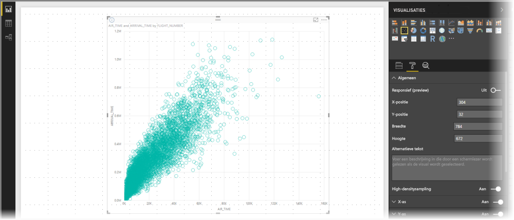
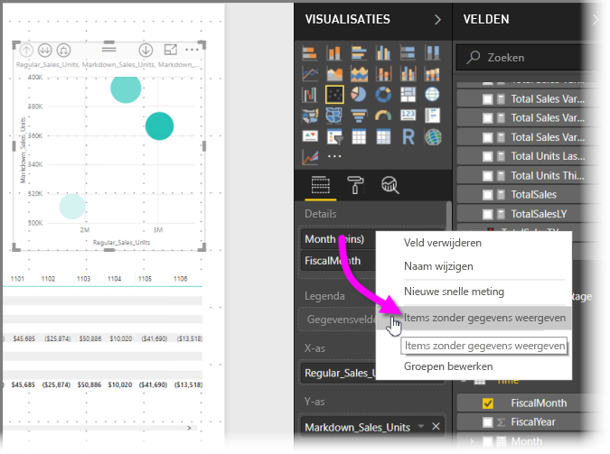
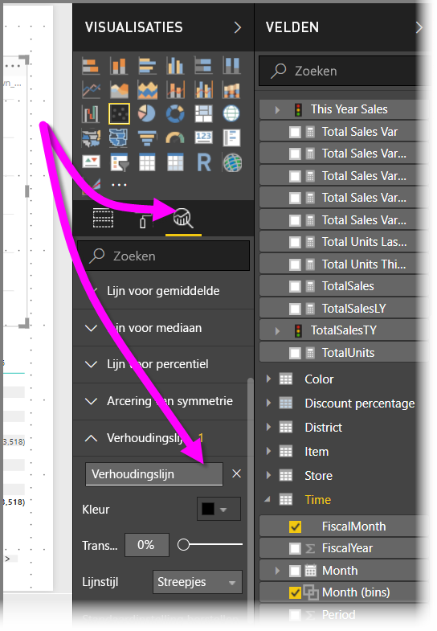

# High-densitysampling in Power BI-spreidingsdiagrammen
Sinds de release in september 2017 van **Power BI Desktop** en updates voor de **Power BI-service** is er een nieuw samplingalgoritme beschikbaar waarmee de weergave van high-densitygegevens in spreidingsdiagrammen is verbeterd.

U kunt bijvoorbeeld een spreidingsdiagram maken van de verkoopactiviteiten van uw organisatie, waarbij elke vestiging elk jaar tienduizenden gegevenspunten genereert. Met een spreidingsdiagram van dergelijke informatie wordt dan een gegevenssample opgehaald (door een zinvolle representatie van alle gegevens te selecteren, ter illustratie van de wijze waarop de verkoop gedurende een bepaalde periode zich heeft ontwikkeld) uit de beschikbare gegevens en wordt een spreidingsdiagram gemaakt dat de onderliggende gegevens vertegenwoordigt. Dit is gebruikelijk bij spreidingsdiagrammen met high-densitygegevens. In Power BI is de sampling van high-densitygegevens verbeterd, zoals nader beschreven in dit artikel.

> [!NOTE]
> Het **high-densitysampling**-algoritme dat in dit artikel wordt beschreven, is beschikbaar in de spreidingsdiagrammen in zowel **Power BI Desktop** als de **Power BI-service**.
> 
> 

## Hoe high-densityspreidingsdiagrammen werken
Voorheen selecteerde **Power BI** op deterministische wijze een sample van gegevenspunten in het volledige bereik van onderliggende gegevens om een spreidingsdiagram te maken. Meer in het bijzonder selecteerde Power BI de eerste en laatste rij gegevens in de reeks van het spreidingsdiagram, waarna de overige rijen gelijkmatig werden verdeeld zodat in totaal 3500 gegevenspunten in het spreidingsdiagram werden geplot. Als de sample bijvoorbeeld uit 35.000 rijen bestond, werden de eerste en laatste rij geselecteerd voor het plotten, waarna elke tiende rij ook werd geplot (35.000 / 10 = elke tiende rij = 3500 gegevenspunten). Voorheen gold ook dat null-waarden of punten die niet in gegevensreeksen konden worden geplot (zoals tekstwaarden), niet werden weergegeven en derhalve niet werden meegenomen bij het genereren van de visual. Met dergelijke samples werd de waargenomen dichtheid van het spreidingsdiagram ook gebaseerd op de representatieve gegevenspunten, waardoor de impliciete visuele dichtheid het gevolg was van de punten in de sample, niet van de volledige verzameling onderliggende gegevens.

Wanneer u **High-densitysampling** inschakelt, implementeert Power BI een algoritme dat overlappende punten elimineert en wordt ervoor gezorgd dat de punten in de visual bereikbaar zijn tijdens interactie met de visual. Bovendien zorgt het algoritme ervoor dat alle punten in de gegevensset worden weergegeven in de visual, zodat er een context wordt verschaft bij de betekenis van de geselecteerde punten, in plaats van alleen maar een representatieve sample te plotten.

High-densitygegevens worden per definitie verzameld om redelijk snel visualisaties te maken die responsief zijn voor op interactiviteit. Door te veel gegevenspunten op een visual kan de snelheid omlaag gaan. Bovendien kan dit afbreuk doen aan de zichtbaarheid van de trends. De manier waarop dergelijke gegevens worden verzameld is bepalend voor het samenstellen van het samplingalgoritme om de best mogelijke visualisatie te bieden en ervoor te zorgen dat alle gegevens worden weergegeven. In Power BI is het algoritme nu verbeterd om de best mogelijke combinatie van reactievermogen, weergave en behoud van belangrijke punten in de algehele gegevensset te bieden.

> [!NOTE]
> Spreidingsdiagrammen die het **high-densitysampling**-algoritme gebruiken, kunnen net zoals alle spreidingsdiagrammen het beste worden geplot in vierkante visuals.
> 
> 

## De werking van het nieuwe samplingalgoritme voor spreidingsdiagrammen
Het nieuwe algoritme voor **high-densitysampling** voor spreidingsdiagrammen maakt gebruik van methoden waarmee de onderliggende gegevens effectiever worden vastgelegd en weergegeven, en waarmee overlappende punten worden geëlimineerd. Het algoritme doet dit door te beginnen met een kleine straal voor elk gegevenspunt (de visuele cirkelgrootte voor een bepaald punt in de visualisatie). Vervolgens wordt de straal van alle gegevenspunten vergroot. Wanneer twee (of meer) gegevenspunten elkaar overlappen, geeft één enkele cirkel (met de vergrote straal) die overlapte gegevenspunten weer. Het algoritme blijft de straal van gegevenspunten vergroten totdat de waarde van de straal resulteert in een redelijk aantal gegevenspunten, in dit geval 3500, die worden weergegeven in het spreidingsdiagram.

De methoden in dit algoritme zorgen ervoor dat in de resulterende visual ook uitschieters worden weergegeven. Het algoritme houdt ook rekening met de schaal wanneer er overlapping wordt vastgesteld, en wel zo dat exponentiële schalen nauwkeurig worden weergegeven op basis van de onderliggende gevisualiseerde punten.

Met dit algoritme blijft ook de algehele vorm van het spreidingsdiagram behouden.

> [!NOTE]
> Wanneer u het **high-densitysampling**-algoritme voor spreidingsdiagrammen gebruikt, is *nauwkeurige distributie* van de gegevens het doel en *niet* de impliciete visuele dichtheid. Een voorbeeld. U hebt een spreidingsdiagram met veel cirkels die elkaar in een bepaald gebied overlappen (dichtheid) en stel u voor dat er hier veel gegevenspunten moeten zijn geclusterd. Aangezien het **high-densitysampling**-algoritme één cirkel kan gebruiken om veel gegevenspunten weer te geven, komt een dergelijke impliciete visuele dichtheid (of 'clustering') niet aan het licht. Als u meer details in een bepaald gebied wilt zien, kunt u slicers gebruiken om in te zoomen.
> 
> 

Daar komt bij dat gegevenspunten die niet kunnen worden geplot (zoals null- of tekstwaarden) genegeerd worden, zodat een andere waarde die wel kan worden geplot wordt geselecteerd, waardoor de juiste vorm van het spreidingsdiagram behouden blijft.

### Wanneer het standaardalgoritme voor spreidingsdiagrammen wordt gebruikt
Er zijn omstandigheden waaronder **high-densitysampling** niet kan worden toegepast op een spreidingsdiagram en derhalve het oorspronkelijke algoritme wordt gebruikt. Dat geldt voor de volgende situaties:

* Als u met de rechtermuisknop op een waarde onder **Details** klikt en vervolgens **Items zonder gegevens weergeven** in het menu selecteert, wordt het spreidingsdiagram teruggezet naar het oorspronkelijke algoritme.
  
  
* Waarden in de **Play**-as zorgen ervoor dat het spreidingsdiagram wordt teruggezet naar het oorspronkelijke algoritme.
* Als de X- en Y-as beide in een spreidingsdiagram ontbreken, wordt het diagram teruggezet naar het oorspronkelijke algoritme.
* Het gebruik van een **verhoudingslijn** in het deelvenster **Analyse** zorgt ervoor dat het diagram wordt teruggezet naar het oorspronkelijke algoritme.
  
  

## High-densitysampling inschakelen voor een spreidingsdiagram
Als u **High-densitysampling** wilt inschakelen, selecteert u een spreidingsdiagram, gaat u naar het deelvenster **Opmaak**, vouwt u de kaart **Algemeen** uit en schuift u de schuifregelaar **High-densitysampling** onderaan de kaart naar **Aan**.

> [!NOTE]
> Zodra de schuifregelaar is ingeschakeld, zal Power BI het **high-densitysampling**-algoritme zo veel mogelijk proberen te gebruiken. Wanneer het algoritme niet kan worden gebruikt (bijvoorbeeld als u een waarde in de *Afspelen*-as zet), blijft de schuifregelaar op **Aan** staan, zelfs als het diagram is teruggezet naar het standaardalgoritme. Als u vervolgens een waarde verwijdert uit de as *Afspelen* (of voorwaarden veranderen waardoor het high-densitysampling-algoritme kan worden gebruikt), maakt het diagram automatisch gebruik van high-densitysampling omdat de functie actief is.
> 
> [!NOTE]
> Gegevenspunten worden door de index geselecteerd of gegroepeerd. Een legenda heeft geen invloed op sampling voor het algoritme, dit geldt alleen voor het ordenen van de visual.
> 
> 

## Overwegingen en beperkingen
Het high-densitysampling-algoritme is een belangrijke verbetering in Power BI, maar er zijn wel enkele zaken waarmee u rekening moet houden wanneer u werkt met high-densitywaarden en spreidingsdiagrammen.

* Het **high-densitysampling**-algoritme werkt alleen met liveverbindingen naar op Power BI gebaseerde modellen, geïmporteerde modellen of DirectQuery.

## Volgende stappen
Zie het volgende artikel voor meer informatie over high-densitysampling in andere diagrammen.

* [High-densitysampling van lijnen in Power BI](desktop-high-density-sampling.md)

