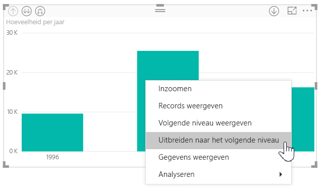
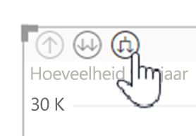
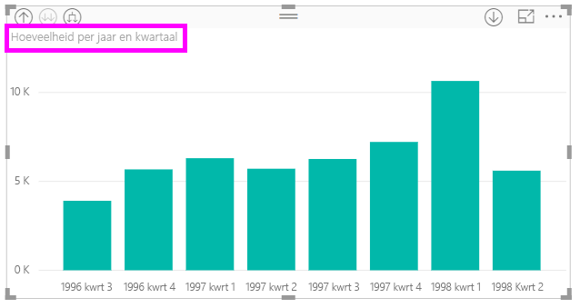
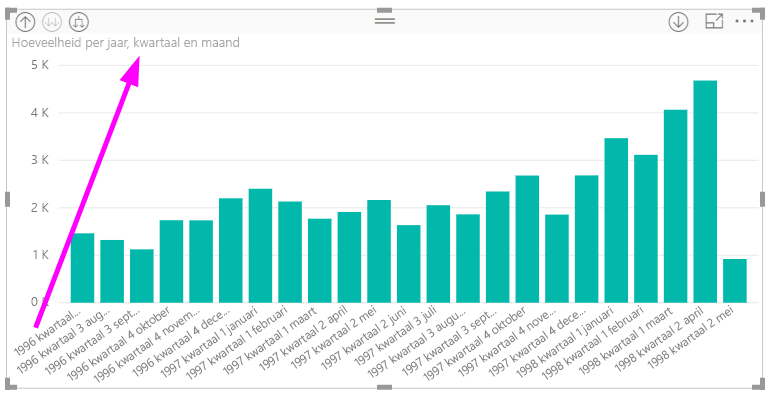
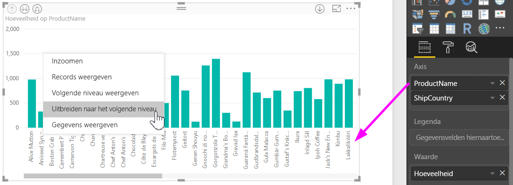
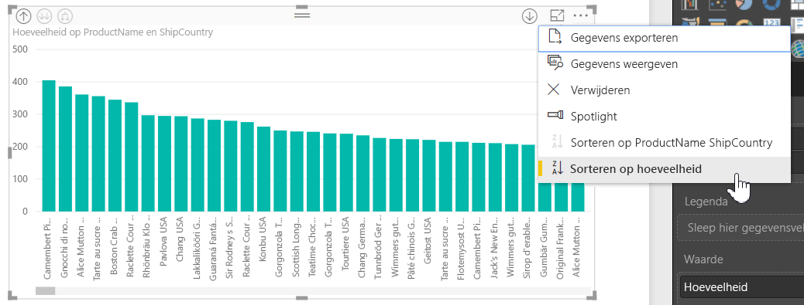
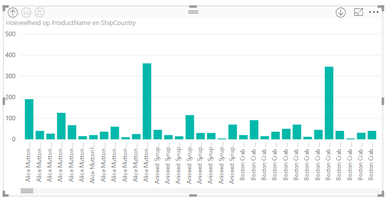

# Labels voor inlinehiërarchie gebruiken in Power BI Desktop
**Power BI Desktop** ondersteunt het gebruik van **labels voor inlinehiërarchie**, de eerste van twee functies waarmee het hiërarchisch analyseren wordt verbeterd. De tweede functie, die nog in ontwikkeling is, maakt het gebruik van geneste hiërarchielabels mogelijk (houd dit in de gaten, onze updates verschijnen regelmatig).   

## Hoe labels voor inlinehiërarchie werken
Met labels voor inlinehiërarchie kunt u hiërarchielabels zien terwijl u visuele elementen uitvouwt met de functie **Alles uitvouwen**. Een groot voordeel van deze hiërarchielabels is dat u ook op deze verschillende hiërarchielabels kunt **sorteren** terwijl u uw hiërarchische gegevens uitvouwt.

### Met gebruik van de ingebouwde functie Uitvouwen (zonder de sorteren op hiërarchielabels)
Laten we het standaardgedrag van de functie **Uitvouwen naar volgend niveau** bekijken voordat we labels voor inlinehiërarchie in actie zien. Daardoor kunnen we beter begrijpen (en waarderen) hoe handig labels voor inlinehiërarchie kunnen zijn.

In de volgende afbeelding ziet u een staafdiagram met de verkoopcijfers per jaar. Wanneer u met de rechtermuisknop op een balk klikt, kunt u kiezen voor **Uitvouwen tot volgend niveau**.

> [!NOTE]
> Als alternatief voor het klikken met de rechtermuisknop op een balk, kunt u de knop *Uitvouwen* selecteren linksboven de visualisatie.

  

Als **Uitvouwen naar volgend niveau** is geselecteerd, vouwt de visual de gekozen datumhiërarchie van *Jaar* naar *Kwartaal*, zoals weergegeven in de volgende afbeelding.

De labels *Jaar* en *Kwartaal* worden samen weergegeven; dit labelingschema gaat door als u **Alles uitvouwt** tot de onderkant van de hiërarchie.

Dit is dus het gedrag van de ingebouwde *Datumhiërarchie*, gekoppeld aan velden met het gegevenstype *datum/tijd*. We gaan verder naar de volgende sectie, waar we de verschillen zien van de nieuwe functie voor labels voor inlinehiërarchie.

### Werken met labels voor inlinehiërarchie
We kijken nu naar een ander diagram en gebruiken gegevens met informele hiërarchieën. In de volgende visual hebben we een staafdiagram met **Kwantiteit**, met *ProductName* als de as. In deze gegevens vormen *ProductName* en *ShipCountry* een informele hiërarchie. Vanuit hier kunt u nogmaals *Uitvouwen naar volgend niveau* selecteren om in te zoomen op de hiërarchie.

Door **Uitvouwen naar volgend niveau** te selecteren wordt het volgende niveau weergegeven met inline-weergave van hiërarchielabels. Standaard worden inlinehiërarchieën gesorteerd op de meetwaarde, in dit geval **Kwantiteit**. Met inlinehiërarchieën ingeschakeld kunt u er voor kiezen om deze gegevens ook op hiërarchie te sorteren door het beletselteken in de rechterbovenhoek te selecteren (de **...**) en daarna **Sorteren op ProductName ShipCountry** te selecteren zoals weergegeven in de volgende afbeelding.

Als **ShipCountry** is geselecteerd worden de gegevens gesorteerd op basis van de informele hiërarchieselectie zoals weergegeven in de volgende afbeelding.

> [!NOTE]
> Met de functie voor labels voor inlinehiërarchie kunt u de ingebouwde tijdhiërarchie nog niet op waarde sorteren, maar nog slechts op volgorde van hiërarchie.
> 
> 

## Problemen oplossen
Het kan voorkomen dat de visuele elementen vast komen te zitten in de uitgevouwen toestand van een inlinehiërarchieniveau. In sommige gevallen ziet u dat sommige visuele elementen vastzitten in de modus waarin ze werden uitgevouwen. Uitzoomen heeft dan geen zin. Dit kan optreden als u de volgende stappen hebt uitgevoerd (u vindt de oplossing hiervoor *onder* deze stappen):

Stappen waardoor visuele elementen mogelijk in een uitgevouwen toestand vast komen te zitten:

1. Schakel de functie **labels voor inlinehiërarchie** in
2. Maak een paar visuele elementen met hiërarchieën
3. Pas **Alles uitvouwen** toe en sla uw bestand op
4. Schakel de functie *labels voor inlinehiërarchie* **uit** en start Power BI Desktop opnieuw
5. Open vervolgens het bestand opnieuw

Als u deze stappen hebt uitgevoerd en uw visuele elementen vastzitten in de uitgevouwen modus, kunt u dit als volgt oplossen:

1. Schakel de functie **labels voor inlinehiërarchie** opnieuw in en start Power BI Desktop opnieuw
2. Open het bestand opnieuw en zoom opnieuw uit tot u de bovenkant van de betreffende visuele elementen ziet
3. Sla uw bestand op
4. Schakel de functie **labels voor inlinehiërarchie** uit en start Power BI Desktop opnieuw
5. Open het bestand opnieuw

U kunt het visuele element ook verwijderen en opnieuw maken.

