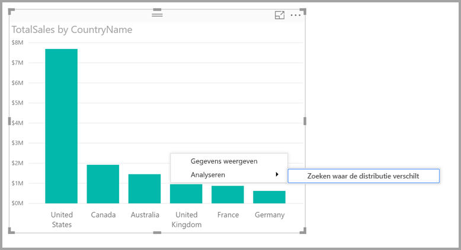
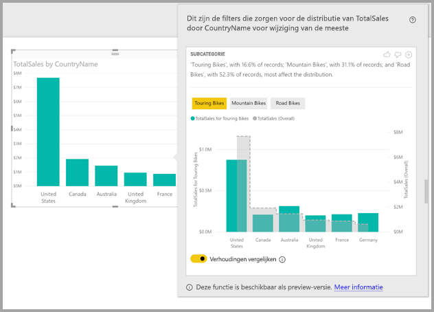

# Inzichten in Power BI Desktop gebruiken om te ontdekken waar de verdeling verschilt (preview)

Als u in een visual een gegevenspunt ziet,vraagt u zich wellicht af of de verdeling in verschillende categorieën hetzelfde is. Met **inzichten** in **Power BI Desktop** kunt u dat met slechts enkele klikken achterhalen.

Bekijk de volgende visual, waar de *totale verkoop* wordt getoond per *land*. Zoals in het diagram te zien is, is het grootste deel van de verkoop afkomstig uit de Verenigde Staten (57%). De andere landen zijn goed voor kleinere percentages. Het is in die gevallen vaak interessant om te bekijken of diezelfde verdeling ook te zien is bij verschillende subpopulaties. Is de verdeling elk jaar hetzelfde? Is deze hetzelfde via alle verkoopkanalen en geldt deze voor alle productcategorieën?  U kunt verschillende filters toepassen en de resultaten visueel vergelijken, maar dat kan veel tijd kosten en er kunnen fouten worden gemaakt. 

U kunt in **Power BI Desktop** opdracht geven te onderzoeken waar de verdeling verschilt en snel en automatisch interessante analyses verkrijgen van uw gegevens. Klik hiertoe met de rechtermuisknop op een gegevenspunt en selecteer **Analyseren > Zoeken waar de verdeling anders is**. U ziet nu inzicht in een gebruiksvriendelijk venster.

In dit voorbeeld ziet u door de automatische analyse snel dat voor *Touring Bikes* het verkoopaandeel in de Verenigde Staten en Canada kleiner is dan het aandeel uit andere landen.   

> [!NOTE]
> De functie is een preview-versie en kan nog worden gewijzigd. De inzichtfunctie is vanaf de **Power BI Desktop**-versie van september 2017 standaard ingeschakeld (u hoeft geen selectievakje Preview in te schakelen).
> 
> 

## Inzichten gebruiken
Als u inzichten wilt gebruiken om te ontdekken waar de verdeling in diagrammen verschilt, klikt u met de rechtermuisknop op een gegevenspunt (of op de visual als geheel) en selecteert u **Analyseren > Zoeken waar de verdeling anders is**.

Vervolgens worden door **Power BI Desktop** de gegevens met machine learning-algoritmen geanalyseerd en worden in een venster een visual en een beschrijving weergegeven. Hieraan ziet u welke categorieën (kolommen) en welke waarden uit die kolommen hebben geleid tot de meest significante en afwijkende verdeling. De inzichten worden standaard gepresenteerd in een kolomdiagram, zoals in de volgende afbeelding is getoond. 

De waarden worden op basis van het geselecteerde filter weergegeven in de normale standaardkleur. De totale waarden, zoals te zien in de oorspronkelijke visual, worden grijs weergegeven zodat u de twee eenvoudig kunt vergelijken. Er kunnen maximaal drie verschillende filters worden gebruikt (in dit voorbeeld zijn dat *Touring Bikes*, *Mountain Bikes* en *Road Bikes*). U kunt afzonderlijke filters kiezen door erop te klikken (of ctrl+klik gebruiken om er meerdere te selecteren).

Voor eenvoudige aanvullende metingen, zoals *Total Sales* in dit voorbeeld, wordt de vergelijking gebaseerd op de relatieve waarden in plaats van de absolute waarden. Terwijl de verkoop van Touring Bikes lager ligt dan de totale verkoop in alle categorieën, wordt in de visual standaard een dubbele as gebruikt, zodat u het verkoopaandeel van Touring Bikes in verschillende landen kunt vergelijken met de totale fietsverkoop.  Met de schakelaar onder de visual kunt u twee waarden weergeven op dezelfde as, waardoor de absolute waarden eenvoudig kunnen worden vergeleken (zoals weergegeven in de volgende afbeelding).    

De beschrijvende tekst biedt ook een indicatie van het belang dat kan worden gehecht aan een filterwaarde. Er wordt namelijk aangegeven hoeveel records overeenkomen met het filter. In dit voorbeeld ziet u dus dat de verdeling van *Touring Bikes* enorm afwijkt, maar dat deze slechts goed zijn voor 16,6% van de records.

Met de pictogrammen met *duim omhoog* of *duim omlaag* boven aan de pagina kunt u feedback geven over het visuele element en de functie. Als u dit doet, levert dit feedback op, maar het algoritme leert hier momenteel niet van dat de resultaten moeten worden aangepast wanneer u de functie de volgende keer gebruikt.

Belang rijk is ook de **+**-knop boven aan het visuele element. Hiermee kunt u het geselecteerde visuele element aan uw rapport toevoegen, alsof u het zelf had gemaakt. Vervolgens kunt u het toegevoegde visuele element opmaken of op andere wijze aanpassen, net zoals u dat voor een ander visueel element in uw rapport zou kunnen doen. U kunt een geselecteerd visueel inzicht alleen toevoegen als u een rapport bewerkt in **Power BI Desktop**.

U kunt inzichten gebruiken als uw rapport in lees- of bewerkmodus is. U kunt er dan gegevens mee analyseren en visuele elementen mee maken die u makkelijk aan uw rapporten kunt toevoegen.

## Details van de geretourneerde resultaten
Het algoritme neemt alle waarden uit de andere kolommen in het model en past deze als filter toe op de oorspronkelijke visual. Op deze manier achterhaalt het algoritme welke filterwaarden leiden tot de resultaten die het meest *verschillen* van de oorspronkelijke resultaten.

U vraagt zich waarschijnlijk af wat *verschillen* precies betekent. Stel bijvoorbeeld dat de totale verdeling van de verkoop tussen de V.S. en Canada als volgt is:

|Land  |Verkoop ($ M)|
|---------|----------|
|VS      |15        |
|Canada   |5         |

Voor een bepaalde productcategorie (bijvoorbeeld *Road Bike*), kan de verkoop als volgt zijn verdeeld:

|Land  |Verkoop ($ M)|
|---------|----------|
|VS      |3        |
|Canada   |1         |

Hoewel de getallen in de tabellen van elkaar verschillen, zijn de relatieve waarden van de V.S. en Canada identiek (75% en 25% in totaal voor Road Bikes). Daarom worden deze niet beschouwd als zijnde 'verschillend'. Voor eenvoudige aanvullende metingen als deze zoekt het algoritme daarom naar verschillen in de *relatieve* waarde.  

Als u een mooi contrast wilt krijgen, kunt u bijvoorbeeld de marge uitrekenen (berekend als winst/kosten). Stel dat de totale marges in de V.S. en Canada als volgt zijn:

|Land  |Marge (%)|
|---------|----------|
|VS      |15        |
|Canada   |5         |

Voor een bepaalde productcategorie (bijvoorbeeld *Road Bike*), kan de verkoop als volgt zijn verdeeld:

|Land  |Marge (%)|
|---------|----------|
|VS      |3        |
|Canada   |1         |

Gezien de aard van deze maatregelen wordt dit *wel* gezien als 'verschillend'. Bij niet-aanvullende metingen, zoals bij dit margevoorbeeld, zoekt het algoritme dus naar verschillen in de absolute waarde.

De visuals die worden weergegeven, zijn dan ook bedoeld om een duidelijk verschil aan te tonen tussen de totale verdeling (zoals in de oorspronkelijke visual) en de waarde als dit specifieke filter wordt toegepast.  

Bij aanvullende metingen, zoals met *Sales* in het vorige voorbeeld, worden een kolom en een lijndiagram gebruikt. Dankzij het gebruik van een dubbele as met een geschikte schaal kunnen de relatieve waarden eenvoudig worden vergeleken. In de kolommen wordt de waarde weergegeven met het filter toegepast. De lijn verwijst naar de totale waarde (de kolomas staat links en de lijnas rechts, zoals gebruikelijk). De lijn wordt *trapsgewijs* weergegeven met streepjes, opgevuld met grijs. Bij het vorige voorbeeld, als de maximale waarde van de kolomas 4 en de maximale waarde van de lijnas 20 is, kunt u de relatieve waarden van de V.S. en Canada eenvoudig vergelijken voor de gefilterde en totale waarden. 

Op dezelfde manier wordt voor niet-aanvullende metingen zoals *Margin* in het vorige voorbeeld, gebruikgemaakt van een kolom- en een lijndiagram. Door het gebruik van één as kunnen de absolute waarden eenvoudig worden vergeleken. De lijn (opgevuld met grijs) toont opnieuw de totale waarde. Ongeacht of u nu echte of relatieve cijfers vergelijkt, het bepalen in welke mate de twee verdelingen van elkaar verschillen, bestaat niet slechts uit het berekenen van het verschil in de waarden. Bijvoorbeeld:

* De grootte van de populatie wordt meegerekend, omdat verschillen statistisch minder belangrijk en interessant zijn als ze van toepassing zijn op een kleiner deel van de totale populatie. Een voorbeeld: de verdeling van de verkoop in verschillende landen kan voor een bepaald product enorm verschillen. Dit wordt niet gezien als interessant als er duizenden producten zijn en dat specifieke product slechts bijdraagt aan een klein percentage van de totale verkoop.

* Verschillen in de categorieën waarbij de oorspronkelijke waarden heel hoog of bijna nul waren, wegen zwaarder mee dan andere verschillen. Als een land in totaal bijvoorbeeld maar 1% van de verkoop bijdraagt, maar voor sommige producten 6% bijdraagt, is dat statisch gezien belangrijk en daarom ook interessanter dan bijvoorbeeld een land dat in plaats van 50% nu 55% bijdraagt. 

* Er worden verschillende methoden gebruikt om te bepalen welke resultaten van de grootste betekenis zijn (zoals het in overweging nemen van andere relaties tussen gegevens).
     
Na het onderzoeken van verschillende kolommen en de waarden in die kolommen, wordt de set waarden met de grootste verschillen gekozen. Om de waarden inzichtelijker te maken, worden de gegevens vervolgens gegroepeerd per kolom. De kolom waarbij de waarden het meest verschillen, wordt als eerste vermeld. Er worden maximaal drie waarden per kolom weergegeven. Het kan zijn dat er minder worden weergegeven als er minder dan drie waarden met een groot effect waren, of als sommige waarden een veel grotere impact hadden dan andere. 

Het is niet per se zo dat alle kolommen in het model binnen de beschikbare tijd worden onderzocht. U hebt dus niet de garantie dat de kolommen en waarden met de grootste invloed worden weergegeven. Er worden echter verschillende methoden toegepast om ervoor te zorgen dat de kolommen die waarschijnlijk interessante gegevens bevatten als eerste worden onderzocht. Stel bijvoorbeeld dat, na het onderzoeken van alle kolommen, wordt bepaald dat de volgende kolommen/waarden de grootste invloed hebben op de verdeling (van de meeste naar de minste invloed):

    Subcategory = Touring Bikes
    Channel = Direct
    Subcategory = Mountain Bikes
    Subcategory = Road Bikes
    Subcategory = Kids Bikes
    Channel = Store

De kolommen zouden als volgt worden uitgevoerd:

    Subcategory: Touring Bikes, Mountain Bikes, Road Bikes (only three listed, with the text including “...amongst others” to indicate that more than three have a significant impact) 

    Channel = Direct (only Direct listed, if it’s level of impact was much greater than Store)

## Overwegingen en beperkingen
In de volgende lijst vindt u een aantal scenario's voor **inzichten** die worden ondersteund:

* TopN-filters
* Maateenheidfilters
* Niet-numerieke metingen
* Het gebruik van Waarde weergeven als
* Gefilterde metingen: met gefilterde metingen voert u berekeningen op visueel niveau uit, waarbij een specifiek filter wordt toegepast (bijvoorbeeld *Total Sales for France*). Deze metingen worden gebruikt voor enkele van de visuals die met de inzichtenfunctie zijn gemaakt

Daarnaast worden de volgende modeltypen en gegevensbronnen niet voor inzichten ondersteund:

* DirectQuery
* Live Connect
* On-premises Reporting Services
* Insluiten

## Volgende stappen
Lees de volgende artikelen voor meer informatie over **Power BI Desktop** en hoe u aan de slag kunt.

* [Wat is Power BI Desktop?](desktop-what-is-desktop.md)
* [Query Overview with Power BI Desktop](desktop-query-overview.md) (Queryoverzicht met Power BI Desktop)
* [Data Sources in Power BI Desktop](desktop-data-sources.md) (Gegevensbronnen in Power BI Desktop)
* [Connect to Data in Power BI Desktop](desktop-connect-to-data.md) (Verbinding maken met gegevens in Power BI Desktop)
* [Shape and Combine Data with Power BI Desktop](desktop-shape-and-combine-data.md) (Gegevens vormgeven en combineren met Power BI Desktop)
* [Common Query Tasks in Power BI Desktop](desktop-common-query-tasks.md) (Algemene querytaken in Power BI Desktop)   

