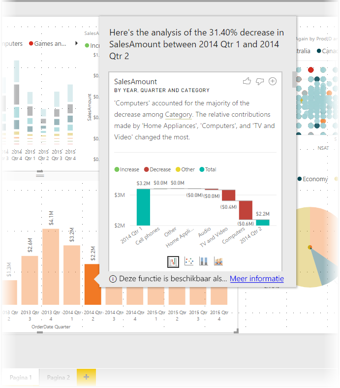
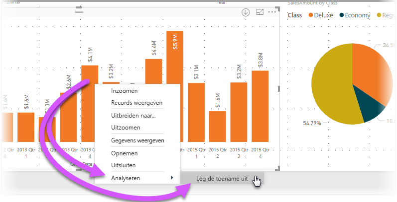
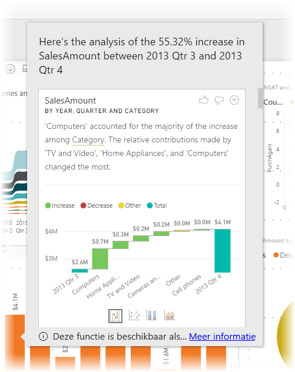
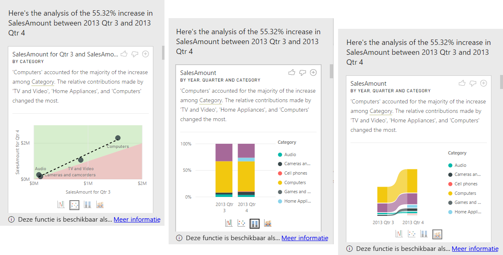

# Inzichten in Power BI Desktop gebruiken om uitleg te bieden over in visuals zichtbare toenamen en afnamen (preview)

U ziet in visuals vaak grote toenamen, gevolgd door flink afgenomen waarden. Vraagt u zich ook wel eens af waardoor deze schommelingen worden veroorzaakt? Met **inzichten** in **Power BI Desktop** kunt u de oorzaak met slechts enkele klikken achterhalen.

Bekijk bijvoorbeeld eens de volgende visual, met daarin de *verkoopbedragen* per *jaar* en *land*. Er is in 2014 een grote afname in de verkoop. De grootste afname vindt plaats tussen *kwartaal 1* en *kwartaal 2*. In dergelijke gevallen kunt u de gegevens verkennen om te achterhalen wat er is veranderd. 

U kunt **Power BI Desktop** vragen toe- of afnames in diagrammen uit te leggen, distributiefactoren in diagrammen te laten zien en snelle, geautomatiseerde en inzichtelijke analyses over uw gegevens te produceren. Klik hiertoe met de rechtermuisknop op een gegevenspunt en selecteer **Analyseren > Leg de afname uit** (toename, als de vorige staaf lager is) of **Analyseren > Zoeken waar de distributie verschilt**. U ziet nu inzicht in een gebruiksvriendelijk venster.

De inzichtfunctie is contextueel en gebaseerd op het gegevenspunt dat er onmiddellijk aan vooraf gaat, zoals de vorige staaf of kolom.

> [!NOTE]
> De functie is een preview-versie en kan nog worden gewijzigd. De inzichtfunctie is vanaf de **Power BI Desktop**-versie van september 2017 standaard ingeschakeld (u hoeft geen selectievakje Preview in te schakelen).

## Inzichten gebruiken
Als u inzichten wilt gebruiken om te achterhalen waarom er toe- of afnamen zijn in een diagram, klikt u met de rechtermuisknop op een gegevenspunt in een staaf of lijn en selecteert u **Analyseren > De toename verklaren** (of *De afname verklaren*, aangezien alle inzichten zijn gebaseerd op de wijziging sinds het vorige gegevenspunt).

Vervolgens worden door **Power BI Desktop** de gegevens met machine-learning algoritmen geanalyseerd en wordt in een venster een visueel element en een beschrijving weergegeven. Hieraan ziet u welke categorieën de meeste invloed hebben gehad op de toe- of afname. De inzichten worden standaard gepresenteerd als een visueel element met een *waterval*, zoals in de volgende afbeelding is getoond.

Als u de kleine pictogrammen onder aan de waterval selecteert, kunt u ervoor kiezen of in de inzichten een spreidingsdiagram, een gestapeld kolomdiagram of lintdiagram wordt weergegeven.

Met de pictogrammen met *duim omhoog* of *duim omlaag* boven aan de pagina kunt u feedback geven over het visuele element en de functie. Als u dit doet, levert dit feedback op, maar het algoritme leert hier momenteel niet van dat de resultaten moeten worden aangepast wanneer u de functie de volgende keer gebruikt.

Belang rijk is ook de **+**-knop boven aan het visuele element. Hiermee kunt u het geselecteerde visuele element aan uw rapport toevoegen, alsof u het zelf had gemaakt. Vervolgens kunt u het toegevoegde visuele element opmaken of op andere wijze aanpassen, net zoals u dat voor een ander visueel element in uw rapport zou kunnen doen. U kunt een geselecteerd visueel inzicht alleen toevoegen als u een rapport bewerkt in **Power BI Desktop**.

U kunt inzichten gebruiken als uw rapport in lees- of bewerkmodus is. U kunt er dan gegevens mee analyseren en visuele elementen mee maken die u makkelijk aan uw rapporten kunt toevoegen.

## Details van de geretourneerde resultaten

De informatie die wordt geretourneerd door de inzichten is bedoeld om aan te geven wat het verschil was tussen twee perioden.  

Als de *verkoop* bijvoorbeeld tussen *kwartaal 3* en *kwartaal 4* in totaal met 55% is gestegen, en dat voor alle product*categorieën* geldt (de verkoop van computers, audio en meer is allemaal met 55% gestegen), maar ook voor alle landen en voor alle typen klanten, is er maar weinig dat kan worden aangedragen als mogelijke oorzaak voor de verandering. Dit is over het algemeen echter niet het geval. Meestal zijn er duidelijke verschillen, bijvoorbeeld dat de categorieën *Computers* en *Home Appliances* met 63% zijn gegroeid terwijl *TV and Audio* met slechts 23% is gegroeid. Daarom hebben de categorieën *Computers* en *Home Appliances* een grotere bijdrage geleverd aan het totaal van *kwartaal 4* dan aan dat van *kwartaal 3*.  In dit voorbeeld zou een redelijke uitleg van de verhoging zijn: *een uitzonderlijk goede verkoop in de categorieën Computers en TV and Audio*. 

Het algoritme retourneert dus niet slechts de waarden die hebben geleid tot het grootste deel van de verandering. Als de grote meerderheid (98%) van de verkoop afkomstig is uit de Verenigde Staten, zou normaal gesproken het overgrote deel van de stijging ook hebben plaatsgevonden in de Verenigde Staten. Tenzij er in de Verenigde Staten of in een ander land een grote verandering is geweest in de relatieve bijdrage aan het totaal, wordt de factor *land* niet interessant gevonden in deze context.  

Eenvoudig gezegd: het algoritme bekijkt alle kolommen in het model en berekent het verschil in de kolommen *vóór* en *na* een bepaald punt. Op die manier wordt bepaald hoeveel verandering er is geweest; de kolommen met de grootste verandering worden geretourneerd. In het bovenstaande voorbeeld is bijvoorbeeld *Category* geselecteerd, omdat de bijdrage van *TV and Video* met 7% is gedaald, van 33% naar 26%, terwijl de bijdrage van *Huishoudelijke apparatuur* van niets is gestegen naar meer dan 6%. 

Voor elke kolom die is geretourneerd, kunnen er vier visuals worden weergegeven. Drie van die visuals zijn bedoeld om de verandering in de bijdrage tussen de twee perioden aan te tonen. Hiermee kunt u bijvoorbeeld zien wat de oorzaak was van de stijging tussen *kwartaal 2* en *kwartaal 3*.

### Het spreidingsplot

In de visual met het spreidingsplot ziet u de waarde van de meting in de eerste periode (op de x-as) in combinatie met de waarde van de meting in de tweede periode (op de y-as) voor alle waarden in de kolom (*Category* in dit geval). Zoals in de volgende afbeelding dus wordt weergegeven, staan gegevenspunten in het groen als de waarde is gestegen en in het rood als deze is gedaald. 

De stippellijn toont het gemiddelde aan. De gegevenspunten boven deze lijn zijn dan ook meer gestegen dan de trend en de punten eronder minder.  

De gegevensitems met een lege waarde in enige periode, worden niet weergegeven in het spreidingsplot (in dit geval bijvoorbeeld *Home Appliances*)

### De 100% gestapelde kolomdiagram

De visual met de 100% gestapelde kolomdiagram bevat de waarde van de meting (vóór en na) voor de geselecteerde kolom, weergegeven als 100% gestapelde kolom. Hierdoor kunnen de bijdragen (voor en na) naast elkaar worden vergeleken. In de knopinfo ziet u de daadwerkelijke bijdrage voor de geselecteerde waarde.

### De lintgrafiek

In de visual met de lintgrafiek ziet u ook de waarde van de meting vóór en na een specifiek punt. Deze visual is vooral handig om veranderingen in bijdragen weer te geven als de *volgorde* van bijdragende categorieën is gewijzigd (als *Computers* bijvoorbeeld op nummer één stond, maar daarna nummer drie is geworden). 

### De watervalgrafiek

De vierde visual is een watervalgrafiek, met daarin de daadwerkelijke toename of afname in een bepaalde periode. In deze visual zijn de daadwerkelijke veranderingen duidelijk te zien, maar wordt niet getoond waarom bepaalde kolommen als 'interessant' zijn gemarkeerd. 

Wanneer de kolommen worden gerangschikt op basis van de grootste verschillen in de relatieve bijdragen, wordt rekening gehouden met het volgende: 

* De kardinaliteit wordt meeberekend omdat een verschil statistisch veel minder belangrijk en interessant is als een kolom een grote kardinaliteit heeft. 

* Verschillen in de categorieën waarbij de oorspronkelijke waarden heel hoog of bijna nul waren, wegen zwaarder mee dan andere verschillen. Als een categorie bijvoorbeeld altijd maar voor 1% van de verkoop heeft gezorgd en dit nu 6% is geworden, is dat statistisch gezien belangrijk en ook interessanter dan een categorie waarbij de bijdrage van 50% is gestegen naar 55%. 

* Er worden verschillende methoden gebruikt om te bepalen welke resultaten van de grootste betekenis zijn (zoals het in overweging nemen van andere relaties tussen gegevens).
 
Na het beoordelen van verschillende kolommen worden de kolommen met de grootste verandering in de relatieve bijdrage gekozen en geretourneerd. Bij elke kolom worden de waarden met de grootste verandering in de bijdrage benoemd in de beschrijving. Daarnaast worden de waarden benoemd met de grootste daadwerkelijke toename en afname.

## Overwegingen en beperkingen
Deze inzichten zijn gebaseerd op de wijziging vanaf het voorgaande gegevenspunt. Ze zijn dus niet beschikbaar als u het eerste gegevenspunt in een visual selecteert. 

In de volgende lijst vindt u een aantal scenario's die momenteel niet worden ondersteund om **de toename/afname te verklaren**:

* TopN-filters
* Opname-/uitsluitingsfilters
* Maateenheidfilters
* Niet-numerieke metingen
* Het gebruik van Waarde weergeven als
* Gefilterde metingen: met gefilterde metingen voert u berekeningen op visueel niveau uit, waarbij een specifiek filter wordt toegepast (bijvoorbeeld *Total Sales for France*). Deze metingen worden gebruikt voor enkele van de visuals die met de inzichtenfunctie zijn gemaakt
* Categorische kolommen op de X-as, tenzij er een scalaire kolomsortering wordt gedefinieerd. Als er een hiërarchie wordt gebruikt, moet elke kolom in de actieve hiërarchie aan deze voorwaarde voldoen

Daarnaast worden de volgende modeltypen en gegevensbronnen niet voor inzichten ondersteund:

* DirectQuery
* Live Connect
* On-premises Reporting Services
* Insluiten

## Volgende stappen
Lees de volgende artikelen voor meer informatie over **Power BI Desktop** en hoe u aan de slag kunt.

* [Wat is Power BI Desktop?](desktop-what-is-desktop.md)
* [Query Overview with Power BI Desktop](desktop-query-overview.md) (Queryoverzicht met Power BI Desktop)
* [Data Sources in Power BI Desktop](desktop-data-sources.md) (Gegevensbronnen in Power BI Desktop)
* [Connect to Data in Power BI Desktop](desktop-connect-to-data.md) (Verbinding maken met gegevens in Power BI Desktop)
* [Shape and Combine Data with Power BI Desktop](desktop-shape-and-combine-data.md) (Gegevens vormgeven en combineren met Power BI Desktop)
* [Common Query Tasks in Power BI Desktop](desktop-common-query-tasks.md) (Algemene querytaken in Power BI Desktop)   

