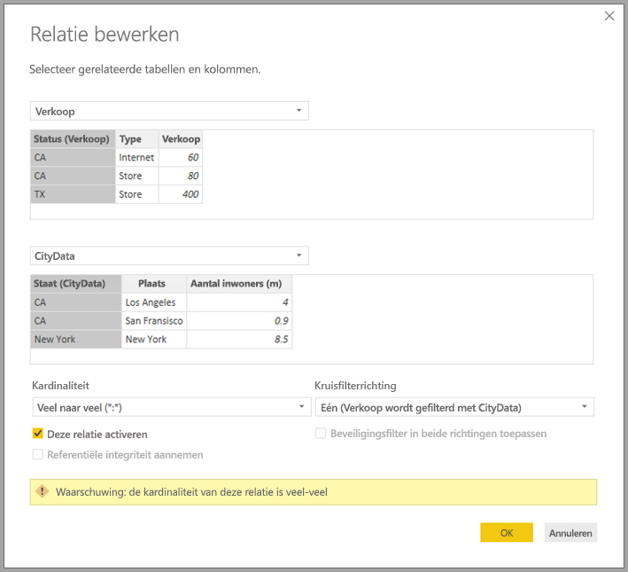

# Veel-op-veelrelaties in Power BI Desktop (preview-versie)

Met de functie **Veel-op-veel-relatie** in **Power BI Desktop** kunt u tabellen samenvoegen met behulp van de kardinaliteit **Veel-op-veel**, om vervolgens eenvoudiger en op een meer intuïtieve manier gegevensmodellen te maken die meerdere gegevensbronnen bevatten. De functie **Veel-op-veel-relatie** maakt deel uit van de overkoepelende voorziening voor **samengestelde modellen** in **Power BI Desktop**.

De functie **Veel-op-veel-relaties** in **Power BI Desktop** maakt deel uit van een verzameling van drie gerelateerde functies:

* **Samengestelde modellen**: maakt het mogelijk dat een rapport meerdere gegevensverbindingen heeft, inclusief DirectQuery-verbindingen of importverbindingen, in elke gewenste combinatie.
* **Veel-op-veel-relaties**: met **samengestelde modellen** kunt u **veel-op-veel-relaties** instellen tussen tabellen, waardoor de vereisten voor unieke waarden in tabellen worden weggenomen, en er ook geen noodzaak meer is voor eerdere tijdelijke oplossingen zoals het toevoegen van nieuwe tabellen alleen maar om relaties te kunnen opzetten. 
* **Opslagmodus**: u kunt nu opgeven welke visualisaties een query naar de back-end-gegevensbronnen vereisen. Visualisaties waarvoor dit niet nodig is, worden geïmporteerd, zelfs als ze zijn gebaseerd op DirectQuery. Hierdoor kunnen de prestaties worden verbeterd en wordt de back-end minder belast. Eerder was het zo dat zelfs voor eenvoudige visualisaties zoals slicers, er query's werden verzonden naar de back-end-bronnen. 

Deze verzameling van drie gerelateerde functies voor **samengestelde modellen** worden in afzonderlijke artikelen beschreven:

* **Samengestelde modellen** worden beschreven in het artikel [Samengestelde modellen in Power BI Desktop (preview-versie)](desktop-composite-models.md).
* **Veel-op-veel-relaties** worden in dit artikel beschreven.
* **Opslagmodus** wordt beschreven in het artikel [Opslagmodus in Power BI Desktop (preview-versie)](desktop-storage-mode.md).

## Preview-versie van veel-op-veel-relaties inschakelen

De functie **Veel-op-veel-relaties** maakt deel uit van de voorziening voor **samengestelde modellen** in **Power BI Desktop** en is momenteel beschikbaar in de preview-versie. U kunt de voorziening **samengestelde modellen** inschakelen door **Bestand > Opties en instellingen > Opties > Preview-functies** te selecteren en vervolgens het selectievakje **Samengestelde modellen** in te schakelen.

U moet **Power BI Desktop** opnieuw starten om de voorziening in te schakelen.

## Het nut van veel-op-veel-relaties

Toen er nog geen ondersteuning werd geboden voor **veel-op-veel-relaties**, was het voor het definiëren van een relatie tussen twee tabellen in Power BI noodzakelijk dat ten minste één van de kolommen in de relatie unieke waarden bevatte. In veel gevallen was het echter zo dat geen enkele kolom in de tabel unieke waarden bevatte. 

Twee tabellen hadden dan bijvoorbeeld een kolom *Land*, maar de waarden van *Land* waren dan niet uniek in de tabellen. Als u dergelijke tabellen wilde samenvoegen, was een tijdelijke oplossing nodig, zoals het toevoegen van extra tabellen aan het model die wel de vereiste unieke waarden bevatten. De functie **Veel-op-veel-relaties** biedt een alternatieve aanpak, waarbij deze tabellen rechtstreeks kunnen worden gekoppeld via een relatie met een kardinaliteit van **Veel-op-veel**.  

## Veel-op-veel-relaties gebruiken

Als u een relatie tussen twee tabellen wilt definiëren in Power BI, moet u de kardinaliteit van de relatie opgeven. De relatie tussen *ProductSales* en *Product* (via de kolommen *ProductSales[ProductCode]* en *Product[ProductCode]*) moet u bijvoorbeeld definiëren als **Veel-1**, aangezien er verschillende verkopen zijn voor elk product, en de kolom in de tabel *Product* *(ProductCode)* uniek is. Als u de kardinaliteit van een relatie definieert als **Veel-1**, **1-veel** of **1-1**, voert Power BI een validatie uit om te controleren of de geselecteerde kardinaliteit overeenkomt met de werkelijke gegevens.

Laten we eens kijken naar het eenvoudige model in de volgende afbeelding.

Stel vervolgens dat de tabel *Product* maar twee rijen bevat.

Laten we er ook vanuit gaan dat de tabel *Sales* maar vier rijen heeft, waaronder *Sales* voor een product **C** dat niet bestaat in de tabel *Product* (vanwege een fout met betrekking tot referentiële integriteit).

Een visualisatie met *ProductName* en *Price* (uit de tabel *Product*), samen met het totale aantal (*Qty*) voor elk product (uit de tabel *ProductSales*), zou worden weergegeven zoals in de volgende afbeelding: 

Zoals u kunt zien in de vorige afbeelding, bevat de visualisatie een rij met een lege *ProductName*, gekoppeld aan de verkopen van het product *C*. Deze lege rij vertegenwoordigt het volgende:

* Rijen in de tabel *ProductSales* zonder een overeenkomende rij in de tabel *Product*: er is een probleem met de referentiële integriteit, zoals we zien voor product *C* in dit voorbeeld.

* Rijen in de tabel *ProductSales* waarvoor de kolom met de refererende sleutel null is. 

Vanwege deze redenen vertegenwoordigt de lege rij in beide gevallen verkopen waarvoor de *ProductName* en *Price* onbekend zijn.

Het komt soms echter ook voor dat de tabellen worden gekoppeld via twee kolommen, maar dat geen van beide kolommen uniek is. Laten we maar eens kijken naar de volgende twee tabellen:

* De tabel *Sales* bevat verkoopgegevens op *State*, waarbij elke rij de omzet bevat voor het type verkoop in die staat (met de staten CA, WA en TX). 

    

* De tabel *CityData* bevat gegevens van steden, waaronder het aantal inwoners en de staat (CA, WA en New York).

    

Hoewel beide tabellen een kolom *State* bevatten en het denkbaar is om te filteren op totale omzet (*Sales*) per *State*, samen met het aantal inwoners van elke staat, is er een probleem: de kolom *State* is in geen van beide tabellen uniek. 

## De eerdere tijdelijke oplossing

In versies van **Power BI Desktop** vóór de release van juli 2018, was het niet mogelijk om rechtstreeks een relatie te maken tussen deze tabellen. Dit is een veelgebruikte tijdelijke oplossing voor dit probleem:

* Maak een derde tabel met alleen de unieke id's voor *State*. Dit kan een berekende tabel zijn (gedefinieerd met behulp van DAX) of een tabel die is gedefinieerd met behulp van een query die is gemaakt in **Query-editor**, die de unieke id's kan bevatten die zijn opgehaald uit een van de tabellen, of de volledige samengevoegde set.

* Koppel de twee oorspronkelijke tabellen aan die nieuwe tabel, met behulp van algemene **veel-1*-relaties.

De tabel die als tijdelijke oplossing fungeert, kan zichtbaar blijven of worden verborgen zodat de tabel niet voorkomt in de lijst met velden. In het laatste geval worden de **veel-1**-relaties meestal ingesteld op filteren in beide richtingen, zodat het veld *State* uit beide tabellen kan worden gebruikt, met daarna kruislings filteren om de gegevens door te geven aan de andere tabel. Deze tijdelijke oplossing wordt weergegeven in de volgende afbeelding van de **relatieweergave**.

Een visualisatie met *State* (uit de tabel *CityData*), samen met het totale aantal inwoners (*Population*) en de totale omzet (*Sales*) ziet er dan zo uit.

Omdat in deze tijdelijke oplossing de staten uit de tabel *CityData* worden gebruikt, worden alleen de*staat* of staten in die tabel vermeld (en wordt TX dus uitgesloten). In tegenstelling tot **veel-1**-relaties bevat de totaalrij wel alle verkopen in *Sales* (inclusief die van TX), maar bevatten de details geen lege rij om rijen zonder overeenkomst te vertegenwoordigen. Zo is er ook geen lege rij voor verkopen (*Sales*) met een null-waarde voor *State*.

Als *City* ook zou worden toegevoegd aan de visualisatie en als de bevolking per plaats (*City*) bekend is, zouden de verkopen (*Sales*) voor *City* gelijk zijn aan de verkopen (*Sales*) voor de bijbehorende *State* (wat ook het geval is bij groeperen op een kolom die is niet gerelateerd aan een bepaalde statistische meting), zoals wordt weergegeven in de volgende afbeelding.

Als de nieuwe tabel *Sales* in deze tijdelijke oplossing zou zijn gedefinieerd als de samenvoeging van alle *staten*, en zichtbaar zou zijn in de lijst met velden, zou dezelfde visualisatie met *State* (in de nieuwe tabel) en het totale aantal inwoners (*Population*) en verkopen (*Sales*) er als volgt uitzien.

In dat geval zouden, zoals weergegeven in de visualisatie, *TX* (met *Sales* maar een onbekend aantal inwoners) en *New York* (met een bekend aantal inwoners maar geen *Sales*) worden opgenomen. 

Zoals u ziet, is deze tijdelijke oplossing niet optimaal en zitten er nogal wat haken en ogen aan. Met behulp van een **veel-op-veel-relatie** kunnen deze problemen worden opgelost, zoals wordt beschreven in de volgende sectie.

## Veel-op-veel-relaties gebruiken in plaats van de tijdelijke oplossing

In versies van **Power BI Desktop** vanaf juli 2018 kunt u tabellen zoals beschreven in de vorige sectie rechtstreeks koppelen zonder gebruik te hoeven maken van tijdelijke oplossingen. Het is nu mogelijk om de kardinaliteit van een relatie in te stellen op **Veel-op-veel**, om aan te geven dat geen van beide tabellen unieke waarden bevat. Voor dergelijke relaties kunt u nog steeds bepalen welke tabel de andere tabel filtert. U kunt er ook voor kiezen om bidirectioneel te filteren, zodat beide tabellen elkaar filteren.  

> [!NOTE]
> De mogelijkheid om **veel-op-veel**-relaties te maken, is nog in preview. Zolang dat het geval is, kunt u geen modellen met **veel-op-veel**-relaties publiceren naar de Power BI-service. 

In **Power BI Desktop** wordt de kardinaliteit standaard ingesteld op **Veel-op-veel** als er is vastgesteld dat geen van beide tabellen unieke waarden bevat voor de kolommen in de relatie. In dat geval wordt er een waarschuwing weergegeven om er zeker van te zijn dat het instellen van een relatie de bedoeling is, en dat dit niet het onbedoelde effect van een gegevensprobleem is. 

Als u bijvoorbeeld een rechtstreekse relatie gaat maken tussen *CityData* en *Sales*, waarbij filters moeten worden doorgegeven van *CityData* naar *Sales*, ziet het dialoogvenster Relatie bewerken eruit zoals wordt weergegeven in de volgende afbeelding.

De resulterende **relatieweergave** bevat dan de directe **veel-op-veel**-relatie tussen de twee tabellen. De vermelding in de lijst **Velden**, en het gedrag wanneer visualisaties worden gemaakt, is dan hetzelfde als bij het toepassen van de tijdelijke oplossing uit de vorige sectie, waarbij de extra tabel (met de afzonderlijke *staten* erin) niet zichtbaar wordt gemaakt. Een visualisatie met *staten*, inclusief het aantal inwoners en de totale omzet, zou er zo uitzien voor de tijdelijke oplossing uit de vorige sectie.

Dit zijn dan ook de belangrijkste verschillen tussen **veel-op-veel**-relaties en de meer gebruikelijke **veel-1**-relaties:

* De waarden die worden weergegeven, bevatten geen lege rij voor rijen zonder overeenkomst in de andere tabel, en evenmin voor rijen waarvoor de kolom die wordt gebruikt in de relatie in de andere tabel null is.
* Het is niet mogelijk om de functie *RELATED()* te gebruiken (aangezien meer dan één rij gerelateerd kan zijn).
* Het toepassen van de functie *ALL()* op een tabel betekent niet dat filters worden verwijderd die zijn toegepast op andere tabellen die via een **veel-op-veel**-relatie zijn gerelateerd aan de tabel. Een meting die als volgt is gedefinieerd in het vorige voorbeeld heeft bijvoorbeeld niet tot gevolg dat filters voor kolommen in de gerelateerde tabel *CityData* worden verwijderd:

    

    Een visualisatie met *State*, *Sales* en *Sales total* zou dan dit opleveren:

    

Het is dan ook belangrijk dat er goed op wordt gelet dat berekeningen met *ALL(\<Tabel >)*, zoals *% of grand total*, het beoogde resultaat opleveren. 

## Beperkingen en overwegingen

Er gelden enkele beperkingen voor deze release van **veel-op-veel-relaties** en **samengestelde modellen**.

De volgende (multidimensionale) Live Connect-bronnen kunnen niet worden gebruikt met **samengestelde modellen**:

* SAP HANA
* SAP Business Warehouse
* SQL Server Analysis Services
* Power BI-gegevenssets
* Azure Analysis Services

Als u met behulp van DirectQuery verbinding maakt met deze multidimensionale bronnen, is het niet mogelijk om ook nog verbinding te maken met een andere DirectQuery-bron. Het is dan evenmin mogelijk om te combineren met geïmporteerde gegevens.

De bestaande beperkingen van het gebruik van DirectQuery gelden nog steeds wanneer u **veel-op-veel-relaties** gebruikt. Veel van deze beperkingen zijn nu per tabel, al naar gelang de **opslagmodus** van de tabel. Zo kan een berekende kolom in een geïmporteerde tabel verwijzen naar andere tabellen, maar kan een berekende kolom in een DirectQuery-tabel nog steeds alleen verwijzen naar kolommen in dezelfde tabel. Andere beperkingen gelden voor het model als geheel, als een van de tabellen in het model DirectQuery gebruikt. De functies **QuickInsights** en **Q&A** zijn bijvoorbeeld niet beschikbaar voor een model als een van de tabellen in het model de **opslagmodus** DirectQuery heeft. 

## Volgende stappen

De volgende artikelen bevatten meer informatie over samengestelde modellen, evenals een gedetailleerde beschrijving van DirectQuery.

* [Samengestelde modellen in Power BI Desktop (preview-versie)](desktop-composite-models.md)
* [Opslagmodus in Power BI Desktop (preview-versie)](desktop-storage-mode.md)

DirectQuery-artikelen:

* [DirectQuery gebruiken in Power BI](desktop-directquery-about.md)
* [Gegevensbronnen die worden ondersteund door DirectQuery in Power BI](desktop-directquery-data-sources.md)

