# Gebruik de matrixvisualisatie in Power BI Desktop
Met de **Matrix**-visualisatie kunt u matrixvisualisaties (ook wel *tabellen* genoemd) maken in **Power BI Desktop**-rapporten, en elementen in de matrix kruislings markeren met andere visualisaties. Bovendien kunt u rijen en kolommen selecteren, en zelfs afzonderlijke cellen en kruislings markeren. En ten slotte ondersteunt de matrixvisualisatie ook een getrapte lay-out, om beter gebruik te maken van de lay-outruimte.

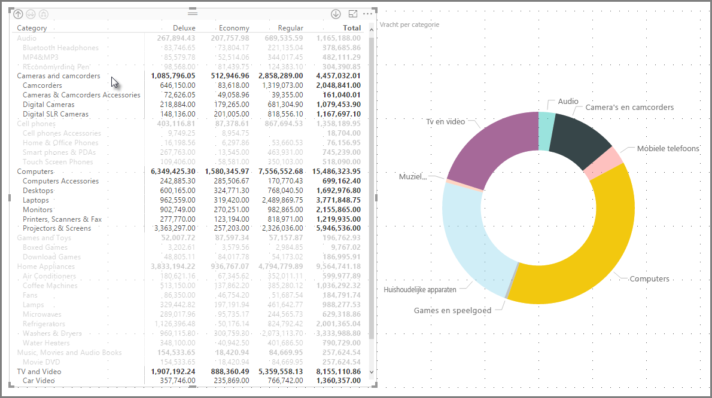

Er zijn veel functies gekoppeld aan de matrix, en in de volgende secties van dit artikel gaan we die behandelen.

> [!NOTE]
> Vanaf de release van juli 2017 van **Power BI Desktop**, worden in matrix- en tabelvisualisaties de stijlen (inclusief kleuren) van het toegepaste **Rapportthema** gebruikt. Dit zijn mogelijk niet de verwachte kleuren voor uw matrixvisualisatie; u kunt ze wijzigen in de **Rapportthema**-configuratie. Zie [ **Rapportthema's gebruiken in Power BI Desktop** ](desktop-report-themes.md) voor meer informatie over thema's.
> 
> 

## Begrijpen hoe Power BI totalen berekent

Voordat u leert hoe u de **Matrix**-visual gebruikt, is het belangrijk om te begrijpen hoe Power BI totale en subtotale waarden in tabellen en matrices berekent. In het geval van totale en subtotale rijen wordt de meting over alle rijen in de onderliggende data geëvalueerd. Het is *geen* eenvoudige optelsom van de waarden in de zichtbare of weergegeven rijen. Dit betekent dat u in de totaalrij andere waarden kunt krijgen dan u had verwacht. 

Bekijk de volgende **Matrix**-visuals. 

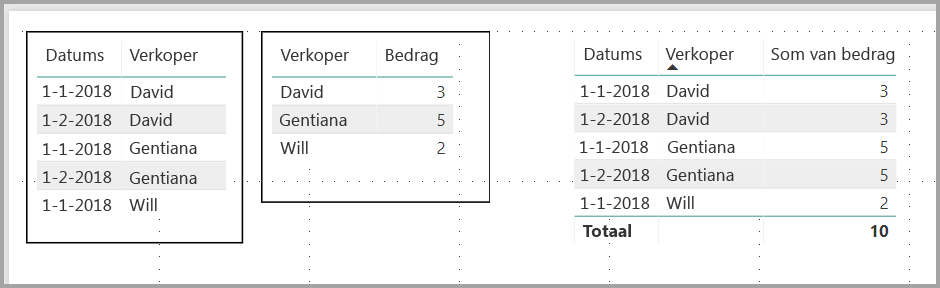

In dit voorbeeld geven alle rijen uiterst rechts in de **Matrix**-visual het *Bedrag* weer van elke combinatie van een verkoper/datum. Maar omdat een verkoper in meerdere datums verschijnt kunnen de getallen vaker dan één keer worden weergegeven. Het accurate totaal van de onderliggende gegevens en de eenvoudige optelsom van de zichtbare waarden komen daarom niet overeen. Dit is een algemeen patroon wanneer de waarde die u optelt de één is in een één-op-veelrelatie.

Als u naar de totalen en subtotalen kijkt, moet u onthouden dat die waarden zijn gebaseerd op de onderliggende gegevens en niet enkel op de zichtbare waarden. 

## Inzoomen gebruiken met de Matrix-visualisatie
Met de **Matrix**-visualisatie, kunt u allerlei interessante zoomactiviteiten uitvoeren die vroeger niet beschikbaar waren. Eén hiervan is de mogelijkheid om in te zoomen met behulp van rijen, kolommen en zelfs op afzonderlijke secties en cellen. Laten we eens kijken hoe dat werkt.

### Inzoomen op rijkoppen
Wanneer u in het deelvenster **Visualisaties** meerdere velden toevoeg in de sectie **Rijen** van de **Velden**-put, maakt u het mogelijk in te zoomen op de rijen van de matrixvisualisatie. Dit is vergelijkbaar met het maken van een hiërarchie, die het vervolgens mogelijk maakt in te zoomen op die hiërarchie (en weer terug te gaan) en de gegevens op elk niveau te analyseren.

In de volgende afbeelding bevat de sectie **Rijen** *Categorie* en *Subcategorie*, waardoor een groepering (of hiërarchie) wordt gemaakt in de rijen waarop we kunnen inzoomen.

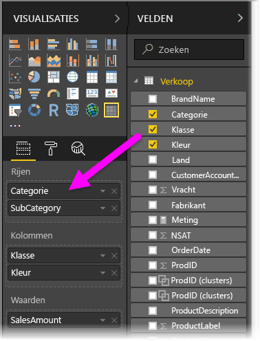

Wanneer in de visualisatie een groepering is gemaakt in de sectie **Rijen**, worden in de linkerbovenhoek van de visualisatie zelf de pictogrammen *Inzoomen* en *Uitvouwen* weergegeven.

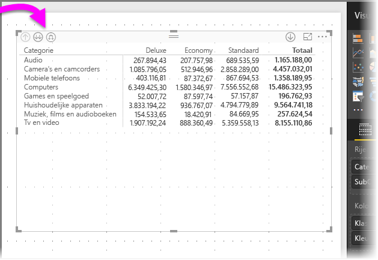

Net als bij het zoom- en uitvouwgedrag in andere visualisaties, kunnen we met die knoppen inzoomen op (of teruggaan door) de hiërarchie. In dit geval kunnen we vanuit *Categorie* inzoomen op *Subcategorie*, zoals getoond in de volgende afbeelding, waar het pictogram voor één niveau inzoomen (de hooivork) is geselecteerd.

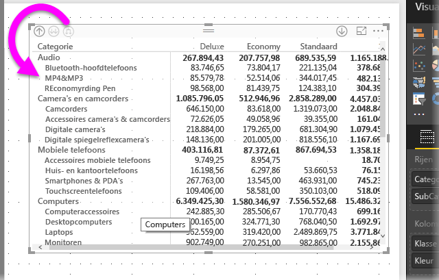

U kunt niet alleen die pictogrammen gebruiken, maar ook met de rechtermuisknop op de rijkoppen klikken en inzoomen door een keuze te maken in het weergegeven menu.

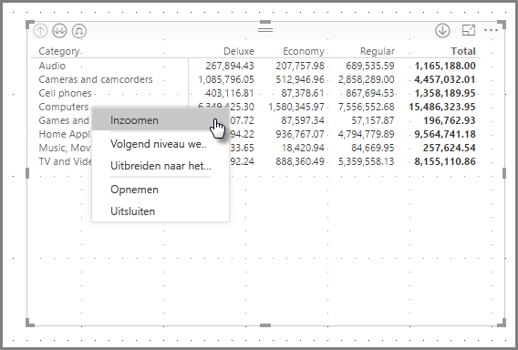

Er zijn een aantal opties in het menu dat verschijnt die verschillende resultaten genereren:

Door **Inzoomen** te selecteren wordt de matrix voor *dat* rijniveau uitgevouwen; alle andere rijkoppen worden *uitgesloten*, behalve de rijkop waarop u met de rechtermuisknop hebt geklikt. In de volgende afbeelding is met de rechtermuisknop op *Computers* geklikt en **Inzoomen** geselecteerd. U ziet dat andere rijen op het hoogste niveau niet meer in de matrix worden weergegeven. Dit is een handige functie, zoals u met name zult zin in de sectie over **kruislings markeren**.

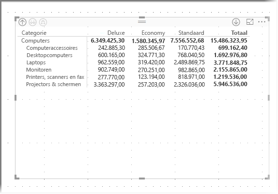

We kunnen op het pictogram **Uitzoomen** klikken om terug te gaan naar de vorige weergave op het hoogste niveau. Als we vervolgens **Volgende niveau weergeven** selecteren in het contextmenu, krijgen we een alfabetische lijst met alle itemselecties op het volgende niveau (in dit geval het veld *Subcategorie*), zonder de hiërarchiecategorisering op het hogere niveau.

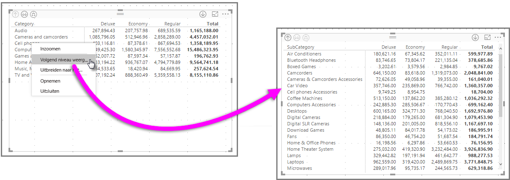

Wanneer we op het pictogram **Uitzoomen** in de linkerbovenhoek klikken om alle categorieën op het hoogste niveau weer te geven in de matrix, en vervolgens nogmaals met de rechtermuisknop klikken en **Uitbreiden naar het volgende niveau** kiezen, zien we het volgende:

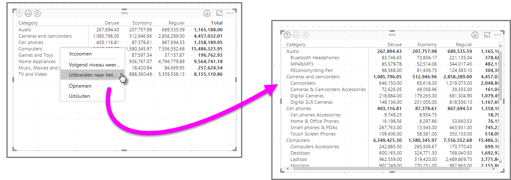

U kunt ook de menu-items **Opnemen** en **Uitsluiten** gebruiken om de rij waarop u met de rechtermuisknop klikt (en eventuele subcategorieën) in de matrix te behouden respectievelijk eruit te verwijderen.

### Inzoomen op kolomkoppen
Vergelijkbaar met de mogelijkheid om in te zoomen op rijen, kunt u ook inzoomen op **kolommen**. In de volgende afbeelding ziet u dat er twee velden in de veldenput **Kolommen** zijn, waardoor een hiërarchie ontstaat die vergelijkbaar is met degene die we eerder in dit artikel voor de rijen hebben gebruikt. De veldenput **Kolommen** bevat *Klasse* en *Kleur*.

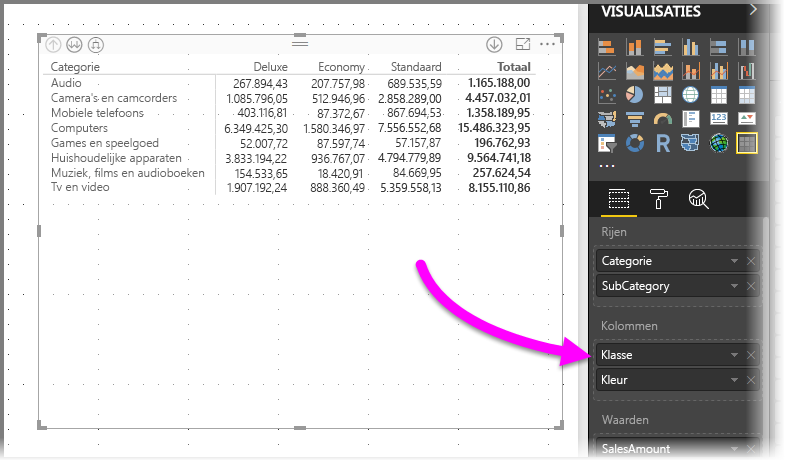

Wanneer we in de visualisatie **Matrix** met de rechtermuisknop op een kolom klikken, zien we de optie om in te zoomen. In de volgende afbeelding klikken we met de rechtermuisknop op *Deluxe* en selecteren **Inzoomen**.

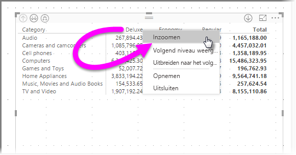

Wanneer **Inzoomen**  wordt geselecteerd, wordt het volgende niveau van de kolomhiërarchie voor *Deluxe* weergegeven, in dit geval *Kleur*.

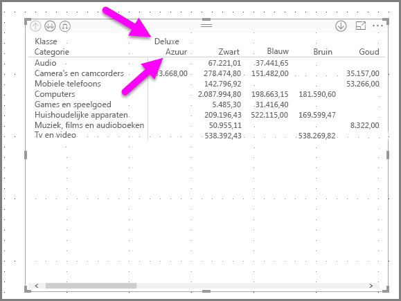

De rest van de menu-items in het contextmenu werken op kolommen op dezelfde manier als op rijen (Zie de vorige sectie **Inzoomen op rijkoppen**). U kunt het **Volgende niveau weergeven**, **Uitbreiden naar het volgende niveau**, en kolommen **Opnemen** of **Uitsluiten**, net als met rijen.

> [!NOTE]
> De pictogrammen voor in- en uitzoomen linksboven in de matrixvisualisatie zijn alleen van toepassing op rijen. Als u wilt inzoomen op kolommen, moet u het contextmenu gebruiken.
> 
> 

## Getrapte indeling met matrixvisualisatie
In de **Matrix**-visualisatie worden de subcategorieën automatisch ingesprongen in een hiërarchie onder elk bovenliggend item; dit wordt een **getrapte lay-out** genoemd.

In de *oorspronkelijke* versie van de matrixvisualisatie werden subcategorieën weergegeven in een geheel andere kolom, wat veel meer ruimte kostte in de visualisatie. De volgende afbeelding toont de tabel in oorspronkelijke **matrix**visualisatie; u ziet dat de subcategorieën in een afzonderlijke kolom staan.

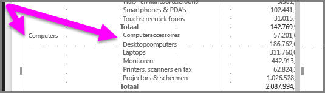

In de volgende afbeelding ziet u een **Matrix**-visualisatie met **getrapte lay-out** in actie. U ziet dat de categorie *Computers* subcategorieën heeft (Computeraccessoires, Desktops, Laptops, Monitors, enzovoort) die enigszins zijn ingesprongen, waardoor de visualisatie er netter en veel compacter uitziet.

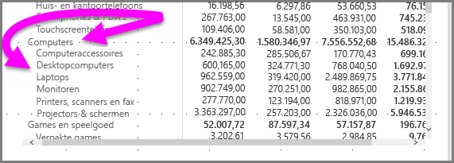

U kunt de instellingen van de **getrapte lay-out** gemakkelijk aanpassen. Selecteer de **Matrix**-visualisatie en vouw in de sectie **Opmaak** (verfrollerpictogram) van het deelvenster **Visualisaties** de sectie **Rijkoppen** uit. Er zijn twee opties: de wisselknop **Getrapte lay-out** (waarmee u dit in- of uitschakelt), en de **Inspringing voor getrapte lay-out** (hiermee geeft u het aantal ingesprongen pixels op).

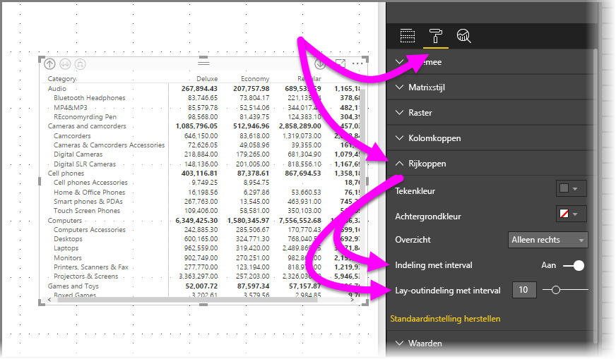

Als u **Getrapte lay-out** uitschakelt, worden de subcategorieën weergegeven in een aparte kolom in plaats van ingesprongen onder de bovenliggende categorie.

## Subtotalen met matrixvisualisaties
U kunt subtotalen in- of uitschakelen in matrixvisualisaties, zowel voor rijen als kolommen. In de volgende afbeelding ziet u dat de rijsubtotalen zijn ingesteld op **aan**.

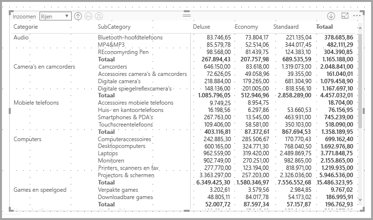

Vouw in de sectie **Opmaak** van het deelvenster **Visualisaties** de kaart **Subtotalen** uit en zet de schuifknop **Rijsubtotalen** op **Uit**. Wanneer u dit doet, worden de subtotalen niet weergegeven.

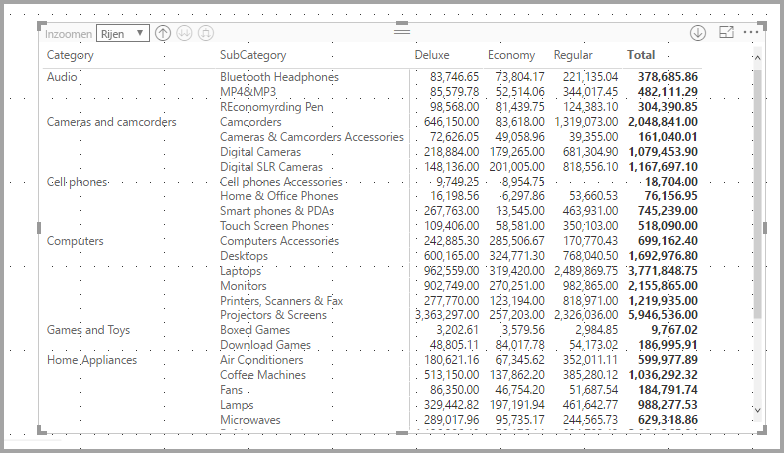

Hetzelfde geldt voor de kolomsubtotalen.

## Kruislings markeren met matrixvisualisaties
Met de **Matrix**-visualisatie kan elk element in de matrix worden geselecteerd als de basis voor kruislings markeren. Selecteer een kolom in een **Matrix**, en die kolom wordt gemarkeerd, net als andere visualisaties op de rapportpagina. Dit was al een algemene functie van andere visualisaties en de selectie van een gegevenspunt, en nu kan de **Matrix**-visualisatie hieraan deelnemen.

Bovendien werkt Ctrl+klikken ook voor kruislings markeren. In de volgende afbeelding is bijvoorbeeld een verzameling subcategorieën geselecteerd in de **Matrix**visualisatie. U ziet dat items die niet in de visualisatie zijn geselecteerd, lichter zijn gekleurd, en dat de in de **Matrix**-visualisatie gemaakte selecties worden weerspiegeld in de andere visualisaties op de pagina.

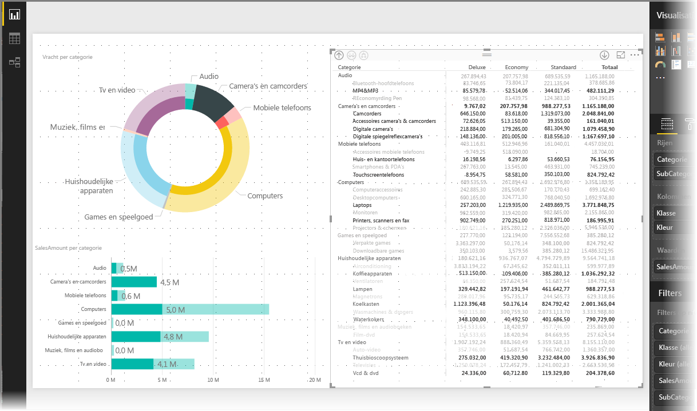

## Arcering en tekstkleuren met matrixvisualisaties
Met de **Matrix**-visualisatie kunt u **voorwaardelijke opmaak** (kleuren en arcering) toepassen op de achtergrond van cellen in de matrix en op de tekst en waarden zelf.

Als u voorwaardelijke opmaak wilt toepassen, kunt u het volgende doen als er een matrixvisualisatie is geselecteerd:

* Klik in het deelvenster **Velden** met de rechtermuisknop op het veld en selecteer **Voorwaardelijke opmaak** in het menu.
  
  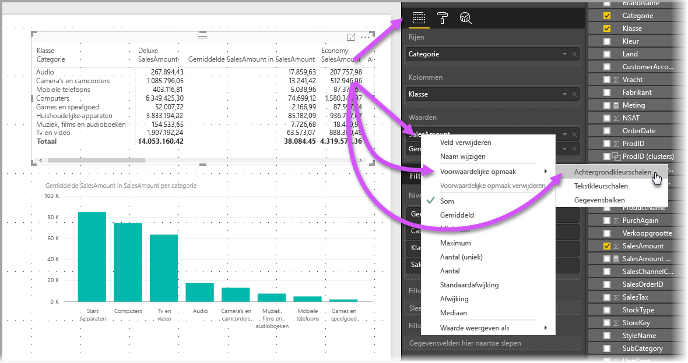
* Of vouw in het deelvenster **Opmaak** de kaart **Voorwaardelijke opmaak** uit en zet de schuifknop van **Achtergrondkleurschalen** of **Tekstkleurschalen** op **Aan**. Door een van deze in te schakelen wordt een koppeling weergegeven naar *Geavanceerde besturingselementen*, waarmee u de kleuren en waarden voor de kleurenopmaak kunt aanpassen.
  
  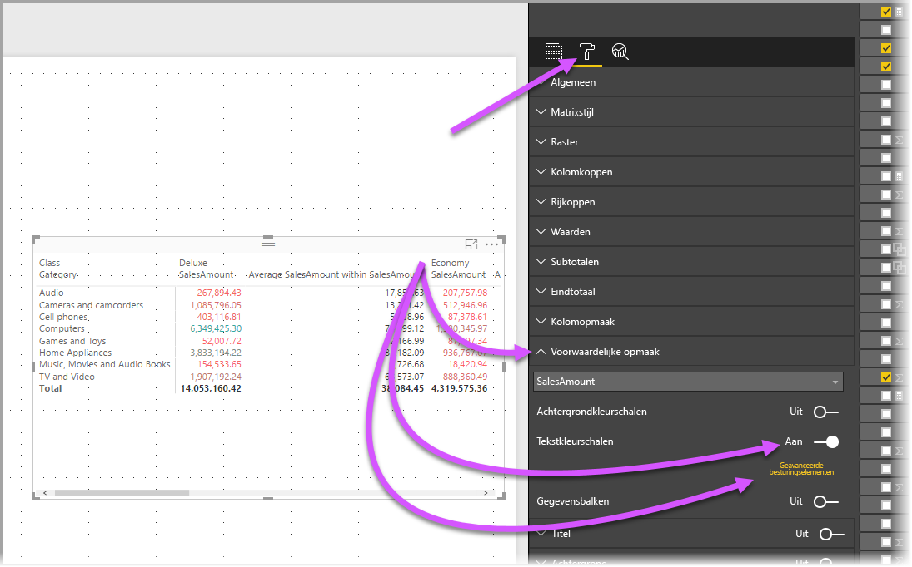

Beide benaderingen geven hetzelfde resultaat. Door *Geavanceerde besturingselementen* te selecteren wordt het volgende dialoogvenster weergegeven, waarin u aanpassingen kunt doen:

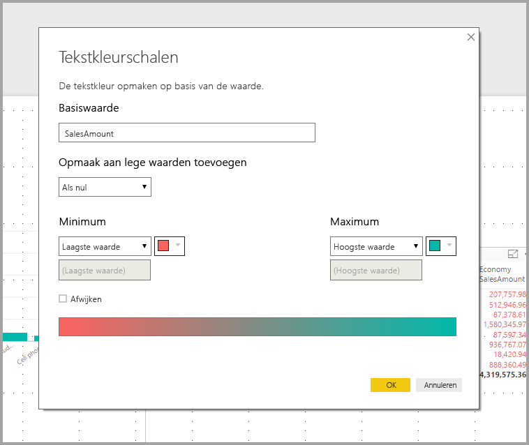

## Volgende stappen

Wellicht bent u geïnteresseerd in de volgende artikelen:

* [Rasterlijnen en Uitlijnen op raster gebruiken in Power BI Desktop-rapporten](desktop-gridlines-snap-to-grid.md)
* [Gegevensbronnen in Power BI Desktop](desktop-data-sources.md)
* [Gegevenstypen in Power BI Desktop](desktop-data-types.md)

 