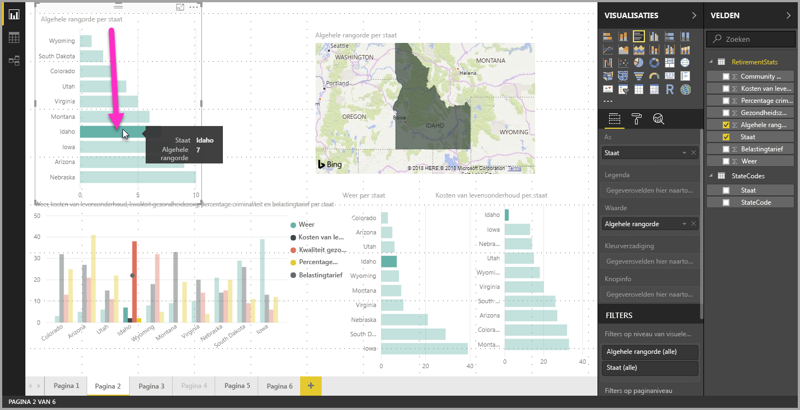
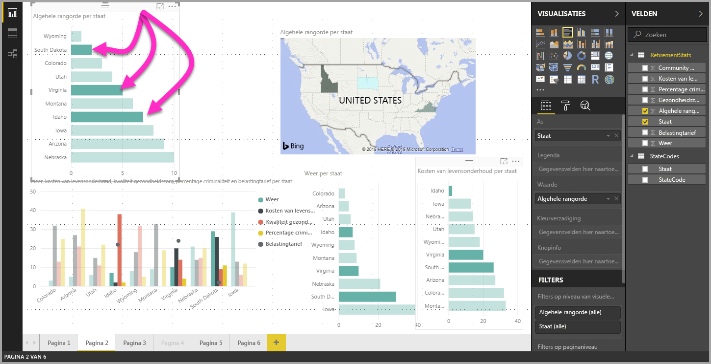

# Meerdere gegevenselementen in visuals selecteren met behulp van Power BI Desktop

In **Power BI Desktop** kunt u een gegevenspunt in een visual markeren door op het gegevenspunt in de visual te klikken. Bijvoorbeeld als u een belangrijke balk of een belangrijk grafiekelement hebt en u wilt dat andere visuals op de rapportpagina gegevens markeren op basis van uw selectie. Dan kunt u op het gegevenselement in één visual klikken, waarna de resultaten in andere visuals op de pagina worden weergegeven. Dit is markering met standaardselectie, oftewel enkelvoudige selectie. De volgende afbeelding toont een standaardselectie. 

Met meervoudige selectie kunt u nu meer dan één gegevenspunt selecteren op uw **Power BI Desktop**-rapportpagina en de resultaten markeren in alle visuals op de pagina. Dit is vergelijkbaar met een **en**-instructie, of -functionaliteit, zoals 'resultaten markeren voor Idaho **en** Virginia'. Voor meervoudige selectie van gegevenspunten in visuals gebruikt u **CTRL + klik** om meerdere gegevenspunten te selecteren. Op de volgende afbeelding ziet u dat er **meerdere gegevenspunten** zijn geselecteerd (meervoudige selectie).

Deze functie lijkt misschien eenvoudig, maar biedt wel allerlei mogelijkheden voor het maken en delen van rapporten en voor interactie met rapporten. 

## Volgende stappen

Wellicht bent u ook geïnteresseerd in de volgende artikelen:

* [Rasterlijnen en Uitlijnen op raster gebruiken in Power BI Desktop-rapporten](desktop-gridlines-snap-to-grid.md)
* [Over filters en markeren in Power BI-rapporten](power-bi-reports-filters-and-highlighting.md)

