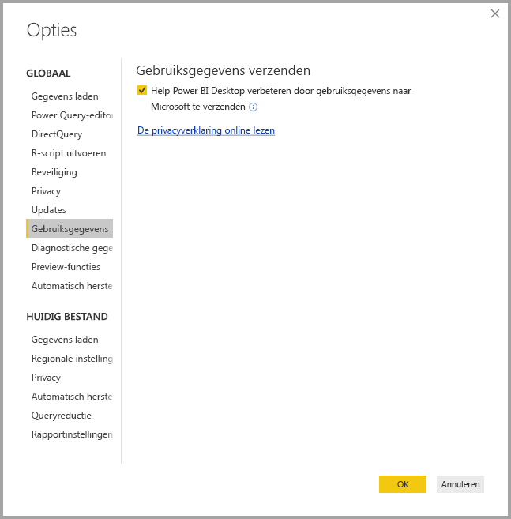
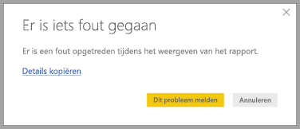

# Privacy in Power BI Desktop

Bij Microsoft werken we er hard aan om uw privacy te beschermen bij het leveren van producten die u de prestaties, het vermogen en het gebruiksgemak bieden die u nodig hebt. Microsoft verzamelt bepaalde informatie over uw gebruik van Power BI Desktop, zodat problemen kunnen worden geanalyseerd en het product kan worden verbeterd. Raadpleeg de privacyverklaring van Microsoft voor meer informatie over het privacybeleid van Microsoft. Dit is van toepassing op de gegevens die worden verzameld over uw gebruik van **Power BI Desktop**.
 
De informatie die we over **Power BI Desktop**-gebruikers verzamelen, kunnen bijvoorbeeld gegevens over het besturingssysteem, Power BI Desktop-gegevens en Internet Explorer-versies zijn. 
 
Als u niet wilt dat deze gegevens over uw gebruik worden verzameld, gaat u naar **Bestand > Opties en Instellingen > Opties** en schakelt u op het tabblad **Gebruiksgegevens** het selectievakje **Gebruiksgegevens verzenden** uit, zoals in de volgende afbeelding wordt weergegeven.

## Aanvullende informatie verzenden

Als het systeem vastloopt of u andere problemen ondervindt, kunt u foutrapporten en aanvullende informatie laten verzenden. Op die manier kunnen we er met uw hulp voor zorgen dat het probleem zich mogelijk niet meer voordoet in een toekomstige release. We verzamelen ook informatie over de status van het **Power BI Desktop**-bestand waaraan u hebt gewerkt, zoals de landinstelling van het document, de preview-functies die zijn ingeschakeld en de opslagmodus. Dit kunnen bijvoorbeeld schermafbeeldingen, foutberichten en formules uit het model zijn. Deze items kunnen de inhoud bevatten van bestanden die u gebruikte terwijl er een fout optrad. U moet deze daarom controleren voordat u deze verzendt. We willen u eraan herinneren dat u kunt kiezen welke informatie naar Microsoft wordt verzonden.  
 
Als u niet wilt dat deze gegevens worden verzonden, kunt u op **Sluiten** klikken wanneer er een fout optreedt. U kunt zich ook afmelden voor het verzenden van gebruiksgegevens, zoals hierboven is uitgelegd. 

