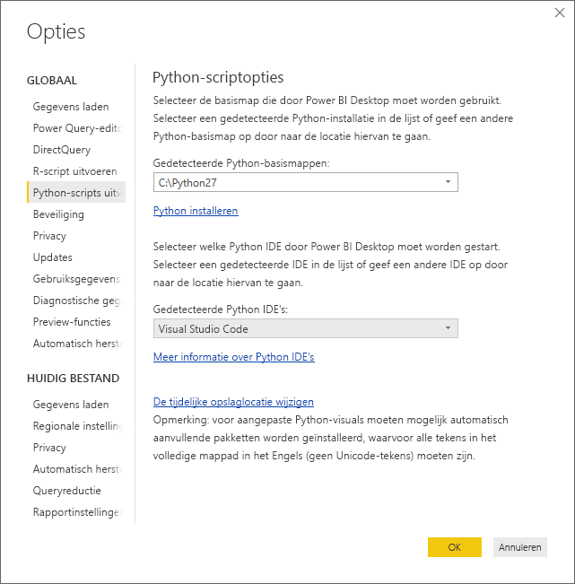
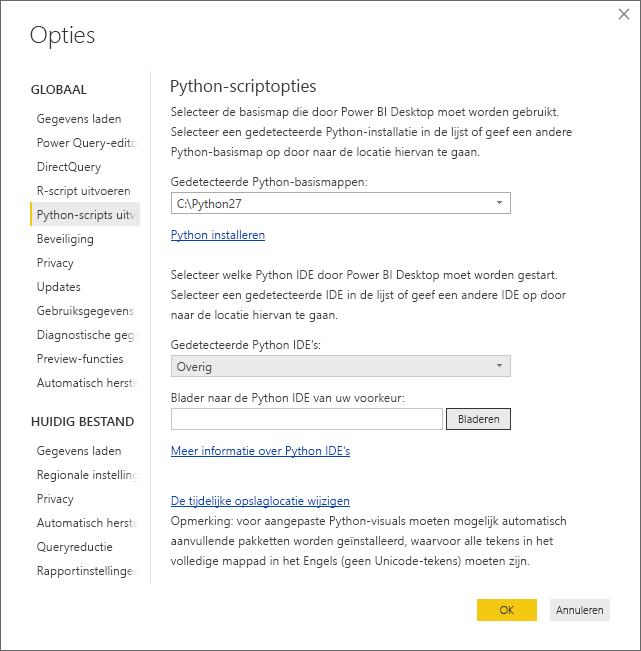
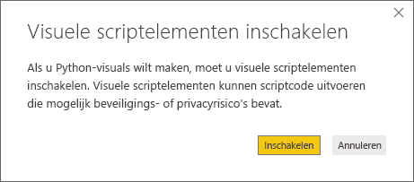
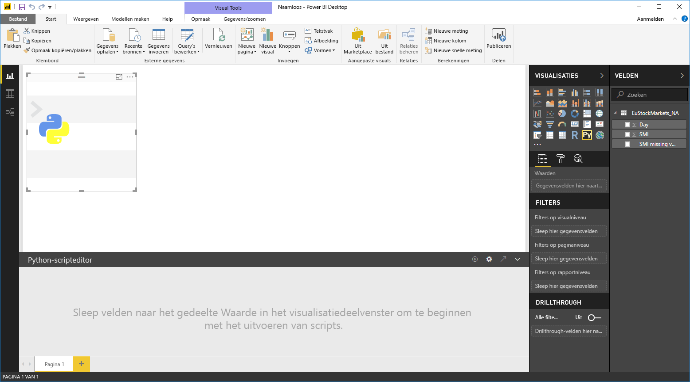
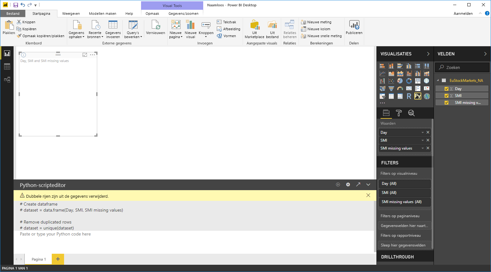
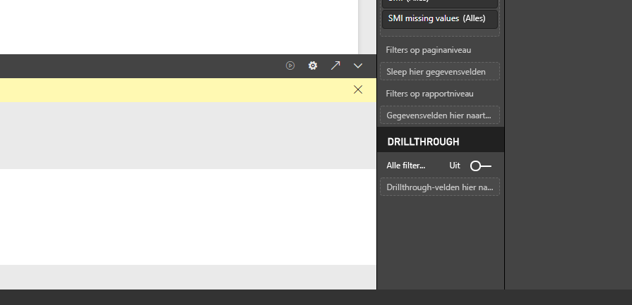
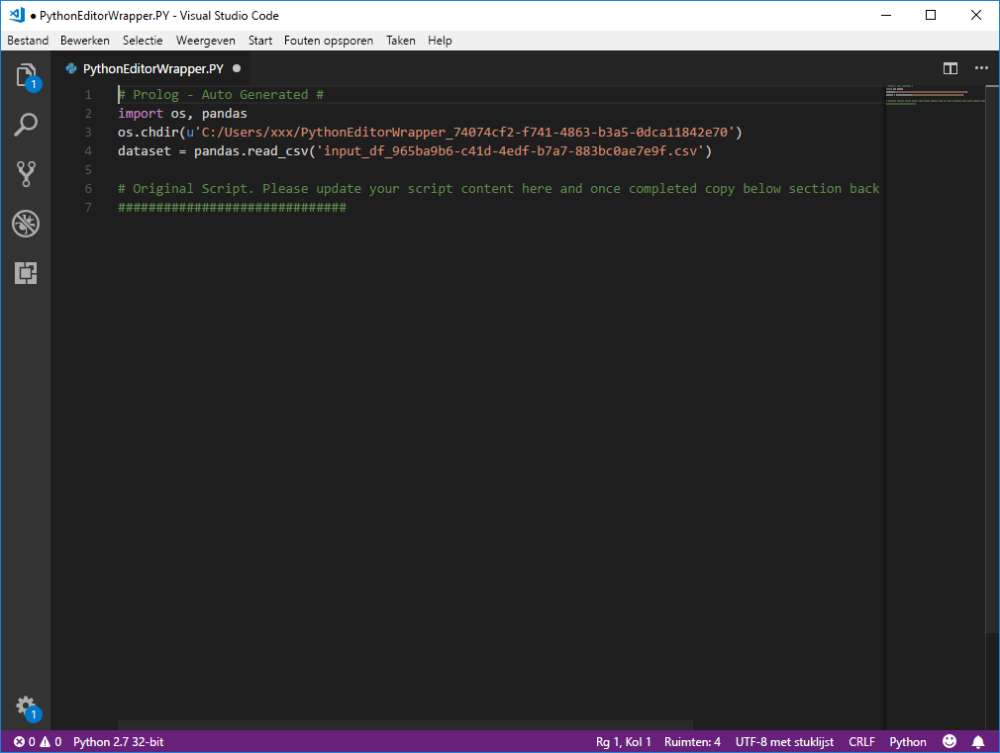

# Een externe Python IDE met Power BI gebruiken
Met **Power BI Desktop** kunt u uw externe Python IDE (Integrated Development Environment) gebruiken om Python-scripts te maken en verfijnen, en deze scripts vervolgens gebruiken in Power BI.

## Een externe Python IDE inschakelen
U kunt uw externe Python IDE starten vanuit **Power BI Desktop** en uw gegevens automatisch laten importeren en weergeven in de Python IDE. Van daaruit kunt u het script in die externe Python IDE wijzigen en het script vervolgens weer in **Power BI Desktop** plakken om visuals en rapporten voor Power BI te maken.

U kunt opgeven welke Python IDE u wilt gebruiken en deze automatisch laten starten vanuit **Power BI Desktop**.

### Vereisten
Als u deze functie wilt gebruiken, moet u een **Python IDE** op uw lokale computer installeren. **Power BI Desktop** zorgt niet voor het opnemen, implementeren of installeren van de Python-engine. Daarom moet u **Python** afzonderlijk installeren op uw lokale computer. U kunt kiezen welke Python IDE u wilt gebruiken, met de volgende opties:

* U kunt uw favoriete Python IDE installeren. Veel daarvan zijn gratis verkrijgbaar, zoals de [Visual Studio Code-downloadpagina](https://code.visualstudio.com/download/).
* **Power BI Desktop** biedt ook ondersteuning voor **Visual Studio**.
* U kunt ook een andere Python IDE installeren en **Power BI Desktop** die **Python IDE** op een van de volgende manieren laten starten:
  
  * U kunt **.PY**-bestanden koppelen aan de externe IDE die **Power BI Desktop** moet starten.
  * U kunt opgeven welke .exe **Power BI Desktop** moet starten door *Overige* te selecteren in de sectie **Opties voor Python-script** in het dialoogvenster **Opties**. U kunt het dialoogvenster **Opties** openen met **Bestand > Opties en instellingen > Opties**.
    
    

Als u meerdere Python IDE’s hebt geïnstalleerd, kunt u opgeven welke daarvan wordt gestart door de gewenste R IDE selecteren in de vervolgkeuzelijst *Gedetecteerde Python IDE's* in het dialoogvenster **Opties**.

De standaardinstelling is dat **Power BI Desktop** **Visual Studio Code** start als externe Python IDE als deze op uw lokale computer is geïnstalleerd. Als **Visual Studio Code** niet is geïnstalleerd en u **Visual Studio** hebt, wordt dit hulpprogramma gestart. Als geen van deze Python IDE’s is geïnstalleerd, wordt de toepassing gestart die gekoppeld is aan **.PY**-bestanden.

En als er geen **.PY**-bestandskoppeling bestaat, kunt u ook een pad opgeven naar een aangepaste IDE in de sectie *Blader naar de Python IDE van uw voorkeur* van het dialoogvenster **Opties**. U kunt ook een andere Python IDE starten door in **Power BI Desktop** het tandwielpictogram **Instellingen** naast de pijl **Python IDE starten** te selecteren.

## Een Python IDE starten vanuit Power BI Desktop
U kunt als volgt een Python IDE starten vanuit **Power BI Desktop**:

1. Laad gegevens in **Power BI Desktop**.
2. Selecteer in het deelvenster **Velden** enkele velden waarmee u wilt werken. Als u nog geen scriptelementen hebt ingeschakeld, wordt u gevraagd dat alsnog te doen.
   
   
3. Wanneer scriptelementen zijn ingeschakeld, kunt u een Python-visual selecteren in het deelvenster **Visualisaties**, waarmee een lege Python-visual wordt gemaakt die geschikt is om de resultaten van uw script weer te geven. Ook het deelvenster **Python-scripteditor** wordt weergegeven.
   
   
4. U kunt nu de velden selecteren die u in uw Python-script wilt gebruiken. Wanneer u een veld selecteert, maakt het veld **Python-scripteditor** automatisch een scriptcode op basis van het veld of de velden die u selecteert. U kunt het Python-script rechtstreeks in het deelvenster **Python-scripteditor** maken (of plakken) of het deelvenster leeg laten.
   
   
   
   > [!NOTE]
   > Het standaardtype voor aggregatie voor Python-visuals is *niet samenvatten*.
   > 
   > 
5. U kunt nu uw Python IDE rechtstreeks vanuit **Power BI Desktop** starten. Selecteer de knop **Python IDE starten** rechts van de titelbalk van **Python-scripteditor**, zoals hieronder wordt weergegeven.
   
   
6. De opgegeven Python IDE wordt gestart door Power BI Desktop, zoals wordt weergegeven in de volgende afbeelding (in deze afbeelding is **Visual Studio Code** de standaard Python IDE).
   
   
   
   > [!NOTE]
   > **Power BI Desktop** voegt de eerste drie regels van het script toe zodat uw gegevens kunnen worden geïmporteerd uit **Power BI Desktop** zodra u het script uitvoert.
   > 
   > 
7. Een script dat u hebt gemaakt in het **Python-scripteditor-venster** van **Power BI Desktop** wordt gestart op regel 4 in uw Python IDE. Op dat punt kunt u uw Python-script in de Python IDE maken. Nadat uw Python-script is voltooid in de Python IDE, moet u het script terug kopiëren naar het deelvenster **Python-scripteditor** van **Power BI Desktop**, *met uitzondering van* de eerste drie regels van het script dat **Power BI Desktop** automatisch heeft gegenereerd. Kopieer niet de eerste drie regels van het script terug naar **Power BI Desktop**. Deze regels zijn alleen gebruikt voor het importeren van uw gegevens naar uw Python IDE vanuit **Power BI Desktop**.

### Bekende beperkingen
Het starten van een Python IDE rechtstreeks vanuit Power BI Desktop heeft enkele beperkingen:

* Automatisch exporteren van het script vanuit uw Python IDE naar **Power BI Desktop** wordt niet ondersteund.

## Volgende stappen
Raadpleeg de volgende aanvullende informatie over Python in Power BI.

* [Python-scripts uitvoeren in Power BI Desktop](desktop-python-scripts.md)
* [Power BI-visuals maken met Python](desktop-python-visuals.md)

