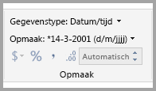
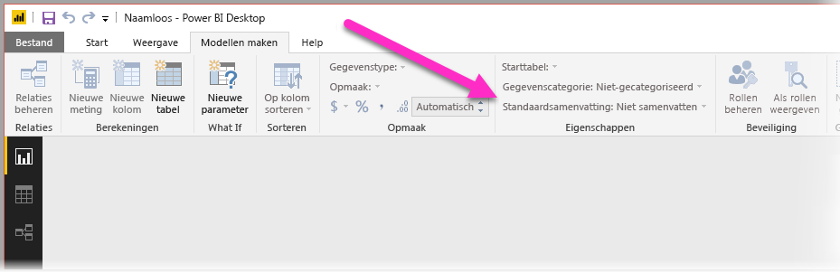
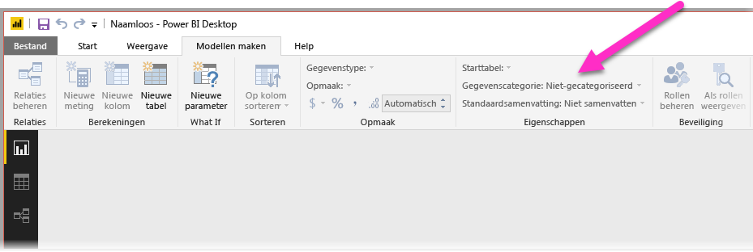
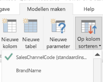
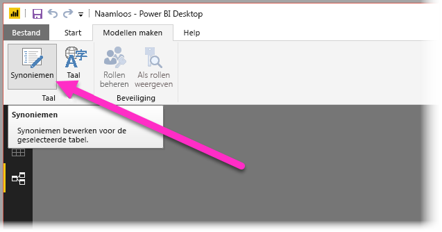
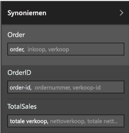

# Q&A in Power BI Desktop gebruiken voor query's met natuurlijke taal
Normale zinnen en natuurlijke taal gebruiken om informatie uit uw gegevens te kunnen opvragen, is uiterst nuttig. Nog nuttiger is het wanneer uw gegevens antwoorden. Dit is wat u voor elkaar kunt krijgen met Q&A in **Power BI Desktop**.

Als u met Q&A het grote aantal vragen wilt interpreteren waarop de functie kan reageren, moet u met Q&A veronderstellingen over het model maken. Als de structuur van uw model niet voldoet aan een of meer van deze veronderstellingen, moet u het model aanpassen. Voor deze aanpassingen voor Q&A gebruikt u voor elk model in Power BI dezelfde optimalisaties voor aanbevolen procedures, ongeacht of u Q&A gebruikt. 

> [!NOTE]
> Q&A is alleen beschikbaar wanneer u met een model werkt dat **geïmporteerde** gegevens bevat. Liveverbindingen met SSAS- en DirectQuery-modellen worden niet ondersteund.
>
>

> [!NOTE]
> Voor Q&A is de volgende update van C Runtime vereist als u een eerdere Windows-versie dan Windows 10 gebruikt. Installeer belangrijke updates via Windows Update of installeer het vereiste Microsoft-onderdeel handmatig (KB2999226) om het probleem op te lossen. https://support.microsoft.com/en-us/help/2999226/update-for-universal-c-runtime-in-windows
>
>

In de volgende secties wordt beschreven hoe u uw model aanpast zodat dit goed samenwerkt met Q&A in Power BI.

## Ontbrekende relaties toevoegen

Als in uw model relaties tussen tabellen ontbreken, kunt u noch met Power BI-rapporten noch met Q&A interpreteren hoe deze tabellen moeten worden samengevoegd als u er een vraag over stelt. Relaties vormen de basis van een goed model. U kunt bijvoorbeeld geen vragen stellen over de 'totale verkoop voor klanten in Amsterdam' als de relatie tussen de tabel *bestellingen* en de tabel *klanten* ontbreekt. In de volgende afbeeldingen ziet u voorbeelden van een model waarvoor nog actie is vereist en een model dat gereed is voor Q&A.

**Actie vereist**

**Gereed voor Q&A**

## De naam van tabellen en kolommen wijzigen

De keuze van tabellen en kolommen is erg belangrijk voor Q&A. Als u bijvoorbeeld een tabel hebt met de naam *KlantenOverzicht* die een lijst van uw klanten bevat, moet u vragen stellen als 'Maak een lijst van klantoverzichten in Chicago' in plaats van 'Maak een lijst van klanten in Chicago'. 

Met Q&A kunt u enkele eenvoudige analyses van woorden en detectie van meervouden uitvoeren. Q&A gaat echter ervan uit dat uw tabel- en kolomnamen een goed beeld vormen van de inhoud ervan.

Kijk nu eens naar een ander voorbeeld. Stel, u hebt een tabel met de naam *Personeelsbezetting* die de voor- en achternamen en het aantal werknemers bevat. Daarnaast hebt u een andere tabel met de naam *Werknemers* die het aantal werknemers, het aantal functies en de begindatums bevat. Dit vormt weliswaar geen problemen voor mensen die bekend zijn met het model, maar als iemand vraagt 'tel het aantal werknemers', krijgt deze persoon mogelijk een optelsom van de rijen van de tabel 'Werknemers' en waarschijnlijk niet de gewenste gegevens omdat dit een optelsom vormt van elke functie die elke werknemer ooit heeft gehad. Het is beter om de naam van de tabellen te wijzigen zodat deze de gegevens weergeven die ze daadwerkelijk bevatten.

**Actie vereist**

**Gereed voor Q&A**

## Onjuiste gegevenstypen corrigeren

Geïmporteerde gegevens kunnen ongeldige gegevenstypen hebben. Met name kolommen met *datum* en *aantal* die worden geïmporteerd als *reeksen*, worden niet door Q&A geïnterpreteerd als datums en aantallen. Zorg ervoor dat u het juiste gegevenstype selecteert in uw Power BI-model.

## Jaar- en id-kolommen markeren als Niet samenvatten

Power BI aggregeert numerieke kolommen standaard op agressieve wijze, zodat vragen als 'totale verkoop per jaar' soms kan resulteren in zowel een totaal van verkopen als een totaal van jaren. Als u specifieke kolommen hebt waarin u niet wilt dat Power BI dit gedrag vertoont, stelt u de eigenschap **Samenvatten op** van de kolom in op **Niet samenvatten**. Let goed op met kolommen voor **jaar**, **maand**, **dag** en **Id**, aangezien deze kolommen het vaakst problemen opleveren. Ook voor andere kolommen met gegevens die minder gevoelig zijn voor optellen, zoals *leeftijd*, kan het gunstig zijn om **Samenvatten op** in te stellen op **Niet samenvatten** of **Gemiddeld**. U vindt deze instelling op het tabblad **Modelleren**.

## Een gegevenscategorie kiezen voor elke datum- en geografiekolom

De **gegevenscategorie** biedt aanvullende semantische kennis over de inhoud van een kolom afgezien van het gegevenstype. Een kolom met gehele getallen kan bijvoorbeeld worden gemarkeerd als een postcode, terwijl een tekenreekskolom kan worden gemarkeerd als een stad, land, regio enzovoort. Deze informatie wordt door Q&A op twee belangrijke manieren gebruikt: voor de selectie van visualisaties en voor de taalafwijkingen.

Ten eerste gebruikt Q&A de informatie in de **gegevenscategorie** om te bepalen op welke manier de visuals moeten worden weergegeven. De functie herkent bijvoorbeeld dat kolommen met de **gegevenscategorieën** voor datum of tijd meestal een goede keuze vormen voor de horizontale as van een lijndiagram of de afspeelas van een bellendiagram. De functie gaat tevens ervan uit dat resultaten met kolommen met geografische **gegevenscategorieën** op een kaart goed overkomen.

Ten tweede kan met Q&A redelijk goed worden ingeschat hoe gebruikers waarschijnlijk zullen praten over datum- en geografiekolommen. Hierdoor kan de functie bepaalde soorten vragen beter begrijpen. Bijvoorbeeld het woord 'wanneer' in de vraag 'Wanneer is Jan Smit in dienst gekomen?' kan bijna zeker worden toegewezen aan een datumkolom en het woord 'Brown' in 'Aantal klanten in Brown' slaat waarschijnlijk op de Amerikaanse plaats Brown, in plaats van op een haarkleur.

## De optie Op kolom sorteren kiezen voor relevante kolommen

Met de eigenschap **Op kolom sorteren** kunt u sorteren op één kolom, zodat in plaats daarvan automatisch op een andere kolom kan worden gesorteerd. Wanneer u bijvoorbeeld vraagt 'klanten sorteren op overhemdgrootte', wilt u waarschijnlijk uw kolom Overhemdgrootte sorteren op de onderliggende grootten (XS, S, M, L, XL) in plaats van alfabetisch (L, M, S, XL, XS).

## Het model normaliseren

Schrik niet, dit betekent niet dat u uw gehele model moet aanpassen. Er zijn echter bepaalde structuren die gewoon zo moeilijk zijn dat Q&A hier niet goed mee overweg kan. Als u eenvoudige normalisering uitvoert op de structuur van uw model, neemt de bruikbaarheid van Power BI-rapporten aanzienlijk toe, evenals de resultaten van Q&A.

Houd de volgende regel in het achterhoofd: elk uniek 'ding' waarover de gebruiker spreekt, moet worden voorgesteld door één exact modelobject (tabel of kolom). Als uw gebruikers over klanten communiceren, moet er dus slechts één object *Klant* zijn. Als uw gebruikers over verkoop communiceren, moet er dus slechts één object *Verkoop*  zijn. Klinkt eenvoudig, of niet? Afhankelijk van de vorm van de gegevens waarmee u begint, kan het inderdaad eenvoudig zijn. In **Query-editor** zijn uitgebreide mogelijkheden beschikbaar voor het vormgeven van gegevens. Voor eenvoudigere transformaties kunt u berekeningen gebruiken in het Power BI-model.

De volgende secties bevatten enkele algemene transformaties die u kunt uitvoeren.

### Nieuwe tabellen maken voor entiteiten met meerdere kolommen

Als u meerdere kolommen hebt die als een afzonderlijke eenheid binnen een grotere tabel fungeren, moeten deze kolommen worden opgesplitst in hun eigen tabel. Als u binnen uw tabel *Bedrijven* bijvoorbeeld een kolom hebt met Naam contactpersoon, Titel contactpersoon en Telefoonnummer contactpersoon, is het raadzaam om een afzonderlijke tabel *Contactpersonen* te maken met Naam, Titel en Telefoonnummer, en een koppeling naar de tabel *Bedrijven* te maken. Op deze manier wordt het eenvoudiger om vragen te stellen over contactpersonen zonder vragen te stellen over de bedrijven waarvoor zij de contactpersoon zijn. Hiermee verbetert u de flexibiliteit van de weergave.

**Actie vereist**

**Gereed voor Q&A**

### Draaien om eigenschappenverzamelingen te elimineren

Als uw model eigenschappenverzamelingen bevat, moeten deze opnieuw worden gestructureerd zodat ze één kolom per eigenschap bevatten. Eigenschappenverzamelingen zijn wellicht handig voor het beheren van grote aantallen eigenschappen, maar veroorzaken ook een aantal beperkingen waarmee zowel Power BI-rapporten als Q&A niet overweg kan.

Neem bijvoorbeeld een tabel *KlantenDemografie* met de kolommen Klant-id, Eigenschap en Waarde, waarbij elke rij een andere eigenschap van de klant bevat (bijvoorbeeld, leeftijd, huwelijkse staat, plaats enzovoort). Door overbelasting van de betekenis van de kolom Waarde op basis van de inhoud van de kolom Eigenschap wordt het voor Q&A onmogelijk om de meeste query's te interpreteren die ernaar verwijzen. Eenvoudige vragen zoals 'toon de leeftijd van elke klant' leveren mogelijk een zinnig antwoord op, omdat dit kan worden geïnterpreteerd als 'toon de klanten en demografische klantgegevens waarbij de eigenschap Leeftijd is'. De structuur van het model ondersteunt echter geen complexere vragen zoals 'gemiddelde leeftijd van klanten in Chicago'. Hoewel gebruikers die rechtstreeks in Power BI-rapporten werken soms met slim zoekwerk de gewenste gegevens kunnen vinden, werkt Q&A alleen wanneer voor elke kolom slechts één betekenis wordt gebruikt.

**Actie vereist**

**Gereed voor Q&A**

### Samenvoegen om partitioneren te elimineren

Als u uw gegevens hebt gepartitioneerd over meerdere tabellen, of waarden hebt gedraaid in meerdere kolommen, kan een aantal algemene bewerkingen voor uw gebruikers moeilijk of zelfs onmogelijk worden. Voer eerst standaardtabelpartities door: een tabel *Verkoop2000-2010* en een tabel *Verkoop2011-2020*. Als al uw belangrijke rapporten zijn beperkt tot een specifiek decennium, kunt u dit waarschijnlijk zo laten voor Power BI-rapporten. Door de flexibiliteit van Q&A verwachten uw gebruikers echter mogelijk antwoorden op vragen als 'totale verkoop per jaar'. Om dit te laten werken, moet u de gegevens samenvoegen in één Power BI-modeltabel.

Kijk op dezelfde manier eens naar een gedraaide waardenkolom: een tabel *BookTour* met de kolommen Auteur, Adresboek, Plaats1, Plaats2 en Plaats3. Met een dergelijke structuur kunnen zelfs eenvoudige vragen als 'aantal boeken per plaats tellen' niet correct worden geïnterpreteerd. Om dit te laten werken, moet u een afzonderlijke tabel *BookTourCities* maken, waarin de plaatswaarden zijn samengevoegd in één kolom.

**Actie vereist**

**Gereed voor Q&A**

### Opgemaakte kolommen splitsen

Als de bron van waaruit u uw gegevens wilt importeren opgemaakte kolommen bevat, kunnen Power BI-rapporten en Q&A niet in de kolom lezen om de inhoud ervan te parseren. Als u bijvoorbeeld een kolom **Volledig adres** hebt met het adres, de plaats en het land, moet u de kolommen voor het adres, de plaats en het land splitsen zodat uw gebruikers query’s kunnen uitvoeren op de afzonderlijke gegevens.

**Actie vereist**

**Gereed voor Q&A**

Als u soortgelijke kolommen hebt met de volledige naam van een persoon, moet u kolommen toevoegen met **Voornaam** en **Achternaam**, voor het geval iemand vragen stelt met betrekking tot gedeelten van namen. 

### Nieuwe tabellen maken voor kolommen met meerdere waarden

Als in een soortgelijke situatie de bron van waaruit u uw gegevens wilt importeren kolommen met meerdere waarden bevat, kunnen Power BI-rapporten en Q&A niet in de kolom lezen om de inhoud ervan te parseren. Als u bijvoorbeeld een kolom Componist hebt die de namen van meerdere componisten voor een nummer bevat, moet u deze opsplitsen in meerdere rijen in een afzonderlijke tabel *Componisten*.

**Actie vereist**

**Gereed voor Q&A**

### Denormaliseren om inactieve relaties te elimineren

De enige uitzondering op de regel 'normalisatie is beter' treedt op wanneer er meerdere manieren zijn om van de ene tabel naar de andere te gaan. Als u bijvoorbeeld een tabel met *Vluchten* hebt, met kolommen voor zowel BronStad-id als DoelStad-id, die elk zijn verbonden met de tabel *Steden*, moet een van de ze relaties worden gemarkeerd als niet-actief. Aangezien met Q&A alleen actieve relaties kunnen worden gebruikt, kunt u geen vragen stellen over de bron- of doellocatie, afhankelijk van uw keuze. Als u in plaats daarvan de kolommen met plaatsnamen denormaliseert naar de tabel *Vluchten*, kunt u vragen stellen als: 'maak een lijst met vlucht voor morgen met als bronlocatie Amsterdam en als doellocatie Wenen.'

**Actie vereist**

**Gereed voor Q&A**

### Synoniemen toevoegen aan tabellen en kolommen

Deze stap geldt specifiek voor Q&A (en niet voor Power BI-rapporten in het algemeen). Gebruikers gebruiken vaak tal van termen om te verwijzen naar hetzelfde, zoals totale verkoop, net verkoop, totale net verkoop. Met het model van Power BI kunt u deze synoniemen toevoegen aan tabellen en kolommen in het model. 

Dit kan erg belangrijk zijn. Zelfs met eenvoudige tabel- en kolomnamen, stellen gebruikers van Q&A vragen waarin ze de woorden gebruiken die als eerste in hen opkomen in plaats van te kiezen uit een vooraf gedefinieerde lijst met kolommen. Hoe meer logische synoniemen u kunt toevoegen, hoe beter de ervaring van uw gebruikers met het rapport. Als u synoniemen wilt toevoegen, selecteert u in de weergave **Relaties** in het lint de knop Synoniemen, zoals wordt weergegeven in de volgende afbeelding.

Het veld **Synoniemen** wordt weergegeven aan de rechterkant van **Power BI Desktop**. Hier kunt u de synoniemen toevoegen, zoals in de volgende afbeelding wordt weergegeven.

 Wees voorzichtig bij het toevoegen van synoniemen. Als u hetzelfde synoniem toevoegt aan meer dan één kolom of tabel, introduceert u dubbelzinnigheid. Met Q&A maakt u waar mogelijk gebruik van context om te kiezen tussen niet-eenduidige synoniemen. Niet alle vragen bieden echter voldoende context. Wanneer de gebruiker bijvoorbeeld vraagt 'tel het aantal klanten', en u in het model drie items met het synoniem 'klant' hebt, krijgt deze gebruiker mogelijk niet het gewenste antwoord. Zorg er in dergelijke gevallen voor dat het primaire synoniem uniek is, aangezien dit wordt gebruikt in de aanpassing. Dit kan worden gebruikt om de gebruiker te waarschuwen voor dubbelzinnigheid (bijvoorbeeld een aanpassing van 'toon het aantal gearchiveerde klantrecords'), waarmee wordt aangegeven dat de vraag wellicht beter op een andere manier kan worden gesteld.

## Volgende stappen
Raadpleeg de volgende artikelen voor meer informatie over functies die beschikbaar zijn in Power BI Desktop:

* [Drillthrough gebruiken in Power BI Desktop](desktop-drillthrough.md)
* [Een dashboardtegel of rapportvisual weergeven in de focusmodus](consumer/end-user-focus.md)

