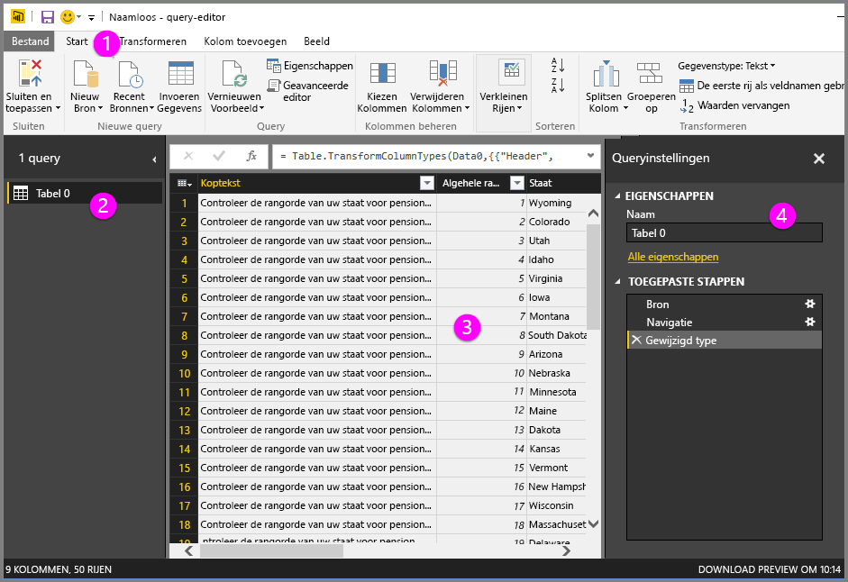
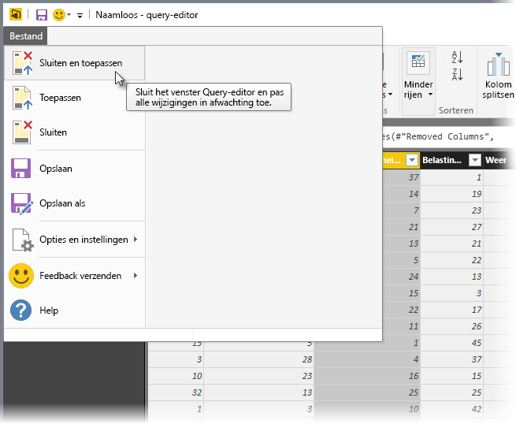

# Queryoverzicht in Power BI Desktop
Met **Power BI Desktop** kunt u verbinding maken met de wereld van gegevens, overtuigende en gefundeerde rapporten maken en uw resultaten delen met anderen, die verder kunnen bouwen op uw werk en hun business intelligence-activiteiten kunnen uitbreiden.

U kunt kiezen uit drie weergaven in Power BI Desktop:

* **Rapport**: gebruik query's om overtuigende visualisaties te maken, gerangschikt zoals u dat wilt, met meerdere pagina's die u met anderen kunt delen
* **Gegevens**: bekijk de gegevens in uw rapport in de indeling van een gegevensmodel waarmee u metingen kunt toevoegen, nieuwe kolommen kunt maken en relaties kunt beheren
* **Relaties**: maak een grafische weergave van de relaties die zijn vastgelegd in uw gegevensmodel, en beheer of wijzig deze zo nodig.

U kiest deze weergaven door een van de drie pictogrammen aan de linkerkant van Power BI Desktop te selecteren. In de volgende afbeelding is de weergave Rapport geselecteerd. Dit is te zien aan de gele band naast het pictogram.  

Power BI Desktop wordt geleverd met **Query-editor**. Hiermee kunt u verbinding maken met een of meer gegevensbronnen, de gegevens naar behoefte vormgeven en transformeren, en dat model vervolgens in Power BI Desktop laden.

Dit document geeft een overzicht van het werken met gegevens in **Query-editor**. Er is meer informatie, natuurlijk, dus aan het einde van dit document vindt u koppelingen naar gedetailleerde richtlijnen over de ondersteunde gegevenstypen, gegevensverbindingen, het vormgeven van gegevens, het maken van relaties en hoe u aan de slag kunt gaan.

Maar eerst laten we u kennismaken met **Query-editor**.

## Query-editor
Om **Query-editor** te openen, selecteert u **Query's bewerken** op het tabblad de **Start** van Power BI Desktop.  

Zonder gegevensverbindingen wordt **Query-editor** weergegeven als een leeg venster, gereed voor gegevens.  

Nadat een query is geladen, wordt het venster van **Query-editor** een stuk interessanter. Als we verbinding maken met de volgende webgegevensbron, wordt er in **Query-Editor** informatie over de gegevens geladen. Vervolgens kunt u deze gaan vormgeven.

[*http://www.bankrate.com/finance/retirement/best-places-retire-how-state-ranks.aspx*](http://www.bankrate.com/finance/retirement/best-places-retire-how-state-ranks.aspx)

**Query-editor** ziet er ongeveer als volgt uit zodra een verbinding tot stand is gebracht:

1. In het lint zijn veel knoppen actief om de gegevens in de query te gebruiken
2. In het linkerdeelvenster worden query's vermeld die beschikbaar zijn om te worden geselecteerd, weergegeven en vormgegeven
3. In het middelste deelvenster worden gegevens uit de geselecteerde query weergegeven en geactiveerd voor weergave
4. Het venster **Query-instellingen** wordt weergegeven, waarin de eigenschappen van de query en de toegepaste stappen worden weergegeven  
   
   

Elk van deze vier gebieden (het lint, het deelvenster met query's, het deelvenster met gegevens en het deelvenster Query-instellingen) komen nader aan bod in de volgende secties.

## Het lint in Query-editor
Het lint in **Query-editor** bestaat uit vier tabbladen: **Start**, **Transformeren**, **Kolom toevoegen** en **Weergeven**.

Het tabblad **Start** bevat de algemene querytaken, met inbegrip van de eerste stap in een query: **Gegevens ophalen.** In de volgende afbeelding ziet u het lint **Start**.  

Om een verbinding met gegevens te maken en te beginnen met het opbouwen van een query, selecteert u de knop **Gegevens ophalen**. Er verschijnt een menu met de meestvoorkomende gegevensbronnen.  

Zie **Gegevensbronnen** voor meer informatie over beschikbare gegevensbronnen. Zie **Verbinding maken met gegevens** voor meer informatie over het maken van verbindingen met gegevens, inclusief voorbeelden en stappen.

Het tabblad **Transformeren** biedt toegang tot algemene gegevenstransformatietaken, zoals het toevoegen of verwijderen van kolommen, het wijzigen van gegevenstypen, het splitsen van kolommen en andere gegevensgestuurde taken. De volgende afbeelding toont het tabblad **Transformeren**.  

Zie **Gegevens combineren en vormgeven** voor meer informatie over het transformeren van gegevens, inclusief voorbeelden.

Het tabblad **Kolom toevoegen** bevat aanvullende taken die zijn gekoppeld aan het toevoegen van een kolom, het opmaken van kolomgegevens en het toevoegen van aangepaste kolommen. De volgende afbeelding toont het tabblad **Kolom toevoegen**.  

Het tabblad **Weergeven** van het lint wordt gebruikt om te bepalen of bepaalde deelvensters of vensters worden weergegeven. Het wordt ook gebruikt om de geavanceerde editor weer te geven. De volgende afbeelding toont het tabblad **Weergeven**.  

Veel taken in het lint zijn overigens ook beschikbaar door met de rechtermuisknop te klikken op een kolom, of andere gegevens, in het middelste deelvenster.

## Het linkerdeelvenster
In het linkerdeelvenster wordt het aantal actieve query's weergegeven, evenals de naam van de query. Wanneer u een query selecteert in het linkerdeelvenster, worden de bijbehorende gegevens weergegeven in het middelste deelvenster, waar u de gegevens naar behoefte kunt vormgeven en transformeren. De volgende afbeelding toont het linkerdeelvenster met meerdere query's.  

## Het middelste deelvenster (Gegevens)
In het middelste deelvenster, het deelvenster Gegevens, worden de gegevens van de geselecteerde query weergegeven. Hier worden veel taken van de queryweergave uitgevoerd.

In de volgende afbeelding ziet u de webgegevensverbinding die eerder tot stand is gebracht. De kolom **Totale score** is geselecteerd en er is met de rechtermuisknop op de kop geklikt om de beschikbare menu-items weer te geven. U ziet dat veel van deze snelmenu-items hetzelfde zijn als knoppen in de linttabbladen.  

Wanneer u een snelmenu-item (of een knop op het lint) selecteert, wordt de query op de gegevens toegepast en opgeslagen als onderdeel van de query zelf. De stappen worden vastgelegd in het deelvenster **Query-instellingen** in sequentiële volgorde, zoals beschreven in de volgende sectie.  

## Het deelvenster Query-instellingen
In het deelvenster **Query-instellingen** worden alle stappen weergegeven die zijn gekoppeld aan een query. Zo ziet u in de volgende afbeelding van de sectie **Toegepaste stappen** van het deelvenster **Query-instellingen** dat we zojuist het type van de kolom **Totale score** hebben gewijzigd.

Als u aanvullende vormgevingsstappen toepast op de query, worden deze vastgelegd in de sectie **Toegepaste stappen**.

Het is belangrijk te weten dat de onderliggende gegevens *niet* worden gewijzigd. In plaats daarvan wordt de weergave en vormgeving van de gegevens in Query-Editor aangepast. Elke interactie met de onderliggende gegevens vindt plaats op basis van de vormgegeven en gewijzigde weergave van die gegevens in Query-editor.

In het deelvenster **Query-instellingen** kunt u de namen van stappen wijzigen, stappen verwijderen of de volgorde van de stappen naar wens aanpassen. Hiertoe klikt u met de rechtermuisknop op een stap in de sectie **Toegepaste stappen** en kiest u een optie in het snelmenu. De querystappen worden uitgevoerd in de volgorde waarin ze worden weergegeven in het deelvenster **Toegepaste stappen**.

## Geavanceerde editor
Als u de code wilt weergeven die bij elke stap in Query-Editor wordt gemaakt, of uw eigen vormgevingscode wilt maken, kunt u de **geavanceerde editor** gebruiken. Om de geavanceerde editor te starten, selecteert u **Weergave** in het lint en vervolgens **Geavanceerde Editor**. Er verschijnt een venster met de bestaande querycode.  

U kunt de code rechtstreeks bewerken in het venster **Geavanceerde editor**. Om het venster te sluiten, selecteert u knop **Gereed** of **Annuleren**.  

## Uw werk opslaan
Wanneer u tevreden bent met uw query, kunt u de wijzigingen in het gegevensmodel door Query-editor laten doorvoeren in Power BI Desktop, en Query-editor sluiten. Hiertoe kiest u **Sluiten en toepassen** in het menu **Bestand** van Query-editor.  

In Power BI Desktop wordt de voortgangsstatus in een dialoogvenster aangegeven.  

Zodra u tevreden bent met uw query, of als u wilt controleren of uw werk is opgeslagen, kunt u uw werk in Power BI Desktop opslaan als PBIX-bestand.

Om uw werk op te slaan, kiest u **Bestand \> Opslaan** (of **Bestand \> Opslaan als**), zoals wordt weergegeven in de volgende afbeelding.  

## Volgende stappen
U kunt allerlei handelingen uitvoeren met Power BI Desktop. Bekijk de volgende bronnen voor meer informatie over de vele mogelijkheden:

* [Wat is Power BI Desktop?](desktop-what-is-desktop.md)
* [Data Sources in Power BI Desktop](desktop-data-sources.md) (Gegevensbronnen in Power BI Desktop)
* [Connect to Data in Power BI Desktop](desktop-connect-to-data.md) (Verbinding maken met gegevens in Power BI Desktop)
* [Shape and Combine Data with Power BI Desktop](desktop-shape-and-combine-data.md) (Gegevens vormgeven en combineren met Power BI Desktop)
* [Common Query Tasks in Power BI Desktop](desktop-common-query-tasks.md) (Algemene querytaken in Power BI Desktop)   

