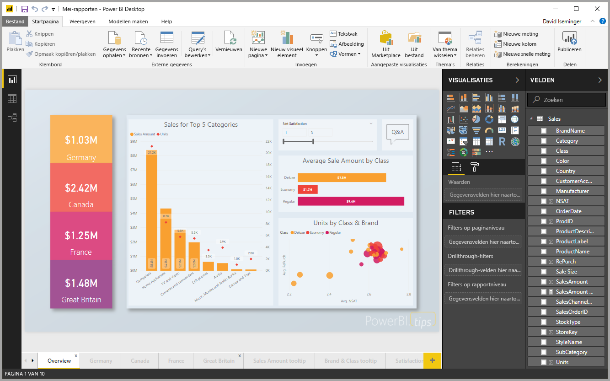

# Snelstart: Verbinding maken met gegevens in Power BI Desktop

In deze snelstart maakt u verbinding met gegevens met behulp van **Power BI Desktop**. Dit is de eerste stap in het bouwen van gegevensmodellen en het maken van rapporten.

Als u zich niet hebt geregistreerd voor Power BI, kunt u zich hier [aanmelden voor een gratis proefversie](https://app.powerbi.com/signupredirect?pbi_source=web) voordat u begint.

## Vereisten

U hebt het volgende nodig om de stappen in dit artikel te voltooien:
* Download en installeer **Power BI Desktop**, een gratis toepassing die wordt uitgevoerd op de lokale computer. U kunt [**Power BI Desktop**](https://powerbi.microsoft.com/desktop) rechtstreeks downloaden of u kunt de toepassing downloaden in [de **Microsoft Store**](http://aka.ms/pbidesktopstore).
* [Download deze Excel-voorbeeldwerkmap](http://go.microsoft.com/fwlink/?LinkID=521962) en maak een map met de naam *C:\PBID-qs* waar u het Excel-bestand kunt opslaan. Bij de volgende stappen in deze snelstart wordt ervan uitgegaan dat dit de bestandslocatie is voor de gedownloade Excel-werkmap.

## Power BI Desktop starten

Zodra u **Power BI Desktop** installeert, start u de toepassing zodat deze wordt uitgevoerd op de lokale computer. U ziet nu een leeg canvas waarop u visualisaties en rapporten kunt maken van de gegevens waarmee u verbinding maakt. 

## Verbinding maken met gegevens

Met **Power BI Desktop** kunt u verbinding maken met veel verschillende typen gegevens. U kunt verbinding maken met basisgegevensbronnen zoals een Microsoft Excel-bestand, en u kunt verbinding maken met onlineservices die allerlei soorten gegevens bevatten, zoals Salesforce, Microsoft Dynamics, Azure Blob Storage en nog veel meer. 

Als u verbinding wilt maken met gegevens, selecteert u **Gegevens ophalen** op het lint **Start**.

Het venster **Gegevens ophalen** verschijnt, waar u kunt kiezen uit veel verschillende gegevensbronnen waarmee **Power BI Desktop** verbinding kan maken. In deze snelstart gebruiken we de Excel-werkmap die u hebt gedownload, zoals beschreven in de sectie *Vereisten* aan het begin van dit artikel. 

Aangezien dit een Excel-bestand is, selecteert u **Excel** in het venster **Gegevens ophalen**. Vervolgens selecteert u de knop **Verbinden**.

U wordt gevraagd om de locatie op te geven van het Excel-bestand waarmee verbinding moet worden gemaakt. Het gedownloade bestand heet *Financieel voorbeeld*. Selecteer dit bestand en selecteer vervolgens **Openen**.

Vervolgens wordt de werkmap geladen in **Power BI Desktop** en de inhoud ervan gelezen. Hierna worden de beschikbare gegevens in het bestand weergegeven in het venster **Navigator** en kunt u kiezen welke gegevens u wilt laden in Power BI Desktop. U selecteert de tabellen door de selectievakjes aan te vinken naast de tabellen die u wilt importeren. In dit geval importeert u beide beschikbare tabellen.

Zodra u de selecties hebt gemaakt, selecteert u **Laden** om de gegevens te laden in Power BI Desktop.

## Gegevens weergeven in het deelvenster Velden

Zodra u de tabellen hebt geladen, worden de gegevens weergegeven in het deelvenster **Velden**. U kunt elke tabel uitvouwen door het driehoekje naast de naam van de tabel te selecteren. In de volgende afbeelding is de tabel *financiën*uitgevouwen, waardoor alle velden worden weergegeven. 

Dat is alles. U hebt verbinding gemaakt met de gegevens in **Power BI Desktop**, de gegevens geladen, en nu ziet u alle beschikbare velden in deze tabellen.

## Volgende stappen
U kunt verschillende dingen doen met **Power BI Desktop** zodra u verbinding hebt gemaakt met gegevens, zoals visualisaties en rapporten maken. Bekijk de volgende resource om u te helpen aan de slag te gaan:

* [Introductiehandleiding voor Power BI Desktop](desktop-getting-started.md)

