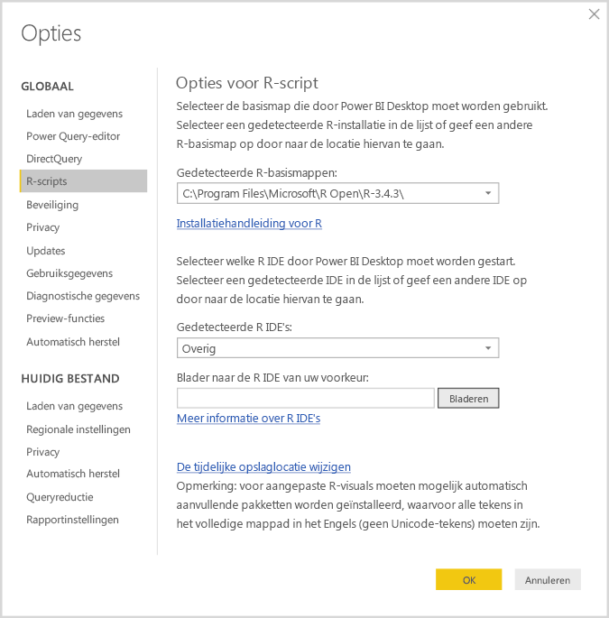
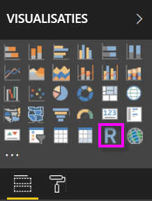
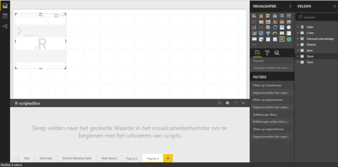
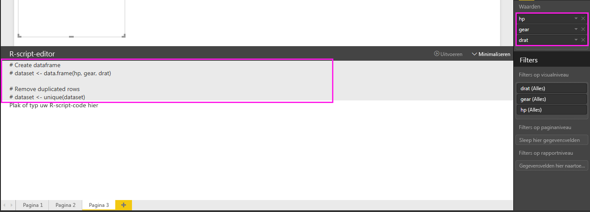
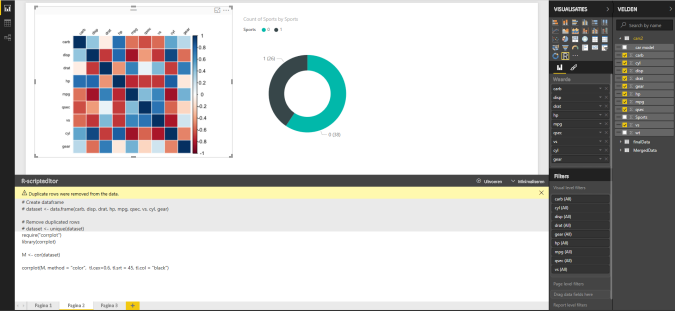
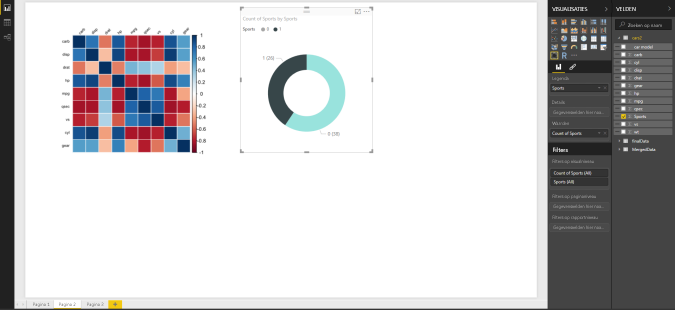
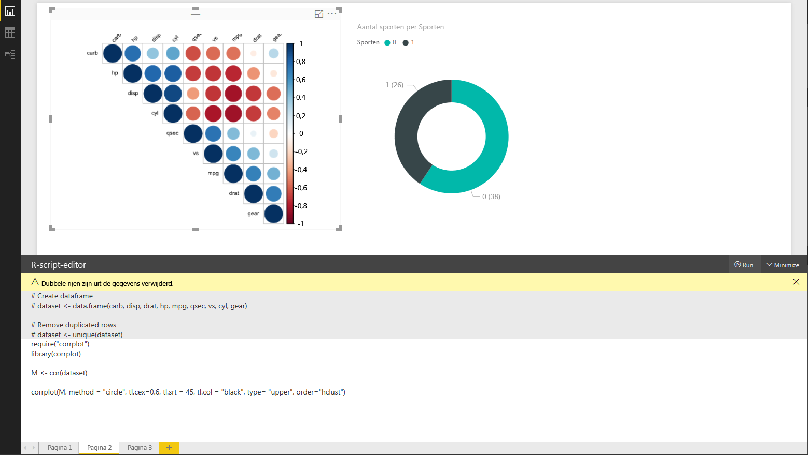
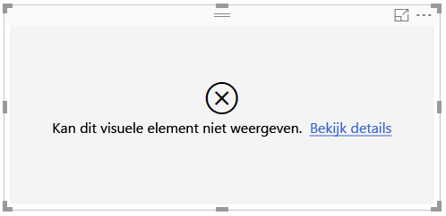

# Power BI-visuals maken met R
In combinatie met **Power BI Desktop** kunt u **R** gebruiken om uw gegevens te visualiseren.

## R installeren
**Power BI Desktop** bevat, implementeert of installeert niet de **R**-engine. Als u R-scripts wilt uitvoeren in **Power BI Desktop**, moet u **R** afzonderlijk installeren op uw lokale computer. U kunt **R** gratis downloaden en installeren vanaf tal van locaties, waaronder de [Revolution Open-downloadpagina](https://mran.revolutionanalytics.com/download/) en de [CRAN-opslagplaats](https://cran.r-project.org/bin/windows/base/). De huidige release van R-scripts in **Power BI Desktop** biedt ondersteuning voor Unicode-tekens en spaties (lege tekens) in het installatiepad.

## R-visuals inschakelen
Als u R-visuals wilt inschakelen, selecteert u **Bestand > Opties en instellingen > Opties** en controleert u op de pagina **Opties** of uw lokale R-installatie is opgegeven in de sectie **R-script** van het venster **Opties**, zoals weergegeven in de volgende afbeelding. In de volgende afbeelding is **C:\Program Files\R\R-3.2.0** het lokale installatiepad van R, dat expliciet is opgegeven in het tekstvak. Zorg ervoor dat het weergegeven pad op de juiste manier verwijst naar de lokale R-installatie die u **Power BI Desktop** wilt laten gebruiken.
   
   

Nadat u uw R-installatie hebt opgegeven, bent u klaar om R-visuals te gaan maken.

## R-visuals maken in Power BI Desktop
1. Selecteer het pictogram **R-visual** in het deelvenster **Visualisatie**, zoals weergegeven in de volgende afbeelding, om een R-visual toe te voegen.
   
   

   Wanneer u een R-visual aan een rapport toevoegt, doet **Power BI Desktop** het volgende:
   
   - Een tijdelijke aanduiding voor een R-visual wordt weergegeven op het rapportcanvas.
   
   - De **R-scripteditor** wordt onderin het middelste deelvenster weergegeven.
   
   

2. Vervolgens voegt u velden toe die u in uw R-script wilt gebruiken. Dat doet u in de sectie **Waarden** onder **Velden**, net zoals bij andere visuele elementen van **Power BI Desktop**. 
    
    Alleen velden die zijn toegevoegd aan de verdieping **Velden**, zijn beschikbaar voor uw R-script. U kunt ook nieuwe velden toevoegen aan of onnodige velden verwijderen uit de verdieping **Velden** terwijl u aan uw R-script werkt in de **R-scripteditor van Power BI Desktop**. **Power BI Desktop** detecteert automatisch welke velden u hebt toegevoegd of verwijderd.
   
   > [!NOTE]
   > Het standaardtype voor aggregatie voor R-visuals is *niet samenvatten*.
   > 
   > 
   
3. U kunt nu de gegevens gebruiken die u hebt geselecteerd voor het maken van een diagram. 

    Terwijl u velden selecteert, genereert de **R-scripteditor** ondersteunende bindingcode voor R-scripts op basis van uw selecties in de grijze sectie aan de bovenkant van het editorvenster. Tijdens het selecteren of verwijderen van extra velden wordt ondersteunende code in de R-scripteditor automatisch gegenereerd of verwijderd, naar gelang van toepassing.
   
   In het voorbeeld in de volgende afbeelding zijn drie velden geselecteerd: hp, gear en drat. Op basis van deze selectie heeft de R-scripteditor de volgende bindingcode gegenereerd:
   
   * Er is een gegevensframe met de naam **gegevensset** gemaakt
     * Dat gegevensframe bestaat uit de verschillende velden die door de gebruiker zijn geselecteerd
   * Het standaard aggregatietype is *Niet samenvatten*
   * Net als bij visuele tabel-elementen worden velden gegroepeerd en komen dubbele rijen slechts eenmaal voor
   
   
   
   > [!TIP]
   > In bepaalde gevallen wilt u geen automatische groepering of wilt u dat alle rijen worden weergegeven, met inbegrip van duplicaten. In dat geval kunt u aan uw gegevensset een indexveld toevoegen dat ervoor zorgt dat alle rijen als uniek worden beschouwd en groepering wordt voorkomen.
   > 
   > 
   
   Het gegenereerde gegevensframe wordt een **gegevensset** genoemd en de geselecteerde kolommen zijn toegankelijk op basis van hun respectieve namen. Het veld gear bijvoorbeeld is toegankelijk door *dataset$gear* in uw R-script te schrijven. Voor velden met spaties of speciale tekens gebruikt u enkele aanhalingstekens.

4. Met behulp van het gegevensframe dat automatisch wordt gegenereerd door de velden die u hebt geselecteerd, kunt u een R-script schrijven dat resulteert in plotten naar het standaard-R-apparaat. Wanneer het script voltooid is, selecteert u **Uitvoeren** in de titelbalk van **R-scripteditor** (**Uitvoeren** bevindt zich rechts op de titelbalk).
   
    Wanneer u **Uitvoeren** selecteert, identificeert **Power BI Desktop** de plot en wordt deze op het canvas weergegeven. Omdat het proces wordt uitgevoerd op uw lokale R-installatie, moet u ervoor zorgen dat de vereiste pakketten zijn geïnstalleerd.
   
   **Power BI Desktop** plot het visuele element opnieuw wanneer een van de volgende gebeurtenissen optreedt:
   
   * Wanneer u **Uitvoeren** selecteert in de titelbalk van **R-scripteditor**
   * Wanneer een gegevenswijziging plaatsvindt, als gevolg van het vernieuwen, filteren of markeren van gegevens

     In de volgende afbeelding ziet u een voorbeeld van de plotcode van de correlatie en wordt de correlatie tussen kenmerken van verschillende typen auto's weergegeven.

     

5. Als u een grotere weergave van de visualisaties wilt, minimaliseert u de **R-scripteditor**. En net zoals andere visuals in **Power BI Desktop** kunt u de correlatieplot kruislings filteren door alleen sportauto's in de ringgrafiek (de ronde visual aan de rechterkant, zoals weergegeven in het bovenstaande voorbeeld) te selecteren.

    

6. U kunt het R-script ook wijzigen om het visuele element aan te passen en R in te zetten door parameters toe te voegen aan de plotting-opdracht.

    Dit was de oorspronkelijke plotting-opdracht:

    corrplot(M, method = "color",  tl.cex=0.6, tl.srt = 45, tl.col = "black")

    Na enkele wijzigingen in het R-script ziet de opdracht er nu zo uit:

    corrplot(M, method = "circle", tl.cex=0.6, tl.srt = 45, tl.col = "black", type= "upper", order="hclust")

    Als gevolg hiervan plot de R-visual nu cirkels, houdt daarbij alleen rekening met het bovenste gedeelte en wijzigt de volgorde van de matrix om gecorreleerde kenmerken te clusteren, zoals wordt weergegeven in de volgende afbeelding.

    

    Wanneer bij het uitvoeren van een R-script een fout optreedt, wordt de R-visual niet geplot en wordt er een foutbericht op het canvas weergegeven. Als u meer wilt weten over de fout, selecteert u **Details bekijken** in de fout op het canvas van de R-visual.

    

    > **Beveiliging van R-scripts:** R-visuals worden gemaakt van R-scripts, die code kunnen bevatten met beveiligings- of privacyrisico's. Wanneer een gebruiker voor het eerst een R-visual probeert weer te geven of ermee probeert te werken, wordt er een beveiligingswaarschuwing weergegeven. Schakel R-visuals alleen in als u de auteur en bron vertrouwt, of nadat u het R-script hebt bekeken en begrijpt.
    > 
    > 

## Bekende beperkingen
R-visuals in **Power BI Desktop** kennen enkele beperkingen:

* Beperkingen voor gegevensgrootte: de grootte van gegevens die door de R-visual worden gebruikt voor het uitzetten, is beperkt tot 150.000 rijen. Als er meer dan 150.000 rijen zijn geselecteerd, worden alleen de bovenste 150.000 rijen gebruikt en wordt er een bericht weergegeven op de afbeelding.
* Tijdslimiet voor berekening: als de berekening van een R-visual langer duurt dan vijf minuten, treedt er een time-out op, met een fout tot gevolg.
* Relaties: net als bij andere Power BI Desktop-visuals geldt dat als er gegevensvelden uit verschillende tabellen zonder gedefinieerde relatie worden geselecteerd, er een fout optreedt.
* R-visuals worden vernieuwd op het moment dat gegevens worden bijgewerkt, gefilterd en gemarkeerd. De afbeelding zelf is echter niet interactief en kan niet de bron van kruislings filteren zijn.
* R-visuals reageren op de markering van andere visuele elementen, maar u kunt niet klikken op elementen in de R-visual om kruislings te filteren op andere elementen.
* Alleen plots die worden weergegeven op het standaard-R-apparaat voor weergave worden correct weergegeven op het canvas. Vermijd expliciet het gebruik van een ander R-apparaat voor weergave.
* In deze release worden RRO-installaties niet automatisch herkend door de 32-bits versie van Power BI Desktop. Daarom moet u het pad naar de installatiemap van R handmatig opgeven in **Opties en instellingen > Opties > R-script** .

## Volgende stappen
Raadpleeg de volgende aanvullende informatie over R in Power BI.

* [R-scripts uitvoeren in Power BI Desktop](desktop-r-scripts.md)
* [Gebruik een externe R IDE met Power BI](desktop-r-ide.md)

