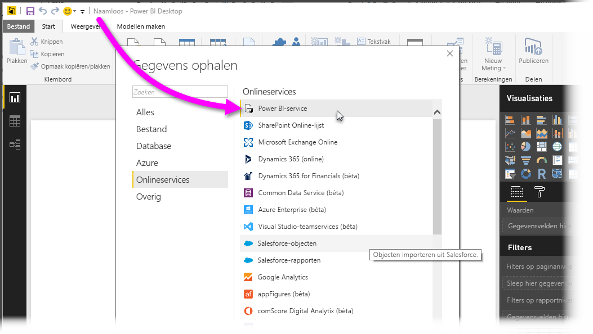
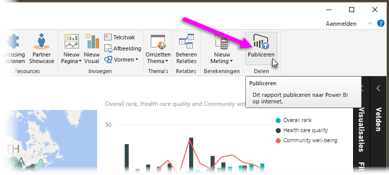
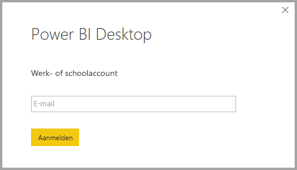
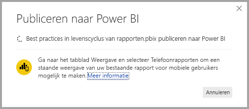
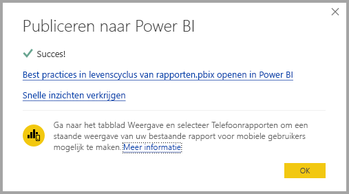
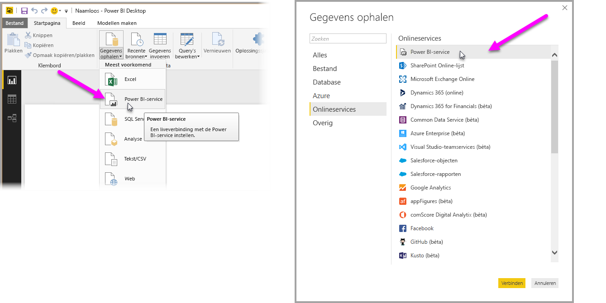
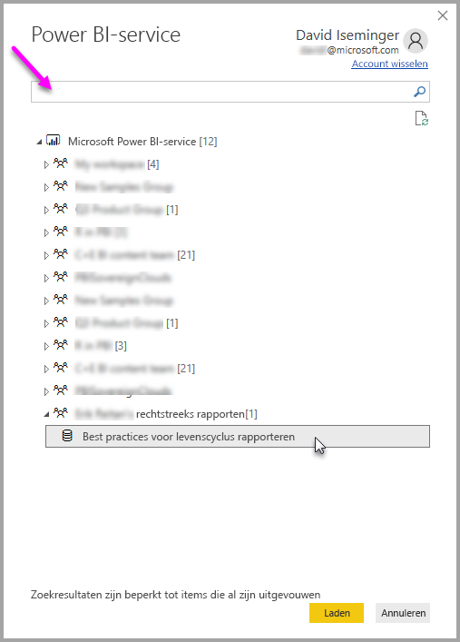
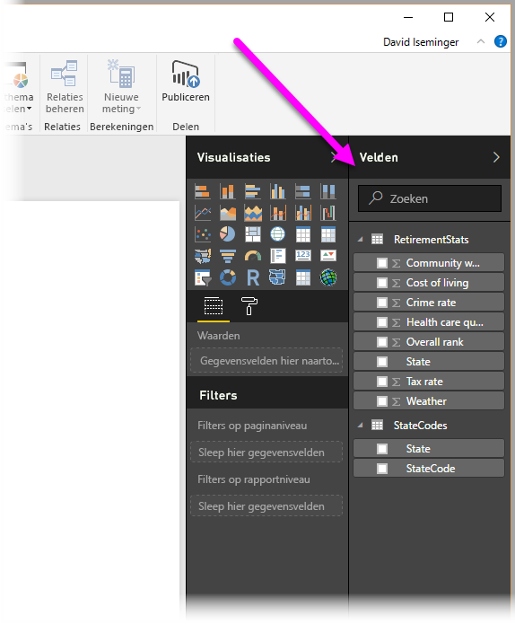

# Verbinding maken met gegevenssets in de Power BI-service vanuit Power BI Desktop
U kunt een live verbinding maken met een gedeelde gegevensset in de Power BI-service en veel verschillende rapporten maken op basis van dezelfde gegevensset. Dit betekent dat u uw perfecte gegevensmodel in Power BI Desktop kunt maken en dit publiceren naar de Power BI-service, waarna u en anderen meerdere verschillende rapporten (in afzonderlijke .pbix-bestanden) kunnen maken op basis van hetzelfde algemene gegevensmodel. Deze functie heet **Liveverbinding met Power BI-service**.

Deze functie heeft allerlei voordelen, waaronder best practices, die in dit artikel worden besproken. Er zijn ook enkele overwegingen en beperkingen, dus lees deze vooral door; ze staan aan het eind van dit artikel.

## Een liveverbinding met de Power BI-service gebruiken voor het beheren van de levenscyclus van rapporten
Eén uitdaging waar de populariteit van Power BI toe leidt is de proliferatie van rapporten, dashboards en de onderliggende gegevensmodellen ervan. Het is gemakkelijk om overtuigende rapporten te maken in **Power BI Desktop**, die rapporten te delen ([publiceren](desktop-upload-desktop-files.md)) in de **Power BI-service**, en geweldige dashboards te maken op basis van die gegevenssets. Omdat zoveel mensen dit deden, vaak met (bijna) dezelfde gegevenssets, werd het een uitdaging om te weten welk rapport op welke gegevensset was gebaseerd, en hoe recent elke gegevensset was. De **liveverbinding met de Power BI-service** pakt deze uitdaging op en maakt het delen, maken en uitbreiden van rapporten en dashboards op basis van gemeenschappelijke gegevenssets gemakkelijker en consistent.

### Maak een gegevensset die iedereen kan gebruiken, en deel deze
Stel dat Anna (een bedrijfsanalist) in uw team zit, en heel goed is in het maken van gegevensmodellen (vaak gegevenssets genoemd). Dankzij haar expertise kan Anna een gegevensset en rapport maken, en dat rapport vervolgens delen in de **Power BI-service**.

Iedereen is dol op haar rapport, en haar gegevensset; en dat is waar het probleem ontstaat: iedereen in haar team probeerde *een eigen versie* van die gegevensset te maken en zijn of haar eigen rapporten met het team te delen. Opeens was er een hele menigte rapporten (van verschillende gegevenssets) in de werkruimte van uw team in de **Power BI-service**. Welk ervan was het meest recent? Waren de gegevenssets hetzelfde, of alleen bijna hetzelfde? Wat waren de verschillen? Met de functie **Liveverbinding met Power BI-service** kan dat allemaal ten goede veranderen. In de volgende sectie ziet u hoe anderen Anna’s van gepubliceerde gegevensset voor hun eigen rapporten kunnen gebruiken, en hoe iedereen dezelfde solide, goedgekeurde, gepubliceerde gegevensset kan gebruiken om eigen unieke rapporten te creëren.

### Verbinding maken met een gegevensset van Power BI-service via een liveverbinding
Nadat Anna haar rapport heeft gemaakt (en de gegevensset waarop het is gebaseerd), publiceert ze het naar de **Power BI-service** en wordt het weergegeven in de werkruimte van haar team in Power BI-service. Nu kan iedereen in haar werkruimte het zien en gebruiken.

Voor meer informatie over werkruimten raadpleegt u [App-werkruimten](service-create-distribute-apps.md#app-workspaces).

Andere leden van haar werkruimte kunnen nu een liveverbinding maken met het gedeelde gegevensmodel van Anna (met behulp van de functie **Liveverbinding met Power BI-service**), en eigen unieke rapporten maken op basis van *haar oorspronkelijke gegevensset*.

In de volgende afbeelding ziet u hoe Anna één **Power BI Desktop**-rapport maakt en het publiceert (met inbegrip van het gegevensmodel ervan) naar de **Power BI-service**. Vervolgens kunnen anderen in haar werkruimte verbinding maken met haar gegevensmodel via de **liveverbinding met de Power BI-service**, en hun eigen unieke rapporten maken op basis van haar gegevensset.

> [!NOTE]
> Gegevenssets worden maar in één werkruimte gedeeld. Als u een liveverbinding met de Power BI-service wilt maken, moet de gegevensset waarmee u verbinding wilt maken zich in een gedeelde werkruimte bevinden waarvan u lid bent.
> 
> 

## Stapsgewijze aanwijzingen voor het gebruik van de liveverbinding met de Power BI-service
Nu we weten hoe nuttig de **liveverbinding met de Power BI-service** is en hoe u deze kunt gebruiken als best-practicebenadering voor het beheren van de levenscyclus van rapporten, gaan we de stappen eens bekijken waarmee we van Anna’s fantastische rapport (en gegevensset) naar een gedeelde gegevensset gaan die haar teamgenoten in de Power BI-werkruimte kunnen gebruiken.

### Een Power BI-rapport en gegevensset publiceren
De eerste stap bij het beheren van de levenscyclus van een rapport met behulp van een **liveverbinding met de Power BI-service** is een rapport (met gegevensset) te hebben dat teamleden willen gebruiken. Anna moet haar rapport dus eerst **publiceren** vanuit **Power BI Desktop**. Ze doet dat door **Publiceren** te selecteren in het lint **Start** van Power BI Desktop.

Als ze zich niet heeft aangemeld bij haar Power BI-service-account, wordt haar gevraagd dit te doen.

Van daaruit kan ze de werkruimte kiezen waarnaar het rapport en de gegevensset worden gepubliceerd. Denk eraan dat alleen leden die toegang hebben tot de werkruimte waarop een rapport wordt gepubliceerd, toegang hebben tot de gegevensset met behulp van een **liveverbinding met de Power BI-service**.

Het publicatieproces begint, en **Power BI Desktop** laat de voortgang zien.

Wanneer het klaar is, laat **Power BI Desktop** u zien dat het gelukt is, en geeft u enkele koppelingen naar het rapport zelf in de **Power BI-service** en een koppeling naar **Snelle inzichten** over het rapport.

Laten we nu eens kijken hoe andere teamgenoten die toegang hebben tot de werkruimte waar het rapport en de gegevensset zijn gepubliceerd, verbinding kunnen maken met de gegevensset en eigen rapporten maken.

### Breng een liveverbinding met de Power BI-service tot stand
Als u verbinding wilt maken met het gepubliceerde rapport en een eigen rapport maken op basis van de gepubliceerde gegevensset, selecteert u **Gegevens ophalen** in het lint **Start** van **Power BI Desktop** en selecteert u **Power BI-service**. U kunt dit ook selecteren in **Gegevens ophalen > Onlineservices > Power BI-service**.

Als u zich niet hebt aangemeld bij Power BI, wordt u gevraagd dit te doen. Nadat u bent aangemeld, krijgt u een venster te zien waarin wordt weergegeven van welke werkruimten u lid bent, en kunt u de werkruimte selecteren die de gegevensset bevat waarmee u een **liveverbinding met Power BI-service** tot stand wilt brengen.

Het getal tussen haakjes naast de werkruimte laat zien hoeveel gedeelde gegevenssets in die werkgroep beschikbaar zijn, en door de driehoek links van de werkruimte te selecteren wordt deze uitgevouwen zodat u de gedeelde gegevensset kunt selecteren.

Er zijn enkele dingen op te merken over het vorige liveverbindingsvenster van de **Power BI-service**:

* U kunt zoeken naar een gedeelde gegevensset, maar de zoekresultaten zijn beperkt tot de uitgevouwen items, en eventuele werkruimten die u niet hebt uitgevouwen worden niet opgenomen.
* U kunt meer dan één werkruimte uitvouwen om uw zoekopdracht uit te breiden.

Wanneer u **Laden** selecteert in het venster, maakt u een liveverbinding met de geselecteerde gegevensset, wat betekent dat de gegevens die u ziet (de velden en hun waarden) in realtime in **Power BI Desktop** worden geladen.

Nu kunt u (en kunnen anderen) aangepaste rapporten maken en delen, op basis van dezelfde gegevensset. Dit is een uitstekende manier om één deskundige persoon een goed ingedeelde gegevensset te laten maken (zoals Anna doet), en een groot aantal teamleden die gedeelde gegevensset te laten gebruiken om hun eigen rapporten te maken.

> [!NOTE]
> Wanneer u rapporten maakt op basis van een gegevensset met behulp van een liveverbinding met de **Power BI-service**, kunt u die rapporten alleen publiceren naar dezelfde werkruimte van de Power BI-service waar de gebruikte gegevensset zich bevindt.
> 
> 

## Beperkingen en overwegingen
Wanneer u de **liveverbinding met de Power BI-service** gebruikt, zijn er enkele beperkingen en overwegingen waarmee u rekening moet houden.

* Alleen-lezen leden van een werkruimte kunnen geen verbinding maken met gegevenssets van **Power BI Desktop**.
* Alleen gebruikers die deel uitmaken van dezelfde **Power BI-service**-werkruimte kunnen verbinding maken met een gepubliceerde gegevensset met de **liveverbinding met de Power BI-service**. Gebruikers kunnen tot meer dan één werkruimte behoren, en doen dat ook vaak.
* Aangezien dit een live-verbinding is, zijn de navigatie aan de linkerkant en modellering uitgeschakeld, vergelijkbaar met het gedrag bij een verbinding met **SQL Server Analysis Services**.
* Omdat dit een live-verbinding is, worden RLS (beveiliging op rij- en rolniveau), OneDrive voor Bedrijven en soortgelijke gedragingen afgedwongen, net als bij verbinding met **SQL Server Analysis Services**.
* Wanneer u selecteert met welke gegevensset verbinding moet worden gemaakt in de **Power BI-service**, is het zoekvak alleen van toepassing op werkruimten die zijn uitgebreid.
* Als de eigenaar het oorspronkelijke gedeelde .pbix-bestand wijzigt, worden de gegevensset en het rapport dat wordt gedeeld in de **Power BI-service** overschreven.
* Leden van een werkruimte kunnen het oorspronkelijk gedeelde rapport niet vervangen. Pogingen daartoe resulteren in een waarschuwing waarin u wordt gevraagd het bestand een andere naam te geven en het te publiceren.
* Als u de gedeelde gegevensset in de **Power BI-service** verwijdert, werken andere **Power BI Desktop**-bestanden (.pbix) niet meer goed en worden hun visuele elementen niet meer weergegeven.
* Voor inhoudspakketten moet u eerst een kopie van een inhoudspakket maken voordat u het gebruikt als basis voor het delen van een. pbix-rapport en gegevensset met de **Power BI service**.
* Nadat de inhoudspakketten van *Mijn organisatie* zijn gekopieerd,kunt u het rapport dat op de service is gemaakt en/of een rapport dat is gemaakt bij het kopiëren van een inhoudspakket met een liveverbinding niet meer vervangen. Pogingen daartoe resulteren in een waarschuwing waarin u wordt gevraagd het bestand een andere naam te geven en het te publiceren. In dit geval kunt u alleen gepubliceerde live gekoppelde rapporten vervangen.
* Wanneer u een rapport maakt op basis van een gegevensset met behulp van een liveverbinding met de **Power BI-service**, kunt u dat rapport alleen publiceren naar dezelfde werkruimte van de Power BI-service waar de gebruikte gegevensset zich bevindt.
* Wanneer u een gedeelde gegevensset in de **Power BI-service** verwijdert, hebt u niet langer toegang tot deze gegevensset van **Power BI Desktop**.

