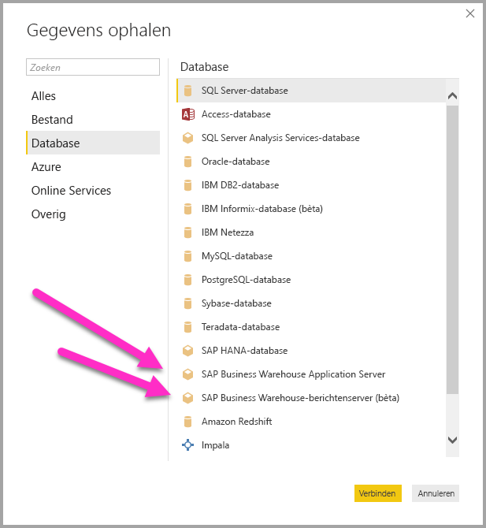
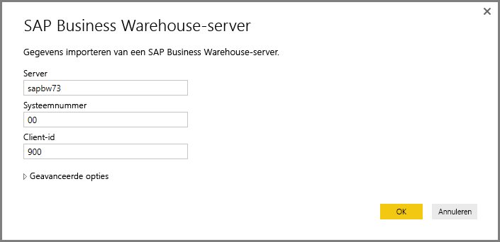
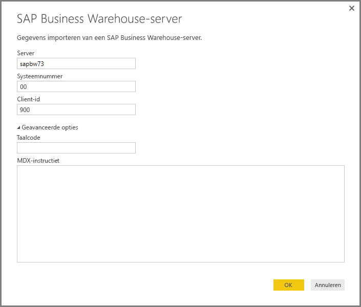
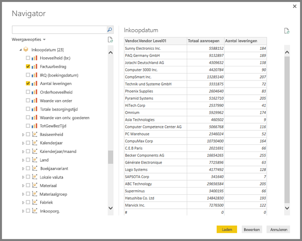
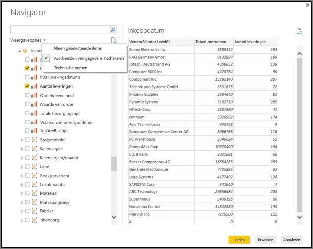
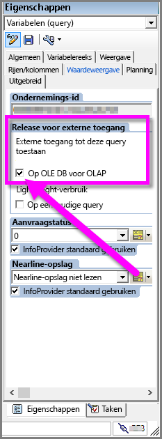

# De SAP BW Connector in Power BI Desktop gebruiken
Met Power BI Desktop hebt u toegang tot gegevens van **SAP BusinessWarehouse (BW)**.

## Installatie van SAP BW Connector
Doorloop de volgende installatiestappen om de **SAP BW Connector** te gebruiken:

1. Installeer de **SAP NetWeaver**-bibliotheek op uw lokale computer. U kunt de **SAP Netweaver**-bibliotheek bij uw SAP-beheerder verkrijgen of rechtstreeks uit het [SAP Software Download Center](https://support.sap.com/swdc) downloaden. Omdat de indeling van het **SAP Software Download Center** vaak verandert, kunnen we geen specifiekere richtlijnen geven voor de navigatie op die site. De **SAP NetWeaver** bibliotheek is meestal ook opgenomen in de hulpprogramma's voor installatie van de SAP-client.
   
   U kunt mogelijk zoeken naar *SAP Note #1025361* voor informatie over de downloadlocatie van de meest recente versie. Zorg ervoor dat de architectuur voor de **SAP NetWeaver**-bibliotheek (32-bits of 64-bits) overeenkomt met uw **Power BI Desktop**-installatie en installeer vervolgens alle bestanden die zijn opgenomen in de **SAP NetWeaver RFC-SDK**  in overeenstemming met de SAP Note.
2. Het dialoogvenster **Gegevens ophalen** bevat een vermelding voor **SAP Business Warehouse Server** in de categorie **Database**.
   
   

## Functies van SAP BW Connector
Via de **SAP BW Connector**-preview in Power BI Desktop kunnen gebruikers gegevens importeren uit hun **SAP Business Warehouse-Server**-kubussen. U kunt ook DirectQuery gebruiken met de **SAP BW Connector**. U moet een *server*, *systeemnummer* en *client-ID* opgeven om de verbinding tot stand te brengen.

U kunt ook twee extra **geavanceerde opties** opgeven: de taalcode en een aangepaste MDX-instructie die wordt uitgevoerd voor de opgegeven server.

Als er geen MDX-instructie is opgegeven, wordt het **Navigator**-venster weergegeven, waarin de lijst met kubussen die beschikbaar zijn op de server wordt weergegeven en dat de optie biedt om in te zoomen en items te selecteren in de beschikbare kubussen, inclusief dimensies en metingen. Power BI geeft de query's en kubussen weer die worden weergegeven door de [BW Open Analysis Interface OLAP-BAPI’s](https://help.sap.com/saphelp_nw70/helpdata/en/d9/ed8c3c59021315e10000000a114084/content.htm).

Wanneer u een of meer items van de server selecteert, wordt een voorbeeld van de uitvoertabel gemaakt op basis van deze selectie.

Het **Navigator**-venster biedt ook enkele **weergaveopties** waarmee u het volgende kunt doen:

* **Alleen geselecteerde items *weergeven* versus *Alle items* (standaardweergave):** deze optie is handig voor het controleren van de definitieve set met geselecteerde objecten. Een alternatieve methode om deze weer te geven, is door de *kolomnamen* in het gebied *Preview* te selecteren.
* **Voorbeelden van gegevens inschakelen (standaardinstelling):** u kunt ook bepalen of voorbeelden van gegevens in dit dialoogvenster moeten worden weergegeven. Als u voorbeelden van gegevens uitschakelt, zijn er minder serveraanroepen, omdat er geen gegevens meer voor de voorbeelden worden aangevraagd.
* **Technische namen:** SAP BW ondersteunt het principe van *technische namen* voor objecten in een kubus. Met technische namen kan de eigenaar van een kubus *gebruikersvriendelijke* namen weergeven voor kubusobjecten, in plaats van alleen de *fysieke namen* voor die objecten in de kubus weer te geven.

Na het selecteren van alle benodigde objecten in de **Navigator**, kunt u bepalen wat u nu wilt gaan doen door een van de volgende knoppen aan de onderkant van het **Navigator**-venster te selecteren:

* Als u **Laden** selecteert, wordt de volledige set rijen voor de uitvoertabel in het gegevensmodel van Power BI Desktop geladen. Vervolgens gaat u naar de **rapportviewer**, waar u kunt beginnen met het visualiseren van de gegevens of verdere wijzigingen kunt aanbrengen met behulp van de **gegevens**- of **relatie**weergave.
* Als u **Bewerken** selecteert, wordt de **Query-editor** geopend, waar u extra stappen voor gegevenstransformatie en filteren van gegevens kunt uitvoeren voordat de volledige set van rijen in het gegevensmodel van Power BI Desktop wordt gebracht.

Naast het importeren van gegevens uit **SAP BW**-kubussen kunt u ook gegevens importeren uit een breed scala aan andere gegevensbronnen in Power BI Desktop. Vervolgens kunt u deze combineren tot één rapport. Dit geeft naast **SAP BW**-gegevens allerlei interessante scenario's voor rapportage en analyse.

## Probleemoplossing
Deze sectie bevat situaties waarin zich problemen voordoen (en oplossingen hiervoor) bij het werken met deze previewversie van de **SAP BW** Connector.

1. Numerieke gegevens uit **SAP BW** retourneren decimale punten in plaats van komma's. Bijvoorbeeld: 1,000,000 wordt geretourneerd als 1.000.000.
   
   **SAP BW** retourneert decimale gegevens met een *,* (komma) of een *.* (punt) als decimaal scheidingsteken. Om op te geven welke van beide **SAP BW** moet gebruiken voor het decimale scheidingsteken, roept het stuurprogramma dat wordt gebruikt door **Power BI Desktop** *BAPI_USER_GET_DETAIL* aan. Deze aanroep retourneert een structuur genaamd **DEFAULTS**, die een veld heeft met de naam *DCPFM* waarin de *decimale notatie* is opgeslagen. Eén van de volgende drie waarden wordt gebruikt:
   
       ‘ ‘ (space) = Decimal point is comma: N.NNN,NN
       'X' = Decimal point is period: N,NNN.NN
       'Y' = Decimal point is N NNN NNN,NN
   
   Klanten die dit probleem hebben gerapporteerd, hebben ondervonden dat de aanroep naar *BAPI_USER_GET_DETAIL* mislukt voor een bepaalde gebruiker (de gebruiker die de onjuiste gegevens weergeeft), en er een foutbericht wordt weergegeven dat vergelijkbaar is met het volgende:
   
       You are not authorized to display users in group TI:
           <item>
               <TYPE>E</TYPE>
               <ID>01</ID>
               <NUMBER>512</NUMBER>
               <MESSAGE>You are not authorized to display users in group TI</MESSAGE>
               <LOG_NO/>
               <LOG_MSG_NO>000000</LOG_MSG_NO>
               <MESSAGE_V1>TI</MESSAGE_V1>
               <MESSAGE_V2/>
               <MESSAGE_V3/>
               <MESSAGE_V4/>
               <PARAMETER/>
               <ROW>0</ROW>
               <FIELD>BNAME</FIELD>
               <SYSTEM>CLNTPW1400</SYSTEM>
           </item>
   
   Om deze fout op te lossen, moeten gebruikers hun SAP-beheerder vragen om de SAPBW-gebruiker die wordt gebruikt in Power BI het recht te verlenen om *BAPI_USER_GET_DETAIL* uit te voeren. Het verdient ook aanbeveling om te controleren of de gebruiker de vereiste *DCPFM*-waarde heeft, zoals eerder in deze oplossing is beschreven.
2. **Connectiviteit voor SAP BEx-query's**
   
   U kunt **BEx**-query's uitvoeren in Power BI Desktop door een bepaalde eigenschap in te schakelen, zoals wordt weergegeven op de volgende afbeelding:
   
   

