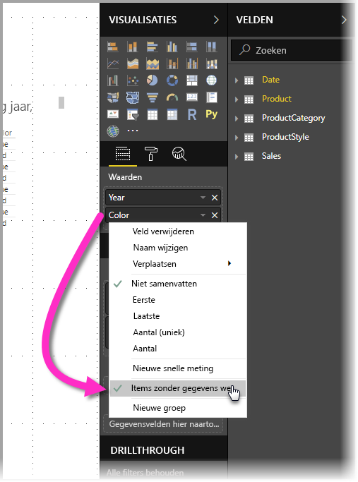
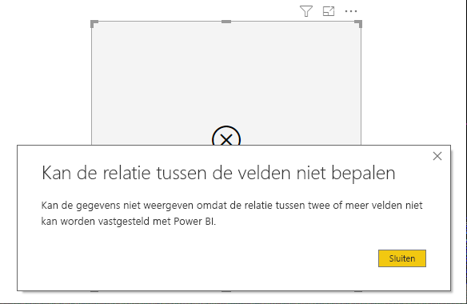

# Items zonder gegevens weergeven in Power BI

Met Power BI visualiseert u allerlei soorten gegevens uit verschillende bronnen. Wanneer u een visual maakt, geeft Power BI alleen relevante gegevens weer om duidelijk te beheren hoe gegevens worden weergegeven. Power BI bepaalt welke gegevens relevant zijn op basis van de configuratie van de visual en het onderliggende gegevensmodel. In dit artikel wordt aan de hand van voorbeelden beschreven hoe Power BI zich gedraagt wanneer relevante gegevens worden bepaald.

## Relevante gegevens bepalen

Als u wilt begrijpen hoe Power BI bepaalt welke gegevens relevant zijn om weer te geven, nemen we een tabel als eenvoudig voorbeeld. Aan de hand van het model in de voorbeeldsectie, aan het eind van dit artikel, kunt u een tabel met de volgende instellingen maken:

**1. Groepen uit dezelfde tabel:** *Product[Color] - Product[Size]*

|*Product[Color]*  |*Product[Size]*  |
|---------|---------|
|Blauw     |Groot         |
|Blauw     |Gemiddeld         |
|Blauw     |Klein         |
|Rood     |Groot         |

In dit voorbeeld geeft Power BI de combinaties *[Color-Size]* weer in het tabel *[Product]*. 

Bekijk nu een andere combinatie:

**2. Groepen van verschillende, maar rechtstreeks gerelateerde, tabellen en een meting:** *ProductStyle[Finish] - Product[Color] - Sum(Sales[Quantity])*

|*ProductStyle[Finish]*  |*Product[Color]*  |*[SumQuantity]*  |
|---------|---------|---------|
|Glans     |Blauw         |10         |
|Mat     |Blauw         |15         |

In dit voorbeeld geeft Power BI alleen combinaties weer die bestaan. Bijvoorbeeld ('Geen' + 'Blauw') of ('Mat' + 'Rood') worden niet weergegeven, omdat die combinaties niet bestaan in het model. De voorwaarde die bepaalt welke combinaties bestaan, is dat de waarde voor *Sum(Sales[Quantity])* niet leeg is.

Bekijk nu een ander geval: 

**3. Groepen van verschillende, maar gerelateerde, tabellen en geen meting:** *ProductStyle[Finish] - Product[Color]*

|*ProductStyle[Finish]*  |*Product[Color]*  |
|---------|---------|
|Glans     |Blauw         |
|Glans     |Rood         |
|Mat     |Blauw         |

Omdat er geen explicite meting is en de twee tabellen rechtstreeks gerelateerd zijn, probeert Power BI een meting te injecteren om de resulterende combinaties te beperken. In dit geval injecteert Power BI de meting *CALCULATE(COUNTROWS('Product'))*, die niet leeg mag zijn, aangezien *Product* het tabel is die voor beide tabellen geldt.

Zodoende geeft Power BI de combinaties weer die vermeldingen hebben in het tabel Product, waar de combinaties *('Geen' + 'Blauw')* en *('Mat' + 'Rood')* zijn uitgesloten.

**4. Groepen uit verschillende en niet-gerelateerde tabellen**

Het voorbeeldmodel bevat deze combinatie niet, maar als er groepen uit verschillende en niet-gerelateerde tabellen zouden zijn, zou Power BI de twee kolommen niet kunnen koppelen en zou het resultaat een samenvoeging zijn van alle waarden uit elke kolom. In dit geval geeft Power BI een fout weer van het type *onbeperkte samenvoeging*, omdat het zwaar is om dergelijke samenvoegingen te berekenen in de database en die samenvoegingen de gebruiker niet veel informatie geven. 

## Items zonder gegevens weergeven

In de vorige sectie werd beschreven hoe Power BI bepaalt welke gegevens relevant zijn om weer te geven. Maar soms wilt u deze items zonder gegevens juist *wel* weergeven. 

Met de functie **Items zonder gegevens weergeven** doet u juist dat: gegevensrijen en -kolommen opnemen die geen metingsgegevens bevatten (lege meetwaarden).

Als u de functie **Items zonder gegevens weergeven** wilt inschakelen, selecteert u een visual en klikt u met de rechtermuisknop op het veld in kolom **Velden**. Vervolgens selecteert u **Items zonder gegevens weergeven** in het menu dat wordt geopend, zoals is weergegeven in de volgende afbeelding.

De functie **Items zonder gegevens weergeven** heeft in de volgende omstandigheden *geen* effect:

* Er is geen meting toegevoegd aan de visual en de groepskolommen zijn afkomstig uit dezelfde tabel
* Groepen zijn niet gerelateerd: Power BI voert geen query's uit op visuals die niet-gerelateerde groepen bevatten
* De meting is niet gerelateerd aan een van de groepen (dit komt doordat de meting nooit leeg is voor een aantal groepscombinaties)
* Er is een door de gebruiker gedefinieerd meetfilter dat lege metingen uitsluit, bijvoorbeeld: *SalesAmount > 0*

### Hoe 'Items zonder gegevens weergeven' werkt

De interessantste gebruiksvoorbeelden voor **Items zonder gegevens weergeven** zijn die waar geen metingen zijn. Bekijk de situatie wanneer de groepen uit dezelfde tabel komen, of kunnen worden gerelateerd via een pad in het model. Bijvoorbeeld *ProductStyle* is rechtstreeks gerelateerd aan *Product* en indirect aan *Sales*, *ProductStyle* en *ProductCategory* kunnen worden gerelateerd via de tabel *Product*, enzovoorts.

Bekijk een aantal interessante voorbeelden en vergelijk deze wanneer **Items zonder gegevens weergeven** eerst uit staat en vervolgens aan. 

**1. Kolommen groeperen uit dezelfde tabel:** *Product[Color] - Product[Size] - Sum(Sales[Quantity])*

Het resultaat wanneer de functie **Items zonder gegevens weergeven** is uitgeschakeld:

|*Product[Color]*  |*Product[Size]*  |*[SumQuantity]*  |
|---------|---------|---------|
|Blauw     |Gemiddeld         |15         |
|Blauw     |Klein         |10         |

Het resultaat wanneer de functie **Items zonder gegevens weergeven** is ingeschakeld:

|*Product[Color]*  |*Product[Size]*  |*[SumQuantity]*  |
|---------|---------|---------|
|Blauw     |Groot         |         |
|Blauw     |Gemiddeld         |15         |
|Blauw     |Klein         |10         |
|Rood     |Groot         |         |

U ziet hoe twee nieuwe combinaties worden weergegeven met de functie ingeschakeld: *Blauw - Groot* en *Rood - Groot*. Deze vermeldingen hebben geen bijbehorende *Quantity* in de tabel *Sales*. Ze worden echter wel weergegeven in de tabel *Product*.

**2. Kolommen groeperen uit gerelateerde tabellen:** *ProductStyle[Finish] - Product[Color] - Sum(Sales[Quantity])*

Het resultaat wanneer de functie **Items zonder gegevens weergeven** is uitgeschakeld:

|*ProductStyle[Finish]*  |*Product[Color]*  |*[SumQuantity]*  |
|---------|---------|---------|
|Glans     |Blauw         |10         |
|Mat     |Blauw         |15         |

Het resultaat wanneer de functie **Items zonder gegevens weergeven** is ingeschakeld:

|*ProductStyle[Finish]*  |*Product[Color]*  |*[SumQuantity]*  |
|---------|---------|---------|
|Glans     |Blauw         |10         |
|Glans     |Rood         |         |
|Mat     |Blauw         |15         |
|Geen     |         |         |

U ziet hoe *(Glans-Rood)* en *(Geen, leeg)* als combinaties worden weergegeven. Dit is de reden waarom ze zijn weergegeven:
* Power BI hield eerst rekening met ProductStyle[Finish] en selecteerde vervolgens alle weer te geven waarden. Dit leidde tot Glans, Mat en Geen.
* Met behulp van deze waarden heeft Power BI alle bijbehorende vermeldingen voor *Product[Color]* geselecteerd 
* Aangezien *Geen* niet overeenkomt met *Product[Color]*, wordt er een lege waarde weergegeven

Het is belangrijk te onthouden dat het mechanisme waarmee waarden voor de kolommen worden geselecteerd, afhankelijk is van de volgorde en kan worden gezien als de bewerking *Left outer join* tussen tabellen. Als de volgorde van de kolommen wordt gewijzigd, veranderen de resultaten eveneens.

Bekijk een voorbeeld waarin de volgorde wordt gewijzigd en bekijk hoe dat van invloed is op de resultaten. Dit is hetzelfde item als item **2** in deze sectie, maar de volgorde is gewijzigd.

**Product[Color] - ProductStyle[Finish] - Sum(Sales[Quantity])**

Het resultaat wanneer de functie **Items zonder gegevens weergeven** is ingeschakeld:

|*Product[Color]* |*ProductStyle[Finish]*  |*[SumQuantity]*  |
|---------|---------|---------|
|Blauw     |Glans         |10         |
|Blauw     |Mat         |15         |
|Rood     |Glans         |         |

In dit geval ziet u hoe *ProductStyle[Finish]=Geen* niet wordt weergegeven in de tabel. Dit komt doordat, in dit geval, Power BI eerst alle waarden voor *Color* heeft geselecteerd in de tabel *Product*. Vervolgens selecteerde Power BI voor elke kleur de bijbehorende waarden voor *Finish* die gegevens bevatten. Aangezien *Geen* niet voorkomt in een combinatie met *Color*, wordt deze niet geselecteerd.

## Voorbeeldgegevensmodel

In deze sectie wordt weergegeven hoe het voorbeeldgegevensmodel wordt gebruikt in de voorbeelden in dit artikel.

**Model**: 

**Gegevens**:

|Product[ProductId]|    Product[ProductName]|   Product[Color]| Product[Size]|  Product[CategoryId]|    Product[StyleId]|
|---------|---------|---------|---------|---------|---------|
|1  |Prod1  |Blauw   |Klein  |1  |1 |
|2  |Prod2  |Blauw   |Gemiddeld |2  |2 |
|3  |Prod3  |Rood    |Groot  |1  |1 |
|4  |Prod4  |Blauw   |Groot  |2  |2 |

|ProductCategory[CategoryId]|   ProductCategory[CategoryName]|
|---------|---------|
|1  |Telefoon   |
|2  |Camera |
|3  |TV |

|ProductStyle[StyleId]| ProductStyle[Finish]|   ProductStyle[Polished]|
|---------|---------|---------|
|1  |Glans  |Ja |
|2  |Mat  |Nee |
|3  |Geen   |Nee |

|Sales[SaleId]| Sales[ProductId]|   Sales[Date]|    Sales[Quantity]|
|---------|---------|---------|---------|
|1  |1  |1-1-2012 0:00| 10 |
|2  |2  |1-1-2013 0:00| 15 |

## Volgende stappen

In dit artikel wordt beschreven hoe u de functie **Items zonder gegevens weergeven** in Power BI inschakelt. Wellicht bent u ook geïnteresseerd in de volgende artikelen. 

* [Gegevensbronnen in Power BI Desktop](desktop-data-sources.md)
