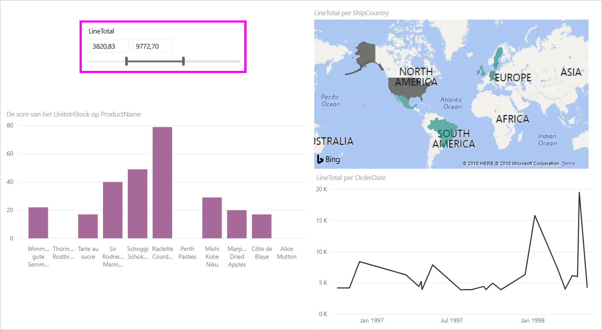
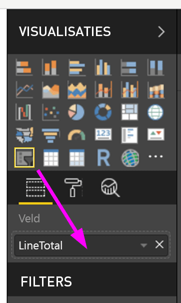
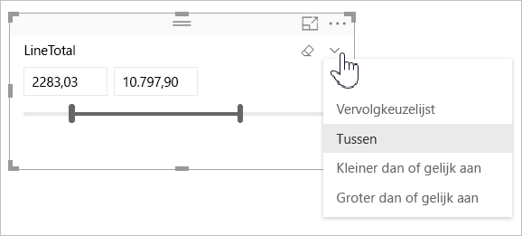
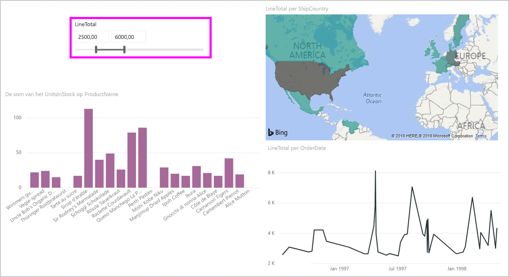
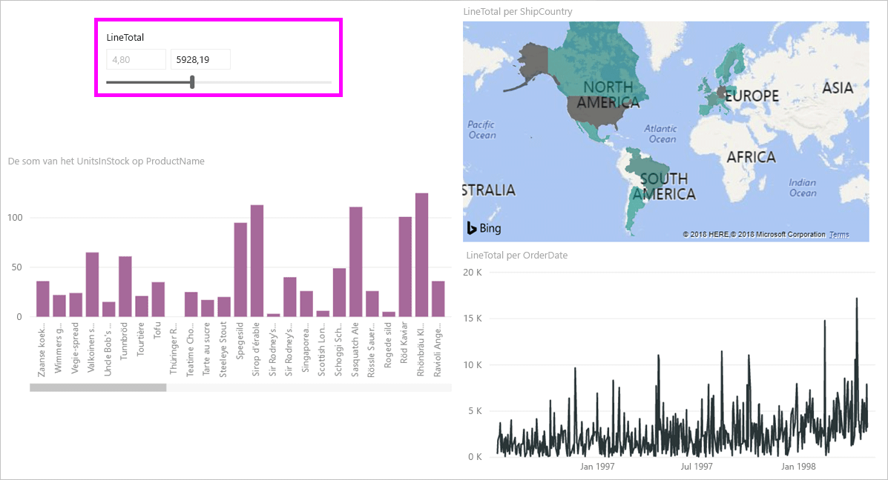
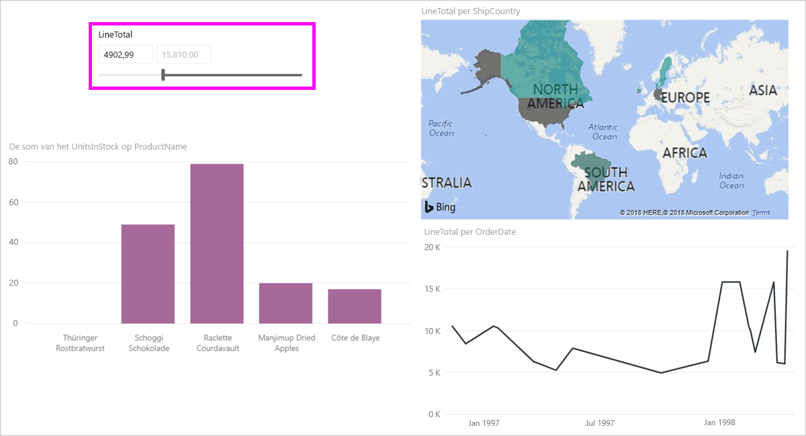

# De slicer voor numeriek bereik in Power BI Desktop gebruiken
Met de **slicer voor numeriek bereik**, kunt u allerlei filters toepassen op een van de numerieke kolommen in het gegevensmodel. U kunt er voor kiezen om te filteren **tussen** getallen, **minder dan of gelijk aan** een getal of **groter dan of gelijk aan** een getal. Hoewel dit eenvoudig klinkt, is het een zeer krachtige manier om uw gegevens te filteren.

## De slicer voor numeriek bereik gebruiken
U kunt de slicer voor numeriek bereik net als elke andere slicer gebruiken. Maak eenvoudig een visueel **slicer**-element voor uw rapport en selecteer vervolgens een numerieke waarde voor de waarde **Veld**. In de volgende afbeelding is het veld *LineTotal* geselecteerd.

Selecteer koppeling met de pijl-omlaag in de rechterbovenhoek van de **slicer voor numerik bereik**. Er wordt een menu weergegeven.

Voor het numerieke bereik kunt u een keuze maken uit de volgende drie opties:

* Tussen
* Kleiner dan of gelijk aan
* Groter dan of gelijk aan

Wanneer u **Tussen** selecteert in het menu, wordt een schuifregelaar weergegeven en kunt u filteren op numerieke waarden die tussen de getallen liggen. Naast het gebruik van de schuifregelaar zelf, kunt u ook in een vak klikken en de waarden typen. Dit is handig wanneer u wilt slicen op specifieke getallen, maar de granulatie van het bewegen van de slicerbalk maakt het lastig om precies op dat getal te belanden.

In de volgende afbeelding is de rapportpagina gefilterd voor *LineTotal*-waarden binnen een bereik van 2500.00 tot 6000.00.

Wanneer we **Kleiner dan of gelijk aan** selecteren, verdwijnt het besturingselement links (lagere waarde) van de schuifregelaar en kan alleen de bovengrens van de schuifregelaar worden aangepast. In de volgende afbeelding is het maximum van de schuifregelaar ingesteld op 5928.19.

Ten slotte, als we **Groter dan of gelijk aan** selecteren, verdwijnt het besturingselement rechts van de schuifregelaar en kunnen we de lagere waarde aanpassen, zoals op de volgende afbeelding te zien is. Nu worden alleen items met een *LineTotal* meer of gelijk aan 4902.99 weergegeven in de visuele elementen op de rapportpagina.

## Uitlijnen op hele getallen met de slicer met numeriek bereik

Een slicer met numeriek bereik lijnt uit op hele getallen, tenzij het een decimaal bereik is. Hierdoor kan uw slicer foutloos uitlijnen op gehele getallen. 

## Beperkingen en overwegingen
De volgende beperkingen en overwegingen zijn momenteel van toepassing op de **slicer met numeriek bereik**:

* De **slicer voor numeriek bereik** filtert momenteel elke onderliggende rij in de gegevens, geen statische waarden. Als bijvoorbeeld een veld *Verkoopbedrag* wordt gebruikt, wordt elke transactie op basis van *Verkoopbedrag* gefilterd, niet de som van *Verkoopbedrag* voor elk gegevenspunt van een visueel element.
* Dit werkt momenteel niet met Measures.
