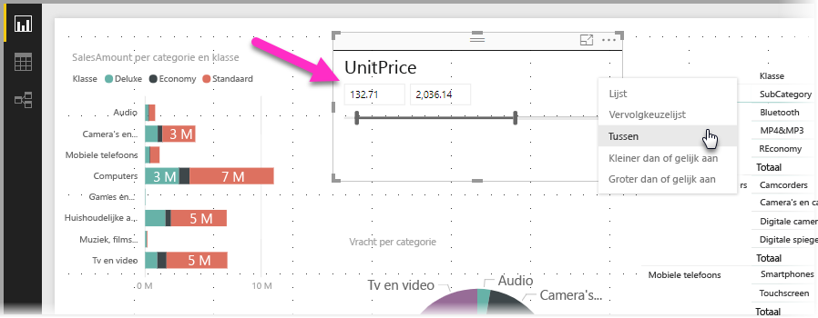
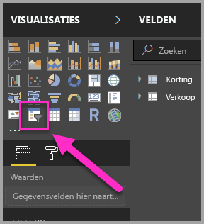
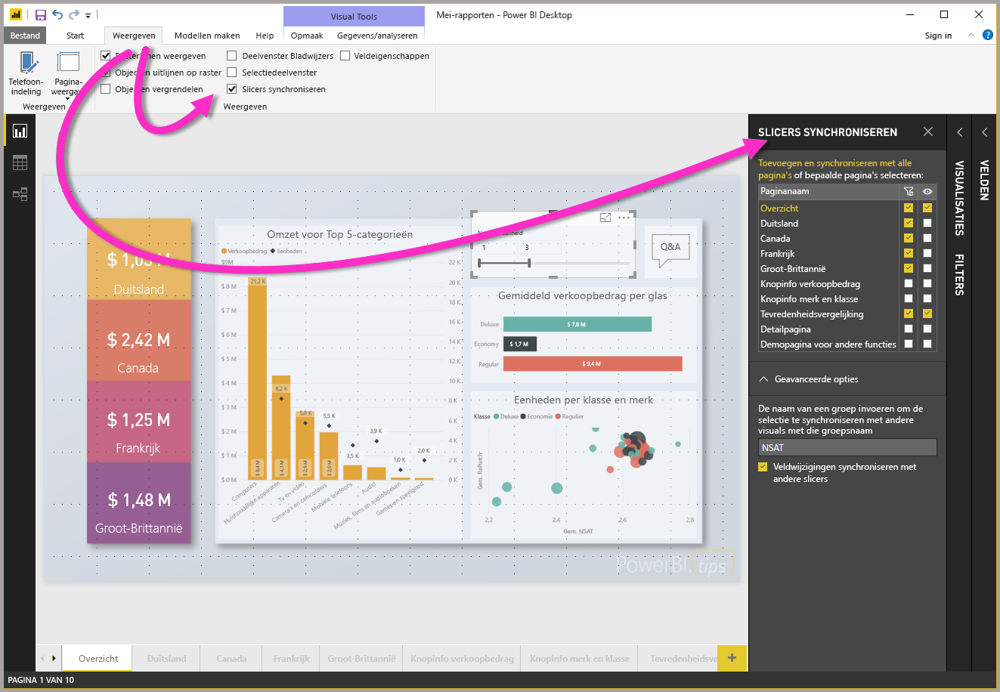
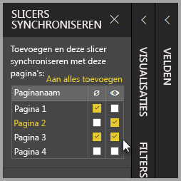

# Slicers gebruiken in Power BI Desktop

U kunt een **slicer** gebruiken in **Power BI Desktop** om de resultaten van visuals op uw rapportpagina te filteren. En met slicers kunt u het filter dat door interactie met de slicer zelf wordt toegepast, gemakkelijk aanpassen. U kunt ook opties opgeven voor hoe uw slicer wordt weergegeven en hoe u er interactie mee hebt. De volgende afbeelding toont een slicer waarbij de vervolgkeuzelijst met *typen* zichtbaar is. 

Een slicer kan worden weergegeven door middel van verschillende typen weergaven:

* Lijst
* Vervolgkeuzelijst
* Tussen
* Kleiner dan of gelijk aan
* Groter dan of gelijk aan

U kunt een slicer aan een rapport toevoegen door op de **slicer**-visual te klikken in het deelvenster **Visualisaties**.

Slicers gedragen zich op dezelfde manier in **Power BI Desktop** en **Power BI-service**. Voor een zelfstudie over het gebruik van slicers raadpleegt u [Slicers in Power BI-service (zelfstudie)](power-bi-visualization-slicers.md).

## Slicers synchroniseren op meerdere rapportpagina's

In **Power BI Desktop** kunt u slicers synchroniseren op meerdere rapportpagina's. Selecteer **Slicers synchroniseren** in het deelvenster **Weergave** op het lint om slicers te synchroniseren. Als u slicers synchroniseert, verschijnt het deelvenster **Slicers synchroniseren** zoals dat in de volgende afbeelding wordt weergegeven.

In het deelvenster **Slicers synchroniseren** kunt u opgeven hoe de slicer op meerdere rapportpagina's moet worden gesynchroniseerd. U kunt opgeven of elke slicer op elke afzonderlijke rapportpagina moet worden **toegepast** en of de slicer op elke afzonderlijke rapportpagina **zichtbaar** moet zijn.

U kunt bijvoorbeeld een slicer plaatsen op **pagina 2** van uw rapport, zoals dat in de volgende afbeelding wordt weergegeven. Vervolgens kunt u selecteren of die slicer *van toepassing* moet zijn op alle geselecteerde pagina's en of die slicer *zichtbaar* moet zijn op alle geselecteerde pagina's in het rapport. Voor elke slicer kunt u alle mogelijke combinaties van deze opties kiezen. 

Met de koppeling **Aan alles toevoegen** in het deelvenster kunt u de geselecteerde slicer toepassen op alle pagina's in het rapport.

Houd er rekening mee dat de selecties in het deelvenster **Slicers synchroniseren** alleen op de *geselecteerde slicer* van toepassing zijn. U kunt meerdere slicers op verschillende pagina's toepassen en het deelvenster gebruiken om voor elke slicer afzonderlijk te bepalen hoe die wordt toegepast op de verschillende pagina's in uw rapport. 

Hoewel uw selectie van slicers kan worden gesynchroniseerd, kunnen andere instellingen zoals vormgeving, bewerken en verwijderen *niet* worden gesynchroniseerd. 

## Volgende stappen

Wellicht bent u ook geïnteresseerd in de volgende artikelen:

* [Slicers in Power BI-service (zelfstudie)](power-bi-visualization-slicers.md)
* [De slicer voor numeriek bereik in Power BI Desktop gebruiken](desktop-slicer-numeric-range.md)
* [Een relatieve datumslicer en -filter in Power BI Desktop gebruiken](desktop-slicer-filter-date-range.md)

