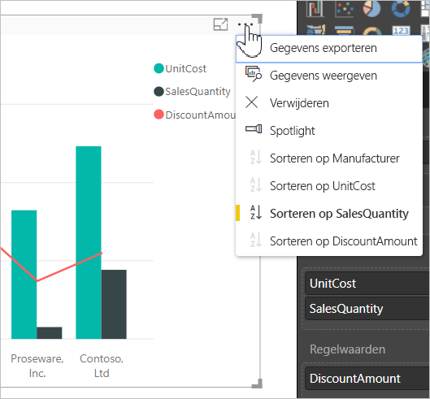
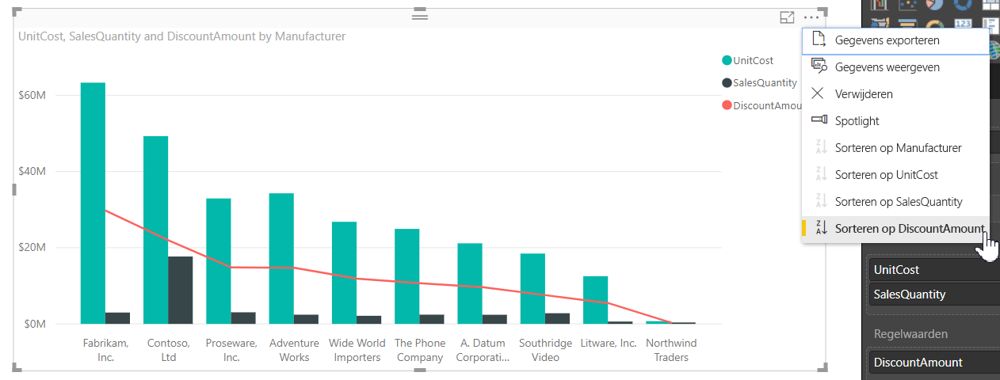
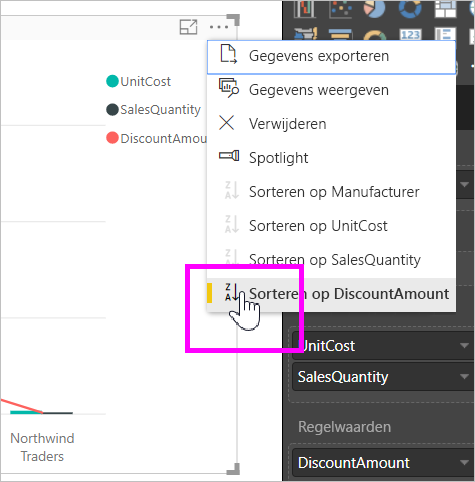
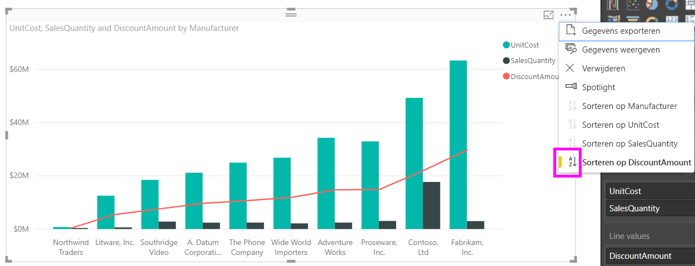
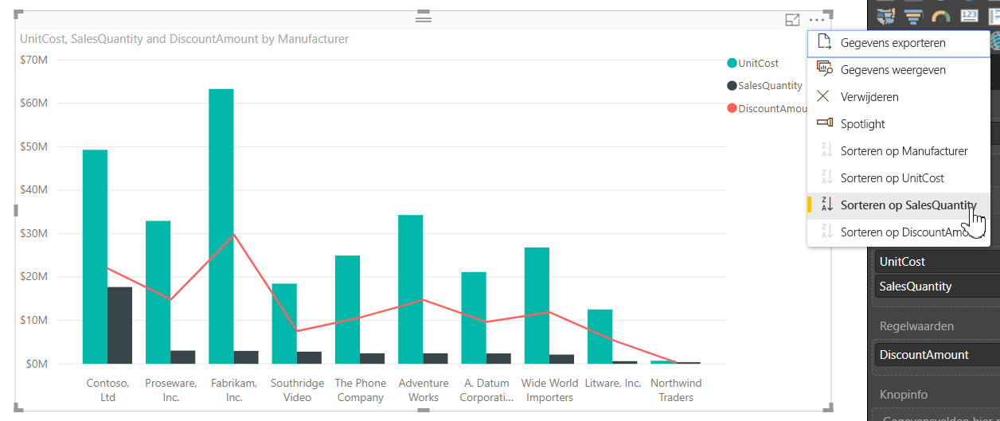
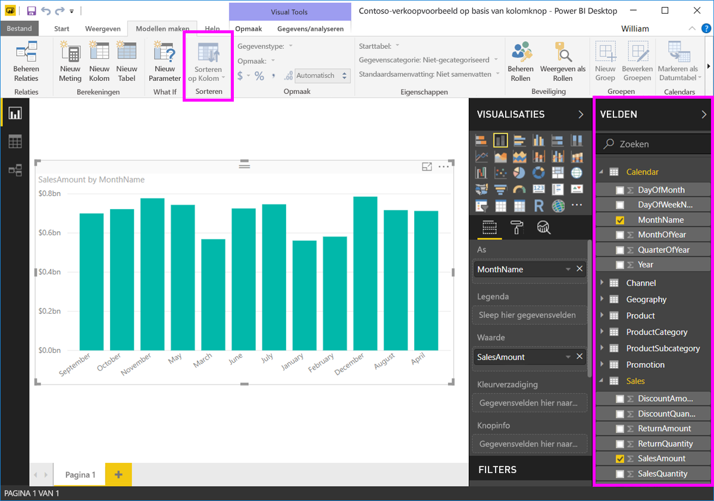
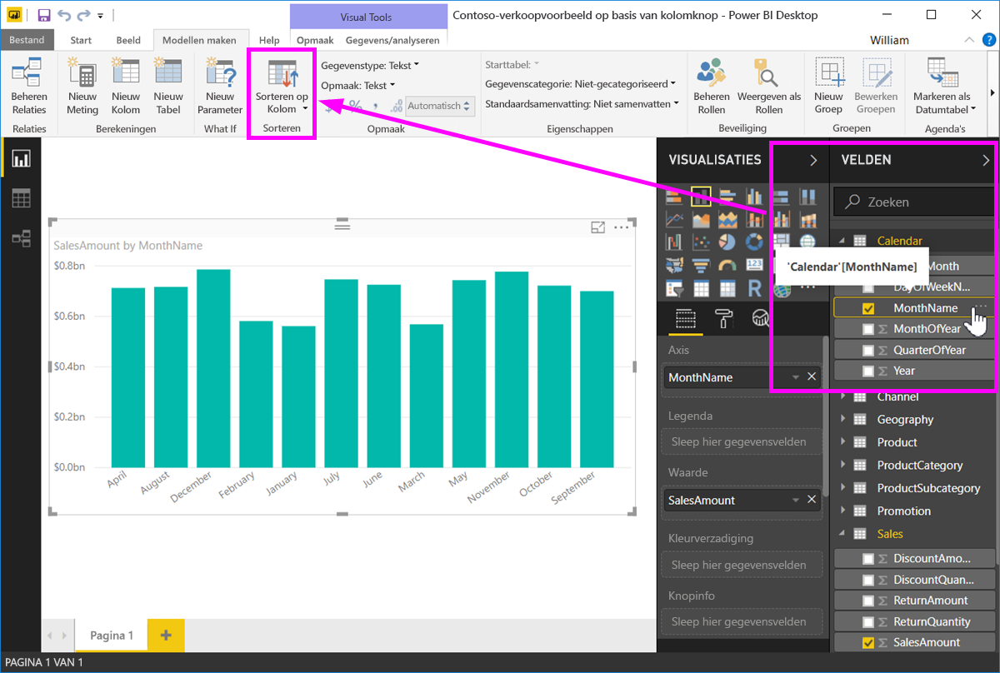
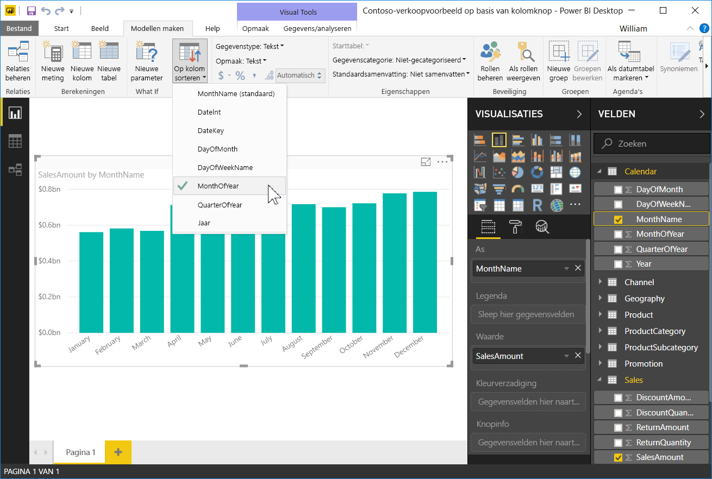
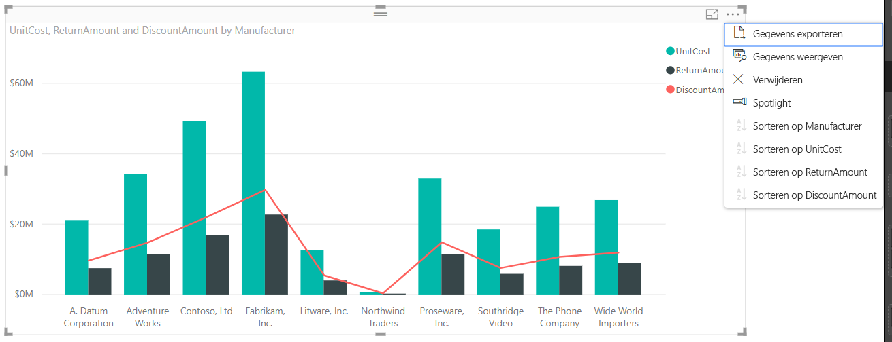

# Op kolom sorteren in Power BI Desktop
In **Power BI Desktop** en de **Power BI-service** kunt u de weergave van een visueel element wijzigen door deze op andere gegevensvelden te sorteren. Als u de sortering van een visual wijzigt, kunt u de informatie markeren die u wilt overbrengen en ervoor zorgen dat de visual de trend (of de nadruk) weergeeft.

Of u nu numerieke gegevens (zoals verkoopcijfers) of tekstgegevens (zoals provincienamen) gebruikt, u kunt uw visualisaties sorteren zoals u wilt en ze eruit laten zien zoals u wilt.  **Power BI** biedt veel flexibiliteit voor het sorteren en snelle menu's die u kunt gebruiken. Op een visual selecteert u het beletseltekenmenu (...) en vervolgens het veld waarop u wilt sorteren, zoals wordt weergegeven in de volgende afbeelding.

## Meer diepgang en een voorbeeld
We nemen een voorbeeld met meer diepgang en bekijken hoe dit werkt in **Power BI Desktop**.

De volgende visualisatie toont kosten, hoeveelheden en bedragen op naam van de fabrikant. De visualisatie ziet er als volgt uit voordat we verder gaan sorteren.

De visual is momenteel gesorteerd op **SalesQuantity**. Dit kunnen we zien doordat de kleur overeenkomt met de oplopende balken in de legenda, maar er is een betere manier om de huidige sorteerkolom te bepalen: het beletseltekenmenu (...) in de rechterbovenhoek van de visual. Wanneer we de weglatingstekens selecteren, zien we het volgende:

* Het huidige sorteerveld is **SalesQuantity**, wat u kunt ziet doordat **Sort By SalesQuantity** vetgedrukt is en een gele balk heeft. 

* De huidige sorteerrichting is van klein naar groot, aangetoond door het kleine pictogram **A/Z** (A boven Z) en een pijl omlaag.

We kijken afzonderlijk naar het sorteerveld en de sorteerrichting in de volgende twee gedeelten.

## Selecteren welke kolom moet worden gebruikt voor het sorteren
U hebt de gele balk naast **Sort By SalesQuantity** in het menu **Meer opties** zien staan; deze geeft aan dat de visual wordt gesorteerd op de kolom **SalesQuantity**. Op een andere kolom sorteren is eenvoudig: selecteer het beletselteken om het beletseltekenmenu weer te geven en selecteer vervolgens een andere kolom.

In de volgende afbeelding hebben we *DiscountAmount* geselecteerd als de kolom waarop we willen sorteren. Deze kolom is een van de lijnen op het visuele element, in plaats van een van de balken. Hier ziet u het resultaat nadat we **Sorteren op DiscountAmount** hebben geselecteerd.

U ziet hoe het visuele element is gewijzigd. De waarden worden nu gerangschikt van hoogste DiscountAmount-waarde, in deze visual Fabrikam Inc., naar Northwind Traders die de laagste waarde heeft. 

Maar wat moeten we doen als we de staten oplopend willen sorteren, in plaats van aflopend? In de volgende sectie wordt beschreven hoe gemakkelijk dit is.

## De sorteervolgorde selecteren (laag naar hoog, hoog naar laag)
Als we nog eens kijken naar het menu **Opties** in de vorige afbeelding, zien we dat het pictogram naast **Sorteren op DiscountAmount** **Z/A** (Z boven A) weergeeft. Kijk maar eens:

Wanneer **Z/A** wordt weergegeven, betekent dit dat het visuele element dat is gesorteerd op de geselecteerde kolom wordt weergegeven van de hoogste naar laagste waarde. Wilt u dit wijzigen? Geen probleem. Tik of klik eenvoudigweg op het pictogram **Z/A**. Hierdoor wordt de sorteervolgorde gewijzigd in **A/Z** en wordt het visuele element (op basis van de geselecteerde kolom) gesorteerd van de laag naar de hoogste waarde.

Hier volgt dezelfde visual, ditmaal nadat we hebben getikt op het pictogram **Z/A** in het menu **Sorteren op DiscountAmount** om de volgorde te wijzigen. U ziet dat Northwind Traders nu de eerste fabrikant in de lijst is en dat Fabrikam Inc. de laatste in de lijst, de tegenovergestelde sorteervolgorde als eerst.

U kunt sorteren op elke kolom die is opgenomen in de visual. We kunnen heel eenvoudig SalesQuantity selecteren als de kolom waarop we willen sorteren, met **Sorteren op SalesQuantity** om de fabrikanten die het meeste hebben verkocht als eerste weer te geven. Hierbij kunnen we de andere kolommen in de visual behouden, ongeacht de manier waarop ze van toepassing zijn op die fabrikant. Hier ziet u het visuele element met deze instellingen.

## Sorteren met de knop Sorteren op kolom
Er is een andere manier om uw gegevens te sorteren, en dat doet u met behulp van de knop **Sorteren op kolom** in het lint **Modelleren**.

Als u deze aanpak voor het sorteren gebruikt, moet u een kolom selecteren in het deelvenster **Velden** en vervolgens de knop **Sorteren op kolom** selecteren om te kiezen hoe (op welke kolom) u het visuele element wilt sorteren. U moet de kolom (veld) die u wilt sorteren selecteren in het deelvenster **Velden** om de knop **Sorteren op kolom** te activeren. Anders is deze knop inactief.

Laten we een veelvoorkomend voorbeeld bekijken. U hebt gegevens van elke maand van het jaar en u wilt ze sorteren op chronologische volgorde. U doet dit met de volgende stappen.

1. U ziet allereerst dat de knop **Sorteren op kolom** inactief is (lichter gekleurd) wanneer het visuele element is geselecteerd, maar er is geen kolom is geselecteerd in het deelvenster **Velden**.
   
   

2. Wanneer we de kolom selecteren waarop we wilt sorteren in het deelvenster **Velden**, wordt de knop **Sorteren op kolom** geactiveerd.
   
   
3. Nu de visual is geselecteerd, kunnen we *MonthOfYear* selecteren, in plaats van de standaardoptie (*MonthName*). De visual wordt nu gesorteerd in de volgorde die we willen: op de maand van het jaar.
   
   

Dat is alles. Houd er rekening mee dat u een kolom moet selecteren in het deelvenster **Velden** om de knop **Sorteren op kolom** te activeren.

## De standaardkolom voor sorteren opnieuw instellen
U kunt sorteren op elke kolom die u maar wilt, maar het kan gebeuren dat u het visuele element weer wilt sorteren op basis van de standaardkolom. Geen enkel probleem. Voor een visual waarvoor een sorteerkolom is geselecteerd (een geselecteerde sorteerkolom heeft een gele balk ernaast in het beletseltekenmenu, zoals we al hebben gezien), opent u het menu **Meer opties** en selecteert u die kolom opnieuw. De visualisatie wordt nu weergegeven op basis van de standaard sorteerkolom.

Dit is bijvoorbeeld het vorige diagram:

Wanneer we teruggaan naar het menu en **SalesQuantity** opnieuw selecteren, wordt de visual standaard op alfabetische volgorde gesorteerd op **Fabrikant**, zoals wordt weergegeven in de volgende afbeelding.

U hebt zoveel opties voor het sorteren van uw visuele elementen dat het maken van de grafiek of afbeelding die u wilt kinderspel is.

