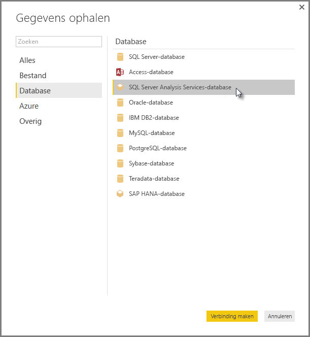

# Verbinding maken met multidimensionale modellen van SSAS in Power BI Desktop
Met Power BI Desktop hebt u toegang tot **multidimensionale modellen van SSAS**, vaak **SSAS MD** genoemd.

Om verbinding te maken met een **SSAS MD**-database, selecteert u **Gegevens ophalen &gt; Database &gt; SQL Server Analysis Services-database**, zoals weergegeven op de volgende afbeelding.

**Multidimensionale modellen van SSAS** in de live-verbindingsmodus worden ondersteund in zowel de Power BI-service als in Power BI Desktop. U kunt ook rapporten die gebruikmaken van **multidimensionale modellen van SSAS** in de livemodus publiceren en uploaden naar de Power BI-service.

## Mogelijkheden en functies van SSAS MD
In de volgende secties worden onderdelen en functies van Power BI- en SSAS MD-verbindingen beschreven.

### Metagegevens van de multidimensionale modellen in tabelvorm
In de volgende tabel wordt de overeenkomst weergegeven tussen multidimensionale objecten en de metagegevens in tabelvorm die worden geretourneerd naar Power BI Desktop. Power BI doorzoekt het model op metagegevens in tabelvorm en op basis van de geretourneerde metagegevens worden de juiste DAX-query's uitgevoerd op Analysis Services wanneer u een visualisatie, zoals een tabel, een matrix, een grafiek of een slicer, maakt.

| Multidimensionaal BISM-object | Metagegevens in tabelvorm |
| --- | --- |
| Kubus |Model |
| Kubusdimensie |Tabel |
| Dimensiekenmerken (sleutels) naam) |Kolommen |
| Meetgroep |Tabel |
| Meting |Meting |
| Metingen zonder gekoppelde meetgroep |In de tabel met de naam *Metingen* |
| Relatie meetgroep -> kubusdimensie |Relatie |
| Perspectief |Perspectief |
| KPI |KPI |
| Gebruiker/bovenliggende en onderliggende hiërarchieën |Hiërarchieën |

### Metingen, meetgroepen en KPI 's
Meetgroepen in een multidimensionale kubus worden in Power BI weergegeven als tabellen met het teken ∑ ernaast in het deelvenster **Velden**. Berekende metingen zonder gekoppelde meetgroep worden gegroepeerd onder een speciale tabel met de naam *Metingen* in de metagegevens in tabelvorm.

In een multidimensionaal model kunt u een set metingen of KPI's in een kubus definiëren met als locatie een *weergavemap*, waarmee u complexe modellen kunt vereenvoudigen. Power BI herkent weergavemappen in metagegevens in tabelvorm en toont metingen en KPI's in de weergavemappen. KPI's in multidimensionale databases ondersteunen *Waarde*, *Doel*, *Statusgrafiek* en *Trendgrafiek*.

### Dimensiekenmerktype
Multidimensionale modellen ondersteunen ook het koppelen van dimensiekenmerken aan specifieke dimensiekenmerktypen. Bijvoorbeeld een dimensie **Geografie** waar de dimensiekenmerken *Stad*, *Staat-provincie*, *Land* en *Postcode* waaraan de juiste geografietypen zijn gekoppeld in de metagegevens in tabelvorm worden weergegeven. Power BI herkent de metagegevens. zodat u kaartvisualisaties kunt maken. U herkent deze koppelingen aan het *kaart*pictogram naast het element in het deelvenster **Veld** in Power BI.

Power BI kan ook afbeeldingen weergeven wanneer u een veld met URL's (Uniform Resource Locator) van de afbeeldingen opgeeft. U kunt deze velden opgeven als het type *ImageURL* in SQL Server Data Tools (of daarna in Power BI), en het bijbehorende type wordt voor Power BI opgegeven in de metagegevens in tabelvorm. Power BI kan deze afbeeldingen vervolgens ophalen van de URL en weergeven als visuele elementen.

### Bovenliggende en onderliggende hiërarchieën
Multidimensionale modellen ondersteunen bovenliggende en onderliggende hiërarchieën die worden weergegeven als een *hiërarchie* in de metagegevens in tabelvorm. Elk niveau van de bovenliggende/onderliggende hiërarchie wordt weergegeven als een verborgen kolom in de metagegevens in tabelvorm. Het sleutelkenmerk van de bovenliggende/onderliggende dimensie wordt niet weergegeven in de metagegevens in tabelvorm.

### Berekende leden van dimensies
Multidimensionale modellen ondersteunen het maken van verschillende typen *berekende leden*. De twee meest voorkomende typen berekende leden zijn de volgende:

* Berekende leden in kenmerkhiërarchieën en niet op hetzelfde niveau als *Alle*
* Berekende leden in gebruikershiërarchieën

Multidimensionale modellen geven *berekende leden in kenmerkhiërarchieën* weer als waarden van een kolom. Er zijn een paar extra opties en beperkingen bij het weergeven van dit type berekend lid:

* Dimensiekenmerk kan een optioneel *UnknownMember* hebben
* Een kenmerk dat berekende leden bevat, kan niet het hoofdkenmerk van de dimensie zijn, tenzij dit het enige kenmerk van de dimensie is
* Een kenmerk dat berekende leden bevat, kan niet een bovenliggend/onderliggend kenmerk zijn

De berekende leden van de gebruikershiërarchieën worden niet weergegeven in Power BI. U kunt wel verbinding maken met een kubus met berekende leden in gebruikershiërarchieën, maar u kunt geen berekende leden zien als ze niet voldoen aan de beperkingen die zijn vermeld in de vorige opsomming.

### Beveiliging
Multidimensionale modellen ondersteunen beveiliging op dimensie- en celniveau via *rollen*. Wanneer u verbinding met een kubus met Power BI maakt, wordt u geverifieerd en geëvalueerd op de juiste machtigingen. Wanneer op een gebruiker *dimensiebeveiliging* is toegepast, worden de leden van de respectieve dimensie niet zichtbaar voor de gebruiker in Power BI. Wanneer voor een gebruiker echter de machtiging *celbeveiliging* is gedefinieerd, waarbij bepaalde cellen zijn beperkt, kan die gebruiker geen verbinding maken met de kubus via Power BI.

## Beperkingen van multidimensionale modellen van SSAS in Power BI Desktop
Er gelden bepaalde beperkingen voor het gebruik van **SSAS MD**:

* Op servers moet SQL Server 2012 SP1 CU4 of een hogere versie van Analysis Services worden uitgevoerd voor een goede werking van de connector voor Power BI Desktop SSAS MD
* *Acties* en *benoemde sets* zijn niet beschikbaar in Power BI, maar u kunt wel verbinding maken met kubussen die ook *acties* of *benoemde sets* bevatten. Ook kunt u visuele elementen en rapporten maken.

## Ondersteunde functies van SSAS MD in Power BI Desktop
De volgende functies van SSAS MD worden ondersteund in Power BI Desktop:

* Gebruik van de volgende elementen wordt ondersteund in deze release van **SSAS MD** (u kunt [meer informatie](https://msdn.microsoft.com/library/jj969574.aspx) over deze functies krijgen):
  * Mappen weergeven
  * KPI-trends
  * Standaardleden
  * Dimensiekenmerken
  * Berekende leden voor dimensies (moet een enkel echt lid zijn wanneer de dimensie meer dan één kenmerk heeft, kan niet het hoofdkenmerk van de dimensie zijn tenzij dit het enige kenmerk is en kan geen bovenliggend/onderliggende kenmerk zijn)
  * Dimensiekenmerktypen
  * Hiërarchieën
  * Metingen (met of zonder meetgroepen)
  * Metingen als variant
  * KPI's
  * ImageUrls
  * Dimensiebeveiliging

