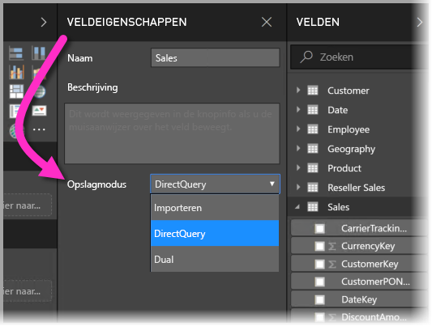
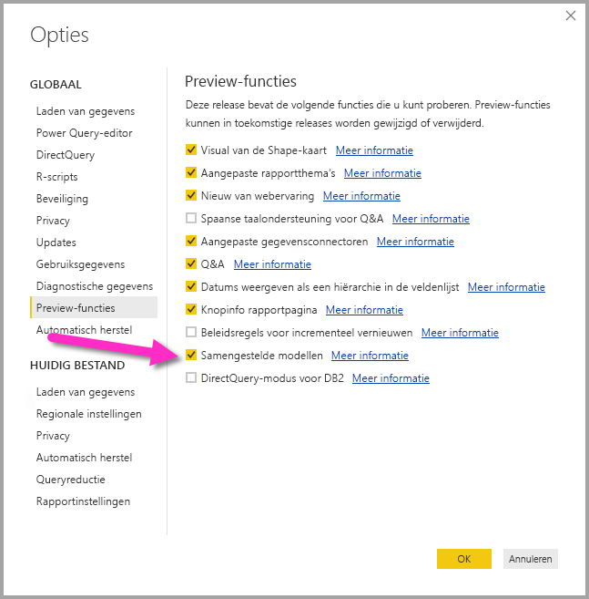
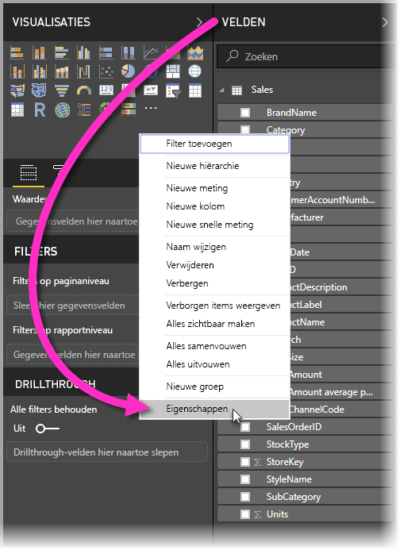
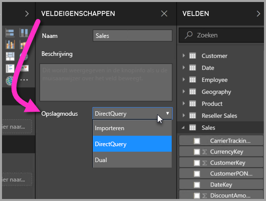
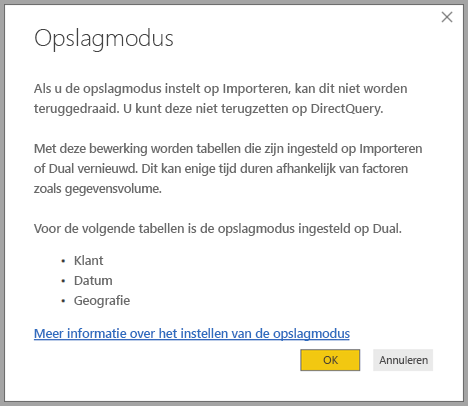

# Opslagmodus in Power BI Desktop (preview-versie)

In **Power BI Desktop** kunt u de **opslagmodus** van tabellen opgeven. Hierdoor kunt u bepalen of tabelgegevens in het cachegeheugen moeten worden opgeslagen voor rapporten. 

Het instellen van de **opslagmodus** biedt verschillende voordelen. U kunt de **opslagmodus** afzonderlijk instellen voor elke tabel in uw model, waardoor u een gegevensset toegang biedt tot een of meer van de volgende voordelen:

* **Queryprestaties**: als gebruikers interactie hebben met visualisaties in Power BI-rapporten werken, worden er DAX-query's verzonden naar de gegevensset. Het opslaan van gegevens in het cachegeheugen door het juist instellen van de **opslagmodus** kan de prestaties van query's en de interactiviteit van uw rapporten verbeteren.
* **Grote gegevenssets**: tabellen die niet in het cachegeheugen worden opgeslagen, verbruiken geen geheugen voor cachebewerkingen. U kunt interactieve analyse inschakelen voor grote gegevenssets die te groot of te duur zijn om volledig op te slaan in het cachegeheugen. U kunt kiezen voor welke tabellen het zinvol is om deze op te slaan in de cache en voor welke niet.
* **Optimalisatie van gegevensvernieuwing**: tabellen die niet in de cache worden opgeslagen, hoeven niet te worden vernieuwd. U kunt de vernieuwingstijden beperken door alleen de gegevens op te slaan in de cache die noodzakelijk zijn om te voldoen aan de serviceovereenkomsten en uw zakelijke vereisten.
* **Vereisten voor bijna realtime gegevens**: voor tabellen met gegevens die in bijna realtime beschikbaar moeten zijn, kan het beter zijn om de gegevens niet in de cache op te slaan, om zo de gegevenslatentie te verminderen.
* **Terugschrijven**: terugschrijven (write-back) stelt zakelijke gebruikers in staat om what-if-scenario's te verkennen door celwaarden te wijzigen. Maatwerktoepassingen kunnen wijzigingen aanbrengen in de gegevensbron. Tabellen die niet in de cache worden opgeslagen, kunnen direct worden bijgewerkt, waardoor de effecten direct kunnen worden geanalyseerd.

De instelling **Opslagmodus** in **Power BI Desktop** is een van drie gerelateerde functies:

* **Samengestelde modellen**: maakt het mogelijk dat een rapport meerdere gegevensverbindingen heeft, inclusief DirectQuery-verbindingen of importverbindingen, in elke gewenste combinatie.
* **Veel-op-veel-relaties**: met **samengestelde modellen** kunt u **veel-op-veel-relaties** instellen tussen tabellen, waardoor de vereisten voor unieke waarden in tabellen worden weggenomen, en er ook geen noodzaak meer is voor eerdere tijdelijke oplossingen zoals het toevoegen van nieuwe tabellen alleen maar om relaties te kunnen opzetten. 
* **Opslagmodus**: u kunt nu opgeven welke visualisaties een query naar de back-end-gegevensbronnen vereisen. Visualisaties waarvoor dit niet nodig is, worden geïmporteerd, zelfs als ze zijn gebaseerd op DirectQuery. Hierdoor kunnen de prestaties worden verbeterd en wordt de back-end minder belast. Eerder was het zo dat zelfs voor eenvoudige visualisaties zoals slicers, er query's werden verzonden naar de back-end-bronnen. 

Deze verzameling van drie gerelateerde functies voor **samengestelde modellen** worden in afzonderlijke artikelen beschreven:

* **Samengestelde modellen** worden beschreven in het artikel [Samengestelde modellen in Power BI Desktop (preview-versie)](desktop-composite-models.md).
* **Veel-op-veel-relaties** worden beschreven in het artikel [Veel-op-veel-relaties in Power BI Desktop (preview-versie)](desktop-many-to-many-relationships.md).
* **Opslagmodus** wordt beschreven in dit artikel.

## De preview-versie van de functie Opslagmodus inschakelen

De voorziening **Opslagmodus** is nog in preview en moet afzonderlijk worden ingeschakeld in **Power BI Desktop**. U kunt de voorziening **Opslagmodus** inschakelen door **Bestand > Opties en instellingen > Opties > Preview-functies** te selecteren en vervolgens het selectievakje **Samengestelde modellen** in te schakelen. 

U moet **Power BI Desktop** opnieuw starten om de voorziening in te schakelen.

## Eigenschap Opslagmodus gebruiken

**Opslagmodus** is een eigenschap die u voor elke tabel in uw model kunt instellen. Om de **opslagmodus** in te stellen, selecteert u de tabel in het deelvenster **Velden** en klikt u vervolgens met de rechtermuisknop om het contextmenu weer te geven. Selecteer **Eigenschappen** in het contextmenu.

De selectie van **opslagmodus** wordt weergegeven in het deelvenster **Veldeigenschappen** voor de tabel. Hier kunt u de huidige **opslagmodus** bekijken of wijzigen.

Er zijn drie mogelijke waarden voor **opslagmodus**:

* **Importeren**: als u deze waarde kiest, worden geïmporteerde tabellen in de cache opgeslagen **.** Query's die worden verzonden naar de Power BI-gegevensset die gegevens retourneren uit importtabellen, kunnen alleen worden uitgevoerd aan de hand van gegevens in de cache.
* **DirectQuery**: met deze instelling worden DirectQuery tabellen niet in de cache opgeslagen. Query's die worden verzonden naar de Power BI-gegevensset (bijvoorbeeld DAX-query's) die gegevens uit DirectQuery-tabellen als resultaat geven, kunnen alleen worden voltooid door het uitvoeren van query's op aanvraag op de gegevensbron. Query's die worden verzonden naar de gegevensbron gebruiken de querytaal voor die gegevensbron (bijvoorbeeld SQL).
* **Dual**: Dual-tabellen worden al dan niet in de cache opgeslagen, afhankelijk van de context van de query die wordt verzonden naar de Power BI-gegevensset. In sommige gevallen worden query's voltooid aan de hand van gegevens in de cache. In andere gevallen worden query's voltooid door het uitvoeren van een query op aanvraag op de gegevensbron.

Het wijzigen van een tabel in Importeren is een *onomkeerbare* bewerking. De opslagmodus van de tabel kan dan niet meer worden gewijzigd in DirectQuery of Dual.

## Beperkingen voor DirectQuery- en Dual-tabellen

Voor Dual-tabellen gelden dezelfde beperkingen als voor DirectQuery-tabellen. Het betreft hier beperkte M-transformaties en beperkte DAX-functies in berekende kolommen. Zie [Gevolgen van het gebruik van DirectQuery](desktop-directquery-about.md#implications-of-using-directquery) voor meer informatie.

## Regels voor relaties tussen tabellen met verschillende opslagmodi

Relaties moeten voldoen aan regels op basis van de **opslagmodus** van de gerelateerde tabellen. In dit gedeelte vindt u voorbeelden van geldige combinaties. Zie [Veel-op-veel-relaties in Power BI Desktop (preview-versie)](desktop-many-to-many-relationships.md) voor uitgebreide informatie.

Voor een gegevensset met één gegevensbron zijn de volgende combinaties van **1-op-veel**-relaties geldig:

| Tabel aan **veel**-zijde | Tabel aan **1**-zijde |
| ------------- |----------------------| 
| Dual          | Dual                 | 
| Importeren        | Importeren of Dual       | 
| DirectQuery   | DirectQuery of Dual  | 

## Doorgifte van Dual
We kijken naar een voorbeeld. In dit eenvoudige model zijn alle tabellen afkomstig uit één bron, die ondersteuning biedt voor de opslagmodi Importeren en DirectQuery.

Stel dat alle tabellen in dit model in eerste instantie de opslagmodus DirectQuery hebben. Als we nu de **opslagmodus** van de tabel *SurveyResponse* wijzigen in Importeren, wordt het volgende bericht weergegeven:

De dimensietabellen (*Customer*, *Date* en *Geography*) moeten worden ingesteld op **Dual** om te voldoen aan de eerder beschreven regels voor relaties tussen tabellen. In plaats van dat deze tabellen vooraf moeten worden ingesteld op **Dual**, kunt u ze in één bewerking instellen.

De doorgiftelogica is namelijk ontworpen om u te helpen met modellen die veel tabellen bevatten. Stel dat u een model hebt met 50 tabellen en dat alleen bepaalde feitentabellen (met transacties) in de cache moeten worden opgeslagen. De logica in **Power BI Desktop** bepaalt wat de minimale set met dimensietabellen is die moet worden ingesteld op **Dual**, zodat u dat niet hoeft te doen.

De doorgiftelogica wordt slechts aan de een-zijde van **1-op-veel**-relaties doorlopen.

* Het wijzigen van de tabel *Customer* in **Importeren** (in plaats van het wijzigen van *SurveyResponse*) is niet toegestaan vanwege de relaties van deze tabel met de DirectQuery-tabellen *Sales* en *SurveyResponse*.
* Het wijzigen van de tabel *Customer* in **Dual** (in plaats van het wijzigen van *SurveyResponse*) is toegestaan. De doorgiftelogica zorgt ervoor dat de tabel *Geography* ook wordt ingesteld op **Dual**.

## Praktijkvoorbeeld van opslagmodus
Laten we verdergaan met het voorbeeld uit het vorige gedeelte en doen alsof we de volgende instellingen van de eigenschap **opslagmodus** toepassen:

| Tabel                   | Opslagmodus         |
| ----------------------- |----------------------| 
| *Sales*                 | DirectQuery          | 
| *SurveyResponse*        | Importeren               | 
| *Date*                  | Dual                 | 
| *Customer*              | Dual                 | 
| *Geography*             | Dual                 | 

Het doorvoeren van deze instellingen voor de eigenschap Opslagmodus resulteert in de volgende gedragingen, ervan uitgaande dat de tabel *Sales* voldoende gegevens bevat.
* De dimensietabellen (*Date*, *Customer* en *Geography*) worden in de cache opgeslagen, zodat de laadtijden van rapporten kort zijn bij het ophalen van slicerwaarden om weer te geven.
* Door de tabel *Sales* niet in de cache op te slaan, gebeurt het volgende:
    * De vernieuwingsintervallen van gegevens zijn korter en het geheugenverbruik is lager
    * Rapportquery's op basis van de tabel *Sales* worden uitgevoerd in de DirectQuery-modus, die meer tijd in beslag kan nemen, maar die dichter in de buurt komt bij realtime omdat er geen cachinglatentie wordt geïntroduceerd

* Rapportquery's op basis van de tabel *SurveyResponse* worden geretourneerd uit de geheugencache en moeten dus relatief snel zijn.

## Query's op de cache die wel of geen hit opleveren

Door **SQL Profiler** te verbinden met de diagnostische poort voor **Power BI Desktop** kunt u zien welke query's op de cache succesvol zijn of mislukken door een trace uit te voeren op de volgende gebeurtenissen:

* Queries Events\Query Begin
* Query Processing\Vertipaq SE Query Begin
* Query Processing\DirectQuery Begin

Voor elke gebeurtenis *Query Begin* controleert u andere gebeurtenissen met dezelfde *ActivityID*. Als er bijvoorbeeld geen gebeurtenis *DirectQuery Begin* is, maar wel een gebeurtenis *Vertipaq SE-Query Begin*, is de query beantwoord vanuit de cache.

Query's die verwijzen naar tabellen met de opslagmodus **Dual** retourneren gegevens uit de cache indien mogelijk, anders vallen ze terug op DirectQuery.

Als we verdergaan met het vorige voorbeeld, verwijst de volgende query alleen naar een kolom uit de tabel *Date*, die is ingesteld als **Dual**. De query moet daarom een hit geven uit de cache.

De volgende query verwijst alleen naar een kolom uit de tabel *Sales*, die in de modus **DirectQuery** staat. De query moet daarom *geen hit* opleveren uit de cache.

De volgende query is interessant omdat hierin beide kolommen worden gecombineerd. Deze query levert geen hit op uit de cache. In eerste instantie zult u denken dat er *CalendarYear*-waarden worden opgehaald uit de cache en *SalesAmount*-waarden uit de bron en dat de resultaten vervolgens worden gecombineerd. Dit is echter minder efficiënt dan het verzenden van de bewerking SUM/GROUP BY naar het bronsysteem. Als de bewerking naar de bron wordt gepusht, zal het aantal geretourneerde rijen waarschijnlijk veel lager zijn. 

> [!NOTE]
> Dit gedrag verschilt van [veel-op-veel-relaties in Power BI Desktop (preview-versie)](desktop-many-to-many-relationships.md) als er een combinatie wordt gemaakt van tabellen die wel en die niet in de cache zijn opgeslagen.

## Caches moeten steeds worden gesynchroniseerd

De query's in het vorige gedeelte laten zien dat **Dual**-tabellen soms wel een hit opleveren uit de cache en soms niet. Als gevolg hiervan kunnen er verschillende waarden worden geretourneerd wanneer de cache verouderd is. Bij het uitvoeren van query's wordt er niet geprobeerd om gegevensproblemen te maskeren, bijvoorbeeld door DirectQuery resultaten te filteren zodat deze overeenkomen met de waarden in de cache. Het is uw verantwoordelijkheid om te weten hoe de gegevensstromen lopen en uw ontwerp hierop af te stemmen. Er zijn in de praktijk bewezen technieken om dergelijke gevallen bij de bron af te handelen, indien nodig.

De opslagmodus **Dual** biedt een optimalisatie van prestaties. Gebruik de modus alleen op manieren die geen conflict opleveren met het voldoen aan zakelijke vereisten. Voor een alternatieve aanpak kunt u de technieken overwegen die worden beschreven in het artikel [Veel-op-veel-relaties in Power BI Desktop (preview-versie)](desktop-many-to-many-relationships.md).

## Gegevensweergave
Als voor ten minste één tabel in de gegevensset de **opslagmodus** is ingesteld op Importeren of Dual, wordt het tabblad **Gegevensweergave** weergegeven.

Wanneer u een tabel met de opslagmodus **Dual** of **Importeren** selecteert in de *gegevensweergave**, bevat de tabel gegevens uit de cache. DirectQuery-tabellen bevatten geen gegevens. U ziet een bericht met de mededeling dat DirectQuery tabellen niet kunnen worden weergegeven.

## Beperkingen en overwegingen

Er gelden enkele beperkingen voor deze release van **opslagmodus**, en de correlatie ervan met **samengestelde modellen**.

De volgende (multidimensionale) Live Connect-bronnen kunnen niet worden gebruikt met **samengestelde modellen**:

* SAP HANA
* SAP Business Warehouse
* SQL Server Analysis Services
* Power BI-gegevenssets
* Azure Analysis Services

Als u met behulp van DirectQuery verbinding maakt met deze multidimensionale bronnen, is het niet mogelijk om ook nog verbinding te maken met een andere DirectQuery-bron. Het is dan evenmin mogelijk om te combineren met geïmporteerde gegevens.

De bestaande beperkingen van het gebruik van DirectQuery gelden nog steeds wanneer u **samengestelde modellen** gebruikt. Veel van deze beperkingen zijn nu per tabel, al naar gelang de **opslagmodus** van de tabel. Zo kan een berekende kolom in een geïmporteerde tabel verwijzen naar andere tabellen, maar kan een berekende kolom in een DirectQuery-tabel nog steeds alleen verwijzen naar kolommen in dezelfde tabel. Andere beperkingen gelden voor het model als geheel, als een van de tabellen in het model DirectQuery gebruikt. De functies **QuickInsights** en **Q&A** zijn bijvoorbeeld niet beschikbaar voor een model als een van de tabellen in het model de **opslagmodus** DirectQuery heeft. 

## Volgende stappen

De volgende artikelen bevatten meer informatie over samengestelde modellen, evenals een gedetailleerde beschrijving van DirectQuery.

* [Samengestelde modellen in Power BI Desktop (preview-versie)](desktop-composite-models.md)
* [Veel-op-veel-relaties in Power BI Desktop (preview-versie)](desktop-many-to-many-relationships.md)

DirectQuery-artikelen:

* [DirectQuery gebruiken in Power BI](desktop-directquery-about.md)
* [Gegevensbronnen die worden ondersteund door DirectQuery in Power BI](desktop-directquery-data-sources.md)

