# Zelfstudie: Berekende kolommen in Power BI Desktop maken

De gegevens die u analyseert bevatten soms niet een bepaald veld dat u nodig hebt om de gewenste resultaten te krijgen. In dergelijke gevallen bieden *berekende kolommen* uitkomst. Berekende kolommen gebruiken DAX-formules (Data Analysis Expressions) om waarden voor een kolom te berekenen, alles van het samenbrengen van tekstwaarden uit een aantal verschillende kolommen tot het berekenen van een numerieke waarde op basis van andere waarden. Stel bijvoorbeeld dat uw gegevens de velden **Plaats** en **Staat** bevatten, terwijl u één veld **Locatie** wilt waarin beide waarden als één waarde zijn opgenomen, zoals Miami, FL. En dat is precies waarvoor berekende kolommen bedoeld zijn.

Berekende kolommen zijn vergelijkbaar met [metingen](desktop-tutorial-create-measures.md) in die zin dat beide gebaseerd zijn op een DAX-formule, maar van elkaar verschillen in de manier waarop ze worden gebruikt. U gebruikt vaak metingen in het gebied **Waarden** van een visualisatie om resultaten op basis van andere velden te berekenen. U gebruikt berekende kolommen als nieuwe **Velden** in de rijen, assen, legenda's en groepsgebieden van visualisaties.

Deze zelfstudie bevat uitleg en een stapsgewijze procedure voor het maken van enkele berekende kolommen en het gebruik hiervan in rapportvisualisaties in Power BI Desktop. 

### Vereisten
- Deze zelfstudie is bedoeld voor Power BI-gebruikers die al bekend zijn met het gebruik van Power BI Desktop en eraan toe zijn om geavanceerdere modellen te maken. U dient al te weten hoe u **Gegevens ophalen** en de **Power Query-editor** gebruikt om gegevens te importeren, hoe u werkt met meerdere verwante tabellen en hoe u velden toevoegt aan het rapportcanvas. Raadpleeg [Aan de slag met Power BI Desktop](desktop-getting-started.md) als u nog geen ervaring hebt met het gebruik van Power BI Desktop.
  
- In de zelfstudie wordt gebruikgemaakt van het [Contoso-verkoopvoorbeeld voor Power BI Desktop](http://download.microsoft.com/download/4/6/A/46AB5E74-50F6-4761-8EDB-5AE077FD603C/Contoso%20Sales%20Sample%20for%20Power%20BI%20Desktop.zip), hetzelfde voorbeeld dat wordt gebruikt voor de zelfstudie [Create your own measures in Power BI Desktop](desktop-tutorial-create-measures.md) (Uw eigen metingen maken in Power BI Desktop). Deze verkoopgegevens van het fictieve bedrijf Contoso, Inc. zijn geïmporteerd uit een database. U kunt daarom geen verbinding maken met de gegevensbron en ook geen gegevens weergeven in de Power Query-editor. Download het bestand en pak het uit op uw computer, en open het vervolgens in Power BI Desktop.

## Een berekende kolom maken met waarden uit verwante tabellen

U wilt in uw verkooprapport productcategorieën en subcategorieën weergeven als enkele waarden, zoals Mobiele telefoons – accessoires, Mobiele telefoons – smartphones & PDA's enzovoort. Er is geen veld in de lijst **Velden** dat u die gegevens biedt, maar er is een veld **ProductCategory** en een veld **ProductSubcategory**, elk in een eigen tabel. U kunt een berekende kolom maken waarin waarden van deze twee kolommen worden gecombineerd. DAX-formules kunnen gebruikmaken van alle mogelijkheden van het model dat u al hebt, inclusief relaties tussen verschillende tabellen die al bestaan. 

 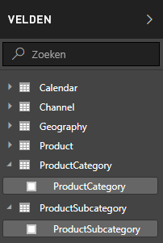

1.  Selecteer het beletselteken (...) voor **Meer opties** of klik met de rechtermuisknop op de tabel **ProductSubcategory** in de lijst Velden en selecteer vervolgens **New Column**. Hiermee maakt u de nieuwe kolom in de tabel ProductSubcategory.
    
    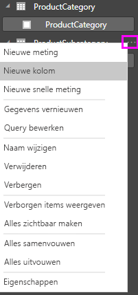
    
    De formulebalk wordt weergegeven bovenaan het rapportcanvas. Hier kunt u de kolom een naam geven en een DAX-formule invoeren.
    
    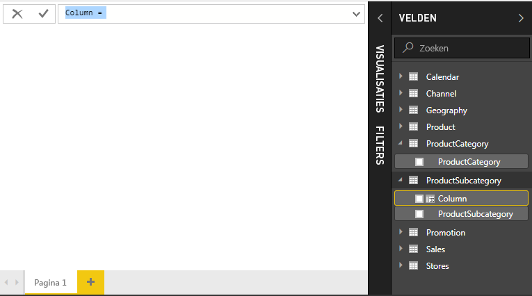
    
2.  Een nieuwe berekende kolom heet standaard gewoon Column. Als u de naam niet wijzigt, heten de extra nieuwe kolommen Column 2, Column 3 enzovoort. U wilt dat de kolom beter herkenbaar is. Omdat de naam **Column** al is gemarkeerd in de formulebalk, wijzigt u de naam door **ProductFullCategory** te typen. Typ vervolgens een 'is gelijk'-teken (**=**).
    
3.  U wilt de waarden in de nieuwe kolom laten beginnen met de ProductCategory-naam. Omdat deze kolom in een andere, maar wel verwante tabel staat, kunt u de functie [RELATED](https://msdn.microsoft.com/library/ee634202.aspx) gebruiken.
    
    Typ na het 'is gelijk'-teken een **r**. Een vervolgkeuzelijst met suggesties bevat alle DAX-functies die beginnen met de letter R. Als u een functie selecteert, wordt een beschrijving van het effect ervan weergegeven. Terwijl u typt, wordt de lijst met suggesties verder beperkt voor de functie die u nodig hebt. Selecteer **RELATED** en druk vervolgens op **Enter**.
    
    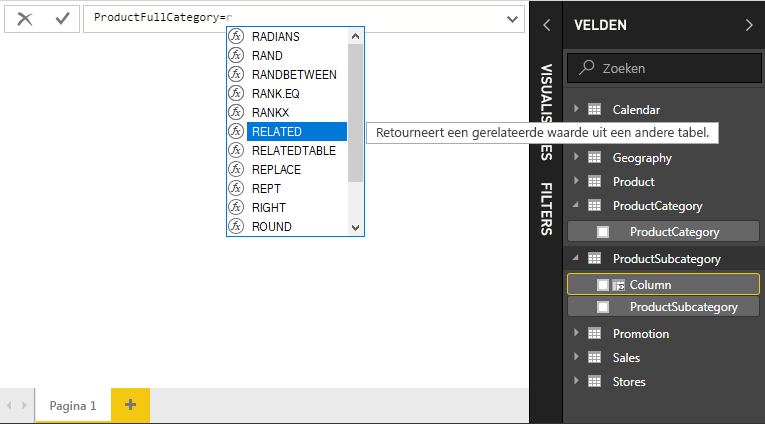
    
    Er wordt een haakje openen weergegeven, samen met een andere suggestielijst van de verwante kolommen die u aan de RELATED-functie kunt doorgeven, met beschrijvingen en informatie over verwachte parameters. 
    
    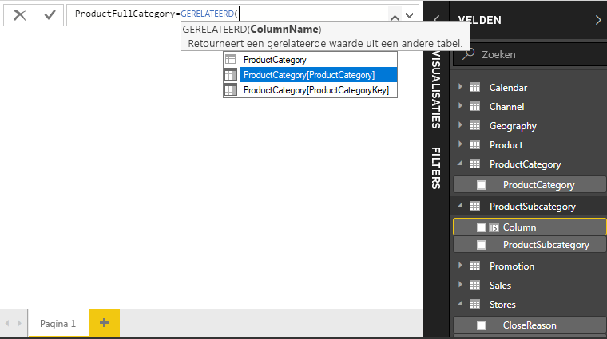
    
4.  U wilt de kolom **ProductCategory** uit de tabel **ProductCategory**. Selecteer **ProductCategory[ProductCategory]**, druk op **Enter** en typ een haakje sluiten.
    
    > [!TIP]
    > Syntaxisfouten worden meestal veroorzaakt door een ontbrekende of verkeerd geplaatste haakje sluiten, hoewel deze soms door Power BI Desktop wordt toegevoegd.
    
4. U wilt dat de ProductCategories en ProductSubcategories in de nieuwe waarden door streepjes en spaties worden gescheiden. U typt daarom na het haakje sluiten van de eerste expressie een spatie, en-teken (**&**), dubbel aanhalingsteken (**"**), spatie, streepje (**-**), nog een spatie, nog een dubbel aanhalingsteken en nog een en-teken. De formule moet er nu zo uitzien:
    
    `ProductFullCategory = RELATED(ProductCategory[ProductCategory]) & " - " &`
    
    > [!TIP]
    > Als u meer ruimte nodig hebt, selecteert u de dubbele pijl-omlaag rechts van de formulebalk om de formule-editor uit te vouwen. Druk in de editor op **Alt + Enter** om een regel omlaag te gaan en op **Tab** om items te verplaatsen.
    
5.  Voer een haakje openen (**[**) in en selecteer de kolom **[ProductSubcategory]** om de formule te voltooien. 
    
    
    
    U hoefde geen andere RELATED-functie te gebruiken om de tabel ProductSubcategory in de tweede expressie aan te roepen, omdat u de berekende kolom in deze tabel maakt. U kunt [ProductSubcategory] invoeren met het tabelnaamvoorvoegsel (volledig gekwalificeerd) of zonder (niet gekwalificeerd).
    
6.  Voltooi de formule door op **Enter** te drukken of door het vinkje in de formulebalk te selecteren. De formule wordt gevalideerd en de kolomnaam **ProductFullCategory** wordt weergegeven in de tabel **ProductSubcategory** in de lijst Velden. 
    
    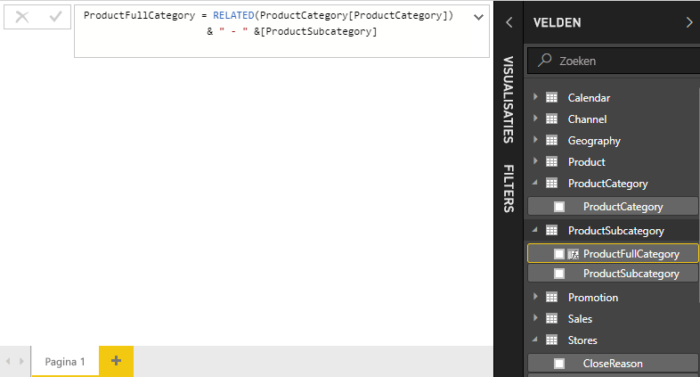
    
    >[!NOTE]
    >In Power BI Desktop krijgen berekende kolommen een speciaal pictogram in de lijst met velden zodat u kunt zien dat ze formules bevatten. Het is in de Power BI-service (uw Power BI-site) niet mogelijk om formules te wijzigen en daarom hebben berekende kolommen geen pictogram.
    
## De nieuwe kolom in een rapport gebruiken

U kunt uw nieuwe ProductFullCategory-kolom nu gebruiken om te kijken naar SalesAmount per ProductFullCategory.

1. Selecteer of sleep de kolom **ProductFullCategory** uit de tabel **ProductSubcategory** naar het rapportcanvas om een tabel te maken waarin alle ProductFullCategory-namen worden weergegeven.
   
   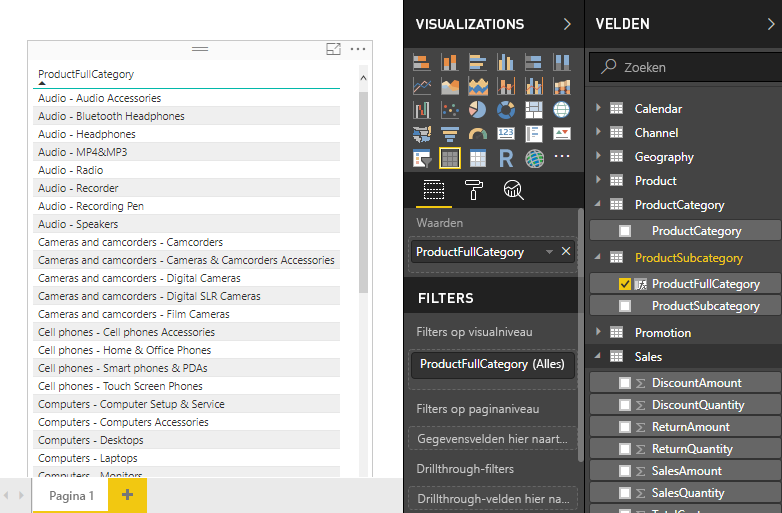
    
2. Selecteer of sleep het veld **SalesAmount** uit de tabel **Sales** naar de tabel om de Sales Amount voor elke Product Full Category weer te geven.
   
   
    
## Een berekende kolom maken die gebruikmaakt van een IF-functie

Het Contoso-verkoopvoorbeeld bevat verkoopgegevens voor zowel actieve als inactieve winkels. U wilt ervoor zorgen dat in het rapport de verkoop van actieve winkels duidelijk wordt gescheiden van de verkoop van inactieve winkels door een veld Active StoreName te maken. In de nieuwe berekende kolom Active StoreName wordt elke actieve winkel weergegeven met de volledige naam van de winkel, terwijl inactieve winkels worden gegroepeerd onder Inactive. 

Gelukkig heeft de tabel Stores een kolom genaamd **Status**, met waarden On voor actieve winkels en Off voor inactieve winkels die we kunnen gebruiken om waarden voor de nieuwe kolom Active StoreName te maken. De DAX-formule gebruikt de logische functie [IF](https://msdn.microsoft.com/library/ee634824.aspx) om de status van elke winkel te testen en om afhankelijk van het resultaat een bepaalde waarde te retourneren. Als de status van een winkel On is, wordt de naam van de winkel door de formule geretourneerd. Als deze Off is, wordt door de formule Inactive als Active StoreName toegewezen. 

1.  Maak een nieuwe berekende kolom in de tabel **Stores** en geef hieraan de naam **Active StoreName** in de formulebalk.
    
2.  Begin na het teken **=** met het typen van **IF**. In de lijst met suggesties wordt weergegeven wat u kunt toevoegen. Selecteer **IF**.
    
    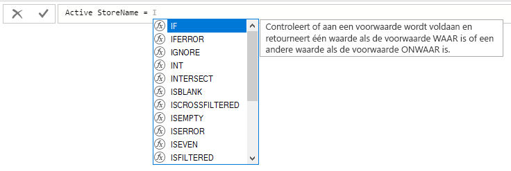
    
3.  Het eerste argument voor IF is een logische test om te kijken of de status van een winkel de waarde On heeft. Typ een haakje openen **[**, waarmee kolommen uit de tabel Stores worden weergegeven, en selecteer **[Status]**.
    
    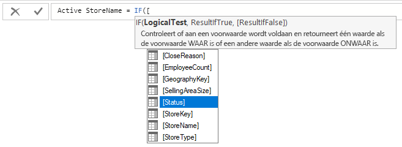
    
4.  Typ na **[Status]** direct **="On"** en typ vervolgens een komma (**,**) om het argument te beëindigen. De knopinfo wijst erop dat u nu een waarde moet toevoegen die moet worden geretourneerd wanneer het resultaat TRUE is.
    
    
    
5.  Als de winkel de status On heeft, wilt u de naam van de winkel laten zien. Typ een haakje openen (**[**), selecteer de kolom **[StoreName]** en typ nog een komma. De knopinfo wijst erop dat u nu een waarde moet toevoegen die moet worden geretourneerd wanneer het resultaat FALSE is. 
    
    
    
6.  De waarde moet *Inactive* zijn, dus typt u **"Inactive"**. Vervolgens voltooit u de formule door op **Enter** te drukken of door het vinkje in de formulebalk te selecteren. De formule wordt gevalideerd en de naam van de nieuwe kolom wordt weergegeven in de tabel **Stores** in de lijst Velden.
    
    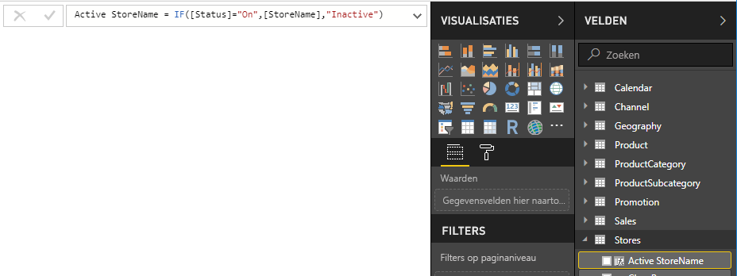
    
8.  U kunt de nieuwe Active StoreName-kolom in visualisaties gebruiken, net zoals elk ander veld. Als u SalesAmounts op Active StoreName wilt weergeven, selecteert u het veld **Active StoreName** of sleept u dit naar het canvas en selecteert u vervolgens het veld **SalesAmount** of sleept u dit naar de tabel. In deze tabel worden actieve winkels afzonderlijk weergegeven met de naam, maar inactieve winkels zijn gegroepeerd aan het einde als *Inactive*. 
    
    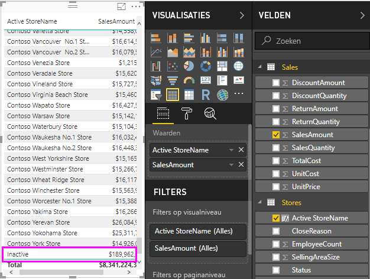
    
## Wat u hebt geleerd
Berekende kolommen kunnen uw gegevens duidelijker maken. U hebt geleerd hoe u berekende kolommen in de lijst met velden en formulebalk maakt, hoe u suggestielijsten en knopinfo gebruikt bij het maken van formules, hoe u DAX-functies aanroept zoals RELATED en IF met de juiste argumenten en hoe u de berekende kolommen in rapportvisualisaties gebruikt.

## Volgende stappen
Zie [Standaard DAX-bewerkingen in Power BI Desktop](desktop-quickstart-learn-dax-basics.md) voor meer informatie over DAX-formules en voor het maken van berekende kolommen met geavanceerdere formules. Dit artikel is voornamelijk gericht op de grondbeginselen van DAX, zoals de syntaxis en functies. Daarnaast gaan we iets dieper in op het begrip context.

Voeg [Naslaginformatie over Data Analysis Expressions (DAX)](https://msdn.microsoft.com/library/gg413422.aspx) toe aan uw favorieten. Hier vindt u gedetailleerde informatie over de syntaxis, operators en meer dan 200 functies van DAX.

