# Zelfstudie: Uw eigen metingen maken in Power BI Desktop
U kunt in Power BI Desktop zeer krachtige gegevensanalyseoplossingen maken met behulp van metingen. Metingen helpen u bij het uitvoeren van berekeningen op gegevens tijdens het werken met rapporten. Deze zelfstudie bevat uitleg over metingen en een stapsgewijze procedure voor het maken van een aantal basismetingen in Power BI Desktop.

### Vereisten
- Deze zelfstudie is bedoeld voor Power BI-gebruikers die al bekend zijn met het gebruik van Power BI Desktop en eraan toe zijn om geavanceerdere modellen te maken. U dient al te weten hoe u Gegevens ophalen en Query-editor gebruikt om gegevens te importeren, hoe u werkt met meerdere verwante tabellen en hoe u velden toevoegt aan het rapportcanvas. Raadpleeg [Aan de slag met Power BI Desktop](desktop-getting-started.md) als u nog geen ervaring hebt met het gebruik van Power BI Desktop.
  
- Download het bestand [Contoso Sales Sample for Power BI Desktop](http://download.microsoft.com/download/4/6/A/46AB5E74-50F6-4761-8EDB-5AE077FD603C/Contoso%20Sales%20Sample%20for%20Power%20BI%20Desktop.zip). Dit bevat al online verkoopgegevens van het fictieve bedrijf Contoso, Inc. De gegevens zijn geïmporteerd uit een database, waardoor u geen verbinding kunt maken met de gegevensbron of deze in Query-editor kunt weergeven. Pak het bestand uit op uw computer en open het in Power BI Desktop.

## Inzicht in metingen

Metingen worden meestal automatisch voor u gemaakt. Schakel in het voorbeeldbestand Contoso Sales Sample het selectievakje in naast het veld **SalesAmount** in de tabel **Sales** in de bron Velden, of sleep **SalesAmount** naar het rapportcanvas. Er wordt een nieuwe visualisatie van een kolomdiagram weergegeven die de som van alle waarden in de kolom SalesAmount van de tabel Sales toont.

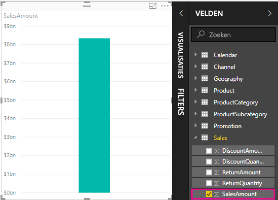

Elk veld dat wordt weergegeven in de bron Velden met een Sigma-pictogram  is numeriek, en de bijbehorende waarden kunnen worden samengevoegd. In plaats van een tabel met alle twee miljoen rijen voor SalesAmount-waarden weer te geven, heeft Power BI Desktop een numeriek gegevenstype gedetecteerd en automatisch een meting gemaakt om de gegevens samen te voegen. Som is de standaardaggregatie voor een numeriek gegevenstype, maar u kunt eenvoudig andere aggregaties toepassen zoals gemiddelde of aantal. Het begrijpen van aggregaties is van cruciaal belang voor het begrijpen van metingen, omdat bij elke meting wel een bepaald type aggregatie wordt uitgevoerd. 

Als u de aggregatie voor de grafiek wilt aanpassen naar gemiddelde, klikt u in het venster Visualisaties in het gedeelte **Waarde** naast **SalesAmount** op de pijl-omlaag en selecteert u **Gemiddelde**. De visualisatie wordt gewijzigd in het gemiddelde van alle omzetwaarden in het veld SalesAmount.

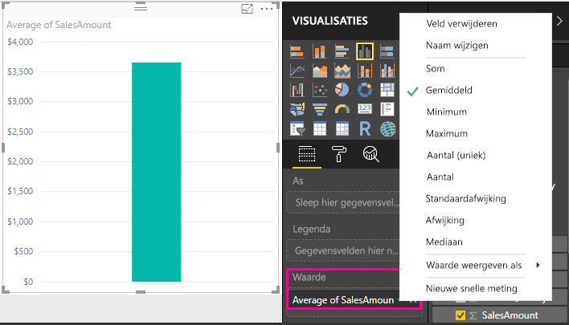

U kunt het type aggregatie wijzigen, afhankelijk van het gewenste resultaat, maar niet elk type aggregatie kan worden toegepast op elk numeriek gegevenstype. Het is bijvoorbeeld wel logisch om de som of het gemiddelde van het veld SalesAmount te berekenen. Dat geldt ook voor het minimum en maximum. Tellen heeft echter niet zo veel zin voor het veld SalesAmount. De waarden zijn weliswaar numeriek, maar betreffen in feite valuta (bedragen).

De waarden die worden berekend op basis van metingen, veranderen bij elke wijziging van het rapport. Als u bijvoorbeeld het veld **RegionCountryName** vanuit de tabel **Geography** naar de grafiek sleept, wordt het gemiddelde van de omzetbedragen per land weergegeven.

Wanneer het resultaat van een meting verandert doordat u een wijziging in het rapport aanbrengt, wijzigt u in feite de *context* van de meting. Bij elke interactie met de rapportvisualisaties, wijzigt u de context waarin een meting wordt berekend en worden de resultaten daarvan weergegeven.

## Uw eigen metingen maken en gebruiken

In de meeste gevallen berekent en retourneert Power BI automatisch de waarden op basis van de typen velden en aggregaties die u kiest, maar in sommige gevallen wilt u mogelijk uw eigen metingen maken om complexere, unieke berekeningen uit te voeren. Met Power BI Desktop kunt u uw eigen metingen maken met de formuletaal DAX (Data Analysis Expressions). 

In DAX-formules worden veel dezelfde functies en operatoren gebruikt als in Excel-formules, en ook de syntaxis is vrijwel identiek. DAX-functies zijn echter ontworpen voor het werken met relationele gegevens en het uitvoeren van meer dynamische berekeningen tijdens het werken met rapporten. Er zijn meer dan 200 DAX-functies, variërend van eenvoudige aggregaties zoals som en gemiddelde tot complexe statistische functies en filters. Er zijn veel bronnen waarmee u meer over DAX te weten kunt komen. Raadpleeg [Standaard DAX-bewerkingen in Power BI Desktop](desktop-quickstart-learn-dax-basics.md) nadat u deze zelfstudie hebt afgerond.

Wanneer u uw eigen meting maakt, wordt deze toegevoegd aan de lijst Velden voor de tabel die u selecteert en wordt deze een *modelmeting* genoemd. Enkele voordelen van modelmetingen zijn: u kunt ze welke naam u maar wilt geven, waardoor ze gemakkelijker te herkennen zijn; u kunt ze als argumenten in andere DAX-expressies gebruiken; en u kunt er zeer snel complexe berekeningen mee uitvoeren.

>[!TIP]
>Vanaf de release van februari 2018 van Power BI Desktop zijn een groot aantal veelgebruikte berekeningen beschikbaar als **snelle metingen**, die de DAX-formules schrijven op basis van de gegevens die u in een dialoogvenster invoert. Deze snelle, krachtige berekeningen zijn ook ideaal voor het leren kennen van DAX of het seeden van uw eigen aangepaste metingen. Als u snelle metingen wilt maken of verkennen, selecteert u **Nieuwe snelle meting** in de lijst **Meer opties** van een tabel of onder **Berekeningen** op het tabblad Start van het lint. Zie [Snelle metingen gebruiken](desktop-quick-measures.md) voor meer informatie over het maken en gebruiken van snelle metingen.

### Een meting maken

U wilt uw netto-omzet analyseren door kortingen en terugbetalingen af te trekken van de totale omzetbedragen. Wat voor context uw visualisatie ook heeft, u hebt een meting nodig die de som van DiscountAmount en ReturnAmount aftrekt van de som van SalesAmount. Er is geen veld voor netto-omzet in de lijst met velden, maar u hebt zo de basis voor het maken van uw eigen meting om de netto-omzet te berekenen. 

1.  Klik met de rechtermuisknop in de bron Velden op de tabel **Sales** of beweeg de muisaanwijzer over de tabel en selecteer het weglatingsteken (...) voor **meer opties** en selecteer vervolgens **Nieuwe meting**. Hiermee wordt de nieuwe meting opgeslagen in de tabel Sales, waar deze eenvoudiger terug te vinden is.
    
    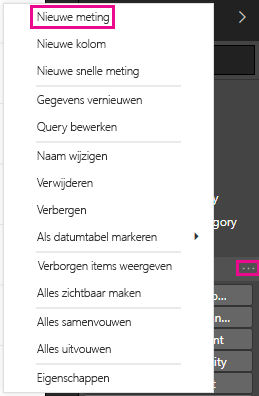
    
    U kunt ook een nieuwe meting maken door op het tabblad Start van het Power BI Desktop-lint in de groep Berekeningen de optie **Nieuwe meting** te selecteren.
    
    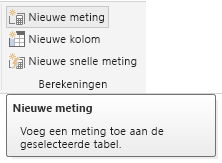
    
    >[!TIP]
    >Wanneer u een meting vanuit het lint maakt, kan deze in elke tabel worden gemaakt, maar de meting is eenvoudiger te vinden als u deze maakt waar u van plan bent om deze te gebruiken. In dit geval selecteert u eerst de tabel Sales om deze te activeren en selecteert u vervolgens **Nieuwe meting**. 
    
    De formulebalk wordt weergegeven bovenaan het rapportcanvas. Hier kunt u de naam van uw meting wijzigen en een DAX-formule invoeren.
    
    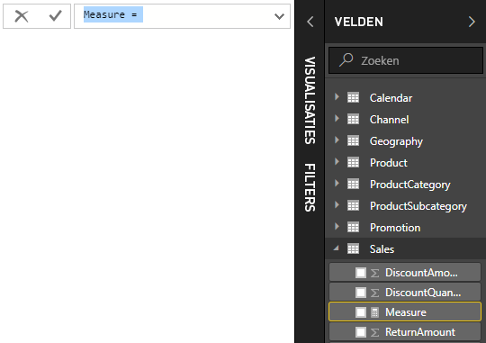
    
2.  De standaardnaam voor een nieuwe meting is gewoon Meting. Als u de naam niet wijzigt, worden extra nieuwe metingen Meting 2, Meting 3 enzovoort genoemd. U wilt waarschijnlijk uw metingen makkelijk kunnen herkennen, dus markeer **Meting** in de formulebalk en typ vervolgens **Net Sales**.
    
3.  Nu kunt u de formule invoeren. Typ na het gelijkteken **Sum**. Terwijl u typt, verschijnt er een vervolgkeuzelijst met alle DAX-functies die beginnen met de letters die u typt. Scrol zo nodig omlaag, selecteer **SUM** uit de lijst en druk op Enter.
    
    
    
    Nu wordt er een haakje-openen weergegeven en een andere vervolgkeuzelijst met suggesties, ditmaal voor alle beschikbare kolommen die kunnen worden doorgegeven in de functie SUM.
    
    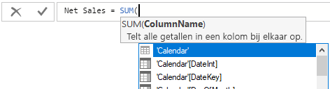
    
    Expressies worden altijd weergegeven tussen een haakje-openen en een haakje-sluiten. De expressie bevat één argument voor doorgeven aan de functie SUM: de kolom SalesAmount. Begin met het typen van 'SalesAmount' totdat er nog maar één waarde in de lijst staat: Sales(SalesAmount). De naam van de kolom voorafgegaan door de naam van de tabel wordt de *volledig gekwalificeerde naam* van de kolom genoemd. Volledig gekwalificeerde kolomnamen zorgen ervoor dat uw formules gemakkelijker te lezen zijn. 
    
    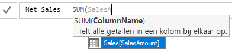
    
4. Selecteer **Sales[SalesAmount]**, en typ vervolgens een haakje sluiten.
    
    > [!TIP]
    > Syntaxisfouten zijn meestal te wijten aan een ontbrekend of verkeerd geplaatst haakje sluiten.
    
    
    
5.  De andere twee kolommen aftrekken:
    1. Typ na het haakje-sluiten van de eerste expressie een spatie, een minteken (**-**) en nog een spatie. 
    2. Voer nog een SUM-functie in en begin met het typen van DiscountAmount tot u de kolom **Sales[DiscountAmount]** als argument kunt kiezen. Voeg een haakje-sluiten toe. 
    3. Typ een spatie, nog een minteken, een spatie, nog een SUM-functie met **Sales[ReturnAmount]** als argument, en een haakje-sluiten.
    
    
    
6.  Druk op Enter of klik op het vinkje in de formulebalk om de formule te voltooien en te valideren. De gevalideerde meting kan nu worden gebruikt in de lijst met velden voor de tabel Sales. 
    
    
    
Als u te weinig ruimte hebt voor het invoeren van een formule of de formule op twee regels wilt hebben, selecteert u aan de rechterkant van de formulebalk de dubbele pijl-omlaag om meer ruimte te creëren.

U kunt onderdelen van de formule op verschillende regels plaatsen door op **Alt+Enter** te drukken of items te verplaatsen door **Tab** te gebruiken.

### De meting in het rapport gebruiken
Nu kunnen we de meting Net Sales toevoegen aan het rapportcanvas en de netto-omzet berekenen voor alle andere velden die u aan het rapport toevoegt. De netto-omzet per land bekijken:

1. Selecteer de meting **Net Sales** in de tabel **Sales** of sleep deze naar het rapportcanvas.
    
2. Selecteer het veld **RegionCountryName** in de tabel **Geography** of sleep deze naar de grafiek.
    
    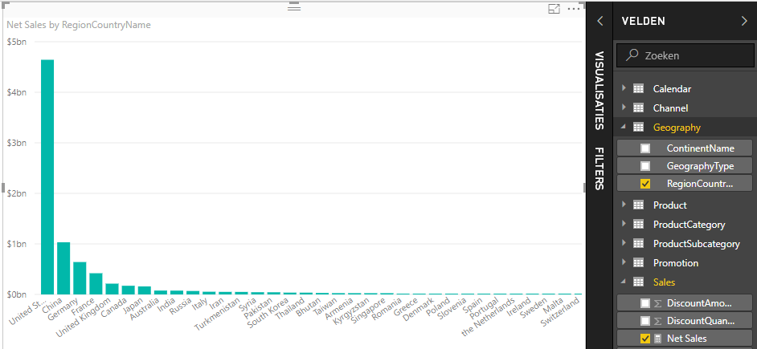
    
Selecteer het veld **SalesAmount** of sleep het naar de grafiek om het verschil tussen de netto-omzet en de totale omzet per land te bekijken. 

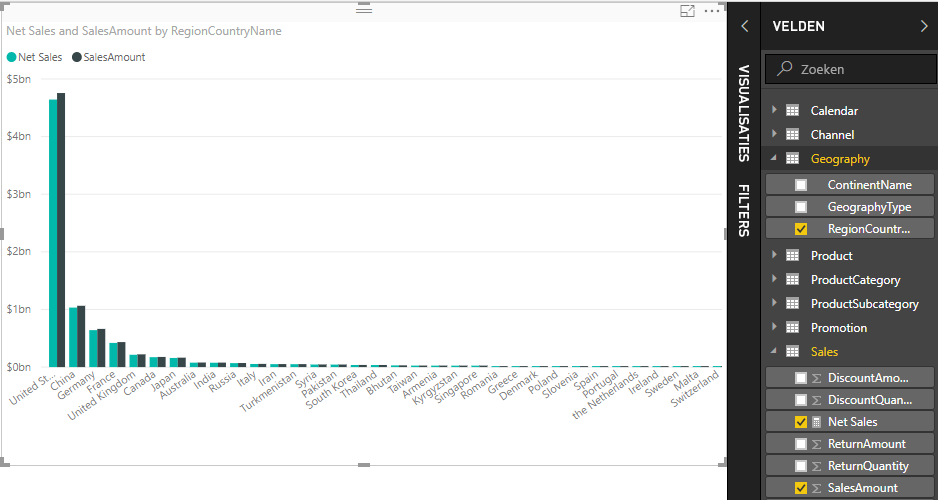

De grafiek gebruikt nu twee metingen: SalesAmount, die automatisch is opgeteld, en de meting Net Sales die u hebt gemaakt. Elke meting is berekend in de context van een ander veld: RegionCountryName.
    
### De meting met een slicer gebruiken

U kunt een slicer toevoegen om de netto-omzet en omzetbedragen verder te filteren op kalenderjaar.
    
1.  Klik op een leeg gebied naast de grafiek en selecteer vervolgens in **Visualisaties** de visualisatie **Tabel**. Hiermee maakt u een lege tabelvisualisatie op het rapportcanvas.
    
    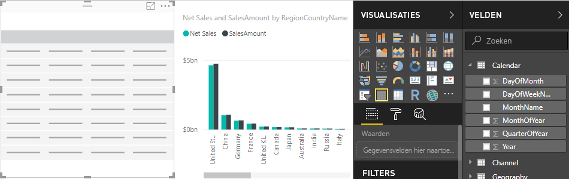
    
2.  Sleep het veld **Year** van de tabel **Calendar** naar de nieuwe, lege tabelvisualisatie. Omdat Year een numeriek veld is, telt Power BI Desktop de waarden ervan op, maar dat werkt niet echt als een aggregatie. 
    
    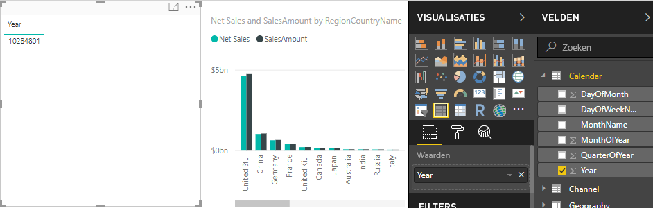
    
3.  Selecteer in het deelvenster Visualisaties in **Waarden** de pijl-omlaag naast **Year** en selecteer vervolgens **Niet samenvatten**. De tabel geeft nu afzonderlijke jaartallen weer.
    
    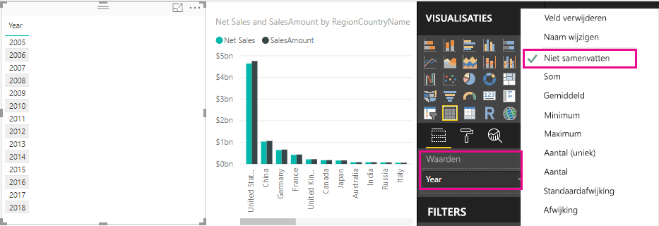
    
4.  Selecteer het pictogram **Slicer** in het deelvenster Visualisaties om de tabel naar een slicer te converteren.

    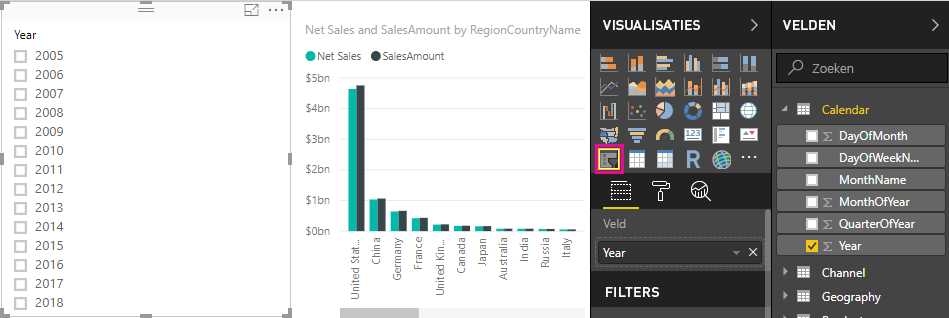
    
5.  Selecteer een waarde in de slicer **Year** om de grafiek voor **netto-omzet en omzet per land** te filteren. De metingen Net Sales en SalesAmount herberekenen de resultaten en geven ze weer in de context van het geselecteerde jaarveld. 
    
    

### Uw meting in een andere meting gebruiken

U wilt weten welke producten de hoogste netto-omzet per verkochte eenheid hebben, dus hebt u een meting nodig die de netto-omzet deelt door het aantal verkochte eenheden. U kunt een nieuwe meting maken die het resultaat van de meting Net Sales deelt door de som van Sales[SalesQuantity].

1.  Maak een nieuwe meting met de naam **Net Sales per Unit** in de tabel Sales.
    
2.  Begint met het typen van **Net Sales** in de formulebalk. In de lijst met suggesties wordt weergegeven wat u kunt toevoegen. Selecteer **[Netto-omzet]**.
    
    
    
    U kunt ook verwijzen naar metingen door alleen een haakje-openen te typen (**[**). De lijst met suggesties toont alleen metingen die u aan uw formule kunt toevoegen.
    
    
    
3.  Voer een spatie, een deelteken (**/**), nog een spatie, en een SUM-functie in en typ vervolgens **Quantity**. In de lijst met suggesties worden alle kolommen met Quantity in de naam weergegeven. Selecteer **Sales[SalesQuantity]**, typ een haakje-sluiten, en druk op ENTER of selecteer het vinkje om de formule te valideren. De formule moet er nu zo uitzien:
    
    `Net Sales per Unit = [Net Sales] / SUM(Sales[SalesQuantity])`
    
4. Selecteer de meting **Net Sales per Unit** in de tabel Sales of sleep deze naar een leeg vlak in het rapportcanvas. De grafiek toont de netto-omzet per eenheid voor alle verkochte producten, maar dit is niet heel nuttig. 
    
    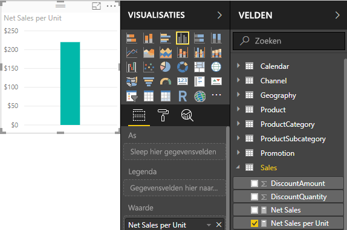
    
5. Wijzig het visualisatietype van de grafiek in **Structuurkaart** voor een andere weergave.
    
    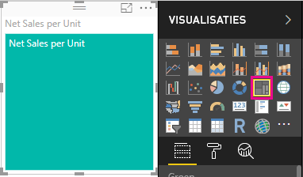
    
6. Selecteer het veld **ProductCategory** of sleep het naar de structuurkaart of naar het veld Groep van het deelvenster Visualisaties. U hebt nu handige informatie tot uw beschikking.
    
    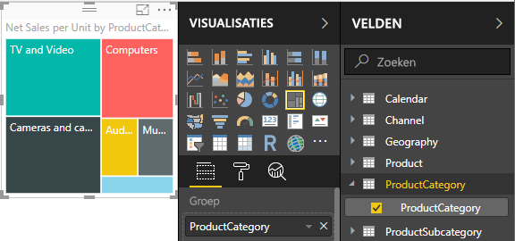
    
7. Verwijder het veld **ProductCategory** en sleep in plaats daarvan het veld **ProductName** naar de grafiek. 
    
    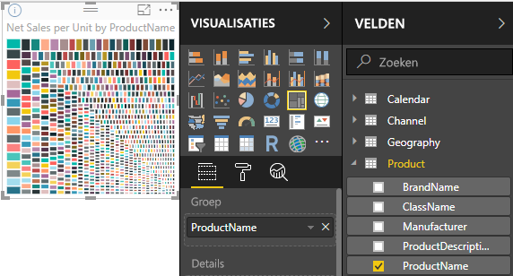
    
Dit is vooral ter illustratie, maar u zult moeten toegeven dat deze functionaliteit geweldig is. Experimenteer met andere manieren om de visualisatie te filteren en in te delen.

## Wat u hebt geleerd
Metingen bieden u veel mogelijkheden om nuttige inzichten uit uw gegevens te halen. U hebt geleerd hoe u metingen maakt met behulp van de formulebalk, hoe u ze een handige naam geeft, en hoe u de juiste formule-elementen vindt en selecteert met behulp van de DAX-suggestielijsten. U hebt ook kennisgemaakt met context, waarbij het resultaat van berekeningen in metingen varieert, afhankelijk van andere velden of andere expressies in uw formule.

## Volgende stappen
- Zie [Gebruik Snelle metingen om eenvoudig algemene en krachtige berekeningen uit te voeren](desktop-quick-measures.md) voor meer informatie over snelle metingen in Power BI Desktop, die u volop veelgebruikte en krachtige berekeningen bieden.
  
- Zie [Standaard DAX-bewerkingen in Power BI Desktop](desktop-quickstart-learn-dax-basics.md) voor meer informatie over DAX-formules en geavanceerde metingen. Dit artikel is voornamelijk gericht op de grondbeginselen van DAX, zoals de syntaxis en functies. Daarnaast gaan we iets dieper in op het begrip context.
  
- Voeg [Naslaginformatie over Data Analysis Expressions (DAX)](https://msdn.microsoft.com/library/gg413422.aspx) toe aan uw favorieten. Hier vindt u gedetailleerde informatie over de syntaxis, operators en meer dan 200 functies van DAX.

