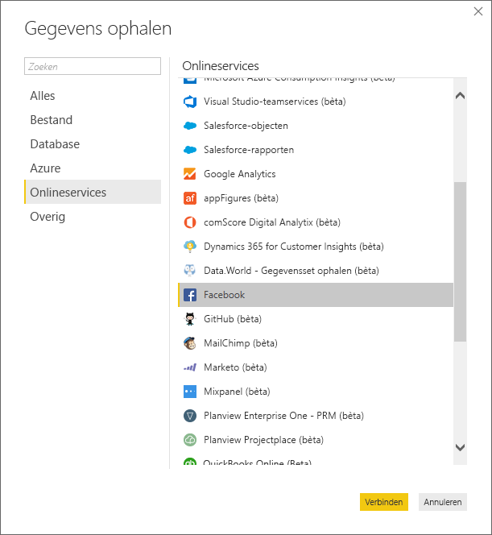
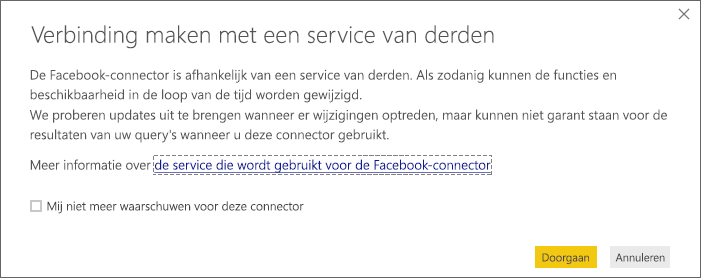
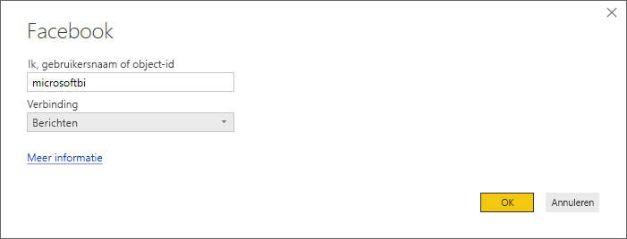
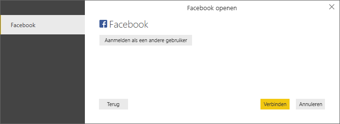
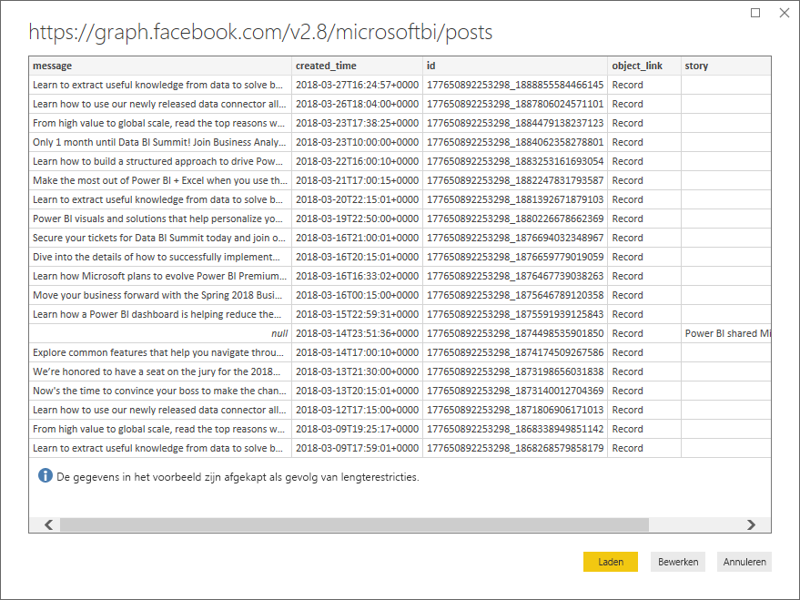
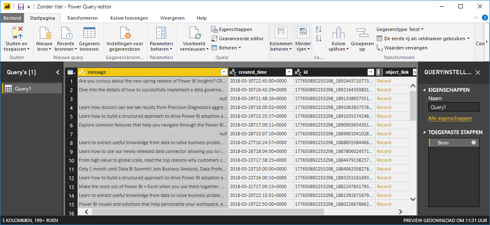
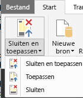
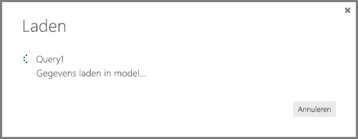

# Zelfstudie: Facebook-analyses met Power BI Desktop
In deze zelfstudie leert u hoe u gegevens uit **Facebook** importeert en visualiseert. Tijdens de zelfstudie leert u hoe u verbinding maakt met een bepaalde Facebook-pagina (de Power BI-pagina), stappen voor gegevenstransformatie toepast en een aantal visualisaties maakt.

Dit zijn de stappen die u gaat uitvoeren:

* **Taak 1:** verbinding maken met een Facebook-pagina
* **Taak 2:** visualisaties maken met behulp van de rapportweergave
  
  * **Stap 1**: een treemapvisualisatie maken
* **Taak 3:** gegevens vormgeven in de queryweergave
  
  * **Stap 1**: de datum/tijd-kolom splitsen in twee kolommen
  * **Stap 2**: een samengevoegde waarde van een verwante tabel toevoegen
* **Taak 4:** extra visualisaties maken met behulp van de rapportweergave
  
  * **Stap 1**: de query in uw rapport laden
  * **Stap 2**: een lijndiagram en een staafdiagram maken

## **Taak 1: verbinding maken met een Facebook-pagina**
In deze taak importeert u gegevens van de [Microsoft Power BI Facebook](https://www.facebook.com/microsoftbi)-site (dit is de URL: *https://www.facebook.com/microsoftbi)*.

Iedereen kan verbinding maken met deze pagina en deze stappen volgen. Er zijn geen speciale referenties vereist (met uitzondering van de referenties van uw eigen Facebook-account, dat u in deze stap gebruikt).

1. Selecteer in het dialoogvenster **Aan de slag** of op het linttabblad **Start** de optie **Gegevens ophalen**.
2. Het dialoogvenster **Gegevens ophalen** wordt weergegeven, zodat u uit allerlei soorten gegevensbronnen kunt selecteren. Selecteer **Facebook** in de groep **Overig**.
   
   
   
   Wanneer u **Verbinden** selecteert, verschijnt een dialoogvenster om u te waarschuwen voor de risico's van het gebruik van een service van derden.
   
   
3. Wanneer u Doorgaan selecteert, verschijnt het dialoogvenster **Facebook** waarin u de naam van de pagina kunt plakken (**microsoftbi**) in het tekstvak **Gebruikersnaam**. Selecteer **Berichten** in de vervolgkeuzelijst **Verbinding**.
   
   
4. Klik op **OK**.
5. Wanneer u wordt gevraagd om referenties in te voeren, meldt u zich aan met uw Facebook-account en geeft u Power Bi toegang via uw account.
   
   

Nadat verbinding is gemaakt met de pagina, ziet u dat de gegevens worden geladen in het model. 

Hierna worden de gegevens weergegeven in **Query-Editor**. **Query-Editor** maakt deel uit van Power BI Desktop, maar wordt geladen in een apart venster. Hier voert u alle transformaties uit op uw gegevensverbindingen.

Wanneer u tevreden bent over uw gegevens, kunt u ze laden in Power BI Desktop. Selecteer **Laden en sluiten** in het lint **Start**.

Hier ziet u een dialoogvenster waarin de voortgang wordt weergegeven van het laden van de gegevens in het gegevensmodel van Power BI Desktop.

Nadat de gegevens zijn geladen, gaat u naar de weergave **Rapport**. Hier worden de kolommen uit de tabel vermeld in de lijst **Veld** aan de rechterkant.

## **Taak 2: visualisaties maken met behulp van de rapportweergave**
Nu u de gegevens van de pagina het geïmporteerd, kunt u snel en eenvoudig inzicht krijgen in uw gegevens met behulp van visualisaties.

**Stap 1**: een treemapvisualisatie maken

Het maken van een visualisatie is eenvoudig. U hoeft slechts een veld uit de **Veldenlijst** te slepen en neer te zetten op het **canvas Rapporteren.**

Sleep het veld **Type** naar het canvas **Rapport**. Power BI Desktop maakt een nieuwe visualisatie in het **canvas Rapport**. Sleep vervolgens **Type** van **Velden** (hetzelfde veld dat u zojuist naar het canvas **Rapport** hebt gesleept) naar het gebied **Waarde** om de visualisatie  **Balk** te maken.

We kunnen eenvoudig het type visualisatie wijzigen door een ander pictogram te selecteren in het deelvenster **Visualisatie**. We wijzigen het type in een **Treemap** door het bijbehorende pictogram te selecteren in **Visualisaties**, zoals wordt weergegeven in de volgende afbeelding.

Vervolgens voegen we een legenda toe en daarna wijzigen we de kleur van een gegevenspunt. Selecteer het pictogram **Opmaak** in het deelvenster **Visualisaties**. Het pictogram **Opmaak** ziet eruit als een verfkwast.

Wanneer u de pijl omlaag naast **Legenda** selecteert, wordt de sectie uitgevouwen om te laten zien hoe u het bijschrift voor de geselecteerde visualisatie aanpast. In dit geval hebben we de volgende selecties gemaakt:

* de schuifregelaar **Legenda** is naar **Aan** verplaatst zodat een legenda wordt weergegeven
* **Rechts** is geselecteerd in de vervolgkeuzelijst **Positie van legenda**
* de schuifregelaar **Titel** is ook verplaatst naar **Aan**, dus er wordt een titel voor de legenda weergegeven
* er is **type** ingevoerd om de legenda een titel te geven

Deze instellingen zijn in de volgende afbeelding al gemaakt en worden weergegeven in de visualisatie.

Vervolgens gaan we de kleur van een van de gegevenspunten wijzigen. Het gegevenspunt van de koppeling moet blauw zijn, zodat de algemene kleur voor hyperlinks wordt benaderd.

Selecteer de pijl naast **Gegevenskleuren** om die sectie uit te vouwen. De gegevenspunten worden weergegeven met selectiepijlen naast elke kleur, zodat we een andere kleur kunnen selecteren voor elk gegevenspunt.

Wanneer u op de pijl omlaag van het kleurvak naast een gegevenspunt klikt, verschijnt een dialoogvenster waarin u uw kleur kunt kiezen. In dit geval kiezen we lichtblauw.

Dat ziet er veel beter uit. In de volgende afbeelding ziet u hoe de kleur is toegepast op het gegevenspunt in de visualisatie, en dat de legenda ook automatisch is bijgewerkt, evenals de kleur in de sectie **Gegevenskleuren**.

## **Taak 3: gegevens vormgeven in de tabel**
Nu u de geselecteerde tabel hebt geïmporteerd en u bent begonnen met het visualiseren, merkt u mogelijk dat u verschillende stappen moet uitvoeren voor het vormgeven en opschonen van uw gegevens om er het meeste uit te halen.

**Stap 1**: de datum/tijd-kolom splitsen in twee kolommen

In deze stap splitst u de kolom **created\_time** zodat u van de waarden datum en tijd gebruik kunt maken. Wanneer u in Power BI Desktop bent en u een bestaande query wilt wijzigen, moet u **Query-Editor** starten. Selecteer daarvoor **Query's bewerken** op het tabblad **Start**.

1. Schuif in het raster van **Query Editor** naar rechts totdat u de kolom **created\_time** hebt gevonden
2. Klik met de rechtermuisknop op een kolomkop in het raster **Query-preview** en klik op **Kolom splitsen \> Op scheidingsteken** om de kolommen te splitsen. Kies **Aangepast** in de vervolgkeuzelijst voor het scheidingsteken en voer **‘T’** in. Deze bewerking is ook beschikbaar in het linttabblad **Start** in de groep **Kolommen beheren** .
   
   
   
   
3. Wijzig de naam van de gemaakte kolommen respectievelijk in **created\_date** en **created\_time**.
4. Selecteer de nieuwe kolom **created\_time**, *** en navigeer in het lint **Queryweergave** naar het tabblad **Kolom toevoegen**. Selecteer **Tijd\>Uur** in de groep **Van datum en tijd**. Hierdoor wordt een nieuwe kolom toegevoegd met alleen het uurgedeelte van de tijd.
   
   
5. Wijzig het type van de nieuwe kolom **Uur** in **Geheel getal** door te navigeren naar het tabblad **Start** en de vervolgkeuzelijst **Gegevenstype** te selecteren. U kunt ook met de rechtermuisknop op de kolom klikken en het **Transformeren\>Geheel getal** selecteren.
   
   

**Stap 2**: een samengevoegde waarde van een verwante tabel toevoegen

In deze stap voegt u het aantal deelacties van de geneste waarde toe zodat u deze in de visualisaties kunt gebruiken.

1. Schuif naar rechts tot u de kolom **shares** ziet. De geneste waarde geeft aan dat we nog een transformatie moeten uitvoeren om de werkelijke waarden op te halen.
2. Selecteer in de rechterbovenhoek van de kolomkop het pictogram  om de opbouwfunctie **Uitvouwen/samenvoegen** te openen. Selecteer **aantal** en klik op **OK**. Hiermee wordt de telling van de deelacties voor elke rij in de tabel toegevoegd.
   
   
   
   Nadat de gegevens zijn geladen, wijzigt u de naam van de kolom **shares** door te dubbelklikken op de naam van de kolom, door met de rechtermuisknop te klikken op de kolom of door in het lint **Queryweergave** de optie **Naam wijzigen** te selecteren op het tabblad **Transformeren** in de groep **Elke kolom**.
3. Ten slotte moet u het type van de nieuwe kolom **shares** wijzigen in **Geheel getal**. Het type van de geselecteerde kolom kan worden gewijzigd door met de rechtermuisknop te klikken op de kolom en **Transformeren\>Geheel getal** te selecteren, of *** door te navigeren naar het tabblad **Start** en de vervolgkeuzelijst **Gegevenstype** te selecteren.

### Gemaakte querystappen
Als u transformaties uitvoert in Query-editor, worden er querystappen gemaakt en vermeld in het deelvenster **Queryinstellingen** in de lijst **TOEGEPASTE STAPPEN**. Elke querystap heeft een bijbehorende Query-formule, die ook wel bekendstaat als de M-taal.

| Taak | Querystap | Formule |
| --- | --- | --- |
| Verbinding maken met een Facebook-bron |Bron |Facebook.Graph  (&quot;https://graph.facebook.com/microsoftbi/posts&quot;) |
| **Kolommen splitsen** om de waarden die u nodig hebt op te halen |Kolom splitsen op scheidingsteken |Table.SplitColumn  (Source,&quot;created_time&quot;,Splitter.SplitTextByDelimiter(&quot;T&quot;),{&quot;created_time.1&quot;, &quot;created_time.2&quot;}) |
| **Het type wijzigen** van de nieuwe kolommen (automatische stap) |Gewijzigd type |Table.TransformColumnTypes  (#&quot;Split Column by Delimiter&quot;,{{&quot;created_time.1&quot;, type date}, {&quot;created_time.2&quot;, type time}}) |
| **De naam van **een kolom wijzigen**** |Kolommen met een nieuwe naam |Table.RenameColumns  (#&quot;Changed Type&quot;,{{&quot;created_time.1&quot;, &quot;created_date&quot;}, {&quot;created_time.2&quot;, &quot;created_time&quot;}}) |
| **Een kolom **invoegen**** |Ingevoegde tijd |Table.AddColumn  (#&quot;Renamed Columns&quot;, &quot;Hour&quot;, each Time.Hour([created_time]), type number) |
| ** Type wijzigen ** |Gewijzigd type1 |Table.TransformColumnTypes  (#&quot;Inserted Hour&quot;,{{&quot;Hour&quot;, type text}}) |
| **Waarden ** uitvouwen in een geneste tabel**** |Deelacties uitvouwen |Table.ExpandRecordColumn  (#&quot;Changed Type1&quot;, &quot;shares&quot;, {&quot;count&quot;}, {&quot;shares.count&quot;}) |
| ** De kolom ** een nieuwe naam geven**** |Kolommen met een nieuwe naam1 |Table.RenameColumns  (#&quot; Expand shares&quot;,{{&quot;shares.count&quot;, &quot;shares&quot;}}) |
| **Type wijzigen** |Gewijzigd type2 |Table.TransformColumnTypes  (#&quot;Renamed Columns1&quot;,{{&quot;shares&quot;, Int64.Type}}) |

## **Taak 4: extra visualisaties maken met behulp van de rapportweergave**
Nu we de gegevens hebben omgezet in de vorm die we nodig hebben voor de rest van onze analyse, kunnen we de resulterende tabel laden ons rapport en extra visualisaties maken.

**Stap 1**: de query in uw rapport laden

Om de queryresultaten in het rapport te laden, moeten we **Laden en sluiten** selecteren in **Query Editor**. Hiermee worden onze wijzigingen in Power BI Desktop geladen en wordt **Query Editor** gesloten.

In Power BI Desktop moeten we de weergave **Rapport** open hebben. Selecteer het eerste pictogram in de linkerbalk in Power BI Desktop.

**Stap 2**: een lijndiagram en een staafdiagram maken

Om een visualisatie te maken, kunnen we velden slepen uit de lijst **Veld** en ze neerzetten in het canvas **Rapport**.

1. Sleep het veld **shares** naar het canvas **Rapport**. Hiermee wordt automatisch een staafdiagram gemaakt. Sleep vervolgens created\_date naar de diagram. Power BI Desktop wijzigt de visualisatie in een **Lijndiagram**.
   
   
2. Sleep vervolgend het veld **shares** en zet het neer in het **canvast Rapport**. Sleep het veld **Uur** nu naar de sectie **As** in de **lijst Veld**.
   
   
3. We kunnen eenvoudig het type visualisatie wijzigen door op een ander pictogram te klikken in het deelvenster **Visualisatie**. De pijl in de afbeelding hieronder wijst naar het pictogram **Staafdiagram**.
   
   
4. Wijzig tet type visualisatie in **Staafdiagram**.
5. De **Staafdiagram** is gemaakt, maar de as is nog niet precies wat we willen. Hij moet worden gesorteerd in de andere richting (van hoog naar laag). Selecteer de pijl omlaag naast **Y-as** om die sectie uit te vouwen. We moeten het type van de as wijzigen van **Doorlopend** naar **Categorisch**, zodat deze sorteert zoals we willen (in de onderstaande afbeelding ziet u de as voordat we de selectie maken, bekijk de volgende afbeelding om te zien hoe de sortering eruit moet gaan zien).

Dat ziet er veel beter uit. En nu hebben we drie visualisaties op deze pagina. We kunnen het formaat wijzigen zoals we willen om de rapportpagina op te vullen.

Zoals u ziet, is het zeer eenvoudig om visualisaties in uw rapport aan te passen om de gegevens te presenteren op de manier waarop u wilt. Power BI Desktop biedt een naadloze complete ervaring voor het ophalen van gegevens uit een breed scala aan gegevensbronnen en het vormgeven van deze gegevens om te voldoen aan uw analysebehoeften. Zo kunt u deze gegevens op uitgebreide en interactieve manieren visualiseren. Wanneer uw rapport klaar is, kunt u [het uploaden naar Power BI](desktop-upload-desktop-files.md) en op basis van dit rapport dashboards maken die u kunt delen met andere Power BI-gebruikers.

U kunt het eindresultaat van deze zelfstudie [hier](http://download.microsoft.com/download/1/4/E/14EDED28-6C58-4055-A65C-23B4DA81C4DE/FacebookAnalytics.pbix) downloaden

### Waar vind ik meer informatie?
* [Andere zelfstudies voor Power BI Desktop lezen](http://go.microsoft.com/fwlink/?LinkID=521937)
* [Power BI Desktop-video's bekijken](http://go.microsoft.com/fwlink/?LinkID=519322)
* [Een bezoek brengen aan het Power BI-forum](http://go.microsoft.com/fwlink/?LinkID=519326)
* [Het Power BI-blog lezen](http://go.microsoft.com/fwlink/?LinkID=519327)

