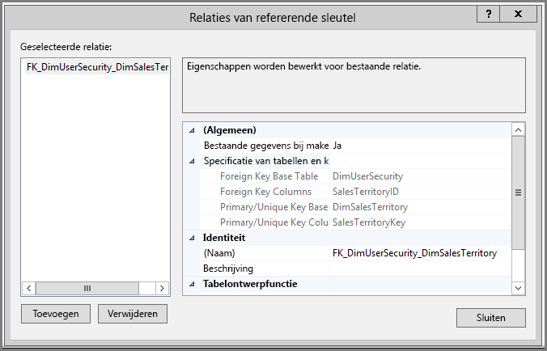
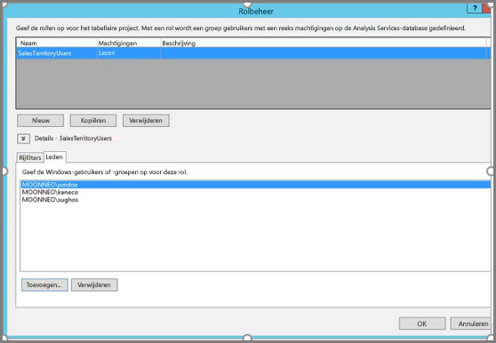
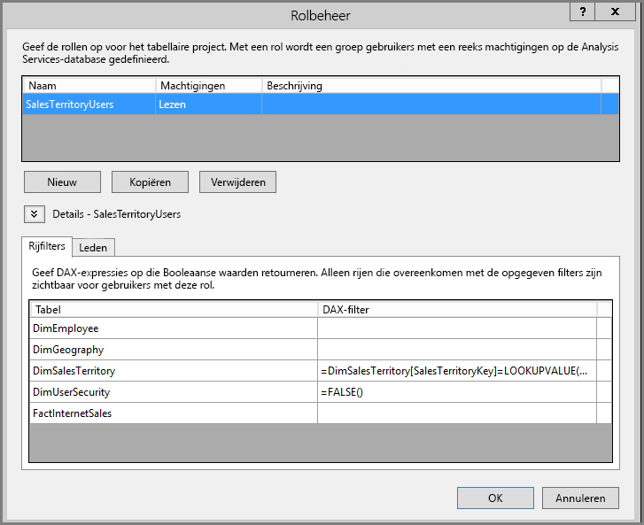
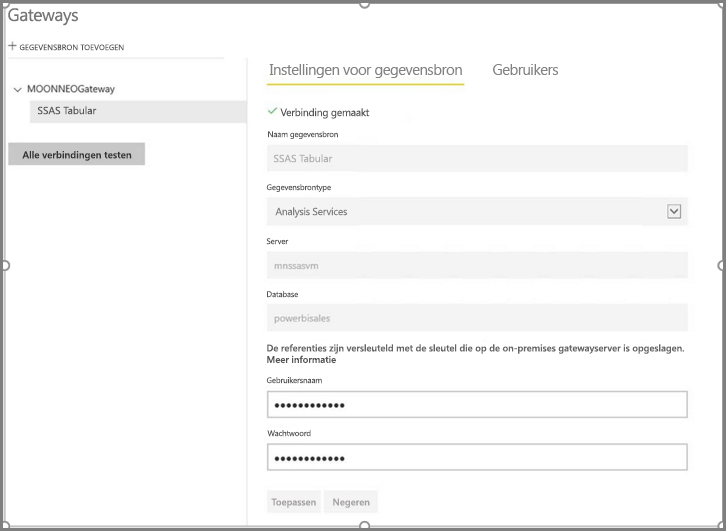
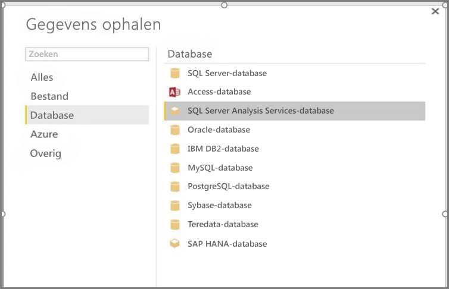
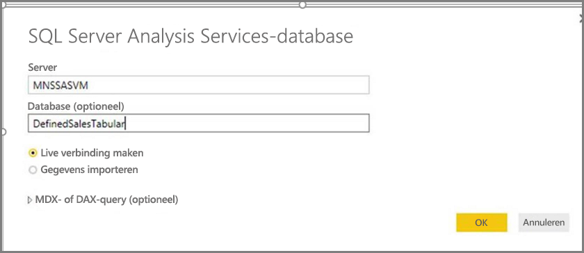
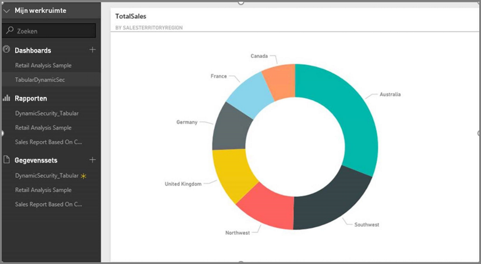
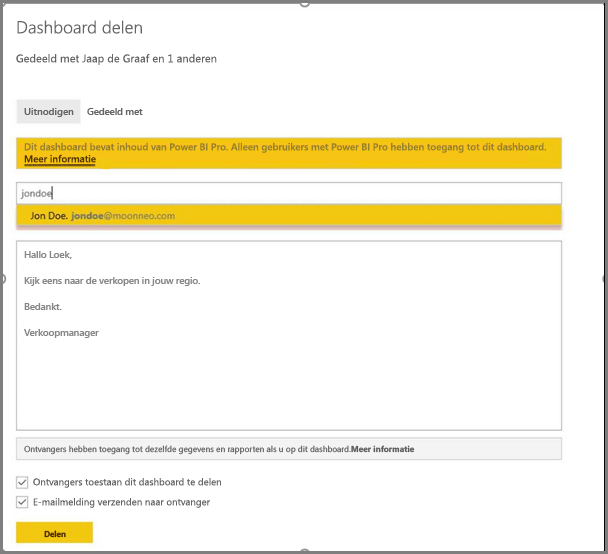
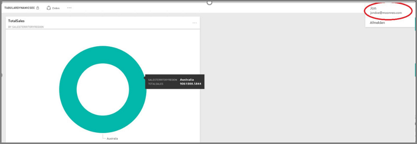

# <a name="dynamic-row-level-security-with-analysis-services-tabular-model"></a>Dynamische beveiliging op rijniveau met model in tabelvorm van Analysis Services
In deze zelfstudie ziet u de benodigde stappen voor het implementeren van **beveiliging op rijniveau** binnen een **tabellair model van Analysis Services**, en wordt beschreven hoe u dit model kunt gebruiken in een Power BI-rapport. Het is de bedoeling dat u de stappen in deze zelfstudie volgt, en zo leert wat de benodigde stappen zijn, door deze uit te voeren op een voorbeeldgegevensset.

Tijdens deze zelfstudie worden de volgende stappen in detail beschreven, zodat u begrijpt wat u moet doen om dynamische beveiliging op rijniveau te implementeren in een tabellair model van Analysis Services:

* Een nieuwe beveiligingstabel maken in de database **AdventureworksDW2012**
* Het tabellaire model opbouwen met de benodigde feiten- en dimensietabellen
* De rollen en machtigingen voor de gebruikers definiëren
* Het model implementeren in een **tabellair Analysis Services**-exemplaar
* Met Power BI Desktop een rapport maken waarin de gegevens worden weergegeven in overeenstemming met het toegangsniveau van de gebruiker die het rapport opent
* Het rapport implementeren in de **Power BI-service**
* Een nieuw dashboard maken op basis van het rapport
* Het dashboard delen met uw collega's

Om de stappen in deze zelfstudie te volgen, hebt u de database **AdventureworksDW2012** nodig. Deze kunt u downloaden uit de **[opslagplaats](https://github.com/Microsoft/sql-server-samples/releases/tag/adventureworks)**.

## <a name="task-1-create-the-user-security-table-and-define-data-relationship"></a>Taak 1: De gebruikersbeveiligingstabel maken en de gegevensrelatie definiëren
Er zijn veel gepubliceerde artikelen waarin wordt beschreven hoe u dynamische beveiliging op rijniveau met het **tabellaire model van SQL Server Analysis Services (SSAS)** kunt definiëren. Voor ons voorbeeld volgen we het artikel [Implement Dynamic Security by Using Row Filters](https://msdn.microsoft.com/library/hh479759.aspx) (Dynamische beveiliging implementeren door rijfilters te gebruiken). Met de volgende stappen doorloopt u de eerste taak in deze zelfstudie:

1. Voor dit voorbeeld maken we gebruik van de relationele database **AdventureworksDW2012**. Maak de tabel **DimUserSecurity** in de database, zoals wordt weergegeven in de volgende afbeelding. Voor dit voorbeeld maken we de tabel met behulp van SQL Server Management Studio (SSMS).
   
   
2. Wanneer de tabel is gemaakt en opgeslagen, moeten we de relatie tussen de kolom **SalesTerritoryID** van de tabel **DimUserSecurity** en de kolom **SalesTerritoryKey** van de tabel **DimSalesTerritory** definiëren, zoals wordt weergegeven in de volgende afbeelding. Klik hiertoe vanuit **SSMS** met de rechtermuisknop op de tabel **DimUserSecurity** en selecteer **Ontwerpen**. Selecteer vervolgens **Tabelontwerpfunctie -> Relaties** in het menu.
   
   
3. Sla de tabel op en voeg enkele rijen met gebruikersgegevens toe aan de tabel. Klik hiertoe opnieuw met de rechtermuisknop op de tabel **DimUserSecurity** en selecteer **Edit top 200 rows** (Bovenste 200 rijen bewerken). Nadat u de gebruikers hebt toegevoegd, zien de rijen van de tabel **DimUserSecurity** er ongeveer uit zoals in de volgende afbeelding:
   
   
   
   In latere taken komen we op deze gebruikers terug.
4. Vervolgens voeren we een *inner join* uit op de tabel **DimSalesTerritory**. In deze tabel worden de regiodetails van de gekoppelde gebruiker weergegeven. De *inner join* wordt uitgevoerd met de volgende code. In de volgende afbeelding ziet u hoe de tabel eruitziet als de *inner join* is geslaagd.
   
       select b.SalesTerritoryCountry, b.SalesTerritoryRegion, a.EmployeeID, a.FirstName, a.LastName, a.UserName from [dbo].[DimUserSecurity] as a join  [dbo].[DimSalesTerritory] as b on a.[SalesTerritoryKey] = b.[SalesTerritoryID]
   
   
5. Merk op dat de bovenstaande afbeelding informatie bevat over de verantwoordelijke gebruiker(s) per verkoopregio. Deze gegevens worden weergegeven vanwege de relatie die we hebben gemaakt in **stap 2**. Merk ook op dat de gebruiker **Jon Doe deel uitmaakt van de verkoopregio Australië**. We komen terug op Jon Doe in de komende stappen en taken.

## <a name="task-2-create-the-tabular-model-with-facts-and-dimension-tables"></a>Taak 2: Het tabellaire model met feiten- en dimensietabellen maken
1. Zodra uw relationele datawarehouse geïnstalleerd is, is het tijd voor het definiëren van uw tabellaire model. Het model kan worden gemaakt met behulp van **SQL Server Data Tools (SSDT)**. Zie [Create a New Tabular Model Project](https://msdn.microsoft.com/library/hh231689.aspx) (Een nieuw project voor een tabellair model maken) voor meer informatie over het definiëren van een tabellair model.
2. Importeer alle benodigde tabellen in het model zoals hieronder wordt weergegeven.
   
    
3. Nadat u de benodigde tabellen hebt geïmporteerd, moet u een rol met de naam **SalesTerritoryUsers** definiëren met een machtiging voor **lezen**. Klik hiertoe op het menu **Model** in SQL Server Data Tools en klik vervolgens op **Roles** (rollen). Klik in het dialoogvenster **Role Manager** (rolbeheer) op **New** (nieuw).
4. Voeg op het tabblad **Members** (leden) in **Role Manager** de gebruikers toe die we hebben gedefinieerd in de tabel **DimUserSecurity** in **taak 1 - stap 3**.
   
    
5. Voeg vervolgens de juiste functies toe voor de tabellen **DimSalesTerritory** en **DimUserSecurity**, zoals hieronder weergegeven op het tabblad **Row Filters** (rijfilters).
   
    
6. In deze stap gebruiken we de functie **LOOKUPVALUE** om waarden te retourneren voor een kolom waarin de Windows-gebruikersnaam hetzelfde is als de gebruikersnaam die wordt geretourneerd door de functie **USERNAME**. Query's kunnen vervolgens worden beperkt als de waarden die worden geretourneerd door **LOOKUPVALUE** overeenkomen met de waarden in dezelfde tabel of een verwante tabel. Typ de volgende formule in de kolom **DAX Filter**:
   
       =DimSalesTerritory[SalesTerritoryKey]=LOOKUPVALUE(DimUserSecurity[SalesTerritoryID], DimUserSecurity[UserName], USERNAME(), DimUserSecurity[SalesTerritoryID], DimSalesTerritory[SalesTerritoryKey])
    In deze formule retourneert de functie **LOOKUPVALUE** alle waarden voor de kolom **DimUserSecurity[SalesTerritoryID]**, waarbij de waarde van **DimUserSecurity[UserName]** gelijk is aan de huidige aangemelde Windows-gebruikersnaam en de waarde van **DimUserSecurity[SalesTerritoryID]** gelijk is aan die van **DimSalesTerritory[SalesTerritoryKey]**.
   
   De set waarden van SalesTerritoryKey die wordt geretourneerd door **LOOKUPVALUE**, wordt vervolgens gebruikt voor het beperken van de rijen in de tabel **DimSalesTerritory**. Alleen rijen waarvan de **SalesTerritoryKey** voor de rij voorkomt in de set met id's die zijn geretourneerd door de functie **LOOKUPVALUE**, worden weergegeven.
8. Typ de volgende formule voor de tabel **DimUserSecurity** in de kolom **DAX Filter**:
   
       =FALSE()

    Met deze formule worden alle kolommen opgelost naar de Booleaanse voorwaarde false, zodat er geen kolommen voor de tabel **DimUserSecurity** kunnen worden opgevraagd.
1. Nu moeten we het model verwerken en implementeren. Zie [het artikel Deploy](https://msdn.microsoft.com/library/hh231693.aspx) voor hulp bij het implementeren van het model.

## <a name="task-3-adding-data-sources-within-your-on-premises-data-gateway"></a>Taak 3: Gegevensbronnen toevoegen binnen uw On-premises gegevensgateway
1. Nadat het tabellaire model geïmplementeerd en gereed voor gebruik is, moet u een gegevensbronverbinding toevoegen aan uw tabellaire on-premises Analysis Services-server in uw Power BI-portal.
2. Om de **Power BI-service** toegang tot uw on-premises Analysis-service te geven, moet u een **[on-premises gegevensgateway](service-gateway-onprem.md)** hebben geïnstalleerd en geconfigureerd in uw omgeving.
3. Als de gateway correct is geconfigureerd, moet u gegevensbronverbinding maken voor uw tabellaire **Analysis Services**-exemplaar. Raadpleeg dit artikel voor het [toevoegen van een gegevensbron in de Power BI-portal](service-gateway-enterprise-manage-ssas.md).
   
   
4. Als u de vorige stap hebt voltooid, is de gateway geconfigureerd en gereed voor communicatie met uw on-premises **Analysis Services**-gegevensbron.

## <a name="task-4-creating-report-based-on-analysis-services-tabular-model-using-power-bi-desktop"></a>Taak 4: Een rapport maken op basis van het tabellaire Analysis Services-model met behulp van Power BI desktop
1. Start **Power BI Desktop** en selecteer **Gegevens ophalen > Database**.
2. Selecteer in de lijst met gegevensbronnen **SQL Server Analysis Services-database** en selecteer **Verbinding maken**.
   
   
3. Vul de details van uw tabellaire **Analysis Services**-exemplaar in en selecteer **Live verbinding maken**. Selecteer **OK**. In **Power BI** werkt dynamische beveiliging alleen bij een **liveverbinding**.
   
   
4. U ziet dat het model dat is geïmplementeerd in het **Analysis Services**-exemplaar. Selecteer het betreffende model en selecteer **OK**.
   
   
5. In **Power BI Desktop** worden nu alle beschikbare velden weergegeven, rechts van het canvas in het deelvenster **Velden**.
6. Selecteer in het deelvenster **Velden** aan de rechterkant de meting **SalesAmount** in de tabel **FactInternetSales** en de dimensie **SalesTerritoryRegion** in de tabel **SalesTerritory**.
7. We willen dit rapport simpel houden, dus we zullen nu geen kolommen meer toevoegen. Om de gegevens wat duidelijker weer te geven, wijzigen we de visualisatie in **Ringdiagram**.
   
   
8. Zodra het rapport gereed is, kunt u het direct publiceren naar de Power BI-portal. Selecteer in het lint **Start** van **Power BI Desktop** de optie **Publiceren**.

## <a name="task-5-creating-and-sharing-a-dashboard"></a>Taak 5: Een dashboard maken en delen
1. U hebt het rapport gemaakt en op **Publiceren** in **Power BI Desktop** geklikt, zodat het rapport is gepubliceerd naar de **Power BI**-service. Nu het in de service aanwezig is, kan modelbeveiligingsscenario worden gedemonstreerd met behulp van het voorbeeld dat in de vorige stappen is gemaakt.
   
   Met zijn rol van **Sales Manager, kan Sumit** de gegevens bekijken van alle verschillende verkoopregio's. Hij maakt dit rapport (het rapport dat is gemaakt in de vorige taakstappen) en publiceert het naar de Power BI-service.
   
   Nadat hij het rapport heeft gepubliceerd, maakt hij een dashboard in de Power BI-service met de naam **TabularDynamicSec** op basis van dat rapport. In de volgende afbeelding ziet u dat de sales manager (Sumit) de gegevens van alle verkoopregio's kan weergeven.
   
   
2. Sumit deelt het dashboard nu met zijn collega, Jon Doe, die verantwoordelijk is voor de verkoop in de regio Australië.
   
   
   
   
3. Wanneer Jon Doe zich aanmeldt bij de **Power BI**-service en het door Sumit gemaakte en gedeelde dashboard bekijkt, ziet Jon Doe **alleen** de verkoop van de regio waarvoor hij verantwoordelijk is. Met andere woorden, Jon Doe meldt zich aan, opent het dashboard dat Sumit met hem heeft gedeeld, maar ziet **alleen** de verkoop van de regio Australië.
   
   
4. Gefeliciteerd. De dynamische beveiliging op rijniveau die is gedefinieerd in het tabellaire on-premises **Analysis Services**-model is met succes toegepast in de **Power BI**-service. Power BI gebruikt de eigenschap **effectiveusername** om de huidige Power BI-gebruikersreferenties te verzenden naar de on-premises gegevensbron waarop de query's worden uitgevoerd.

## <a name="task-6-understanding-what-happens-behind-the-scenes"></a>Taak 6: Begrijpen wat er achter de schermen gebeurt
1. Bij deze taak wordt ervan uitgegaan dat u bekend bent met SQL Profiler, omdat u een SQL Server Profiler-tracering op uw tabellaire on-premises SSAS-exemplaar moet vastleggen.
2. De sessie wordt geïnitialiseerd zodra de gebruiker (in dit geval Jon Doe) het dashboard opent in de Power BI-service. U kunt zien dat de rol **salesterritoryusers** onmiddellijk van kracht wordt met de effectieve gebruikersnaam als **<EffectiveUserName>jondoe@moonneo.com</EffectiveUserName>**
   
       <PropertyList><Catalog>DefinedSalesTabular</Catalog><Timeout>600</Timeout><Content>SchemaData</Content><Format>Tabular</Format><AxisFormat>TupleFormat</AxisFormat><BeginRange>-1</BeginRange><EndRange>-1</EndRange><ShowHiddenCubes>false</ShowHiddenCubes><VisualMode>0</VisualMode><DbpropMsmdFlattened2>true</DbpropMsmdFlattened2><SspropInitAppName>PowerBI</SspropInitAppName><SecuredCellValue>0</SecuredCellValue><ImpactAnalysis>false</ImpactAnalysis><SQLQueryMode>Calculated</SQLQueryMode><ClientProcessID>6408</ClientProcessID><Cube>Model</Cube><ReturnCellProperties>true</ReturnCellProperties><CommitTimeout>0</CommitTimeout><ForceCommitTimeout>0</ForceCommitTimeout><ExecutionMode>Execute</ExecutionMode><RealTimeOlap>false</RealTimeOlap><MdxMissingMemberMode>Default</MdxMissingMemberMode><DisablePrefetchFacts>false</DisablePrefetchFacts><UpdateIsolationLevel>2</UpdateIsolationLevel><DbpropMsmdOptimizeResponse>0</DbpropMsmdOptimizeResponse><ResponseEncoding>Default</ResponseEncoding><DirectQueryMode>Default</DirectQueryMode><DbpropMsmdActivityID>4ea2a372-dd2f-4edd-a8ca-1b909b4165b5</DbpropMsmdActivityID><DbpropMsmdRequestID>2313cf77-b881-015d-e6da-eda9846d42db</DbpropMsmdRequestID><LocaleIdentifier>1033</LocaleIdentifier><EffectiveUserName>jondoe@moonneo.com</EffectiveUserName></PropertyList>
3. Op basis van de aanvraag voor de effectieve gebruikersnaam, wordt de aanvraag in Analysis Services omgezet naar de werkelijke referentie moonneo\jondoe na het uitvoeren van de query op de lokale Active Directory. Als de werkelijke referentie eenmaal in **Analysis Services** is opgehaald uit Active Directory, worden in **Analysis Services** alleen de gegevens geretourneerd waarvoor de gebruiker toegangsrechten en machtigingen heeft.
4. Als er meer activiteit plaatsvindt in het dashboard, bijvoorbeeld als Jon Doe vanuit het dashboard naar het onderliggende rapport navigeert, ziet u dat er in SQL Profiler een specifieke query wordt geretourneerd naar het tabellaire Analysis Services-model als een DAX-query.
   
   
5. Hieronder ziet u ook de DAX-query die wordt uitgevoerd om de gegevens voor het rapport te vullen.
   
   ```
   EVALUATE
     ROW(
       "SumEmployeeKey", CALCULATE(SUM(Employee[EmployeeKey]))
     )
   
   <PropertyList xmlns="urn:schemas-microsoft-com:xml-analysis">``
             <Catalog>DefinedSalesTabular</Catalog>
             <Cube>Model</Cube>
             <SspropInitAppName>PowerBI</SspropInitAppName>
             <EffectiveUserName>jondoe@moonneo.com</EffectiveUserName>
             <LocaleIdentifier>1033</LocaleIdentifier>
             <ClientProcessID>6408</ClientProcessID>
             <Format>Tabular</Format>
             <Content>SchemaData</Content>
             <Timeout>600</Timeout>
             <DbpropMsmdRequestID>8510d758-f07b-a025-8fb3-a0540189ff79</DbpropMsmdRequestID>
             <DbPropMsmdActivityID>f2dbe8a3-ef51-4d70-a879-5f02a502b2c3</DbPropMsmdActivityID>
             <ReturnCellProperties>true</ReturnCellProperties>
             <DbpropMsmdFlattened2>true</DbpropMsmdFlattened2>
             <DbpropMsmdActivityID>f2dbe8a3-ef51-4d70-a879-5f02a502b2c3</DbpropMsmdActivityID>
           </PropertyList>
   ```

## <a name="considerations"></a>Overwegingen
Er zijn enkele overwegingen waarmee u rekening moet houden bij het werken met beveiliging op rijniveau, SSAS en Power BI:

1. On-premises beveiliging op rijniveau met Power BI is alleen beschikbaar bij een liveverbinding.
2. Dankzij de **live verbinding** van de Power BI-service zijn eventuele wijzigingen in de gegevens na het verwerken van het model onmiddellijk beschikbaar voor de gebruikers die het rapport openen.

