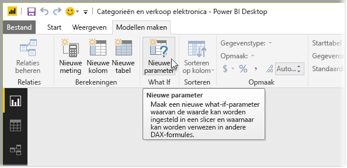
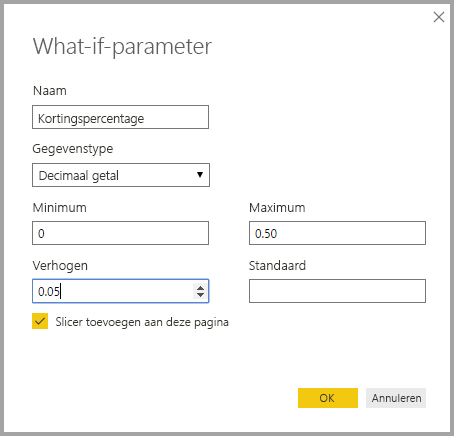
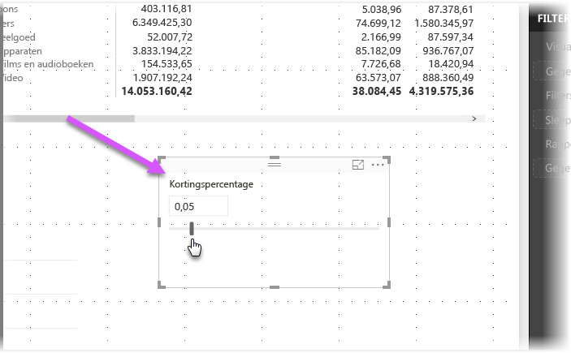
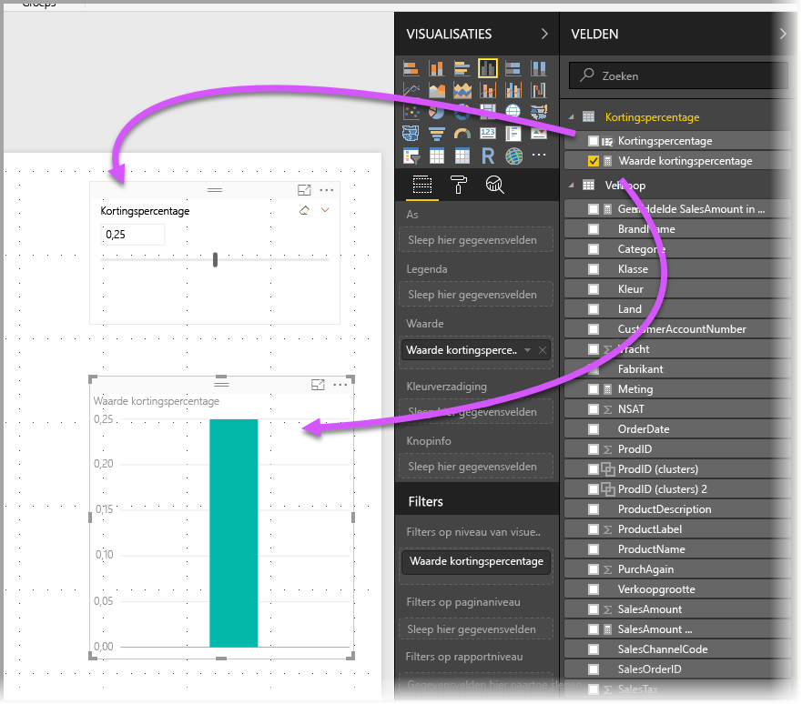
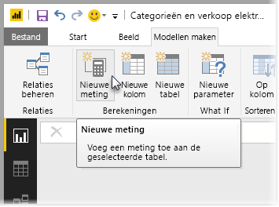
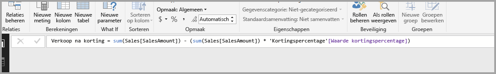
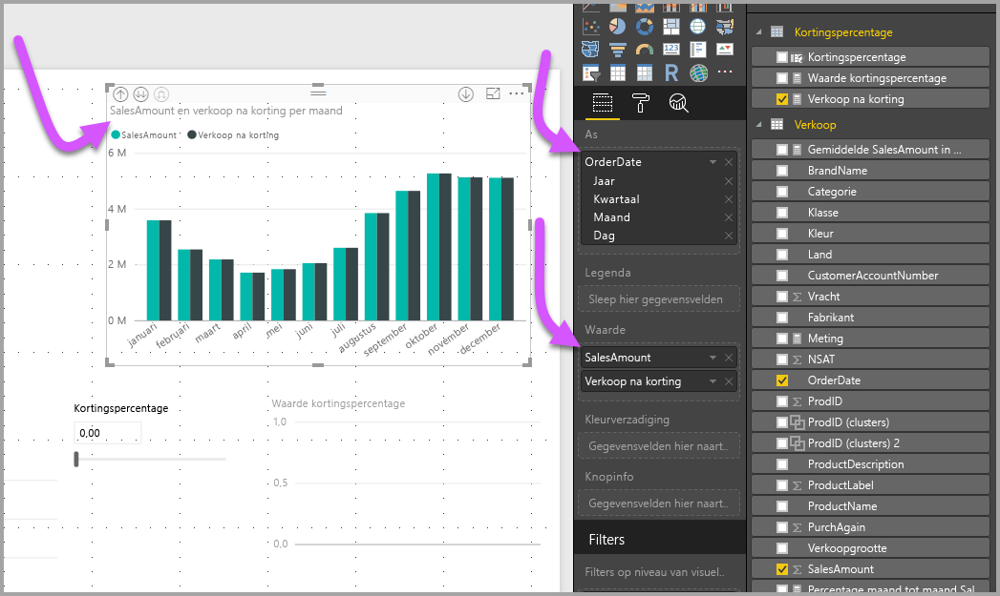
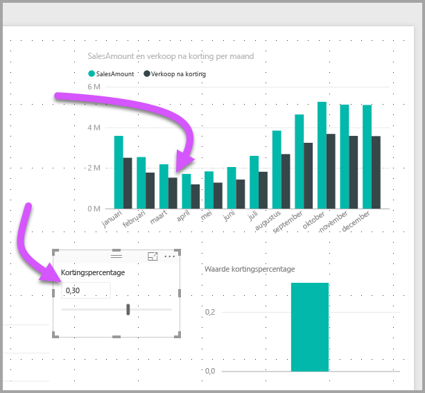

# Een What if-parameter maken en gebruiken om variabelen in Power BI Desktop te visualiseren
Vanaf de release van augustus 2017 van **Power BI Desktop** kunt u **What if**-variabelen voor uw rapporten maken, communiceren met de variabele als een slicer en daardoor verschillende sleutelwaarden in uw rapporten visualiseren en kwantificeren.

De parameter **What if** bevindt zich op het tabblad **Model maken** van **Power BI Desktop**. Wanneer u deze selecteert, wordt een dialoogvenster weergegeven waarin u de parameter kunt configureren.

## Een What if-parameter maken
Als u een **What if**-parameter wilt maken, selecteert u de **What if**-knop op het tabblad **Model maken** van **Power BI Desktop**. In de volgende afbeelding hebben we een parameter met de naam *Discount percentage* gemaakt en is het gegevenstype ingesteld op *Decimaal getal*. De *Minimum*waarde is nul, de *Maximum*waarde is 0,50 (50 procent). Bovendien hebben we de *Verhoging* ingesteld op 0,05, ofwel vijf procent. Dat is hoeveel de parameter wordt aangepast bij interactie met een rapport.

> [!NOTE]
> Zorg er bij decimale getallen voor dat u deze vooraf laat gaan door een nul, zoals 0,50, en dus niet ,50. Anders wordt het getal niet gevalideerd en kan de knop **OK** niet worden geselecteerd.
> 
> 

Om het u gemakkelijk te maken, wordt door het selectievakje **Slicer toevoegen aan deze pagina** automatisch een slicer bij uw **What if**-parameter op de huidige rapportpagina geplaatst.

Door een **What if**-parameter te maken wordt ook een meting gemaakt, waarmee u de huidige waarde van de **What if**-parameter kunt visualiseren.

Het is belangrijk en handig te weten dat wanneer u een **What if**-parameter maakt, zowel de parameter als de meting deel van het model worden. Ze zijn beschikbaar in het hele rapport en kunnen derhalve op andere rapportpagina's worden gebruikt. En omdat ze onderdeel van het model zijn, kunt u de slicer verwijderen uit de rapportpagina. Wilt u de slicer terug, dan kunt u de parameter **What if** gewoon ophalen uit de lijst **Velden** en naar het canvas slepen (wijzig vervolgens de visual in een slicer) om de parameter gemakkelijk terug in het rapport te zetten.

## Een What if-parameter gebruiken
Laten we een eenvoudig voorbeeld van het gebruik van een **What if**-parameter maken. In de vorige sectie hebben we de **What if**-parameter gemaakt. We gaan de parameter nu gebruiken door een nieuwe meting te maken waarvan de waarde wordt aangepast met de slicer. Daarvoor maken we een nieuwe meting.

De nieuwe meting bestaat alleen maar uit de totale omzet, waarvoor het kortingstarief wordt toegepast. U kunt uiteraard ook complexe en interessante metingen maken waarmee de gebruikers van uw rapporten de variabele van uw **What if**-parameter kunnen visualiseren. U kunt bijvoorbeeld een rapport maken waarmee verkoopmedewerkers hun bonus kunnen bekijken als ze voldoen aan bepaalde verkoopdoelstellingen of -percentages, of het effect kunnen zien van gestegen verkoop en hogere kortingen.

Wanneer we de formule van de meting in de formulebalk typen en deze de naam **Sales after Discount** geven, krijgen we het volgende resultaat:

Vervolgens maken we een kolomvisual met *OrderDate* op de as en zowel *SalesAmount* als de zojuist gemaakte meting *Sales after Discount* als waarden.

Als de slicer wordt verschoven, kunt u zien dat de kolom *Sales after Discount* de gereduceerde verkoopcijfers weerspiegelt.

Zo eenvoudig werkt dat. U kunt **What if**-parameters in verschillende situaties gebruiken, zodat gebruikers van rapporten kunnen werken met verschillende scenario's die u in uw rapporten maakt.

