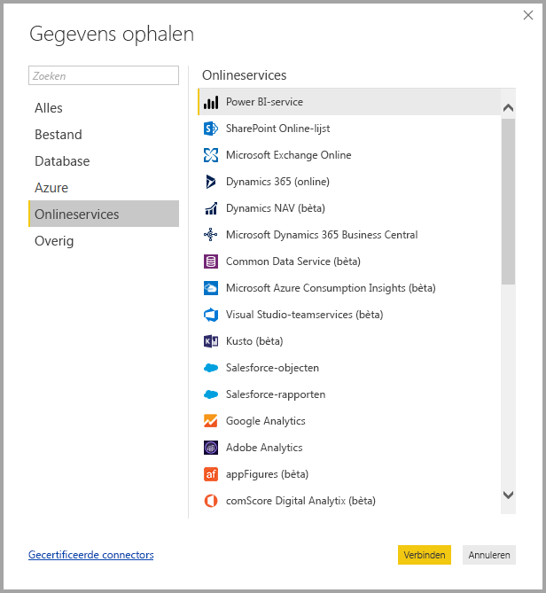
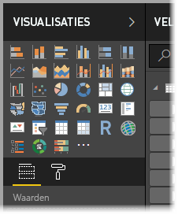
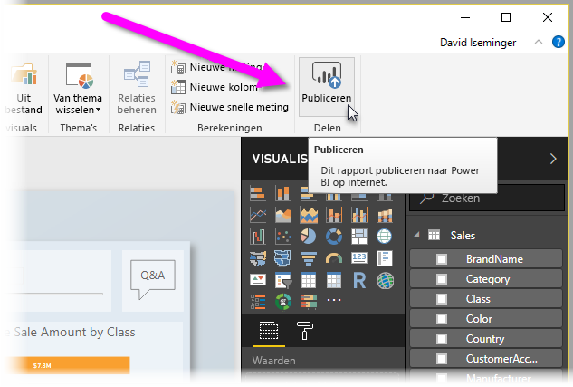

# Wat is Power BI Desktop?

**Power BI Desktop** is een gratis toepassing die u op uw lokale computer kunt installeren en waarmee u verbinding kunt maken met gegevens, gegevens kunt transformeren en gegevens kunt visualiseren. Met **Power BI Desktop** kunt u verbinding maken met verschillende bronnen met gegevens en deze gegevens combineren (ook wel modelleren genoemd) in een gegevensmodel waarmee u visuals kunt maken en verzamelingen met visuals kunt maken die u als rapporten kunt delen met andere personen binnen uw organisatie. De meeste gebruikers die aan business intelligence-projecten werken, gebruiken **Power BI Desktop** om rapporten maken en gebruiken vervolgens de **Power BI-service** om hun rapporten met anderen te delen.

**Power BI Desktop** wordt het meest gebruikt voor de volgende taken:

* Verbinding maken met gegevens
* Deze gegevens transformeren en opschonen om een gegevensmodel te maken
* Visuals maken, zoals diagrammen en grafieken, die de gegevens visueel weergeven
* Rapporten (van een of meer rapportpagina's) maken die verzamelingen zijn van visuals
* Rapporten delen met anderen behulp van de **Power BI-service**

De personen die meestal verantwoordelijk zijn voor dergelijke taken, worden ook wel *gegevensanalisten* (of *analisten*) of business intelligence-professionals (ook wel *makers van rapporten*) genoemd. Veel personen die zichzelf niet als analist of maker van rapporten zien, gebruiken **Power BI Desktop** om aantrekkelijke rapporten te maken, of om gegevens op te halen uit diverse bronnen en vervolgens gegevensmodellen te maken, die ze met hun collega's en organisaties kunnen delen.

Met **Power BI Desktop** kunt u complexe en visueel rijke rapporten maken van gegevens uit meerdere bronnen, die u allemaal in één rapport kunt opnemen dat u vervolgens kunt delen met anderen in uw organisatie. 

## Verbinding maken met gegevens
Als u aan de slag wilt met **Power BI Desktop**, moet u eerst verbinding maken met gegevens. Via **Power BI Desktop** kunt u verbinding maken met allerlei gegevensbronnen. Als u een verbinding wilt maken met gegevens, selecteert u het tabblad **Start** op het lint en selecteert u vervolgens **Gegevens ophalen > Meer**. In de volgende afbeelding ziet u het venster **Gegevens ophalen** dat wordt weergegeven. Hierin worden de vele categorieën weergegeven waarmee u in Power BI Desktop verbinding kunt maken.

Wanneer u een gegevenstype selecteert, wordt u gevraagd om gegevens (zoals de URL en de referenties) in te voeren die in Power BI Desktop nodig zijn om namens u verbinding te kunnen maken met de gegevensbron.

Wanneer u verbinding met een of meer gegevensbronnen maakt, wilt u de gegevens wellicht transformeren, zodat ze nuttig voor u zijn.

## Gegevens transformeren en opschonen, en een model maken

In Power BI Desktop kunt u gegevens opschonen en transformeren met behulp van de ingebouwde **Query-editor**. Met Query-editor kunt u wijzigingen aanbrengen in uw gegevens. Zo kunt u het gegevenstype wijzigen, kolommen verwijderen of gegevens uit meerdere bronnen combineren. U kunt dit proces een beetje vergelijken met beeldhouwen: u kunt beginnen met een groot blok klei (of gegevens) en vervolgens kleine delen afschaven of juist toevoegen, totdat de gewenste vorm ontstaat. 

Elke stap die u uitvoert bij het transformeren van gegevens (zoals het wijzigen van de naam van een tabel, het transformeren van een gegevenstype of het verwijderen van kolommen), wordt vastgelegd met **Query-editor**. Elke keer dat deze query verbinding maakt met de gegevensbron, worden deze stappen uitgevoerd zodat de gegevens altijd op de door u opgegeven manier worden vormgegeven.

In de volgende afbeelding ziet u het deelvenster **Query-instellingen** voor een query die is vormgegeven en is omgezet in een model.

 

Als de gegevens op de gewenste manier zijn vormgegeven, kunt u visuals maken. 

## Visuals maken 

Als u een gegevensmodel hebt, kunt u *velden* naar het rapportcanvas slepen om *visuals* te maken. Een *visual* is een grafische weergave van de gegevens in het model. Met de volgende visual wordt een eenvoudig kolomdiagram aangegeven. 

Er zijn veel verschillende typen visuals waaruit u kunt kiezen in Power BI Desktop. Als u een visual wilt maken of wijzigen, selecteert u het pictogram voor de visual in het deelvenster **Visualisaties**. Als u een visual op het rapportcanvas hebt geselecteerd, verandert de geselecteerde visual in het type dat u hebt geselecteerd. Als u geen visual hebt geselecteerd, wordt op basis van de selectie een nieuwe visual gemaakt.

## Rapporten maken

Het komt vaker voor dat u een verzameling met visuals wilt maken waarmee verschillende aspecten worden weergegeven van de gegevens op basis waarvan u het model in Power BI Desktop gemaakt. Een verzameling met visuals in één Power BI Desktop-bestand wordt een *rapport* genoemd. Een rapport kan uit een of meer pagina's bestaan, net zoals een Excel-bestand uit een of meer werkbladen kan bestaan. In de volgende afbeelding ziet u de eerste pagina van een Power BI Desktop-rapport met de naam Overzicht (u ziet het tabblad aan de onderkant van de afbeelding). Dit rapport bestaat uit tien pagina's.

## Rapporten delen

Wanneer het rapport met anderen kan worden gedeeld, kunt u het rapport **publiceren** naar de **Power BI-service** en het beschikbaar maken voor iedereen in uw organisatie die een licentie heeft voor Power BI. Als u een Power BI Desktop-rapport wilt publiceren, selecteert u de knop **Publiceren** op het tabblad **Start** van het lint in Power BI Desktop.

Als u **Publiceren** selecteert, wordt in Power BI Desktop met behulp van uw Power BI-account verbinding met de **Power BI-service** gemaakt. Vervolgens wordt u gevraagd waar in de Power BI-service u het rapport wilt delen (bijvoorbeeld in uw werkruimte, in een teamwerkruimte of op een andere locatie in de Power BI-service). U moet over een licentie voor Power BI beschikken om rapporten te delen met de Power BI-service.

## Volgende stappen

Als u aan de slag wilt met **Power BI Desktop**, moet u eerst de toepassing downloaden en installeren. U kunt **Power BI Desktop** op twee manieren downloaden:

* [Power BI Desktop downloaden via het web](desktop-get-the-desktop.md)
* [Power BI Desktop downloaden vanuit de Windows Store](http://aka.ms/pbidesktopstore)
