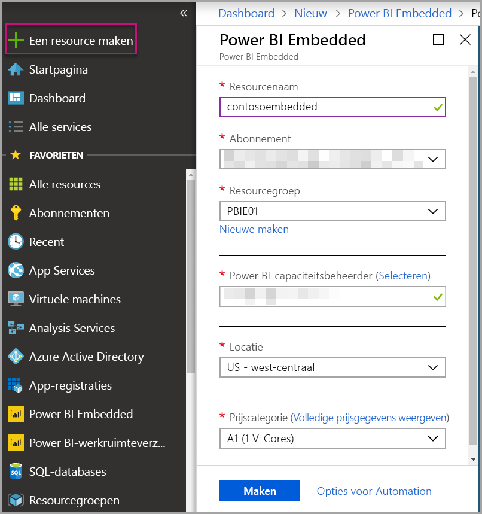
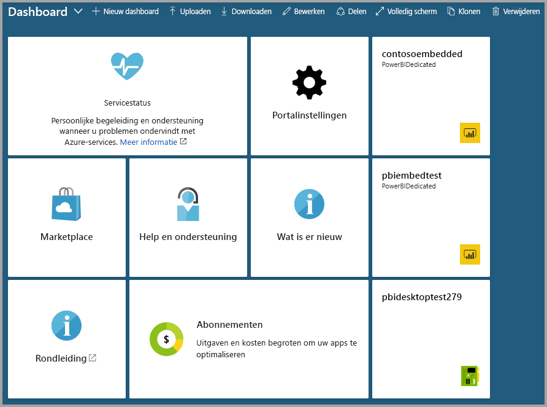

# Power BI Embedded-capaciteit maken in Azure Portal

Dit artikel biedt informatie over het maken van [Power BI Embedded](azure-pbie-what-is-power-bi-embedded.md)-capaciteit in Microsoft Azure. Met Power BI Embedded kunt u eenvoudiger gebruikmaken van de Power BI-functionaliteit: u kunt hiermee namelijk snel prachtige visuals, rapporten en dashboards toevoegen aan uw apps.

Als u nog geen abonnement voor Azure hebt, maakt u een [gratis account](https://azure.microsoft.com/free/) voordat u begint.

> [!VIDEO https://www.youtube.com/embed/aXrvFfg_iSk]

## Voordat u begint

Voor deze snelstartgids hebt u heet volgende nodig:

* **Azure-abonnement:** ga naar [Gratis proefversie van Azure](https://azure.microsoft.com/free/) om een account te maken.
* **Azure Active Directory:** uw abonnement moet zijn gekoppeld aan een Azure Active Directory-tenant (AAD). Bovendien ***moet u zijn aangemeld bij Azure met een account in deze tenant***. Microsoft-accounts worden niet ondersteund. Zie [Verificatie en gebruikersmachtigingen](https://docs.microsoft.com/azure/analysis-services/analysis-services-manage-users) voor meer informatie.
* **Power BI-tenant:** ten minste één account in uw AAD-tenant moet zijn geregistreerd voor Power BI.
* **Resourcegroep:** gebruik een resourcegroep die u al hebt of [maak een nieuwe](https://docs.microsoft.com/azure/azure-resource-manager/resource-group-overview).

## Een capaciteit maken

1. Meld u aan bij [Azure Portal](https://portal.azure.com/).

2. Zoek in het zoekvak naar *Power BI Embedded*.

3. In Power BI Embedded selecteert u **Maken**.

4. Vul de vereiste gegevens in en selecteer vervolgens **Maken**.

    

    |Instelling |Beschrijving |
    |---------|---------|
    |**Resourcenaam**|Een unieke naam voor de capaciteit. De resourcenaam wordt weergegeven in de Power BI-beheerportal en in Azure Portal.|
    |**Abonnement**|Het abonnement waarvoor u de capaciteit wilt maken.|
    |**Resourcegroep**|De resourcegroep die deze nieuwe capaciteit bevat. Kies een bestaande resourcegroep of maak een nieuwe. Zie [Overzicht van Azure Resource Manager](https://docs.microsoft.com/azure/azure-resource-manager/resource-group-overview) voor meer informatie.|
    |**Power BI-capaciteitsbeheerder**|Power BI-capaciteitsbeheerders kunnen de capaciteit in de Power BI-beheerportal bekijken en machtigingen toewijzen aan andere gebruikers. De rol van capaciteitsbeheerder is standaard toegewezen aan uw account. De capaciteitsbeheerder moet zich binnen uw Power BI-tenant bevinden.|
    |**Locatie**|De locatie waar Power BI voor uw tenant wordt gehost. Uw standaardlocatie is uw basisregio. U kunt de regio wijzigen met behulp van [Multi-Geo-opties](embedded-multi-geo.md).
    |**Prijscategorie**|Selecteer de SKU (aantal v-cores en de hoeveelheid geheugen) die voldoet aan uw behoeften.  Zie [Prijzen voor Power BI Embedded](https://azure.microsoft.com/pricing/details/power-bi-embedded/) voor meer informatie|

U kunt naar **Alle services** > **Power BI Embedded** navigeren om te ontdekken of uw capaciteit gereed is. U kunt ook **Vastmaken aan dashboard** selecteren in het meldingengedeelte of binnen een blade om naar uw dashboard te navigeren om uw nieuwe capaciteit te zien.

## Volgende stappen

Als u uw nieuwe Power BI Embedded-capaciteit wilt gebruiken, bladert u n aar de Power BI-beheerportal om werkruimten toe te wijzen. Zie [Capaciteiten in Power BI Premium en Power BI Embedded beheren](https://powerbi.microsoft.com/documentation/powerbi-admin-premium-manage/) voor meer informatie.

Als u deze capaciteit niet nodig hebt, kunt u deze onderbreken zodat er geen kosten meer in rekening worden gebracht. Zie [Uw Power BI Embedded-capaciteit onderbreken en starten in Azure Portal](azure-pbie-pause-start.md) voor meer informatie.

Als u Power BI-inhoud wilt insluiten in uw toepassing, ziet u [Uw Power BI-dashboards, -rapporten en -tegels insluiten](https://powerbi.microsoft.com/documentation/powerbi-developer-embedding-content/).

Hebt u nog vragen? [Misschien dat de Power BI-community het antwoord weet](http://community.powerbi.com/)