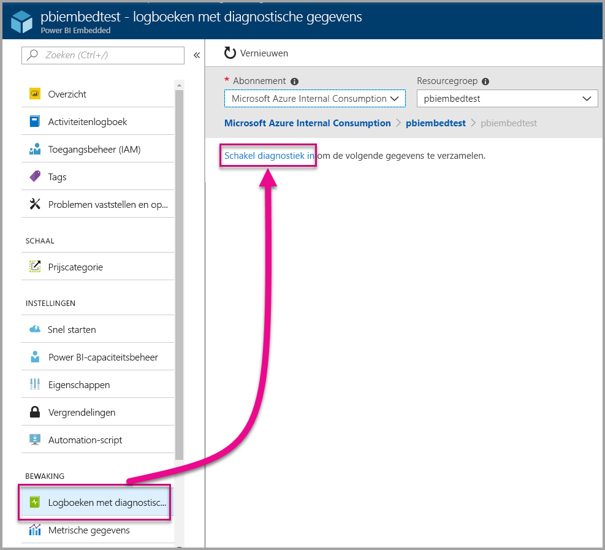
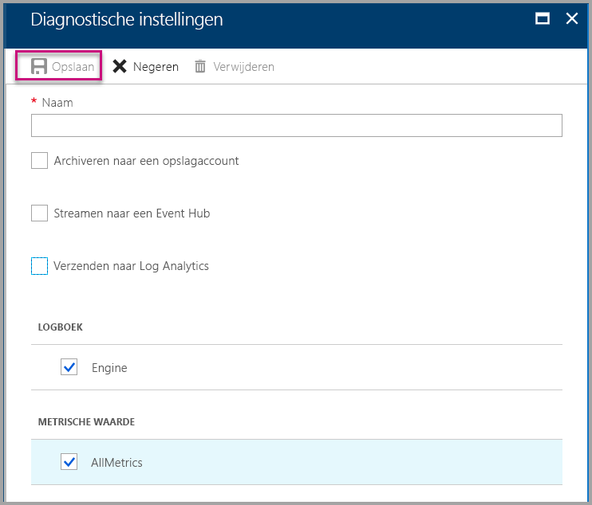
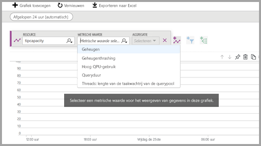
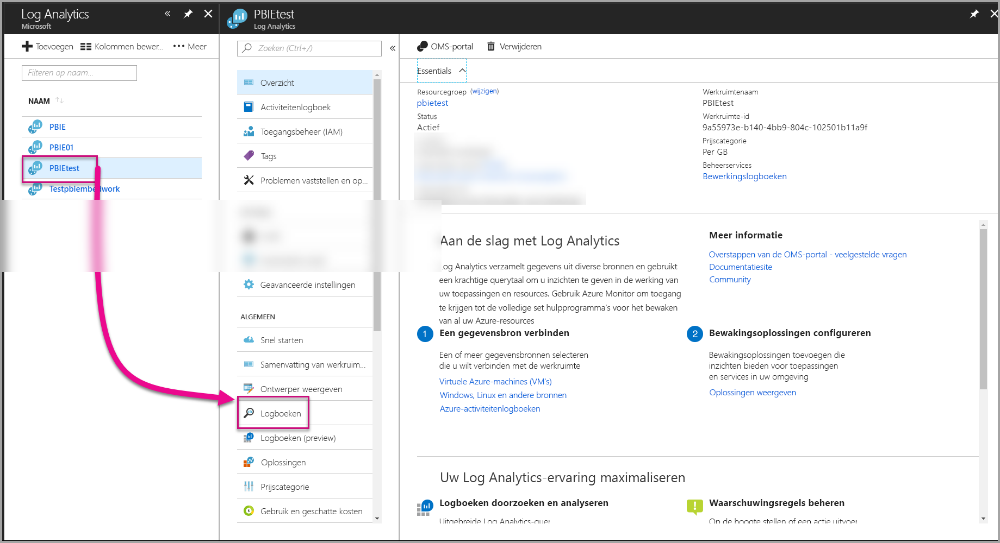
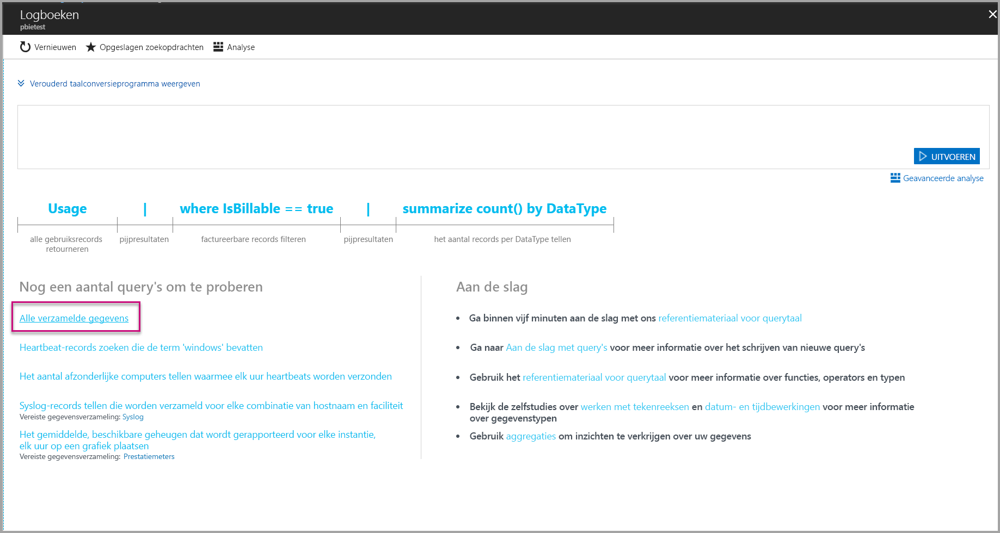
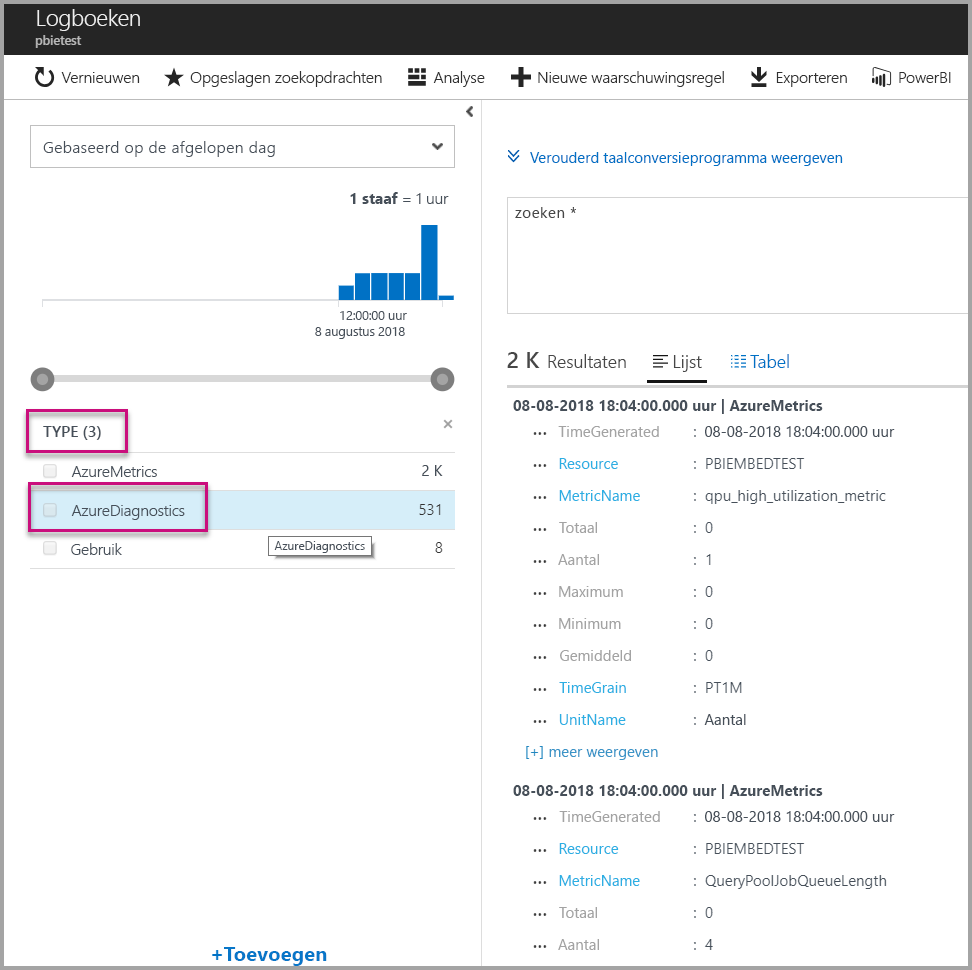
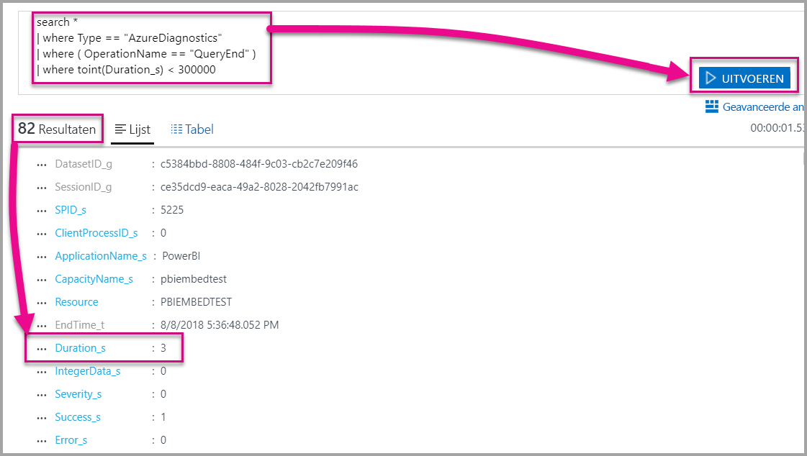
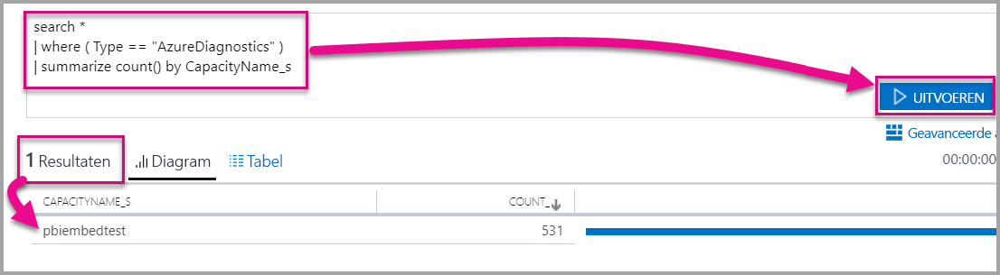

# <a name="diagnostic-logging-for-power-bi-embedded-in-azure"></a>Logboekregistratie van diagnostische gegevens voor Power BI Embedded in Azure

Met [diagnostische logboeken voor Azure-resources](https://docs.microsoft.com/azure/monitoring-and-diagnostics/monitoring-overview-of-diagnostic-logs) kunt u veel gebeurtenissen uit uw capaciteit vastleggen en een hulpprogramma voor analyse gebruiken om deze gegevens te transformeren in inzichten in het gedrag van de resource.

Het gebruik van diagnostische gegevens is handig in een aantal scenario's, bijvoorbeeld:

* Bij het detecteren van langlopende of problematische query's.
* Bij het detecteren van fouten wanneer de capaciteitslimiet is bereikt.
* Bij het afleiden van [metrische capaciteitsgegevens](https://powerbi.microsoft.com/blog/power-bi-developer-community-april-update/).
* Bij het bijhouden van specifieke gegevenssets.

## <a name="set-up-diagnostics-logging"></a>Logboekregistratie van diagnostische gegevens instellen

### <a name="azure-portal"></a>Azure-portal

1. Selecteer in [Azure-portal](https://portal.azure.com) > Power BI Embedded-resource in het linkernavigatievenster de optie **Diagnostische logboeken**. Selecteer vervolgens **Diagnostische gegevens inschakelen**.

    

2. Geef bij **Diagnostische instellingen** de volgende opties op:

    * **Naam**. Voer een naam in voor de diagnostische instelling die moet worden gemaakt.

    * **Archiveren in een opslagaccount**. Voor deze optie moet u verbinding maken met een bestaand opslagaccount. Zie [Een opslagaccount maken](https://docs.microsoft.com/azure/storage/common/storage-create-storage-account) en volg de instructies om een opslagaccount te maken. Selecteer vervolgens uw opslagaccount door terug te keren naar deze pagina in de portal. Het kan enkele minuten duren voordat nieuwe opslagaccounts worden weergegeven in de vervolgkeuzelijst. Logboekbestanden worden opgeslagen in de JSON-indeling.
    * **Streamen naar een Event Hub**. Voor deze optie moet u verbinding maken met een bestaande Event Hub-naamruimte en Event Hub. Zie [Create an Event Hubs namespace and an event hub using the Azure portal](https://docs.microsoft.com/azure/event-hubs/event-hubs-create) (Een Event Hub-naamruimte en een Event Hub maken met behulp van de Azure-portal) voor meer informatie.
    * **Verzenden naar Log Analytics**. Voor deze optie moet u een bestaande werkruimte gebruiken of een nieuwe Log Analytics-werkruimte maken door de stappen te volgen in [Een nieuwe werkruimte maken](https://docs.microsoft.com/azure/log-analytics/log-analytics-quick-collect-azurevm#create-a-workspace) in de portal. Hiervoor wordt gebruikgemaakt van [Azure Log Analytics](https://docs.microsoft.com/azure/log-analytics/log-analytics-overview), dat ingebouwde analysefunctionaliteit, dashboards en mogelijkheden voor meldingen biedt. U kunt Log Analytics gebruiken om meer gegevens van andere resources te koppelen en zo een volledig beeld te krijgen van de gegevens in alle resources van uw toepassing. Log Analytics kan ook in slechts één klik worden gekoppeld aan [Power BI](https://docs.microsoft.com/azure/log-analytics/log-analytics-powerbi).
    Zie [Logboeken weergeven in Log Analytics](https://docs.microsoft.com/azure/log-analytics/log-analytics-activity) voor meer informatie over het weergeven van logboeken in Log Analytics.
    * **Engine**. Selecteer deze optie om de set met [Engine-gebeurtenissen](#whats-logged) weer te geven die hieronder worden vermeld.
    * **AllMetrics**. Selecteer deze optie om uitgebreide gegevens in [Metrische gegevens](https://docs.microsoft.com/azure/analysis-services/analysis-services-monitor#server-metrics) op te slaan. Als u wilt archiveren in een opslagaccount, kunt u de bewaarperiode voor de diagnostische logboeken selecteren. Logboeken worden automatisch verwijderd als de bewaarperiode is verlopen.

3. Selecteer **Opslaan**.

    Als u wilt aanpassen hoe de diagnostische logboeken worden opgeslagen, keert u terug naar deze pagina om de instellingen te wijzigen.

    

### <a name="using-powershell-to-enable-diagnostics"></a>PowerShell gebruiken om diagnostische gegevens in te schakelen

Gebruik de volgende opdrachten om metrische gegevens en logboekregistratie van diagnostische gegevens in te schakelen met behulp van PowerShell:

* Gebruik deze opdracht om de opslag van diagnostische logboeken in een opslagaccount in te schakelen:

    ```powershell
    Set-AzureRmDiagnosticSetting -ResourceId [your resource id] -StorageAccountId [your storage account id] -Enabled $true
    ```
    De opslagaccount-id is de resource-id voor het opslagaccount waarnaar u de logboeken wilt verzenden.

* Gebruik deze opdracht om het streamen van diagnostische logboeken naar een Event Hub in te schakelen:

    ```powershell
    Set-AzureRmDiagnosticSetting -ResourceId [your resource id] -ServiceBusRuleId [your service bus rule id] -Enabled $true
    ```
* De id voor de Azure Service Bus-regel is een tekenreeks met deze indeling:

    ```powershell
    {service bus resource ID}/authorizationrules/{key name}
    ```

* Gebruik deze opdracht om het verzenden van diagnostische logboeken naar een Log Analytics-werkruimte in te schakelen:

    ```powershell
        Set-AzureRmDiagnosticSetting -ResourceId [your resource id] -WorkspaceId [resource id of the log analytics workspace] -Enabled $true
    ```

* U kunt de resource-id van de Log Analytics-werkruimte achterhalen door de volgende opdracht te gebruiken:

    ```powershell
    (Get-AzureRmOperationalInsightsWorkspace).ResourceId
    ```

U kunt deze parameters combineren om meerdere uitvoeropties in te schakelen.

### <a name="rest-api"></a>REST API

Leer hoe u [diagnostische instellingen kunt wijzigen met behulp van de Azure Monitor REST API](https://docs.microsoft.com/rest/api/monitor/). 

### <a name="resource-manager-template"></a>Resource Manager-sjabloon

Leer hoe u [diagnostische instellingen kunt inschakelen tijdens het maken van een resource met behulp van een Resource Manager-sjabloon](https://docs.microsoft.com/azure/monitoring-and-diagnostics/monitoring-enable-diagnostic-logs-using-template).

## <a name="whats-logged"></a>Wat wordt er geregistreerd?

U kunt de categorie **Engine** en/of de categorie **AllMetrics** selecteren.

### <a name="engine"></a>Engine

Als de categorie Engine is geselecteerd, worden in de resource de volgende gebeurtenissen geregistreerd (elke gebeurtenis heeft eigenschappen):

|     Naam van de gebeurtenis     |     Beschrijving van de gebeurtenis     |
|----------------------------|----------------------------------------------------------------------------------|
|    Controle van aanmeldingen    |    Registreert alle nieuwe verbindingen met Engine sinds het begin van de tracering.    |
|    Initialisatie van sessies    |    Registreert alle gestarte sessies sinds het begin van de tracering.    |
|    Start van Vertipaq-query    |    Registreert alle keren dat VertiPaq SE-query is gestart sinds het begin van de tracering.    |
|    Start van query    |    Registreert alle keren dat de query is gestart sinds het begin van de tracering.    |
|    Einde van query    |    Registreert alle keren dat de query is geëindigd sinds het begin van de tracering.    |
|    Einde van Vertipaq-query    |    Registreert alle keren dat VertiPaq SE-query is geëindigd sinds het begin van de tracering.    |
|    Controle van afmeldingen    |    Registreert alle verbroken Engine-verbindingen sinds het begin van de tracering.    |
|    Fout    |    Registreert alle Engine-fouten sinds het begin van de tracering.    |

</br>
</br>

| Naam van de eigenschap | Voorbeeld van Einde van Vertipaq-query | Beschrijving van de eigenschap |
|-------------------|---------------------------------------------------------------------------------------------------------------------------------------------------------------------------------------------------------|--------------------------------------------------------------------------------------------------------------------------|
| EventClass | XM_SEQUERY_END | Gebeurtenisklasse wordt gebruikt om gebeurtenissen te categoriseren. |
| EventSubclass | 0 | Gebeurtenissubklasse biedt extra informatie over elke gebeurtenisklasse. (bijvoorbeeld, 0: VertiPaq Scan) |
| RootActivityId | ff217fd2-611d-43c0-9c12-19e202a94f70 | Id van hoofdactiviteit. |
| CurrentTime | 2018-04-06T18:30:11.9137358Z | Tijd waarop de gebeurtenis is gestart, indien beschikbaar. |
| StartTime | 2018-04-06T18:30:11.9137358Z | Tijd waarop de gebeurtenis is gestart, indien beschikbaar. |
| JobID | 0 | Taak-id voor voortgang. |
| ObjectID | 464 | Object-id |
| ObjectType | 802012 | ObjectType |
| ObjectName | SalesLT Customer | ObjectName |
| ObjectPath | 5eaa550e-06ac-4adf-aba9-dbf0e8fd1527.Model.SalesLT Customer | Objectpad. Een door komma's gescheiden lijst met bovenliggende items, te beginnen met het bovenliggende item van het object. |
| ObjectReference | <Object><Table>SalesLT Customer</Table><Model>Model</Model><Database>5eaa550e-06ac-4adf-aba9-dbf0e8fd1527</Database></Object> | Objectverwijzing. Voor alle bovenliggende items als XML gecodeerd, met labels om het object te beschrijven. |
| EndTime | 2018-04-06T18:30:11.9137358Z | Tijd waarop de gebeurtenis is beëindigd. |
| Duur | 0 | De tijdsduur (in milliseconden) van de gebeurtenis. |
| SessionType | User | Sessietype (de entiteit die de bewerking heeft veroorzaakt). |
| ProgressTotal | 0 | Totaal van voortgang. |
| IntegerData | 0 | Gegevens in gehele getallen. |
| Ernst | 0 | Ernstniveau van een uitzondering. |
| Geslaagd | 1 | 1 = geslaagd. 0 = mislukt (een 1 betekent bijvoorbeeld dat een machtigingscontrole is voltooid en een 0 dat deze controle is mislukt). |
| Fout | 0 | Foutnummer van een specifieke gebeurtenis. |
| TextData | SET DC_KIND=\"AUTO\";  SELECT  [SalesLT Customer (464)].[rowguid (606)] AS [SalesLT Customer (464)$rowguid (606)]  FROM [SalesLT Customer (464)]; [Geschatte grootte (volume marshalling bytes): 850 6800] | Tekstgegevens met betrekking tot de gebeurtenis. |
| ConnectionID | 3 | Unieke verbindings-id. |
| DatasetID | 5eaa550e-06ac-4adf-aba9-dbf0e8fd1527 | Id van de gegevensset waarin de instructie van de gebruiker wordt uitgevoerd. |
| SessionID | 3D063F66-A111-48EE-B960-141DEBDA8951 | Sessie-GUID. |
| SPID | 180 | Serverproces-id. Hiermee wordt een specifieke gebruikerssessie geïdentificeerd. Deze id komt exact overeen met de sessie-GUID die wordt gebruikt voor XML/A. |
| ClientProcessID | null | De proces-id van de clienttoepassing. |
| ApplicationName | null | De naam van de clienttoepassing waarin de verbinding met de server tot stand is gebracht. |
| CapacityName | pbi641fb41260f84aa2b778a85891ae2d97 | De naam van de resource Power BI Embedded-capaciteit. |
| RequestParameters |  |  |
| RequestProperties |  |  |

### <a name="allmetrics"></a>AllMetrics

Als u de optie **AllMetrics** inschakelt, worden alle metrische gegevens geregistreerd die u met een Power BI Embedded-resource kunt gebruiken.

   

## <a name="manage-your-logs"></a>Logboeken beheren

Logboeken zijn meestal een paar uur na het instellen van logboekregistratie beschikbaar. U moet zelf uw logboeken beheren in het opslagaccount:

* Gebruik standaardmethoden voor Azure-toegangsbeheer om de logboeken te beveiligen door te beperken wie er toegang heeft.
* Verwijder logboeken die u niet meer wilt bewaren in uw opslagaccount.
* Stel altijd een bewaarperiode in, zodat oude logboeken worden verwijderd uit het opslagaccount.

## <a name="view-logs-in-log-analytics"></a>Logboeken weergeven in Log Analytics

Metrische gegevens en servergebeurtenissen zijn geïntegreerd met xEvents in Log Analytics voor gelijktijdige analyse. Log Analytics kan ook worden geconfigureerd om gebeurtenissen te ontvangen van andere Azure-services voor een volledig beeld van logboekregistratie van diagnostische gegevens in uw architectuur.

Als u de diagnostische gegevens in Log Analytics wilt bekijken, opent u de pagina **Logboeken** in het linkermenu of in het gedeelte Beheer, zoals hieronder wordt weergegeven.



Nu u gegevensverzameling hebt ingeschakeld, selecteert u bij **Logboeken** de optie **Alle verzamelde gegevens**.



Selecteer bij **Type** de optie **AzureDiagnostics**. Selecteer vervolgens **Toepassen**. AzureDiagnostics omvat Engine-gebeurtenissen. U ziet dat er indien nodig een Log Analytics-query wordt gemaakt.



Selecteer **EventClass\_s** of een van de gebeurtenisnamen. Vervolgens wordt er een Log Analytics-query gemaakt. Vergeet niet om uw query's op te slaan, zodat u ze later opnieuw kunt gebruiken.

Ga ook naar [Log Analytics](https://docs.microsoft.com/azure/log-analytics/). Op de website hiervan vindt u uitgebreide queryfunctionaliteit, dashboards en mogelijkheden voor meldingen over verzamelde gegevens.

### <a name="queries"></a>Query's

Er zijn honderden query's die u kunt gebruiken. Hier ziet u een paar query's waarmee u direct aan de slag kunt gaan. Zie [Understanding log searches in Log Analytics](https://docs.microsoft.com/azure/log-analytics/log-analytics-log-search) (Informatie over zoekopdrachten in logboeken in Log Analytics) voor meer informatie over het gebruik van de nieuwe querytaal voor Zoeken in logboeken.

* Query-uitvoer die in minder dan vijf minuten (300.000 milliseconden) werd geretourneerd.

    ```
    search *
    | where Type == "AzureDiagnostics"
    | where ( OperationName == "QueryEnd" )
    | where toint(Duration_s) < 300000
    ```

    

* Capaciteitsnamen identificeren.

    ```
    search *
    | where ( Type == "AzureDiagnostics" )
    | summarize count() by CapacityName_s 
    ```

    

## <a name="next-steps"></a>Volgende stappen

Lees meer informatie over logboekregistratie van diagnostische gegevens in Azure-resources.

> [!div class="nextstepaction"]
> [Logboekregistratie van diagnostische gegevens in Azure-resources](https://docs.microsoft.com/azure/monitoring-and-diagnostics/monitoring-overview-of-diagnostic-logs)

> [!div class="nextstepaction"]
> [Set-AzureRmDiagnosticSetting](https://docs.microsoft.com/powershell/module/azurerm.insights/Set-AzureRmDiagnosticSetting)