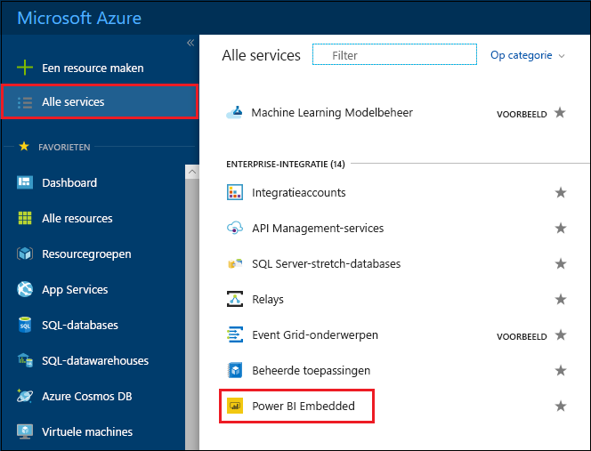
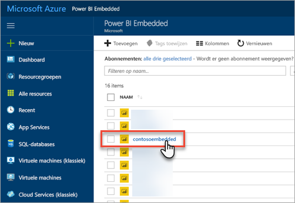
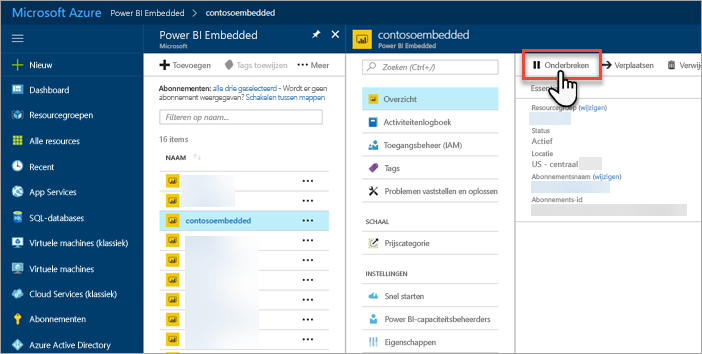
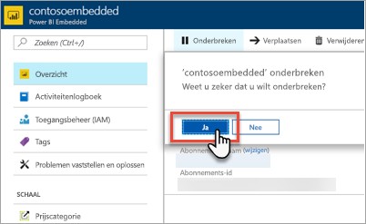
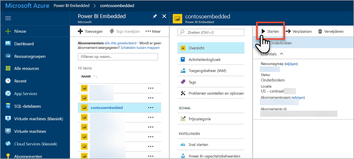
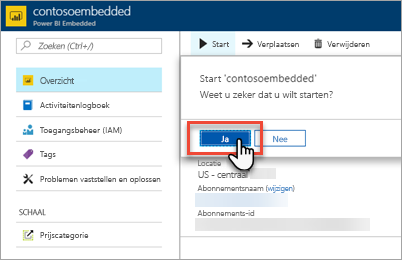

# Uw Power BI Embedded-capaciteit onderbreken en starten in Azure Portal

Dit artikel biedt informatie over het onderbreken en starten van Power BI Embedded-capaciteit in Microsoft Azure. Hierbij wordt ervan uitgegaan dat u Power BI Embedded-capaciteit hebt gemaakt. Als u dat nog niet hebt gedaan, gaat u naar [Power BI Embedded-capaciteit maken in Azure Portal](azure-pbie-create-capacity.md) om aan de slag te gaan.

Als u nog geen abonnement voor Azure hebt, maakt u een [gratis account](https://azure.microsoft.com/free/) voordat u begint.

## Capaciteit onderbreken

Als u capaciteit onderbreekt, worden er geen kosten in rekening gebracht. Het is handig om capaciteit te onderbreken als u de capaciteit gedurende een bepaalde periode niet nodig hebt. Voer de volgende stappen uit om uw capaciteit onderbreken.

> [!NOTE]
> Als u een capaciteit onderbreekt, kan dat ertoe leiden dat inhoud niet beschikbaar wordt gemaakt in Power BI. Zorg ervoor dat u de toewijzing van werkruimten aan uw capaciteit opheft voordat u een capaciteit onderbreekt. Op die manier voorkomt u mogelijke onderbrekingen.

1. Meld u aan bij [Azure Portal](https://portal.azure.com/).

2. Selecteer **Alle services** > **Power BI Embedded** om uw capaciteiten te bekijken.

    

3. Selecteer de capaciteit die u wilt onderbreken.

    

4. Selecteer **Onderbreken** in de capaciteitsgegevens.

    

5. Selecteer **Ja**. Hiermee bevestigt u dat u de capaciteit wilt onderbreken.

    

## Capaciteit starten

U kunt het gebruik hervatten door de capaciteit te starten. Als u de capaciteit weer start, worden er ook weer kosten in rekening gebracht.

1. Meld u aan bij [Azure Portal](https://portal.azure.com/).

2. Selecteer **Alle services** > **Power BI Embedded** om uw capaciteiten te bekijken.

    

3. Selecteer de capaciteit die u wilt starten.

    

4. Selecteer **Starten** in de capaciteitsgegevens.

    

5. Selecteer **Ja**. Hiermee bevestigt u dat u de capaciteit wilt starten.

    

Als er inhoud is toegewezen aan deze capaciteit, wordt deze na het starten beschikbaar gemaakt.

## Volgende stappen

Als u uw capaciteit omhoog of omlaag wilt schalen, ziet u [Uw Power BI Embedded-capaciteit schalen](azure-pbie-scale-capacity.md).

Als u Power BI-inhoud wilt insluiten in uw toepassing, ziet u [Uw Power BI-dashboards, -rapporten en -tegels insluiten](https://powerbi.microsoft.com/documentation/powerbi-developer-embedding-content/).

Hebt u nog vragen? [Misschien dat de Power BI-community het antwoord weet](http://community.powerbi.com/)