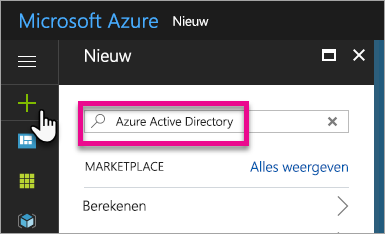
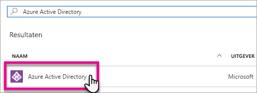
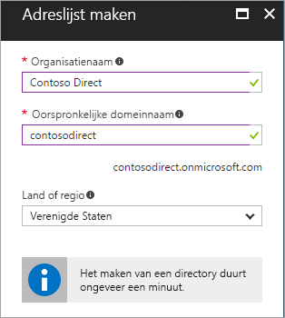
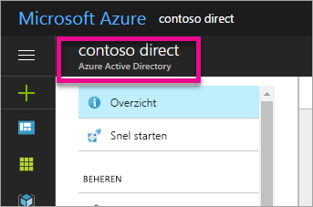
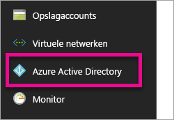
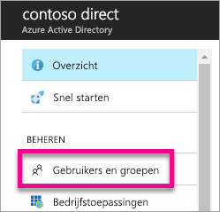
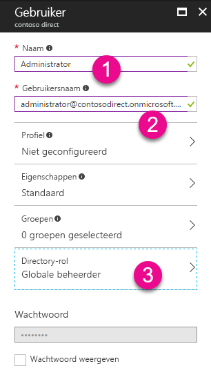
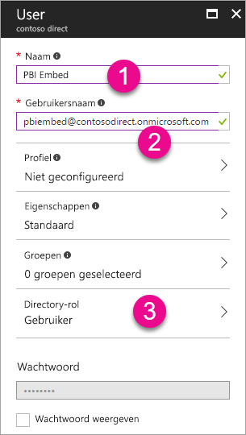

# Een Azure Active Directory-tenant maken voor gebruik met Power BI
Informatie over het maken van een nieuwe Azure Active Directory-tenant (Azure AD) voor gebruik met uw aangepaste toepassing met behulp van de Power BI REST-API's.

Een tenant is een vertegenwoordiger van een organisatie binnen Azure Active Directory. Het is een toegewezen exemplaar van de Azure AD-service die een organisatie ontvangt en waarvan de organisatie eigenaar is wanneer deze zich aanmeldt voor een Microsoft-cloudservice zoals Azure, Microsoft Intune of Office 365. Elke Azure AD-tenant is uniek en werkt afzonderlijk van andere Azure AD-tenants.

Zodra u een Azure AD-tenant hebt, kunt u een toepassing definiëren en machtigingen toewijzen zodat uw toepassing gebruik kan maken van de Power BI REST-API's.

Uw organisatie heeft mogelijk al een Azure AD-tenant die u voor uw toepassing kunt gebruiken. U kunt die tenant gebruiken voor de behoeften van uw toepassing of u kunt een nieuwe tenant maken specifiek voor uw toepassing. In dit artikel wordt behandeld hoe u een nieuwe tenant maakt.

## Een Azure Active Directory-tenant maken
U moet een toepassing definiëren in Azure AD om Power BI te kunnen integreren met uw aangepaste toepassing. Hiervoor moet u een map in Azure AD maken. Dit is uw tenant. Als uw organisatie nog geen tenant heeft, omdat deze niet Power BI of Office 365 gebruikt, [moet u er een maken](https://docs.microsoft.com/azure/active-directory/develop/active-directory-howto-tenant). U moet er mogelijk ook een maken als u uw toepassing niet wilt combineren met de tenant van uw organisatie. Zo kunt u zaken apart houden.

Of misschien wilt u een tenant alleen maken voor testdoeleinden.

Ga als volgt te werk om een nieuwe Azure AD-tenant te maken.

1. Ga naar [Azure Portal](https://portal.azure.com) en meld u aan met een account met een Azure-abonnement.
2. Selecteer het **plus-pictogram (+)** en zoek naar *Azure Active Directory*.
   
    
3. Selecteer **Azure Active Directory** in de zoekresultaten.
   
    
4. Selecteer **Maken**.
5. Geef een **naam op voor de organisatie** samen met de **initiële domeinnaam**. Selecteer vervolgens **Maken**. Hiermee maakt u uw map.
   
    
   
   > [!NOTE]
   > Uw initiële domein maakt deel uit van onmicrosoft.com. U kunt later andere domeinnamen toevoegen. Aan de map van een tenant kunnen meerdere domeinen zijn toegewezen.
   > 
   > 
6. Nadat het maken van uw map is voltooid, selecteert u het informatievak voor het beheren van uw nieuwe map.

De map is nu gemaakt. We gaan nu een gebruiker toevoegen aan de tenant.

## Enkele gebruikers maken in uw Azure Active Directory-tenant
Nu we een map hebben, gaan we ten minste twee gebruikers maken. Eén globale beheerder voor de tenant en een andere die onze hoofdgebruiker voor insluiting wordt. U kunt deze account zien als een serviceaccount.

1. Zorg dat u zich binnen Azure Portal in het gedeelte van Azure Active Directory bevindt.
   
    
   
    Als dit niet het geval is, selecteert u het Azure Active Directory-pictogram in de servicebalk links.
   
    
2. Selecteer onder **Beheren** de optie **Gebruikers en groepen**.
   
    
3. Selecteer **Alle gebruikers** en selecteer vervolgens **+ Nieuwe gebruiker**.
4. Geef een naam en de gebruikersnaam op voor deze gebruiker. Dit is de globale beheerder voor de tenant. U wilt ook de **Maprol** wijzigen naar *Globale beheerder*. U kunt ook het tijdelijke wachtwoord weergeven. Selecteer **Maken** als u klaar bent.
   
    
5. Hetzelfde wilt u opnieuw doen voor een gewone gebruiker in uw tenant. Dit kan ook worden gebruikt voor uw hoofdinsluitingsaccount. De **Maprol** laten we nu ingesteld als *Gebruiker*. Vergeet niet het wachtwoord te noteren. Selecteer vervolgens **Maken**.
   
    
6. Meld u aan bij Power BI met de gebruikersaccount die u in stap 5 hebt gemaakt. U kunt dit doen door naar [powerbi.com](https://powerbi.microsoft.com/get-started/) te gaan en **Gratis uitproberen** te selecteren onder *Power BI - samenwerken en delen in de cloud*.
   
    
   
    Wanneer u zich aanmeldt, wordt u gevraagd om Power BI Pro gratis 60 dagen uit te proberen. U kunt daarvoor kiezen om een gebruiker van de Pro-versie te worden. U kunt nu ook beginnen met het ontwikkelen van een ingesloten oplossing als u dat wilt.
   
   > [!NOTE]
   > Zorg ervoor dat u zich aanmeldt met het e-mailadres dat u hebt opgegeven voor de gebruikersaccount.
   > 
   > 

## Volgende stappen
Nu u een Azure AD-tenant hebt, kunt u deze tenant gebruiken voor het testen van items in Power BI en/of u kunt u Power BI-dashboards en -rapporten gaan insluiten in uw toepassing. Zie [Power BI-dashboards, -rapporten en -tegels insluiten](embedding-content.md) voor informatie over het insluiten van items.

[Wat is Azure AD-directory?](https://docs.microsoft.com/azure/active-directory/active-directory-whatis)  
[Een Azure Active Directory-tenant verkrijgen](https://docs.microsoft.com/azure/active-directory/develop/active-directory-howto-tenant)  

Nog vragen? [Misschien dat de Power BI-community het antwoord weet](http://community.powerbi.com/)

