# <a name="tutorial-developing-a-power-bi-custom-visual"></a>Zelfstudie: Een aangepaste visual voor Power BI ontwikkelen

We stellen ontwikkelaars in staat om eenvoudig aangepaste visuals toe te voegen aan Power BI, zodat deze kunnen worden gebruikt in het dashboard en in rapporten. Om u te helpen om hiermee aan de slag te gaan, hebben we de code voor al onze visualisaties naar GitHub gepubliceerd.

Naast het visualisatieframework hebben we ons testpakket en onze hulpprogramma's ter beschikking gesteld, zodat de community aangepaste visuals van hoge kwaliteit voor Power BI kunnen maken.

In deze zelfstudie leert u hoe een aangepaste Power BI-visual maakt met de naam Circle Card om een opgemaakte metingswaarde in een cirkel weer te geven. Voor de visual Circle Card is er nu ondersteuning om de opvulkleur en randbreedte aan te passen.

In het Power BI Desktop-rapport worden de kaarten gewijzigd in Cirkelkaarten.

  

In deze zelfstudie leert u het volgende:
> [!div class="checklist"]
> * Een aangepaste Power BI-visual maken.
> * De aangepaste visual met visuele D3-elementen ontwikkelen.
> * Gegevensbinding met de visual configureren.
> * Gegevenswaarden opmaken.

## <a name="prerequisites"></a>Vereisten

* Als u zich niet hebt geregistreerd voor **Power BI Pro**, [kunt u zich hier aanmelden voor een gratis proefversie](https://powerbi.microsoft.com/pricing/) voordat u begint.
* U moet [Visual Studio Code](https://www.visualstudio.com/) hebben geïnstalleerd.
* U hebt [Windows PowerShell](https://docs.microsoft.com/powershell/scripting/setup/installing-windows-powershell?view=powershell-6) versie 4 of hoger voor Windows-gebruikers nodig OF [Terminal](https://macpaw.com/how-to/use-terminal-on-mac) voor OSX-gebruikers.

## <a name="setting-up-the-developer-environment"></a>De ontwikkelomgeving instellen

Naast de vereiste programma's is er een aantal andere hulpprogramma's dat u moet installeren.

### <a name="installing-nodejs"></a>Node.js installeren

1. Als u Node.js wilt installeren, navigeert u in een webbrowser naar [Node.js](https://nodejs.org).

2. Download het nieuwste MSI-installatieprogramma.

3. Voer het installatieprogramma uit en volg de installatiestappen. Accepteer de voorwaarden van de licentieovereenkomst en alle standaarden.

   

4. Start de computer opnieuw op.

### <a name="installing-packages"></a>Pakketten installeren

Nu moet u het pakket **pbiviz** installeren.

1. Open Windows PowerShell nadat de computer opnieuw is opgestart.

2. Voer de volgende opdracht uit om pbiviz te installeren.

    ```powershell
    npm i -g powerbi-visuals-tools
    ```

### <a name="creating-and-installing-a-certificate"></a>Een certificaat maken en installeren

#### <a name="windows"></a>Windows

1. Voer de volgende opdracht uit om een certificaat te maken.

    ```powershell
    pbiviz --create-cert
    ```

  De opdracht retourneert een resultaat met een *wachtwoordzin*. In dit geval is de *wachtwoordzin* **_15105661266553327_**.

  

2. Nu moet u het certificaat installeren. Voer de volgende opdracht uit om het certificaat te installeren.

    ```powershell
    pbiviz --install-cert
    ```

3. Controleer of in de wizard voor het importeren van certificaten de opslaglocatie is ingesteld op Huidige gebruiker. Selecteer vervolgens *Volgende*.

      

4. Selecteer *Volgende* in de stap **Te importeren bestand**.

5. In de stap **Beveiliging met persoonlijke sleutel** plakt u de wachtwoordzin die u bij het maken van het certificaat hebt ontvangen, in het wachtwoordvenster.  Deze zin is in dit geval opnieuw **_15105661266553327_**.

      

6. Selecteer tijdens de stap **Certificaatarchief** de optie **Alle certificaten in het volgende archief plaatsen**. Selecteer vervolgens *Bladeren*.

      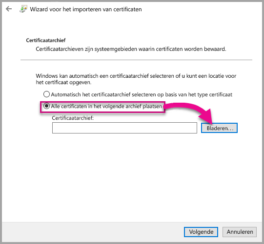

7. Selecteer in het venster **Certificaatarchief selecteren** **Vertrouwde basiscertificeringsinstanties** en selecteer vervolgens *OK*. Selecteer vervolgens *Volgende* op het scherm **Certificaatarchief**.

      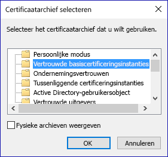

8. Selecteer **Voltooien** om de import te voltooien.

9. Selecteer **Ja** als u een beveiligingswaarschuwing krijgt.

    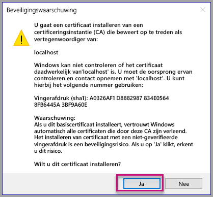

10. Als er wordt gemeld dat de import is geslaagd, selecteert u **OK**.

    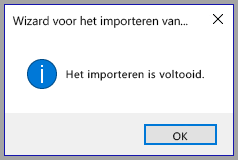

> [!Important]
> Sluit de Windows PowerShell-sessie niet.

#### <a name="osx"></a>OSX

1. Als de vergrendeling in de linkerbovenhoek is vergrendeld, selecteert u deze om te ontgrendelen. Zoek naar *localhost* en dubbelklik op het certificaat.

    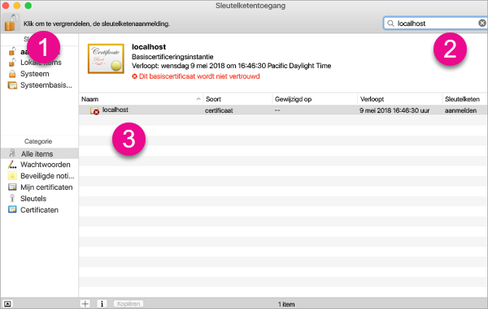

2. Selecteer **Altijd vertrouwen** en sluit het venster.

    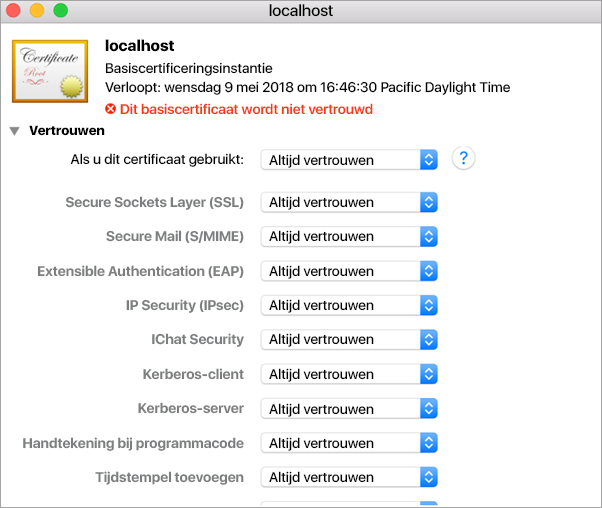

3. Voer uw gebruikersnaam en wachtwoord in. Selecteer **Instellingen bijwerken**.

    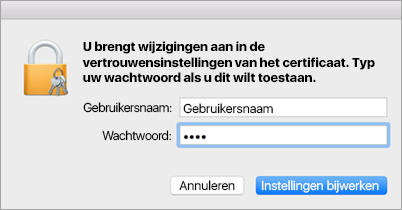

4. Sluit alle browsers die u hebt geopend.

> [!NOTE]
> Als het certificaat niet wordt herkend, moet u de computer mogelijk opnieuw opstarten.

## <a name="creating-a-custom-visual"></a>Een aangepaste visual maken

Nu u uw omgeving hebt ingesteld, is het tijd om uw aangepaste visual te maken.

U kunt de volledige broncode voor deze zelfstudie [downloaden](https://github.com/Microsoft/PowerBI-visuals-circlecard).

1. Controleer of het pakket Power BI Visual Tools is geïnstalleerd.

    ```powershell
    pbiviz
    ```
    Als het goed is, wordt de Help-uitvoer weergegeven.

    <pre><code>
        +syyso+/
    oms/+osyhdhyso/
    ym/       /+oshddhys+/
    ym/              /+oyhddhyo+/
    ym/                     /osyhdho
    ym/                           sm+
    ym/               yddy        om+
    ym/         shho /mmmm/       om+
        /    oys/ +mmmm /mmmm/       om+
    oso  ommmh +mmmm /mmmm/       om+
    ymmmy smmmh +mmmm /mmmm/       om+
    ymmmy smmmh +mmmm /mmmm/       om+
    ymmmy smmmh +mmmm /mmmm/       om+
    +dmd+ smmmh +mmmm /mmmm/       om+
            /hmdo +mmmm /mmmm/ /so+//ym/
                /dmmh /mmmm/ /osyhhy/
                    //   dmmd
                        ++

        PowerBI Custom Visual Tool

    Usage: pbiviz [options] [command]

    Commands:

    new [name]        Create a new visual
    info              Display info about the current visual
    start             Start the current visual
    package           Package the current visual into a pbiviz file
    update [version]  Updates the api definitions and schemas in the current visual. Changes the version if specified
    help [cmd]        display help for [cmd]

    Options:

    -h, --help      output usage information
    -V, --version   output the version number
    --install-cert  Install localhost certificate
    </code></pre>

    <a name="ssl-setup"></a>

2. Controleer de uitvoer, inclusief de lijst met ondersteunde opdrachten.

     

3. Als u een project voor een aangepaste visual wilt maken, voert u de volgende opdracht uit. De naam van het project is **CircleCard**.

    ```PowerShell
    pbiviz new CircleCard
    ```
    

4. Navigeer naar de projectmap.

    ```powershell
    cd CircleCard
    ```
5. Start de aangepaste visual. Uw CircleCard-visual wordt nu uitgevoerd en gehost op uw computer.

    ```powershell
    pbiviz start
    ```

    

> [!Important]
> Sluit de Windows PowerShell-sessie niet.

### <a name="testing-the-custom-visual"></a>De aangepaste visual testen

In deze sectie gaan we de aangepaste CircleCard-visual testen door een Power BI Desktop-rapport te uploaden en vervolgens het rapport aan te passen om de aangepaste visual weer te geven.

1. Meld u aan bij [PowerBI.com](https://powerbi.microsoft.com/) > ga naar het **Tandwielpictogram** > selecteer **Instellingen**.

      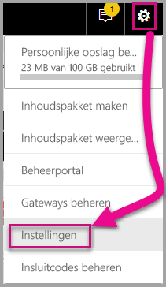

2. Selecteer **Ontwikkelaar** en vink vervolgens het selectievakje **Visueel element voor ontwikkelaars inschakelen voor testen** aan.

    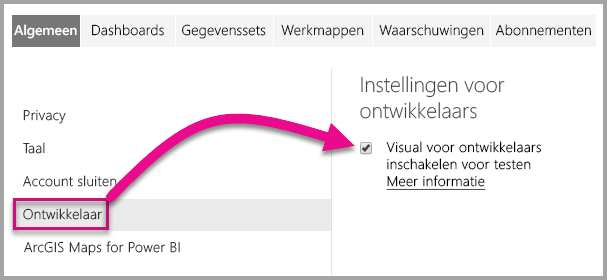

3. Een Power BI Desktop-rapport uploaden.  

    Gegevens ophalen > Bestanden > Lokaal bestand.

    U kunt een Power BI Desktop-voorbeeldrapport [downloaden](https://microsoft.github.io/PowerBI-visuals/docs/step-by-step-lab/images/US_Sales_Analysis.pbix) als u er niet al een hebt gemaakt.

    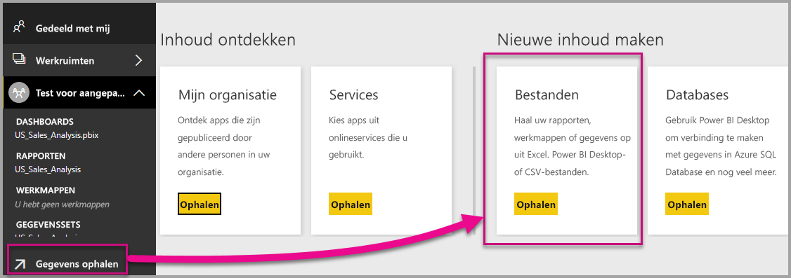 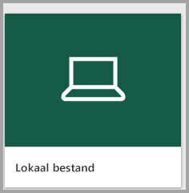

    Als u nu het rapport wilt bekijken, selecteert u **US_Sales_Analysis** in de sectie **Rapport** in het navigatiepaneel aan de linkerzijde.

    

4. Nu moet u het rapport bewerken in de Power BI-service.

    Ga naar **Rapport bewerken**.

    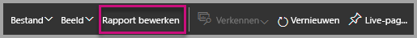

5. Selecteer **Visual voor ontwikkelaars** in het deelvenster **Visualisaties**.

    

    > [!Note]
    > Deze visualisatie staat voor de aangepaste visual die u op uw computer hebt gestart. Deze is alleen beschikbaar wanneer de instellingen voor ontwikkelaars zijn ingeschakeld.

6. U ziet dat er een visual is toegevoegd aan het rapportcanvas.

    

    > [!Note]
    > Dit is een zeer eenvoudige visual die het aantal keer weergeeft dat de Update-methode ervan is opgeroepen. Op dit moment ontvangt de visual nog geen gegevens.

7. Ga terwijl u de nieuwe visual in het rapport selecteert naar het venster Velden > vouw Verkoop uit > selecteer Hoeveelheid.

    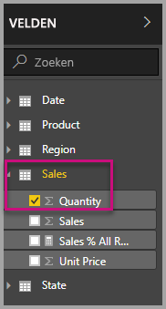

8. Als u de visual vervolgens wilt testen, wijzigt u het formaat van de visual. Bekijk dan hoe de waarde toeneemt.

    

Druk op Ctrl + C om de uitvoering van de aangepaste visual in PowerShell te stoppen. Wanneer u wordt gevraagd om de batchtaak te beëindigen, voert u Y in en drukt u op Enter.

## <a name="adding-visual-elements"></a>Visuele elementen toevoegen

U moet nu de **JavaScript-bibliotheek D3** installeren. D3 is een JavaScript-bibliotheek voor het produceren van dynamische, interactieve gegevensvisuals in webbrowsers. Het maakt gebruikt van breed geïmplementeerde SVG-, HTML5- en CSS-standaarden.

Nu kunt u de aangepaste visual zo ontwikkelen dat er een cirkel met tekst wordt weergegeven.

> [!Note]
> Veel tekstitems in deze zelfstudie kunnen vanuit [hier](https://github.com/uve/circlecard) worden gekopieerd.

1. Als u de **D3-bibliotheek** wilt installeren in PowerShell, voert u de onderstaande opdracht uit.

    ```powershell
    npm i d3@3.5.5 --save
    ```

    

2. Voer de onderstaande opdracht in om typedefinities voor de **D3-bibliotheek** te installeren.

    ```powershell
    npm i @types/d3@3.5
    ```

    

    Deze opdracht installeert de TypeScript-definities op basis van JavaScript-bestanden, waardoor u de aangepaste visual in TypeScript (een superset van JavaScript) kunt ontwikkelen. Visual Studio Code is een ideale IDE om TypeScript-toepassingen te ontwikkelen.

3. Start [Visual Studio Code](https://code.visualstudio.com/).

    U kunt **Visual Studio Code** met de volgende opdracht starten vanuit PowerShell.

    ```powershell
    code .
    ```

4. Vouw in het venster **Explorer** de map **node_modules** uit om te controleren of de **d3-bibliotheek** is geïnstalleerd.

    

5. U ziet het TypeScript-bestand, **index.d.ts**, door node_modules uit te vouwen > @types > d3 in het venster **Explorer**.

    

6. Selecteer het bestand **pbiviz.json**.

7. Voer de volgende bestandsreferentie in de matrix externalJS in om de **d3-bibliotheek** te registreren. Zorg ervoor dat u een *komma* toevoegt tussen de bestaande bestandsverwijzing en de nieuwe bestandsverwijzing.

    ```javascript
    "node_modules/d3/d3.min.js"
    ```
    

8. Sla de wijzigingen in het bestand **pbiviz.json** op.

### <a name="developing-the-visual-elements"></a>De visuele elementen ontwikkelen

Nu kunt u verkennen hoe u een aangepaste visual met een cirkel en voorbeeldtekst ontwikkelt.

1. In het venster **Explorer** vouwt u de map **src** uit en selecteert u **visual.ts**.

    > [!Note]
    > Bekijk de opmerkingen bovenaan het bestand **visual.ts**. U kunt overeenkomstig de voorwaarden van de MIT-licentie gratis gebruikmaken van de pakketten aangepaste Power BI-visuals. Als onderdeel van de overeenkomst moet u de opmerkingen aan de bovenkant van het bestand laten staan.

2. Verwijder de volgende standaardlogica van de aangepaste visual uit de Visual-klasse.
    * De vier declaraties voor privévariabelen op klasseniveau.
    * Alle coderegels van de constructor.
    * Alle coderegels van de updatemethode.
    * Alle resterende regels binnen de module, waaronder de methoden parseSettings en enumerateObjectInstances.

    Controleer of de modulecode er als volgt uitziet.

    ```typescript
    module powerbi.extensibility.visual {
    "use strict";
    export class Visual implements IVisual {

        constructor(options: VisualConstructorOptions) {

        }

        public update(options: VisualUpdateOptions) {

            }
        }
    }
    ```

3. Voeg de volgende eigenschappen op klasseniveau in onder de klassedeclaratie *Visual*.

    ```typescript
     private host: IVisualHost;
     private svg: d3.Selection<SVGElement>;
     private container: d3.Selection<SVGElement>;
     private circle: d3.Selection<SVGElement>;
     private textValue: d3.Selection<SVGElement>;
     private textLabel: d3.Selection<SVGElement>; 
    ```

    

4. Voeg de volgende code toe aan de *constructor*.

    ```typescript
    this.svg = d3.select(options.element)
                 .append('svg')
                 .classed('circleCard', true);
    this.container = this.svg.append("g")
                         .classed('container', true);
    this.circle = this.container.append("circle")
                             .classed('circle', true);
    this.textValue = this.container.append("text")
                                 .classed("textValue", true);
    this.textLabel = this.container.append("text")
                                 .classed("textLabel", true);
    ```

    Met deze code wordt er een SVG-groep toegevoegd in de visual en vervolgens drie vormen: een cirkel en twee tekstelementen.

    Als u de code in het document wilt opmaken, klikt u met de rechtermuisknop ergens in het **Visual Studio Code-document** en selecteert u **Document opmaken**.

      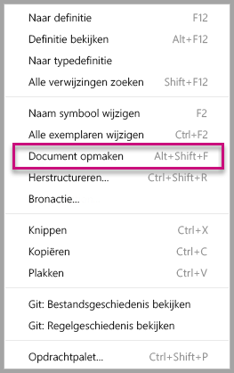

    Het is aanbevolen dat u elke keer dat u codefragmenten invoegt, het document opmaakt. Dat bevordert de leesbaarheid.

5. Voeg de volgende code toe aan de *updatemethode*.

    ```typescript
    let width: number = options.viewport.width;
    let height: number = options.viewport.height;
    this.svg.attr({
     width: width,
     height: height
    });
    let radius: number = Math.min(width, height) / 2.2;
    this.circle
     .style("fill", "white")
     .style("fill-opacity", 0.5)
     .style("stroke", "black")
     .style("stroke-width", 2)
    .attr({
     r: radius,
     cx: width / 2,
     cy: height / 2
    });
    let fontSizeValue: number = Math.min(width, height) / 5;
    this.textValue
     .text("Value")
     .attr({
         x: "50%",
         y: "50%",
         dy: "0.35em",
         "text-anchor": "middle"
     }).style("font-size", fontSizeValue + "px");
    let fontSizeLabel: number = fontSizeValue / 4;
    this.textLabel
     .text("Label")
     .attr({
         x: "50%",
         y: height / 2,
         dy: fontSizeValue / 1.2,
         "text-anchor": "middle"
     })
     .style("font-size", fontSizeLabel + "px");
    ```

    *Met deze code wordt de breedte en hoogte van de visual ingesteld en worden vervolgens de kenmerken en stijlen van de visuele elementen geïnitialiseerd.*

6. Sla het bestand **visual.ts** op.

7. Selecteer het bestand **capabilities.json**.

    Verwijder in regel 14 de gehele objectelementen (regel 14-60).

8. Sla het bestand **capabilities.json** op.

9. Start de aangepaste visual in PowerShell.

    ```powershell
    pbiviz
    ```

### <a name="toggle-auto-reload"></a>Automatisch opnieuw laden in-/uitschakelen

1. Ga terug naar het Power BI-rapport.
2. Selecteer **Automatisch opnieuw laden in-/uitschakelen** in de werkbalk die boven de visual voor ontwikkelaars zweeft.

    

    Met deze optie zorgt u ervoor dat de visual automatisch opnieuw wordt geladen wanneer u projectwijzigingen opslaat.

3. Sleep vanuit het venster **Velden** het veld **Hoeveelheid** naar de visual voor ontwikkelaars.

4. Controleer of de visual er als volgt uitziet.

    

5. Wijzig het formaat van de visual.

    U ziet dat de cirkel- en tekstwaarden zich schalen aan de beschikbare afmeting van de visual.

    De updatemethode wordt continu aangeroepen wanneer u het formaat van de visual wijzigt. Dat zorgt ervoor dat het formaat van de visuele elementen vloeiend wordt gewijzigd.

    U hebt nu de visuele elementen ontwikkeld.

6. Blijf de visual uitvoeren.

## <a name="configuring-data-binding"></a>Gegevensbinding configureren

Definieer de toewijzingen voor de gegevensrollen en gegevensweergaven en pas vervolgens de logica van de aangepaste visual zo aan dat de waarde en weergavenaam van een meting worden weergegeven.

### <a name="configuring-the-capabilities"></a>De mogelijkheden configureren

Bewerk het bestand **capabilities.json** zo dat de toewijzingen voor de gegevensrol en gegevensweergave worden gedefinieerd.

1. Verwijder in Visual Studio Code alle inhoud (regels 3-12) uit de matrix **dataRoles** van het bestand **capabilities.json**.

2. Voeg de volgende code toe in de matrix **dataRoles**.

    ```json
    {
     "displayName": "Measure",
     "name": "measure",
     "kind": "Measure"
    }
    ```
    De matrix **dataRoles** definieert nu een enkele gegevensrol van het type **meting**, heeft de naam **measure** en wordt weergegeven als **Measure**. Door deze gegevensrol kan er nu een metingsveld worden doorgegeven, of een samengevat veld.

3. Verwijder vanuit de matrix **dataViewMappings** all inhoud (regels 10-31).

4. Voeg de volgende inhoud toe in de matrix **dataViewMappings**.

    ```json
            {
            "conditions": [
                { "measure": { "max": 1 } }
            ],
            "single": {
                "role": "measure"
            }
           }
    ```
    De matrix **dataViewMappings** definieert nu een veld dat kan worden doorgegeven aan de gegevensrol met de naam **measure**.

5. Sla het bestand **capabilities.json** op.

6. In Power BI ziet u dat de visual nu kan worden geconfigureerd met **Measure**.

    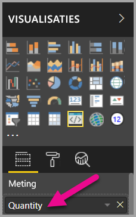

    > [!Note]
    > Het visualproject bevat nog geen logica voor gegevensbinding.

### <a name="exploring-the-dataview"></a>De gegevensweergave verkennen

1. Selecteer **DataView weergeven** in de werkbalk die boven de visual zweeft.

    

2. Vouw verder uit naar **single** en bekijk vervolgens de waarde.

    

3. Vouw vervolgens **metadata** uit en vervolgens de matrix **columns**. Let dan vooral op de waarden **format** en **displayName**.

    

4. Als u weer terug wilt naar de visual, selecteert u **DataView weergeven** in de werkbalk die boven de visual zweeft.

    

### <a name="configuring-data-binding"></a>Gegevensbinding configureren

1. Voeg in **Visual Studio** in het bestand **visual.ts** de volgende instructie toe als eerste instructie van de updatemethode.

    ```typescript
    let dataView: DataView = options.dataViews[0];
    ```
    

    Deze instructie wijst *dataView* toe aan een variabele voor eenvoudige toegang en instrueert de variabele om te verwijzen naar het object *dataView*.

2. Vervang in de **updatemethode** replace.text(“Value”)** door het volgende.

    ```typescript
    .text(dataView.single.value as string)
    ```
    

3. Vervang in de **updatemethode** **.text(“Label”)** door het volgende.

    ```typescript
    .text(dataView.metadata.columns[0].displayName)
    ```
    

4. Sla het bestand **visual.ts** op.

5. Bekijk in **Power BI** de visual, die nu de waarde en weergavenaam weergeeft.

U hebt nu de gegevensrollen geconfigureerd en de visual gebonden aan de gegevensweergave.

In de volgende zelfstudie leert u hoe u opmaakopties toevoegt aan de aangepaste visual.

## <a name="debugging"></a>Foutopsporing

Zie de [handleiding voor foutopsporing](https://microsoft.github.io/PowerBI-visuals/docs/how-to-guide/how-to-debug/) voor tips over het opsporen van fouten in uw aangepaste visual.

## <a name="next-steps"></a>Volgende stappen

> [!div class="nextstepaction"]
> [Opmaakopties toevoegen](custom-visual-develop-tutorial-format-options.md)