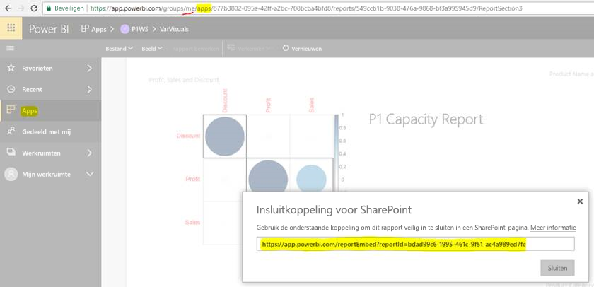

# Rapporten of dashboards uit apps insluiten

In **Power BI** kunt u apps maken om gekoppelde **dashboards** en **rapporten** op één plek te verzamelen en ze vervolgens te publiceren naar grote groepen mensen in uw organisatie. Het gebruik van die apps is relevant wanneer al uw gebruikers Power BI gebruiken, zodat u inhoud met ze kunt delen zonder Power BI-apps te gebruiken. Bekijk de volgende korte stappen om inhoud uit een gepubliceerde Power BI-app in te sluiten in een externe toepassing.

## De insluitings-URL voor rapporten ophalen voor insluiten

1. Start de toepassing in een gebruikerswerkruimte (’Mijn werkruimte’) door deze met uzelf te delen of door een andere gebruiker te begeleiden om door deze stroom te gaan.

2. Open uw gewenste rapport in Power BI-service.

3. Ga naar Bestand ->Insluiten in SharePoint Online en haal hier de insluitings-URL voor rapporten op (zie onderstaande momentopname), of roep de GetReports/GetReport REST API aan en extraheer het bijbehorende veld met de insluitings-URL voor rapporten uit de reactie (let op: in de URL van de REST-aanroep mag geen werkruimte-id staan, aangezien de app in de werkruimte van de gebruiker is gestart).

4. Gebruik de insluitings-URL die u in stap 3 hebt opgehaald om deze in combinatie met de JS SDK te gebruiken.

    

## De insluitings-URL voor dashboards ophalen voor insluiten

1. Start de toepassing in een gebruikerswerkruimte (’Mijn werkruimte’) door deze met uzelf te delen of door een andere gebruiker te begeleiden om door deze stroom te gaan.

2. Roep de GetDashboards REST API aan en extraheer het bijbehorende veld met de insluitings-URL voor dashboards uit de reactie (let op: in de URL van de REST-aanroep mag geen werkruimte-ID staan, aangezien de app in de werkruimte van de gebruiker is gestart).

3. Gebruik de insluitings-URL die u in stap 4 hebt opgehaald om deze in combinatie met de JS SDK te gebruiken.

## Volgende stappen

Controleer ook hoe u inhoud uit app-werkruimten kunt insluiten voor uw externe klanten en uw organisatie.

> [!div class="nextstepaction"]
>[Insluiten voor externe klanten](embed-sample-for-customers.md)

> [!div class="nextstepaction"]
>[Insluiten voor uw organisatie](embed-sample-for-your-organization.md)